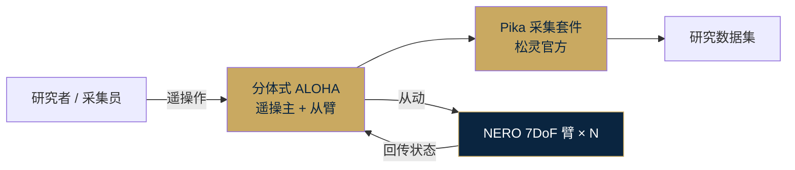

# 松灵 NERO 七轴机械臂 · 技术 Memo

> **定位**：国产 · 面向具身智能研究的仿人七轴协作机械臂
> **厂商**：松灵机器人（Agilex Robotics）
> **备份**：本文档同时存在于网站 `competitors/agilex-nero/doc.md` · 原始 Obsidian 备份于 `临时调研/01｜竞品分析/`

---

## 1. 产品概况

| 项 | 内容 |
|---|---|
| 产品名 | **NERO-7 DoF**（七自由度机械臂） |
| 厂商 | 松灵机器人 · [agilex.ai](https://www.agilex.ai) |
| 定位 | "面向具身智能 · 人形机器人研究 · 复杂任务场景"的轻量协作机械臂 |
| 目标市场 | 具身智能研究团队 · 人形机器人上肢 · 遥操数据采集 · 精密操作实验 |
| 产品线 | 作为松灵机器人"机械臂产品线"之一，与 **PiPER 六轴臂**对比差异化定位 |
| 配套 | 松灵移动底盘（Ranger/Scout/Tracer/Cobot Magic 等系列） + **分体式 ALOHA** 遥操 + **Pika** 数据采集套件 |
| 开源 / 闭源 | 公开资料未披露（推测为硬件闭源 + SDK 开放） |

---

## 2. 硬件架构

### 关键参数

| 项 | 数值 |
|---|---:|
| 自由度 | **7 轴冗余** |
| 自重 | **4.8 kg** |
| 有效负载 | **3 kg** |
| 工作半径 | **580 mm** |
| 重复定位精度 | **±0.1 mm** |
| 底座尺寸 | 70 mm × 70 mm |
| 供电 | DC 24V |
| 综合功耗 | ≤ 60 W |
| 峰值功耗 | ≤ 150 W |

### 运动参数

- J1–J3（大臂）：最高 **180°/s**
- J4–J7（小臂/腕）：最高 **225°/s**
- J1 范围 ±157°，J2 范围 −15°~190°（其余轴范围详见官网）

### 安装方式

- 支持**台面 / 侧装 / 倒装**三种安装姿态
- **与松灵全系移动底盘适配**（便于做轮式双臂 / 四足上肢集成）

### 末端执行器

- 官方配套 **G 型夹 + 桌面固定器**
- 支持用户自行接入其他末端（灵巧手 / 自适应夹爪）——视频里已见 NERO + 灵巧手组合

### 公开资料**未披露**项

- 关节电机型号（是谐波减速 / 摆线 / 行星 / QDD 准直驱均未说明）
- 具体关节扭矩（仅给功率和转速）
- 本体搭载的相机 / 雷达 / IMU 配置（可能依赖外挂）
- 本体计算平台（通常协作臂只带控制卡，AI 推理依赖外部主机）

---

## 3. 软件栈

### 通信协议

- **CAN / TCP / HTTP** 三种总线可选
- 相对开放，便于二次集成（TCP / HTTP 可跨 OS，不像 CAN 强依赖 Linux 实时内核）

### 开发支持

| 能力 | 描述 |
|---|---|
| Python SDK | 官方提供（降低研究者接入门槛） |
| ROS 兼容 | **全面支持 ROS 1 和 ROS 2**（关键：ROS 2 对标学术与产品化，不同于只支持 ROS 1 的老式臂） |
| 控制模式 | 拖动示教 / 离线轨迹规划 / API 编程 / 上位机控制 |
| AI / VLA 模型 | 公开资料未披露 |
| 仿真 | 官网未明示 MuJoCo / Isaac Lab / Gazebo 支持，但 ROS 2 生态通常可接入 |

---

## 4. 数据采集生态：Pika + 分体式 ALOHA

这是松灵在 NERO 本体之外的**差异化能力**，也是本次调研最有战略价值的观察：

- **分体式 ALOHA**：不像原版 ALOHA（Stanford Tony Zhao 开源）的 leader-follower 在同一台底盘上，松灵做成"分体"——主臂 / 从臂可分别安装在不同底盘 / 桌面 / 机架，**场地更灵活**
- **Pika 数据采集套件**：官方封装了遥操+录制+标注工具链
- **战略意图**：卖"机械臂 + 数据采集基础设施"打包，让研究团队和创业公司能快速起步做模仿学习 / VLA 训练

---

## 5. 差异化与构型原理

松灵 NERO 的差异化不在"参数绝对领先"，而在 **"冗余自由度 + 国产成熟度 + 数据采集生态"** 的组合：

| 维度 | NERO 的选择 | 理由 |
|---|---|---|
| 自由度 | 7 轴（冗余） | 让末端位姿固定时肘部仍能自由调整——这是仿人 / 狭窄空间操作的关键 |
| 减速方案 | 未披露（工业协作臂路径） | 优先**±0.1 mm 精度保证**，非 QDD 柔顺路线 |
| 自重 | 4.8 kg 轻量 | 便于**挂载到移动底盘**而不增加过多负担 |
| 功耗 | 60 W 常规 / 150 W 峰值 | 适合**24V 电池移动平台** |
| 安装姿态 | 3 种（正装 / 侧装 / 倒装） | 支持**人形上肢 / 桌面 / 墙挂**多场景 |
| 生态定位 | 与 Pika + ALOHA + 移动底盘协同销售 | 打包售"完整实验平台" |

---

## 6. 与 XC-Robot 的区别

### NERO 是"单臂"，XC-Robot 是"整机"

| 维度 | 松灵 NERO | XC-Robot |
|---|---|---|
| 产品颗粒度 | **单个机械臂模块**（可选配底盘） | **整机系统**（底盘+升降+双臂+头部+视觉+语音） |
| 购买方式 | 按臂单买，配套松灵底盘 | 合同型交付（揭榜挂帅 ¥45 万） |
| 交付内容 | 硬件 + SDK + ROS 驱动 | 硬件 + 软件栈 + 任务 Demo + 场景方案 |

### 硬件路线差异

| 维度 | 松灵 NERO | XC-Robot |
|---|---|---|
| 自由度 | **7 轴冗余**（单臂） | 5 DOF × 2（双臂） |
| 重复定位精度 | **±0.1 mm**（关节级已达标，走工业协作臂路径） | **±0.5 mm 关节层 + ±0.1 mm 任务层**（分层承诺，走 QDD 准直驱 + 视觉力控闭环） |
| 电机 | 推测工业谐波 / 摆线减速（精度高但刚性强） | **达妙 DM + 9:1 行星 QDD**（准直驱，可背驱柔顺） |
| 减速比 | 未披露（协作臂通常 80-100:1 谐波） | **9:1 低减速**（典型 QDD） |
| 自重 | 4.8 kg × 1 = 4.8 kg（单臂） | 约 4-5 kg × 2 + 结构件（双臂总约 10-12 kg） |
| 负载 | 3 kg | 3 kg（每臂） |
| 工作半径 | 580 mm | 单臂 620+ mm（上 338 + 下 310 mm） |
| 通信 | CAN / TCP / HTTP | **CAN + MIT 模式**（低层直控，非 TCP 指令级） |

### 软件 / 数据路线差异

| 维度 | 松灵 NERO | XC-Robot |
|---|---|---|
| SDK | **Python SDK + ROS 1/2 全兼容** | ROS 2 Humble + 自研 openarmx_xc |
| 控制模式 | 拖动示教 / 轨迹 / API / 上位机 | **compensated_impedance_controller + Pinocchio 动力学前馈 + Ruckig 整形** |
| 力控路线 | 未公开专门力控栈（协作臂一般靠电流反推） | **任务层力控闭环**（±0.1 N 接触阈值 + 视觉微调迭代） |
| 实时性 | 未强调（TCP / HTTP 指令级通信暗示非硬实时） | **500 Hz + PREEMPT_RT**（cyclictest P99 < 100μs） |
| 数据采集 | **Pika + 分体式 ALOHA 官方套件** | 本期未规模化采集 · 手眼标定 + 手动示教 |

### 生态定位差异

| | 松灵 NERO | XC-Robot |
|---|---|---|
| 商业模式 | **硬件销售** · 按单价卖 | 合同研发 + 自建实验室平台 |
| 客户 | B 端研究团队 / 创业公司 | 祥承电子（特定客户） + 海安研究院 |
| 规模 | 量产国产协作臂厂商（松灵 2019 成立） | 单个揭榜挂帅项目 |

### 战略启示

1. **松灵在"数据采集生态"上的投入值得学习** —— 分体式 ALOHA + Pika 是松灵卖机械臂之外最具想象力的能力。我们 XC-Robot 一期不做 VLA，但**二期可以考虑复用松灵的 ALOHA 遥操套件 + NERO 臂作为数据采集站**（成本远低于自建），让我们专注在"整机系统集成"而非"采集基础设施"
2. **技术路线不同不代表竞争** —— NERO 是传统工业协作臂升级（高精度 + 高刚性 + 7 轴），我们是 QDD 柔顺（低成本 + 可背驱 + 力控分层）。NERO 适合**精密操作**（装配 / 焊接 / 实验）；XC-Robot 适合**接触式日常任务**（分拣 / 上下料）。场景分野清晰
3. **NERO 作为研究平台参考** —— 如果未来 XC-Robot 需要与学术圈建立联系（发论文 / 合作），NERO + ALOHA 的数据飞轮是参考样板
4. **国产化叙事一致** —— 松灵是国产协作臂代表，XC-Robot 也是国产化路线。两者不是竞品，是**国产具身智能生态的两块拼图**（松灵在臂 / XC 在整机）

---

## 7. 主要信源

- [松灵官网 · NERO 产品页](https://www.agilex.ai/product/69314a20866efa631c9812fa)
- [Bilibili · 松灵NERO 七自由度机械臂+灵巧手](https://www.bilibili.com/video/BV14oSqBCE6W/)
- [Bilibili · 松灵七轴臂NERO遥操展示](https://www.bilibili.com/video/BV1sdUBBuEJw/)
- [Bilibili · 松灵推出分体式ALOHA遥操新玩法](https://www.bilibili.com/video/BV1TxKseRENn/)

## 8. 不确定 / 有待进一步调研

- **关节电机型号 / 减速方案**（谐波 / 摆线 / QDD）—— 官网只给运动参数不给电机细节
- **具体关节扭矩**（只给功率和转速）
- **AI / VLA 模型支持**（官网未明示是否支持 ACT / Diffusion Policy 等训练框架）
- **价格 / 交付周期**（需要联系松灵销售）
- **分体式 ALOHA 是否基于原版 ALOHA 开源**（还是独立实现）
- **Pika 采集套件的数据格式 / 是否开源**
- **与 PiPER 六轴臂的具体差价**（定位差异清楚，价格差距不清楚）

---

**整理**：Kevin & Claude · Transcribe Box Lab
**整理日期**：2026-04-18
