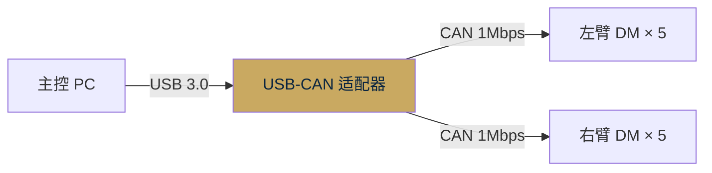
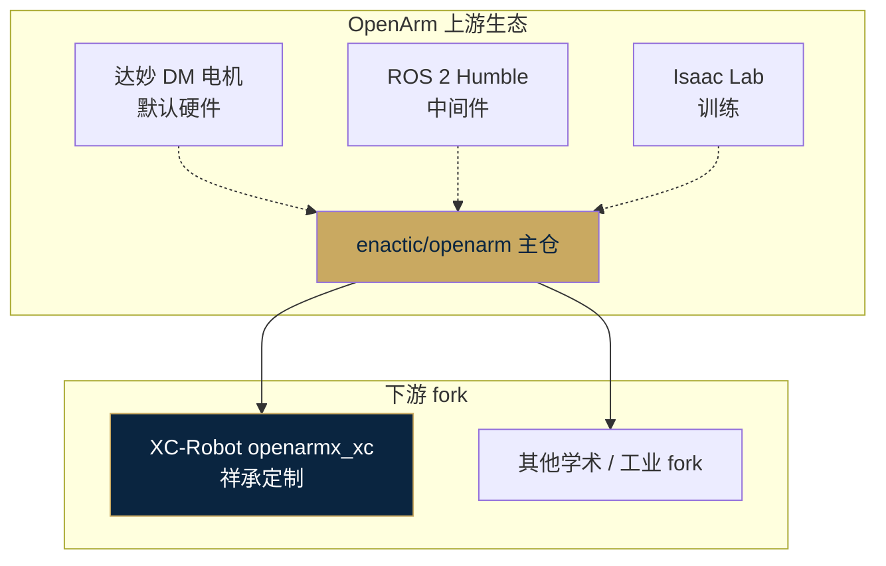
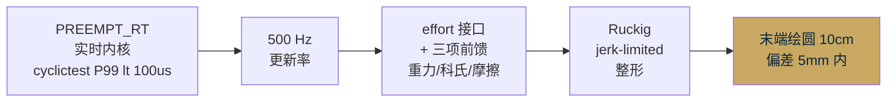

# OpenArm（enactic 开源双臂）· 技术 Memo

> **定位**：开源双臂协作机械臂 · 全栈开放方案（URDF / ros2_control / MoveIt / Isaac Lab）
> **关系**：XC-Robot 的 **openarmx_xc** 是基于 OpenArm 的 fork + 内部定制（上游 → 下游关系）
> **备份**：本文档同时存在于网站 `competitors/openarm/doc.md` · 原始 Obsidian 备份于 `临时调研/01｜竞品分析/`

---

## 1. 项目概况

| 项 | 内容 |
|---|---|
| 主仓 | [github.com/enactic/openarm](https://github.com/enactic/openarm) |
| 维护者 | **enactic** 组织 |
| 开源协议 | 开源（允许二次开发与商用） |
| 子仓数量 | **13 个**（覆盖 URDF / ros2_control / teleop / MoveIt / MuJoCo / Isaac Lab / ker / 双臂 MoveIt 配置 / dora-rs 集成等） |
| 推荐硬件 | **达妙 DM 系列电机**（Damiao / 深圳达妙科技） |
| 减速方式 | **9 : 1 行星减速**（准直驱 QDD 路线） |
| 协议 | **CAN + MIT 模式**（Kp / Kd / τ 前馈） |

### 13 个子仓清单

- `openarm/` 官方主仓（文档站）
- `openarm_can/` C++ CAN 底层库（默认达妙 MIT 协议）
- `openarm_driver/` Python 驱动层（薄封装）
- `openarm_ros2/` ros2_control 硬件接口
- `openarm_teleop/` C++ 双边遥操（含重力补偿参考）
- `openarm_description/` URDF
- `openarm_mujoco/` MuJoCo 仿真
- `openarm_isaac_lab/` RL 训练（NVIDIA Isaac Lab）
- `openarm_maniskill_simulation/` 任务仿真
- `openarm_dataset/` 数据集
- `openarm_ker/` 运动学
- `dora-openarm/` Dora 实时框架集成
- `openarm_ros2/openarm_bimanual_moveit_config/` MoveIt 双臂配置

---

## 2. 硬件架构（建议配置）

### 关节电机（达妙 DM 系列）

| 位置 | 建议型号 | 额定扭矩 | 峰值扭矩 | 功率 |
|---|---|---:|---:|---|
| 肩 × 2 | DM-J8009 | 22 Nm | 54 Nm | ~500 W |
| 肘 | DM-J8006 | 12 Nm | 36 Nm | ~300 W |
| 腕 × 2 | DM-J4310 | 5 Nm | 11 Nm | ~150 W |

### 通信



- **USB-CAN 适配器**（周立功 USBCAN-2E-U / Kvaser / PCAN-USB 工业级）
- **波特率**：1 Mbps 标准 CAN
- **左右臂独立 CAN**：隔离故障

### 末端 / 结构

- 末端法兰：标准接口，用户自选（夹爪 / 灵巧手均可适配）
- 结构件：CAD 开源，可 3D 打印或机加工

---

## 3. 软件架构

### 控制协议：MIT 模式

一次下发 5 个参数：

```text
τ_joint = Kp · (q_d − q) + Kd · (q̇_d − q̇) + τ_ff
```

- `q_d, q̇_d` 目标位置 / 速度
- `τ_ff` 前馈力矩（可做重力 / 摩擦 / 科氏补偿）
- `Kp, Kd` 运行时动态调节 → 关节级柔顺控制

### 原版 ros2_controllers.yaml 默认配置

| 项 | OpenArm 原版默认值 |
|---|---|
| `update_rate` | **100 Hz** |
| `command_interfaces` | **position only** |
| 默认控制器 | **joint_trajectory_controller (JTC)** |
| MoveIt Servo | **未工程化**（`grep -r servo` 全仓库 0 结果） |
| 零点标定脚本 | **无** |

### 原版的 4 项技术局限

| 问题 | 后果 |
|---|---|
| 100 Hz 更新频率 | 远低于 QDD 所需的 500–1000 Hz |
| position only 接口 | 无法用 MIT 模式下发力矩前馈 |
| JTC 离散航点执行 | 段间速度跳变 × MIT Kd = 力矩阶跃 |
| 9:1 低减速比无机械低通 | 抖动直达末端，**关节抖动四重放大机理** |

---

## 4. 参考栈：roboto_origin / Atom01

不是 OpenArm 官方直接产物，但同生态。

| 项 | 内容 |
|---|---|
| 项目 | **萝博头 Atom01**（RoboParty 出品） |
| 开源协议 | GPL v3 |
| 特点 | 人形机器人原型机 · 4 月原型完成 · Isaac Lab 训练 · **RDK X5 上 PREEMPT_RT 实时内核部署脚本（可抄）** |
| CAN 配置 | SocketCAN · 4 路（can0–can3）· 23 个关节（左腿 6/右腿 7/左臂 5/右臂 5）· 波特率 1 Mbps |
| 电机 | 达妙 DM（与 OpenArm 同源） |
| 协议 | MIT 模式，参数表公开（髋 Kp=100/Kd=3.3，膝 150/5，踝 40/2 …） |

对 XC-Robot 的借鉴价值：
- **CAN 通讯层**：可直接参考 `socket_can.cpp` Linux SocketCAN 实现
- **电机驱动层**：DM 驱动可直接迁移
- **RDK X5 PREEMPT_RT 实证**：双 RDK 方案（报告 B）的最强锚点
- **dm_pd_optimizer**：Damiao 自动 PID 整定工具（可迁移到 Robstride 或其他电机）

---

## 5. OpenArm 作为开源生态的定位



---

## 6. 与 XC-Robot（openarmx_xc）的区别

> XC-Robot 的 `openarmx_xc` 是基于 OpenArm 的 fork + 系统性改造。详细改造清单见 [OpenARM / OpenARM-X 硬件控制架构](../../dev/openarm-control-architecture/index.html)。

### 维度对比

| 维度 | OpenArm（上游开源） | openarmx_xc（XC-Robot 定制） |
|---|---|---|
| 控制频率 | 100 Hz | **500 Hz** |
| Command Interface | position only | **position + velocity + effort** 三通道 |
| 默认控制器 | joint_trajectory_controller | **compensated_impedance_controller**（自研 ros2_control 插件） |
| 动力学前馈 | 无 | **Pinocchio RNEA**（Atlas 3.5 μs · 重力 + 科氏项） |
| 摩擦补偿 | 无 | **Stribeck 曲线 4 参数**（fc / fs / vs / fv） |
| 轨迹整形 | 无 | **Ruckig Type V**（jerk-limited · 250 μs 周期） |
| 实时内核 | 可选 | **必选 PREEMPT_RT 6.1+**（Ubuntu 22.04） |
| 动力学参数 | CAD 估值 | **两点悬挂 + 扭摆法实测 + MuJoCo 验证 <5% 误差** |
| MoveIt Servo | 未工程化 | 本期暂不上（接触任务走简化阻抗栈），P2 上 |
| 精度承诺 | 默认无明确 | **分层承诺**（关节层 ±0.5 mm + 任务层 ±0.1 mm） |
| 双臂同步 | Controller Manager 基础 | 原子写入 + **硬件 PTP** 目标（同步误差 < 0.5 mm） |
| 安全层 | 基础 | 急停 Service + 心跳 + 软限位 + 电流阈值 + GPIO 急停桥 |
| 关节抖动机理治理 | 无（原版必抖） | **4 层治理**（见下图） |

### XC 治理 OpenArm 抖动的四层方案



---

## 7. 我们的战略意义

1. **OpenArm 是 XC-Robot 的"硬件 + 软件基线"** —— 正因有了开源主仓，我们才能用 1-1.5 万元的成本做出双臂，而不是 FR3 / JAKA 那样单臂 >5 万
2. **但 OpenArm 原版不能直接交付** —— 100 Hz + JTC + position only 在准直驱上必抖。XC-Robot 的核心技术价值就是**把开源打磨成可工程交付的状态**
3. **我们与 OpenArm 不是竞品关系，而是"上游 + 下游"关系** —— 我们在 openarmx_xc 里沉淀的改进（500 Hz / compensated_impedance_controller / Ruckig 接入 / Stribeck 摩擦辨识）完全有条件回馈上游，形成"社区 → 工程化 → 社区"的正循环
4. **合作启示** —— 可以考虑 RD3 或 RD4 期间把 openarmx_xc 的 compensated_impedance_controller 作为 PR 回提到 enactic/openarm，既是学术声誉积累也是 XC-Robot 的行业名片

---

## 8. 相关内部文档

- [OpenARM / OpenARM-X 硬件控制架构](../../dev/openarm-control-architecture/index.html) · 完整定制细节 + Mermaid 控制链路图 + 7 周实施路径
- [技术分析报告 A · 双 X86 方案](../../dev/report-a-dual-x86/index.html) §4.1 机械臂底层运动规划与 Servo 模式
- [BOM v2.1 · 硬件基线解析](../../dev/bom-v21-hardware-baseline/index.html) §E 双臂与末端

## 9. 主要信源

- [OpenArm 官方主仓](https://github.com/enactic/openarm)
- [RoboParty atom01_deploy · RDK X5 PREEMPT_RT 实证](https://github.com/Roboparty/atom01_deploy)
- [达妙 DM 电机官网](https://www.dji-tech.com/)（暂以替代链接占位）
- 内部文档：`02｜研发进展跟踪/02｜roboto_origin分析/01_项目概述与技术架构.md`
- 内部文档：`02｜研发进展跟踪/02｜roboto_origin分析/02_机械臂驱动与CAN总线协议分析.md`

---

**整理**：Kevin & Claude · Transcribe Box Lab
**整理日期**：2026-04-18
