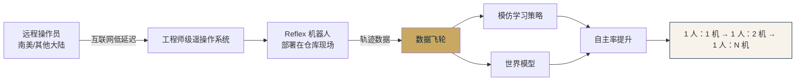

# Reflex Robotics · 技术 Memo

> **定位**：美国 · 轮式双臂移动操作机器人 · 物流与仓储场景
> **备份**：本文档同时存在于网站 `competitors/reflex/doc.md` · 原始 Obsidian 备份于 `临时调研/01｜竞品分析/`

---

## 1. 公司概况

| 项 | 内容 |
|---|---|
| 成立 | 2022 年，美国纽约 |
| 创始人 | **Ritesh Ragavender**（CEO · MIT 2014-2018 · 创立过 AlphaSheets 并被 Google 收购） |
| CTO | **Mason Massie** |
| 团队来源 | MIT · Boston Dynamics（主导 Stretch 项目）· Tesla · Oculus · ASML |
| 融资 | 种子轮约 **7M USD** · Khosla Ventures 领投 · Dropbox / Cruise 创始人 + Crossover VC / Invariantes Fund / Julian Capital / SNR 跟投 |
| 商业节点 | 2024-09 与 **GXO Logistics**（全球最大第三方物流商之一）签约，进入一家 Fortune 100 零售商履约仓做试点 |
| 定位 | 低成本通用人形 · 售价区间 10k–50k USD · 主打仓储物流与轻制造的人类上肢替代 |

---

## 2. 硬件架构

### 形态

- **轮式双臂**（wheeled bimanual mobile manipulator），非双足人形
- 底盘约 **0.6 m × 0.6 m**（under 2 ft × 2 ft），支持 **零度转向**
- 整机身高 **1.5–1.7 m 可变**，通过 **伸缩脊柱（telescoping spine）** 机构升降，可够到地面到高货架

### 负载能力

- 单臂满伸展负载 **25 lb（~11.3 kg）**
- 双臂合计 **50 lb（~22.7 kg）**
- 整机"硬拉"约 100 lb

### 末端执行器

- **可换式夹爪**
- 包括三指灵巧手（带吸盘）与仓储用定制夹爪

### 感知

- 头部搭载**多路 RGB 相机 + 深度相机阵列**
- 带 **180° 视场可转动颈部**
- 腕部相机 + 桅杆全景相机
- 公开资料**未提及激光雷达**、未披露 IMU 型号

### 电池与主控

- 底盘内置大容量电池，**续航 16+ 小时**（官网反复强调比双足方案长 5×）
- 主控 / 计算平台：**公开资料未披露**

### 未披露项（务必明确）

- 关节自由度具体数字
- 电机型号 / 是否 QDD 准直驱 / 减速方式
- 主控硬件（Jetson / x86 / 自研板卡均无证据）
- 软件栈是否 ROS 2（JD 仅提"proprietary control stack"）

---

## 3. 软件栈与产品模式

### 核心商业 + 技术护城河：数据飞轮

Reflex 的核心护城河**不是本体**，而是：

```text
遥操作 + 世界模型 + RL 人在回路学习
```



### 关键技术事实

- 工程师宣称搭建了"世界最好的实时遥操作系统"，延迟可承受 3,000 英里跨洲
- 官网承诺"60 分钟内完成部署"
- 遥操作既产生正现金流（客户按使用付费），又喂数据
- **不走纯端到端 VLA 路线**：公司 JD 里明确承认"VLA 做到 ~80% 成功率，真实部署需要 99.99%"

### 招聘 JD 暴露的技术栈方向

| 岗位 | 技术信号 |
|---|---|
| Principal AI Research Engineer · World Models | 训练类 Sora/Veo 的大规模视频/世界模型；把生成模型做成"动作/状态条件化"的可控仿真器 |
| Principal AI Research Engineer · RL | 真机 RL + human-in-the-loop 介入学习 |
| Staff Mechanical Engineer · Actuators | 跨 actuator / power electronics / 通信 / 控制 |
| Staff Software Engineer · Infrastructure | 数据闭环与评估管线 |

---

## 4. 构型原理（为什么是轮式+双臂+伸缩脊柱）

Ritesh 对外公开的技术论证：

1. **双足 BOM 贵 2-3×** · 在仓储 / 履约 / 制造场景没有 ROI
2. **双足动态平衡** · 控制问题加剧工程复杂度和可靠性风险
3. **双足续航瓶颈** · 双足电机必须强到扛起胸腔大电池，普遍卡在 2-3 小时；轮式可把大电池塞进底盘，"重心低"反而成被动稳定优势，做到 16 小时连续工作

### 场景回溯硬件的决策路径

> 仓储 90% 以上是平地作业 · 双足越障/上楼梯在该场景是伪需求

- **双臂 + 可升降脊柱**覆盖货架取放的高度范围（地面到约 2 m）
- 身高 1.5-1.7 m 对齐**人类工位的货架高度与通道宽度**，而非模仿人体美学
- 与 Boston Dynamics 的 Stretch（前团队作品，**单臂**轮式）思路同源，多加了一条手臂和脊柱扩展任务集

---

## 5. 与 XC-Robot 的区别

### 相似点

- 同为**轮式双臂 + 升降**形态
- 都强调"以克制的成本实现接近人形的操作能力"
- 都采用模块化 / 非人形路径

### 关键差异

| 维度 | Reflex Robotics | XC-Robot（Transcribe Box Lab） |
|---|---|---|
| 目标市场 | 仓储物流（Fortune 100 零售商履约仓） | 3C 制造 / 办公递送 / 中央仓物流 **多场景** |
| 商业模式 | **遥操作即服务**（按小时付费） + 数据飞轮 | 合同型交付（揭榜挂帅 45 万）· 面向特定客户 Demo |
| 融资 | 种子轮 7M USD + Fortune 100 合作 | 政府揭榜挂帅经费 · 合作单位海安研究院（上海交大） |
| 底盘尺寸 | 0.6 × 0.6 m（小型） | 0.6 × 0.5 m（Q235B 钢板焊接，类似尺寸） |
| 升降轴 | 伸缩脊柱（机构细节不详） | 米思米 E-MCH14 丝杆 500 mm + AC 220V 400W 伺服 + EtherCAT |
| 双臂 | 未披露电机类型（推测定制） | **OpenArmX + 达妙 DM 电机 + 9:1 行星减速**（准直驱 QDD） |
| 单臂负载 | 11.3 kg（宣称） | 3 kg（设计目标） |
| 末端 | 三指灵巧手 + 吸盘 · 可换式 | 智元 OmniPicker 2 指自适应夹爪 |
| AI 路线 | **世界模型 + RL + 遥操作兜底** | 本期**不做 VLA** · 闭集指令（6 条）+ 脚本化 Skill |
| 控制栈 | 自研 proprietary（未公开是否 ROS 2） | **ROS 2 Humble + ros2_control + compensated_impedance_controller + Pinocchio + Ruckig + MoveIt 2 + Nav2** |
| 数据采集 | **遥操作** · 操作员远程控制 · 互联网延迟可承 3000 英里 | 本期**未系统采集** · 手眼标定 + 人工 teleop 示教（规模小） |
| 感知 | RGB + 深度相机阵列 · 头部 + 腕部 + 桅杆 · 无激光雷达 | **M10 + MS200 双激光雷达 + CMP10A IMU + 海康 ROSEB43i 双目 RGBD × 3 + 鱼眼 × 2** |
| 续航 | 16+ 小时（大电池在底盘） | 48V 20 Ah × 2 · 满载 1 h + 热插拔 2 h |
| 开源度 | 闭源 | 基于 OpenArm 开源 fork + 内部定制（openarmx_xc 闭源） |

### 我们的战略启示

1. **Reflex 的"遥操作付费服务"是数据冷启动的绝佳模式**——XC-Robot 一期不做 VLA 并不意味放弃数据策略，可以在 RD3-RD4 引入遥操作收集机制，为二期模型训练准备
2. **Reflex 拒绝纯 VLA 路线的判断与我们一致**：工业场景 99.99% 可靠性要求，VLA 当前 80% 精度远远不够；但 Reflex 靠"遥操作兜底 + RL 渐进"的路径可借鉴
3. **硬件形态判断高度一致**：轮式双臂 + 升降是当前最务实的非人形路径，不要被双足人形的 PR 声量干扰
4. **两家的竞争窗口不同**：Reflex 已占据北美物流高端市场，XC-Robot 应聚焦中国制造业与国产化需求（RDK 国产 BPU 方案保留作二期战略选项）

---

## 6. 主要信源

- [Reflex Robotics 官网](https://www.reflexrobotics.com/)
- [TechCrunch 2024-03 报道](https://techcrunch.com/2024/03/13/reflex-robotics-wheeled-humanoid-is-here-to-grab-you-a-snack/)
- [The Robot Report RBR50 2025](https://www.therobotreport.com/rbr50-company-2025/wheeled-mobile-manipulator-uses-teleoperation-to-multi-task/)
- [GXO × Reflex 合作公告 2024-09](https://www.globenewswire.com/news-release/2024/09/18/2948075/0/en/GXO-Partners-with-Reflex-Robotics-to-Deploy-New-Warehouse-Automation.html)
- [Principal AI Research Engineer · World Models JD](https://jobs.ashbyhq.com/reflexrobotics/50f1ecc1-5499-4932-9e9c-567aad4cbc0d)
- [humanoid.press 数据库：Reflex 条目](https://humanoid.press/database/humanoid-press-database-reflex/)
- [Crunchbase：Reflex Robotics](https://www.crunchbase.com/organization/reflex-robotics)

## 7. 不确定 / 有待进一步调研

- 自由度、电机型号、减速方式（可能需要 LinkedIn 挖工程师个人页）
- 主控 / 计算平台（Jetson / x86 / 自研板卡）
- 激光雷达有无（底盘可能藏有 2D LiDAR）
- 2025 年 Series A 是否完成（收入宣称 60M/year）
- 当前部署台数（2024 年 10-20 台 → 2025 年"hundreds" 未独立核实）

---

**整理**：Kevin & Claude · Transcribe Box Lab
**整理日期**：2026-04-18
