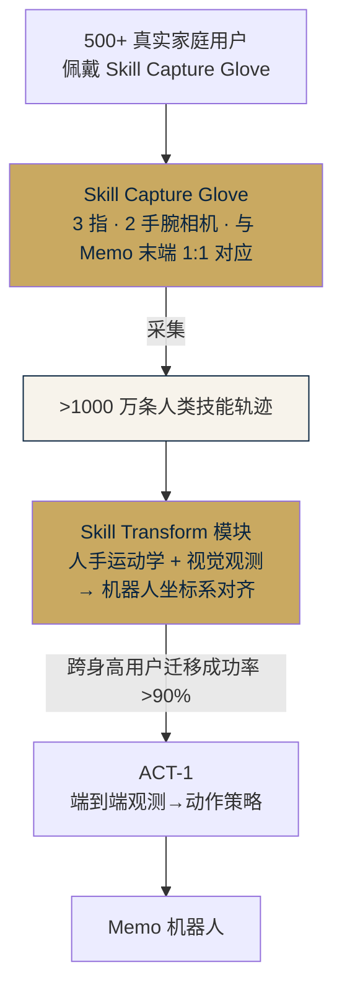

# Sunday Robotics (Sunday Memo) · 技术 Memo

> **定位**：美国 · 家用场景轮式双臂 · "Zero Robot Data" 训练范式 · 已进入独角兽
> **备份**：本文档同时存在于网站 `competitors/sundayai/doc.md` · 原始 Obsidian 备份于 `临时调研/01｜竞品分析/`

---

## 1. 公司概况

| 项 | 内容 |
|---|---|
| 公司 | **Sunday Robotics** · sundayrobotics.com · @sundayrobotics |
| 总部 | Mountain View, California, USA |
| CEO | **Tony Zhao**（@tonyzzhao）· 前斯坦福 · 特斯拉经历 · **ALOHA / ACT** 论文核心作者 |
| CTO | **Cheng Chi**（@chichengcc）· 前斯坦福 · **UMI / Diffusion Policy** 论文共同作者 |
| 融资 | **2026-03 完成 B 轮 1.65 亿美元** · **Coatue 领投** · 估值 **11.5 亿美元（独角兽）** |
| 跟投 | Tiger Global · Benchmark · Bain Capital Ventures · Fidelity |
| 产品 | **Memo**（2025-11-19 发布首段 Demo） |
| 上市计划 | 2026 年秋季 邀请制 Beta · 感恩节前首批家庭运行 |
| 应用场景 | 清桌 · 装洗碗机 · 叠袜子 / 叠衣服 · 操作意式咖啡机 等**家务任务** |
| 产品名来源 | "Memo" 源自创始人对"友好、有记忆、像家庭成员"的拟人化设定（非算法名词） |

> **关键背景**：Sunday 的两位创始人，是当前具身智能三大标志性工作 **ALOHA（双臂遥操作）、UMI（Universal Manipulation Interface 手持夹爪）、Diffusion Policy** 的核心作者——这是直接从学术圈带着方法论和数据哲学创业的公司。

---

## 2. 硬件架构

### 形态

- **轮式双臂**，非人形、非双足
- **低重心被动稳定底盘**（强调在孩子和宠物周围安全移动）
- **刻意不在"眼睛"位置放相机**（创始人原话：让人看到相机盯着自己会让人不适），相机藏在别处

### 末端执行器 ⭐

- **三指欠驱动夹爪（pincer-like hand）**
- 不是五指灵巧手，也不是两指平行夹爪
- 每只"手"上集成 **2 颗手腕相机**

### 传感器配置

- 以 **视觉为主**（手腕相机 + 头部相机构成多视角）
- **未公开**是否搭载激光雷达、六维力、触觉指尖
- 力反馈来自**采集侧（手套里）**，**不是**机器人本体的力矩传感

### 未披露项

| 项 | 状态 |
|---|---|
| 自由度 / 关节数 | 未披露 |
| 电机类型（QDD / 谐波 / 腱驱） | 未披露 |
| 主控平台（Jetson / x86 / 自研 ASIC） | 未披露 |
| 激光雷达 / RGBD 深度传感 | 未确认 |
| 仿真训练占比 | 未明说（官方口径是"Zero Robot Data"） |

### 开源情况

- **硬件不开源** · 全栈自研闭源

---

## 3. 软件栈与 AI 模型：ACT-1

### 核心模型

**ACT-1**（Action Chunking Transformer-1，架构血统来自 Tony Zhao 的 ALOHA 论文里的 ACT）

官方定位："**A Robot Foundation Model Trained on Zero Robot Data**" —— **完全不用机器人本体数据训练**。

### 训练链路

### 核心 Demo

- **端到端"餐桌 → 洗碗机"超长程任务**：33 个独立交互 · 21 种不同物体 · 跨越 ~130 英尺（~40 米）的导航 + 操作一体策略 · **全程未被切段**
- **叠袜子 Demo**（此前几乎没有家用机器人公开能完成的灵巧任务）
- 架构细节未公开，但从描述判断是**观测→动作的端到端策略 + 3D 地图条件导航融合**，**非模块化 VLM+控制器**

### 速度护城河

- 公司自称构建底层基础设施用了 **>1 年**
- 用该栈训练出当前 Demo 能力仅用 **3 个月**
- 强调"**全栈迭代速度**"，而非单点模型 SOTA

---

## 4. 数据采集方式：Skill Capture Glove（重点）

### 方法论：Sunday **明确放弃** VR 遥操作路线

Tony 的原话论点：

> "VR 里手是**麻的**（no force closure），对软物容易施加无限大力"
> "如果只靠遥操作采数，我们要**几十年**"

### 取代方案：Skill Capture Glove 技能捕捉手套

| 特性 | 说明 |
|---|---|
| **构型 1:1 对应 Memo 末端** | 3 指，传感器布局一致，戴上手套做的动作可**直接零差异映射**到机器人手 |
| **手套自带 2 颗相机** | 与机器人手腕相机视角对齐，不依赖外部追踪 |
| **无需携带机器人本体** | 采集者可在任意真实家庭场景采集，极大提升环境多样性 |
| **采集效率高 100×** | 相较遥操作公司自称数据采集效率高两个数量级 |
| **真实力反馈** | 来自手套本身的接触感，比遥操作数据质量更高 |
| **规模** | 已向 **500+ 真实家庭** 发放手套 · 累计 **>1000 万条人类技能轨迹** |
| **商业** | 采集者按小时计酬（约 $40/h） |
| **开源度** | 数据集**不公开 / 不开源** · 专有数据护城河 |

---

## 5. 构型原理（为什么这样设计）

创始人在 TBPN 等访谈中给出的推理链：

1. **双足人形当前不成熟**
   - 在有孩子 / 宠物 / 台阶家庭里摔倒风险不可接受
   - 轮式低重心是当前"被动安全"最优解

2. **产品不是 Demo 实验室**
   - 创始人刻意抵制了"做 frontier humanoid 实验室"的诱惑
   - （业内熟人 Huaijiang Zhu 评语）

3. **末端选 3 指而不是 5 指灵巧手** ⭐
   - 让采集端的**手套可制造、低成本、工人佩戴不累**
   - 让**数据飞轮真正跑起来**
   - **硬件是数据采集的约束派生物** —— 这是 Sunday 与 Figure / 1X / Optimus 最大的方法论分叉

---

## 6. 与 XC-Robot 的区别

### 场景差异

| 维度 | Sunday Memo | XC-Robot |
|---|---|---|
| 主要场景 | **家用**（清桌 / 洗碗机 / 叠衣服 / 咖啡机） | **工业 / 办公**（3C 分拣 / 办公递送 / 中央仓物流） |
| 用户 | C 端家庭 | B 端企业（祥承电子合作客户） |
| 任务特征 | 长时序（40 m 导航 + 33 个交互）· 非结构化环境 | 结构化工位 · 重复性抓放 · 语音闭集指令 |

### 技术路线对比

| 维度 | Sunday | XC-Robot |
|---|---|---|
| AI 核心 | **ACT-1（自研端到端 Policy Foundation Model）** | 本期**不做 VLA** · 闭集语音指令 + 脚本化 Skill |
| 数据采集 | **Skill Capture Glove**（零真机数据 · 100× 效率 · 500 家庭 · >1000 万条轨迹） | 手眼标定 · 手动示教 · **尚未规模化采集** |
| 学习范式 | 端到端模仿学习（ACT-1 Transformer） | 传统控制栈（ros2_control + compensated_impedance_controller） |
| 末端 | **3 指欠驱动**（为数据采集优化） | **2 指智元 OmniPicker**（工业场景优化） |
| 感知策略 | **纯视觉为主**（手腕 × 2 + 头部相机）· 不做激光雷达 | **多模态**（M10 + MS200 激光 + ROSEB43i 双目 RGBD + 鱼眼 + 力觉） |
| 力反馈 | 来自采集侧（手套），非本体 | 计划本体力觉（六维力传感器预留，RD4 集成） |
| 导航 | 3D 地图条件化端到端策略 | Nav2 + AMCL + AprilTag + SLAM Toolbox（模块化栈） |
| 控制栈开源度 | 全栈闭源 | 基于 OpenArm 开源 fork + openarmx_xc 内部定制 |

### 方法论分叉（最重要）

| 视角 | Sunday | XC-Robot |
|---|---|---|
| 硬件决策 | **硬件是数据采集的约束派生** | **硬件先定，软件适配**（BOM v2.1 已冻结） |
| 数据策略 | 数据即护城河 · 硬件为采集服务 | 工程先行 · 数据作为后续增强 |
| 迭代节奏 | 3 个月从 0 到超长程 Demo（基建完成后） | RD1→RD2→RD3→RD4 四期串行，8 个月完成首期 Demo |

### 商业与体量对比

| | Sunday | XC-Robot |
|---|---|---|
| 融资体量 | **1.65 亿美元 · 独角兽** | 45 万人民币揭榜挂帅合同 |
| 团队 | 斯坦福系学术明星（ALOHA / UMI / Diffusion Policy 作者） | 祥承电子 + 上海交大海安研究院 |
| 客户 | C 端家庭（邀请制 Beta） | B 端合作客户 |
| 战略窗口 | 家用具身智能早期 (2025-2027 黄金期) | 国产工业场景 + 揭榜挂帅政策红利 |

### 我们的战略启示

1. **Sunday 的方法论最值得深思** —— "硬件为数据采集服务"是一种颠覆性视角。我们的**智元 OmniPicker 夹爪选型主要为任务优化**，未来如果走 VLA 路线，末端选型要重新考虑"数据采集友好度"
2. **Skill Capture Glove 的思路可借鉴** —— 即使我们不走端到端 VLA，让"示教工具"在采集侧独立于机器人本体，可以**极大提升标注数据的多样性**（规模化前尤其重要）
3. **不要盲目追 VLA** —— Sunday 自己走 ACT-1 而非 Diffusion Policy 原路径，是因为他们已验证"端到端 + Chunk + Transformer"足够。我们本期不做 VLA 的判断是对的，但要**保留二期接入的技术路径**（不要把当前的硬件栈锁死在不可扩展的方向）
4. **场景差异化** —— 家用 vs 工业是两个不同的技术 / 商业 / 合规世界，不应直接对比胜负，而是各走各的路

---

## 7. 主要信源

- [Sunday Robotics 官推首发 ACT-1 与 Memo (2025-11-19)](https://x.com/tonyzzhao/status/1991204856422625748)
- [B 轮 1.65 亿官宣 (2026-03)](https://x.com/sundayrobotics/status/2032131717402960135)
- [Coatue 投资声明](https://x.com/coatuemgmt/status/2033586256576127064)
- [Bain Capital Ventures：描述手套采集机制](https://x.com/BainCapVC/status/2032113405528850644)
- [EmbodiedAIRead 技术拆解：ACT-1 / Skill Transform / 500 家庭 / 1000 万轨迹](https://x.com/EmbodiedAIRead/status/1991394970117312614)
- [Humanoids Daily：数据死锁与零机器人数据路线](https://www.humanoidsdaily.com/p/sunday-robotics-memo)
- [创始人 TBPN 访谈：为何弃用 VR 遥操作](https://x.com/humanoidsdaily/status/1992406181805949269)
- [HackerNews 讨论](https://www.youtube.com/watch?v=QfBw0gMuhaI)

## 8. 不确定 / 有待进一步调研

- 自由度具体数字（单臂 DOF、夹爪 DOF）
- 电机方案（准直驱 / 谐波 / 腱驱）
- 主控平台（Jetson Thor / x86 / 自研 ASIC）
- 激光雷达 / RGBD 深度传感 明确配置
- 是否仿真训练（官方"Zero Robot Data"含义不明）
- ACT-1 架构参数（Transformer 规模 / 是否 Diffusion head / 训练算力）
- 单次采集任务时长、采样频率、单条轨迹平均长度
- 公司员工规模与中国团队关系（创始人华人背景但公司美国注册）
- 价格、Beta 规模、首批出货量

---

**整理**：Kevin & Claude · Transcribe Box Lab
**整理日期**：2026-04-18
