# AGV 导航方案 · 硬件架构 × 软件架构 × 路径规划

> **文档定位**：技术分析与架构决策 · 方案设计
> **范围**：XC-Robot 底盘 AGV 部分 · 基于双目视觉 + 双激光雷达 + IMU 的现有供应商组合
> **更新**：2026-04-19

---

## 1. 概述

XC-Robot 整机为**轮式双臂复合机器人**，下层 AGV 负责自主导航 + 工位对接 + 避障。本文聚焦 AGV 侧（机械臂控制见姊妹文档 [OpenARM / OpenARM-X 硬件控制架构](../openarm-control-architecture/)）。

### 1.1 导航目标（合同 KPI）

| 指标 | 合同要求 | 本期目标 |
|---|---|---|
| 移动速度 | 0.5–1.5 m/s · 波动 ≤ 5% | 达标 |
| 静态 SLAM 定位 | ≤ ±10 mm | 临界可达（需 ChArUco 工位锚点） |
| 动态相对定位 | ≤ ±5 mm | 临界可达（视觉伺服闭环） |
| 点选位点到达 | 偏差 < 5 cm | AMCL + Nav2 |
| 工位精对接 | 偏差 < 3 cm | AprilTag DockingServer |
| 避障能力 | 识别 ≥ 30 cm 障碍 | 2D LiDAR + RGB-D 点云 |

### 1.2 现状（2026-04）

- 底盘里程计漂移 > 50 cm / 10 m（未做 EKF 融合）
- Nav2 未配置（路径规划能力缺失）
- Cartographer 已建图成功，精度 ±3 cm（正在收敛中）

**方向**：从半自研到商业 AGV 水平 · 4 步闭环（见 §5）。

---

## 2. 硬件架构

### 2.1 整体拓扑

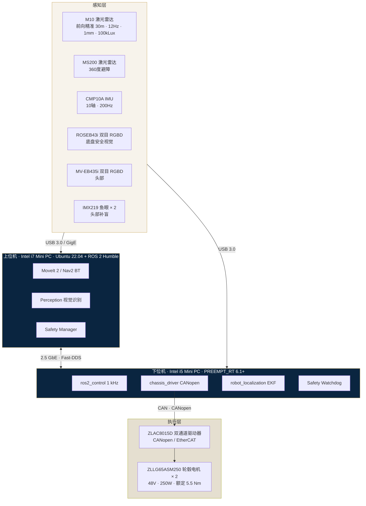

### 2.2 感知层关键参数（BOM v2.1 - C.3 & F 表）

| 传感器 | 型号 | 关键参数 | 职责 |
|---|---|---|---|
| **导航激光雷达** | 镭神 **M10** | 20 kHz 采样 · TOF · 1 mm · 抗光 100 kLux · 12 Hz · 30 m | 前向**精准定位**建图基准 |
| **避障激光雷达** | **MS200**（与 CMP10A 组合） | 200 Hz · 360° · 室内 | 全向**避障**与实时 obstacle layer |
| **IMU** | 亚博 **CMP10A** | 10 轴（加速度 + 陀螺 + 磁力计 + 气压）· 200 Hz · ROS INS | **robot_localization** EKF 的 IMU 输入 |
| **底盘安全视觉** | 海康 **ROSEB43i** | 双目 RGBD + 6-DOF IMU · 90° · 1.5%@0.2–3 m · 30 fps · 1280×720 | 近场 obstacle point cloud · 人员识别 |
| **头部视觉** | 海康 **MV-EB435i** | 同规格 | 粗场景定位 + 人脸 + 物体识别 |
| **头部补盲** | 160° **IMX219 鱼眼** × 2 | MIPI · 1080p 800 万像素 | 盲区覆盖 · 大视野近感知 |

### 2.3 两雷达分工的设计逻辑

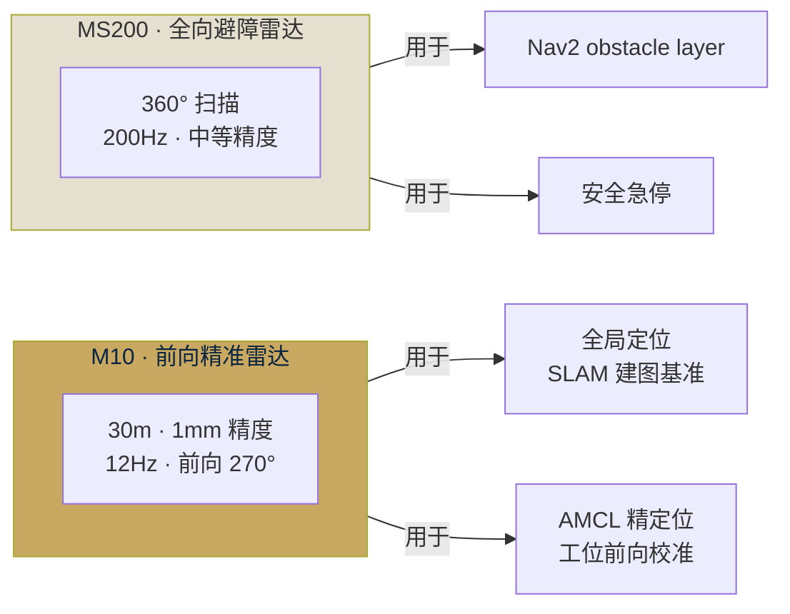

**为什么要两颗**：

- M10 是**精度第一**（1 mm，抗光），但帧率低（12 Hz）+ 视场受限（270°，前向）；适合做 SLAM 建图的**几何基准**和 AMCL 定位。
- MS200 是**帧率第一**（200 Hz）+ 全向（360°）；精度稍弱但足够做 **obstacle layer** 实时刷新 + 行人/动态障碍响应。
- 两颗雷达都通过 `tf2` 统一到 `base_link`，Nav2 的 `costmap_2d` 插件同时订阅即可融合。

### 2.4 视觉传感器分工

| 位置 | 型号 | 主要用途 |
|---|---|---|
| 底盘（胸前） | ROSEB43i × 1 | AGV 近场点云（≤ 3 m）· 人员识别 · 视觉辅助对接 |
| 头部 | MV-EB435i × 1 | 目标物粗定位 · 人脸识别 · 场景理解 |
| 头部左右 | IMX219 鱼眼 × 2 | 补盲（侧后方视野） |
| 双臂眼在手 | ROSEB43i × 2 | **任务层精对位**（±0.6 mm 手眼标定后） |

底盘侧主要依赖第 1 颗 ROSEB43i，**机械臂眼在手的两颗另文管理**（见 OpenARM 文档）。

---

## 3. 软件架构

### 3.1 ROS 2 节点拓扑

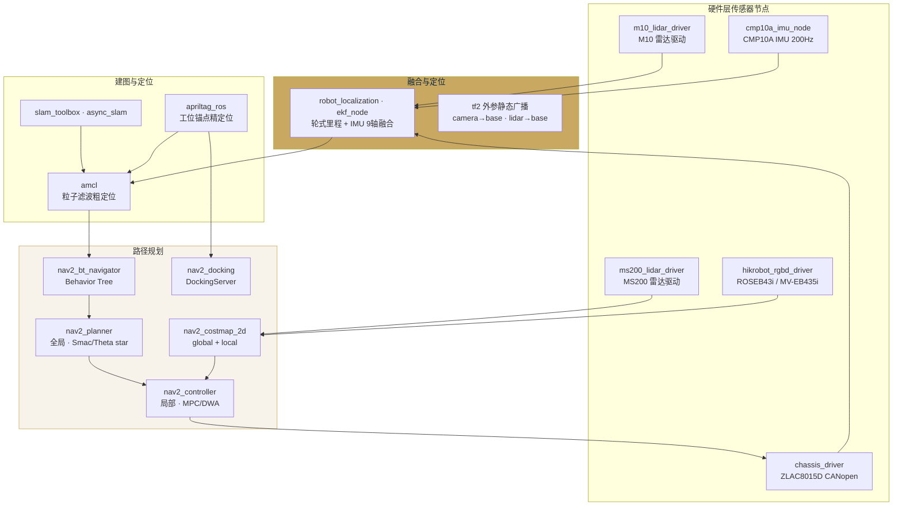

### 3.2 核心 ROS 2 包清单（祥承自研）

| 包 | 职责 | 依赖 |
|---|---|---|
| `chassis_driver` | SocketCAN 裸驱动 + ZLAC8015D CANopen 协议 | socketcan_interface |
| `chassis_localization` | robot_localization EKF 配置 + tf 发布 | robot_localization |
| `chassis_nav` | Nav2 参数 + BT xml + costmap 插件配置 | nav2_bringup |
| `chassis_docking` | DockingServer 扩展 + AprilTag external_detection_pose | nav2_docking |
| `chassis_slam` | slam_toolbox 参数 + 地图保存工具 | slam_toolbox |
| `chassis_safety` | 急停 Service + 心跳 + 安全触边 GPIO | diagnostic_msgs |
| `xc_perception_msgs` | `/scene/semantic_map` 自定义消息 | rclcpp |

### 3.3 数据流：从传感器到 cmd_vel

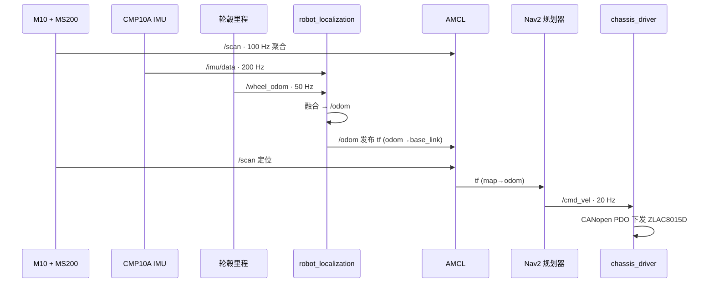

### 3.4 时空同步（核心工程点）

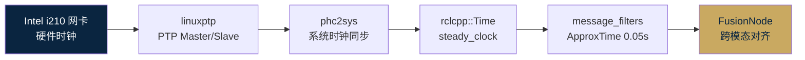

---

## 4. 导航路径规划

### 4.1 建图阶段

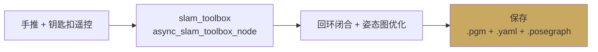

**SLAM Toolbox vs Cartographer**（本期推荐迁移）：

| 对比项 | Cartographer（在用） | SLAM Toolbox（推荐） |
|---|---|---|
| 动态环境 ATE | 0.21 m | **0.13 m** |
| TF 广播 | 需 odom | 纯扫描匹配 |
| 增量建图 | 不支持 | 支持 lifelong |
| 上游维护 | 弱 | 活跃（ROS 2 核心成员） |

**建图要求**：20 m × 20 m 工位一次建图成功，矩形绕一圈回原点误差 < 10 cm。

### 4.2 定位：粗 + 精两级

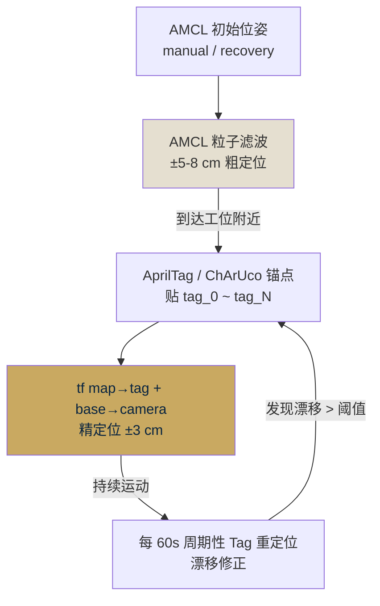

**ChArUco 为什么比 ArUco 好**：亚像素检测 + 棋盘格子精度，在线精度 0.4–0.6 mm；而裸 ArUco 只有 1–2 mm。

### 4.3 路径规划（全局 + 局部）

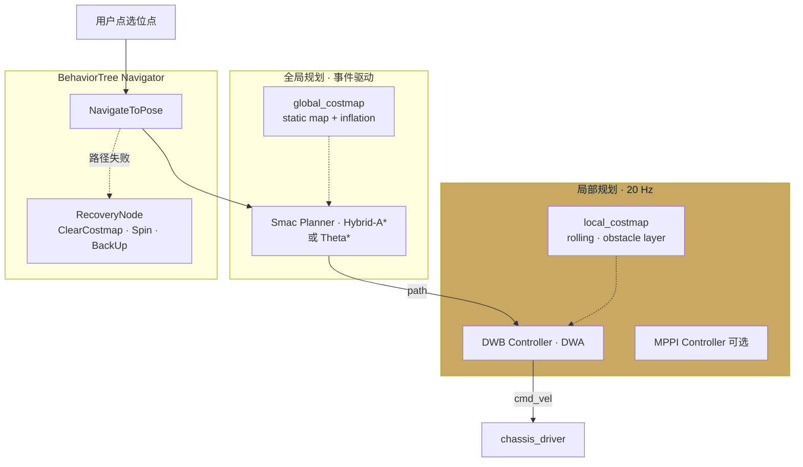

**规划器选型建议**：

- **全局**：`Smac Planner`（Hybrid-A*）—— 考虑运动学约束，差速底盘适用；或 `Theta*`（简单工位场景已足够）
- **局部**：`DWB`（改良 DWA）—— Nav2 默认，参数成熟；如果需要更平滑可上 `MPPI Controller`

### 4.4 工位对接（Docking）

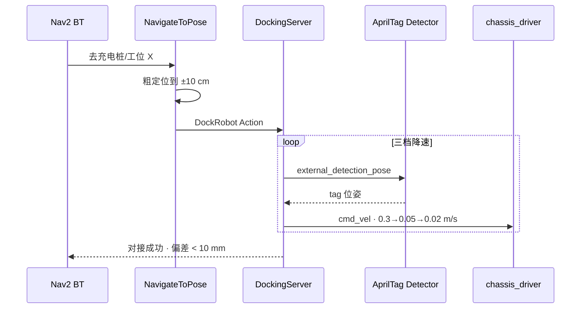

**三档降速策略**：

- 粗定位段：0.3 m/s（AMCL 控制）
- 接近段：0.05 m/s（Tag 进入视野）
- 对接段：0.02 m/s（最后 30 cm · 力觉/触边兜底）

### 4.5 自动充电流程

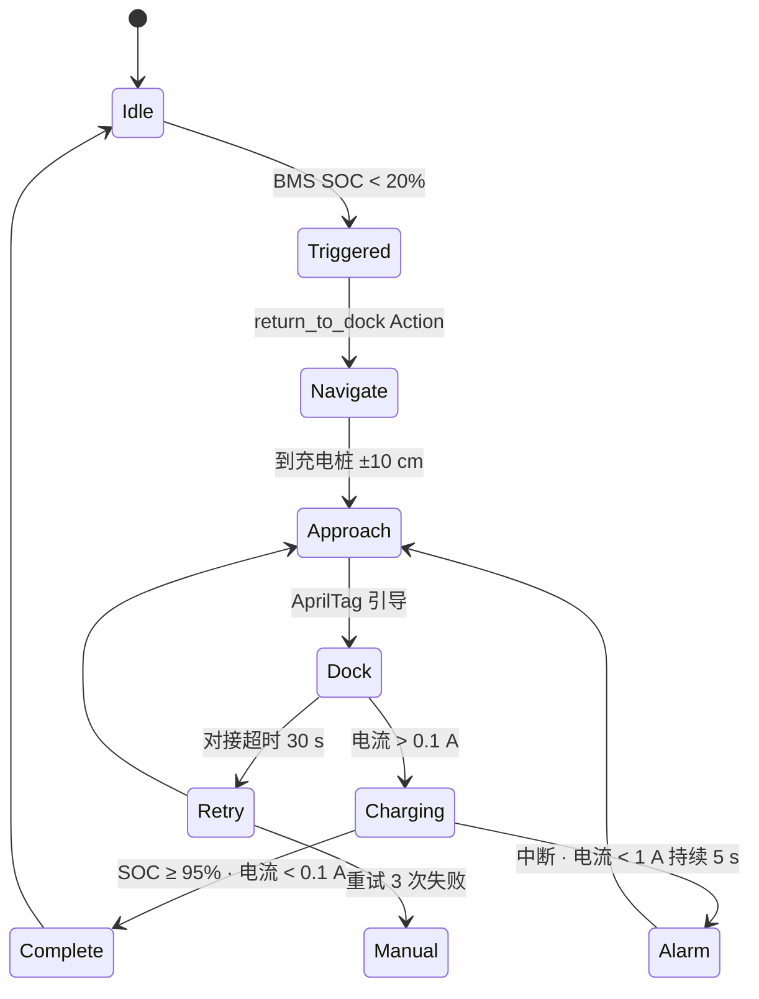

**Tag 编码约定**：

- `ID 0x00` = 充电桩
- `ID 0x01–0x1F` = 工位（16 个位点预留）
- `ID 0x20+` = 保留

### 4.6 避障与安全策略

```mermaid
graph TD
    Ms[MS200 360 lidar<br/>200 Hz]
    Rgbd[ROSEB43i RGB-D<br/>点云]
    Touch[安全触边<br/>KSYD-A454]
    Estop[急停按钮 × 4]

    Ms --> Costmap[local_costmap<br/>obstacle layer]
    Rgbd --> Costmap
    Costmap --> Nav[Nav2 Controller<br/>DWB 避让]

    Touch -->|硬件触发| Brake[紧急制动<br/>&lt; 100 ms]
    Estop -->|硬件| Brake

    Nav --> Cmd[/cmd_vel]
    Brake --> Cmd

    style Brake fill:#C9A961,color:#0A2540
    style Costmap fill:#F7F3EB
```

---

## 5. 提升路径：4 步闭环

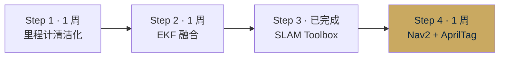

> 各阶段详细做法与验收指标见下方表格。

| 阶段 | 本期验收 |
|---|---|
| Step 1 | 10 m 直线 · 轮式里程计漂移 < 10 cm |
| Step 2 | 直角转弯 1 s 内 EKF 收敛 |
| Step 3 | 20 m × 20 m 建图 · 回原点误差 < 10 cm |
| Step 4 | 10 次工位对接 · 平均偏差 < 3 cm |
| 综合 | 10 次点选位点到达 · 平均 < 5 cm |

---

## 6. 关键风险与应对

| 风险 | 概率 | 影响 | 应对 |
|---|---|:---:|---|
| M10 抗光不达标（强光环境反光） | 中 | 高 | MS200 切主模态 + 视觉 Tag 兜底 |
| CMP10A 磁力计干扰 | 中 | 中 | 关闭 EKF 磁力计输入 · 只用陀螺 + 加速度 |
| ROSEB43i 深度 NaN > 30% | 低 | 中 | 降级到纯 2D LiDAR 避障 |
| CANopen 长时间 bus-off | 低 | 高 | SocketCAN 自动恢复 + 心跳监控 + 10 s 告警 |
| 工位 Tag 被遮挡 | 中 | 中 | 三档降速 + 力觉触边兜底 + 失败 3 次后手动 |

---

## 7. 后续演进

| 项 | 计划期 | 说明 |
|---|---|---|
| 多模态融合深化（RGBD + 激光 + 鱼眼 + 力觉） | RD3 | 置信度加权 · 降级策略完整 · `/scene/semantic_map` 统一接口 |
| arm_torso 8-DOF 联合规划 | P1 触发（≥ 3 次状态机无解） | 升降 + 臂一次性规划，参考 TIAGo |
| 语义导航 | 二期 | 从"去位点 A"到"去咖啡机"，NLU + Knowledge Graph |
| Loop Closure 主动触发 | RD4 | 机器人主动回到已知 Tag 做 SLAM 重定位 |

---

## 8. 参考

- **BOM 源**：`01｜机器人配置中心/01｜当前配置/01｜新版BOM清单/祥承电子BOM_v2.1_2025-09-24_解析.md` §C.3 导航与感知 + §F 视觉与交互
- **Nav2 文档**：<https://docs.nav2.org/>
- **SLAM Toolbox 论文**：<https://joss.theoj.org/papers/10.21105/joss.02783>
- **robot_localization 官方教程**：<https://docs.ros.org/en/noetic/api/robot_localization/html/>
- **Nav2 Docking 教程**：<https://docs.nav2.org/tutorials/docs/using_docking.html>
- **AprilTag ROS 2**：<https://github.com/christianrauch/apriltag_ros>
- **本项目内部文档**：
  - `02｜研发进展跟踪/03｜2026-04报告三件套/01_技术分析报告A_双X86方案.md` §4.2 底盘导航
  - `02｜研发进展跟踪/03｜2026-04报告三件套/06_X86方案简化版.md` 挑战 3

---

**文档作者**：Kevin & Claude · Transcribe Box Lab
**发布日期**：2026-04-19
