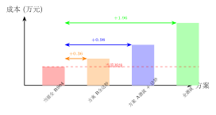

# 关节模组升级方案评估：双编码器行星 vs 谐波混合

> 基于代码仓库调研、行业调研和成本分析的系统评估。

## 一、背景：电机替换历史与编码器退化

从代码仓库分析发现了一个关键事实：

### OpenARM 原版（达妙 → 双编码器）

```yaml
# openarm_driver/config.yaml
motor_config:
  types: ['DM8009', 'DM8009', 'DM4340', 'DM4340', 'DM4310', 'DM4310', 'DM4310', 'DM3507']
```

原版 OpenARM 使用 **达妙（Damiao）电机**，`openarm_can` 库有专门的 `damiao_motor/` 驱动目录（`dm_motor_control.cpp`）。达妙 DM-J 系列全系标配**双磁编码器（-2EC 后缀）**，电机侧 + 输出侧各一个 14bit 磁编码器。

### OpenARMX（XC-Robot）= 灵足 RobStride → 单编码器退化

```cpp
// v10_simple_hardware.cpp 第 25 行
#include <openarmx/robstride_motor/rs_motor_control.hpp>
```

OpenARMX（XC-Robot 购买的版本）将电机从达妙换成了**灵足 RobStride（RS04/RS03）**。整个硬件接口层使用 `robstride_motor::` 命名空间。编码器能力因此退化：

| | 原版 OpenARM（达妙） | XC-Robot（灵足 RS04） |
|---|---|---|
| 编码器数量 | **双编码器**（电机侧 + 输出侧，成品级支持） | **硬件 2×AS5047P，驱动未启用 encoder2** |
| 输出端反馈 | 物理编码器直接测量 | 软件估算（÷减速比），`encoder2raw` 寄存器存在但未读 |
| 背隙补偿 | 可闭环补偿 | **当前无法**（硬件有潜力，需改驱动层） |
| 典型型号 | DM-J8009-2EC | RS04 + OpenARMX 驱动 |

<!-- 注意事项 -->
<div class="callout callout-warn">
⚠️ <strong>注意</strong>：RS03/RS04 硬件上有 2 颗 AS5047P 磁编码器芯片（BOM 确认），且 `encoder2raw（0x3007）` 寄存器可用于输出侧独立读数。但 OpenARMX 驱动层<strong>未激活</strong>第二路编码器——瓶颈不在硬件，在驱动层。换回达妙可直接用成品级双编码器功能，无需改驱动。
</div>

---

## 二、两个可选升级方案

### 方案 A：肩肘谐波 + 其余达妙双编码器行星（从笔记 18）

保留 OpenARM 架构不变，只换模组：

| 关节 | 模组 | 型号 | 成本（估） | 理由 |
|------|------|------|-----------|------|
| **J1** | **谐波** 100:1 | 达妙 DM-JH14 / 绿的谐波一体 | ~¥4,000 | 背隙经全臂长放大 |
| **J2** | **谐波** 100:1 | 同上 | ~¥4,000 | 同上 |
| J3 | 行星双编码 | 达妙 DM-J8009-2EC | ~¥4,751 | 背隙不放大 |
| **J4** | **谐波** 80:1 | 达妙 DM-JH11 | ~¥3,000 | 背隙经前臂放大 |
| J5 | 行星双编码 | 达妙 DM-J4310-2EC | ~¥899 | 直接末端 |
| J6 | 行星双编码 | 同上 | ~¥899 | 直接末端 |
| J7 | 行星双编码 | 达妙 DM-J3507-2EC | ~¥700 | 最小模组 |
| **合计** | | | **~¥18,249/臂** | |

### 方案 B：全达妙双编码器行星（新方案）

全部替换为达妙 DM-J 系列双编码器行星，保持全行星架构：

| 关节 | 模组 | 型号 | 成本（估） |
|------|------|------|-----------|
| J1 | 行星双编码 | 达妙 DM-J8009-2EC（40 Nm 峰扭）| ~¥4,751 |
| J2 | 行星双编码 | 同上 | ~¥4,751 |
| J3 | 行星双编码 | 达妙 DM-J4340-2EC（27 Nm）| ~¥1,500 |
| J4 | 行星双编码 | 同上 | ~¥1,500 |
| J5 | 行星双编码 | 达妙 DM-J4310-2EC（12.5 Nm）| ~¥899 |
| J6 | 行星双编码 | 同上 | ~¥899 |
| J7 | 行星双编码 | 达妙 DM-J3507-2EC（3 Nm）| ~¥700 |
| **合计** | | | **~¥14,999/臂** |

<!-- 关键发现 -->
<div class="callout callout-key">
🔑 <strong>关键差异</strong>：方案 B 比方案 A 单臂便宜 约<strong>¥3,250</strong>，且安装更简单（全行星空不用混装）。代价是末端精度不如谐波方案——但双编码器可部分补偿背隙，对<strong>抓取、码垛、投放</strong>场景足够。
</div>

---

## 三、四方案成本全景



| 方案 | 单臂成本 | 双臂成本 | vs 当前整机 BOM | 末端精度 |
|------|---------|---------|----------------|---------|
| **① 当前（全 RS04 单编码）** | ~¥8,400 | ~¥16,800 | ~6.4 万（基线） | ±1-2mm |
| **② 全达妙双编码行星（B）** | ~¥15,000 | ~¥30,000 | **+¥1.32 万** | ±0.3-0.5mm |
| **③ 谐波+达妙双编码（A）** | ~¥18,200 | ~¥36,400 | **+¥1.96 万** | ±0.1-0.3mm |
| ④ 全谐波 | ~¥28,000 | ~¥56,000 | +¥3.92 万 | ±0.05mm |

<!-- 推荐做法 -->
<div class="callout callout-ok">
✅ <strong>推荐</strong>：方案 B（全达妙双编码器行星）是当前性价比最优路径。相比当前基线 BOM 增量约 ¥1.32 万，精度提升 3-5 倍，且与原版 OpenARM 驱动高度兼容，落地风险最低。
</div>

---

## 四、优势对比

| 维度 | 方案 A（谐波混合） | 方案 B（全达妙行星） |
|------|------------------|-------------------|
| 成本增量（双臂） | +¥1.96 万 | **+¥1.32 万** |
| 精度改善 | 最优（谐波零背隙） | 良好（双编码器补偿） |
| 安装复杂度 | 高（谐波/行星混装，接口可能不同） | **低（全行星空，接口统一）** |
| 代码兼容性 | 中等（需适配谐波模组参数） | **高（原版 OpenARM 达妙驱动可复用）** |
| 供应链风险 | 谐波供应商集中（绿的） | **分散（达妙/因克斯/高擎均可替换）** |
| 抗冲击维护 | 谐波寿命 ~10,000 hrs | **行星寿命 >100,000 hrs** |
| 未来升级空间 | 已到顶 | 可进一步升级到 J1/J2 谐波 |

### 精度足够性的判断

方案 B 的末端精度 ±0.3-0.5mm 对应：

| 场景 | 可行性 |
|------|--------|
| SMT 料盘分拣 | ✅ 完全可行（抓取容差 >1mm） |
| 线边转运 | ✅ 完全可行 |
| 拆码垛 | ✅ 完全可行 |
| 仓储搬运 | ✅ 完全可行 |
| 精密插孔/装配 | 🟡 需要视觉引导补偿（±0.3mm 不够，需 ±0.05mm） |
| 拖动示教/力控 | 🟡 精度够，缺力矩传感器信号 |

---

## 五、实施建议

### 建议分两步走

```
阶段 1（优先级高）: 换全达妙双编码器行星 + 摩擦辨识标定
  → 成本增量 ¥13,200（双臂）
  → 目标精度 ±0.3-0.5mm
  → 验证是否覆盖 90% 应用场景

阶段 2（按需）: 如阶段 1 精度不够，再升级 J1/J2/J4 为谐波
  → 从方案 B 升级到方案 A
  → 仅增量 ¥6,400（双臂）
  → 末端精度提升到 ±0.1mm
```

<!-- 关键结论 -->
<div class="callout callout-key">
🔑 <strong>核心判断</strong>：双编码器行星方案（方案 B）的精度能否覆盖需求，取决于摩擦辨识和 URDF 标定的完成度——硬件的双编码器提供了基础，但软件的标定决定了最终精度。先做阶段 1，验证数据驱动决策。
</div>

### 代码复用建议

原版 OpenARM 的达妙驱动代码可直接使用：

```
openarm_can/src/openarm/damiao_motor/
├── dm_motor.cpp
├── dm_motor_control.cpp
├── dm_motor_device.cpp
└── dm_motor_device_collection.cpp
```

以及 PD 优化工具：
```
dm_pd_optimizer/DM_Control_Python/
├── DM_CAN.py
├── DM_Motor_Test.py
└── BFGS_pd_finder.py
```

这些代码在 openarmx 移除了达妙支持、换成 RobStride 后被弃用，**但仍在仓库中**。换回达妙电机后可恢复使用。
