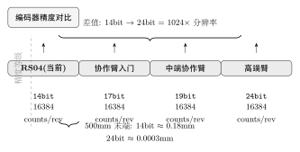
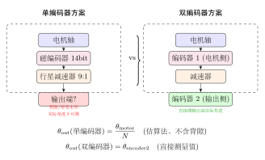
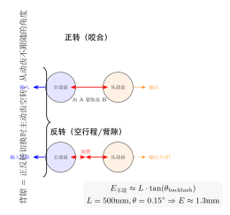
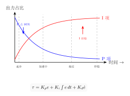

# 编码器精度、背隙与 PI 控制权重

> 从编码器分辨率到 PD/PID 信号链，系统分析机器人关节精度的影响因素。

## 一、编码器分辨率与倍频效应

编码器是机器人关节的"眼睛"——它将轴角位置转换为数字信号。编码器的核心指标是**分辨率**（bit 数），它直接决定了关节能感知的最小角度变化。

### 1.1 精度对比

下图展示了从 14bit 到 24bit 编码器的精度差异，以及经过 9:1 行星减速器后的末端分辨率：



编码器分辨率每提高 1bit，角分辨率翻倍。14bit 到 24bit 的差距是 1024 倍。

### 1.2 倍频效应（Gearbox Multiplication）

编码器通常安装在电机侧（减速器之前）。经过减速器后，有效的输出端分辨率会乘以减速比：

$$\theta_{\text{out\_min}} = \frac{\theta_{\text{encoder\_min}}}{N}$$

其中 $N$ 是减速比。

| 编码器 | 电机侧分辨率 | 9:1 减速后 | 500mm 末端位移 |
|--------|------------|-----------|---------------|
| 14bit | 16,384/rev | ~147,456/rev | ~0.18mm |
| 17bit | 131,072/rev | ~1,179,648/rev | ~0.026mm |
| 19bit | 524,288/rev | ~4,718,592/rev | ~0.007mm |
| 24bit | 16,777,216/rev | — | 亚微米级 |

<!-- 关键结论 -->
<div class="callout callout-key">
🔑 <strong>关键结论</strong>：倍频效应只能放大由编码器分辨率决定的"理论最小分辨率"，无法补偿齿轮背隙、弹性形变等机械误差。实际精度永远受限于 <strong>机械误差 > 编码器分辨率</strong>。
</div>

### 1.3 单编码器 vs 双编码器

单编码器只能感知电机侧角度，输出端位置 = 电机角度 / 减速比——这**假设齿轮箱无背隙、无形变**，而实际齿轮箱一定有背隙。

双编码器在输出端加装第二个编码器，直接测量实际输出角度：



双编码器的核心价值在于：$\theta_{\text{out}}$ 由编码器②直接测量，减速器背隙、弹性形变、齿轮磨损等误差全部可以被控制器闭环补偿——**把硬约束变成可控误差**。

<!-- 关键结论 -->
<div class="callout callout-ok">
✅ <strong>推荐</strong>：如果保留行星方案，双编码器是必要条件——否则背隙误差经过臂长放大到末端，限制精细操作能力。
</div>

---

## 二、背隙（Backlash）：不是回差，是空行程

背隙（Backlash）是齿轮啮合间隙导致的现象：**当输入轴改变方向时，主动齿脱离接触、空转一段角度后，才再次推动从动齿**。



关键澄清：

- **背隙 ≠ 惯性过冲**。过冲是动态的（质量停不住），背隙是静态的（齿轮间隙客观存在）。
- **背隙 = 换向空行程**，不是"回差"——"回差"容易和"迟滞"混淆。

### 2.1 背隙对末端精度的影响

臂长 $L=500$mm 时，背隙 $\theta$ 对末端位置误差的影响：

$$E = L \cdot \tan(\theta)$$

| 减速器类型 | 背隙典型值 | 500mm 末端误差 | 适用场景 |
|-----------|-----------|---------------|---------|
| 谐波减速器 | $<$ 1 arcmin ($<$ 0.017$^\circ$) | $<$ 0.15mm | 精密操作 |
| 精密行星（双编码器） | 3-8 arcmin (0.05-0.13$^\circ$) | 0.4-1.2mm | 通用抓取 |
| 标准行星（单编码器） | 5-15 arcmin (0.08-0.25$^\circ$) | 0.7-2.2mm | 粗放作业 |

### 2.2 arcmin 单位换算

$$
1^\circ = 60 \text{ arcmin} \\
1 \text{ arcmin} = 60 \text{ arcsec}
$$

直观感受：1 arcmin 在手臂末端的偏差 ≈ 500mm 臂长 × tan(0.017$^\circ$) ≈ 0.15mm。

---

## 三、PI 控制动态权重

### 3.1 PID 控制公式

$$\tau = K_p e + K_i \int e\,dt + K_d \dot{e}$$

| 项 | 含义 | 特性 |
|----|------|------|
| **P（比例）** | $K_p \cdot e$，当前误差成正比 | 误差大时主导，但无法消除静差 |
| **I（积分）** | $K_i \int e\,dt$，历史误差累积 | 消除稳态误差，但有 windup 风险 |
| **D（微分）** | $K_d \cdot \dot{e}$，误差变化趋势 | 提供阻尼，抑制超调 |

### 3.2 单次运动中 P 和 I 的动态变化

在一次从 A 到 B 的运动中，P 和 I 的权重持续变化：



- **起步时**：误差大，P 项占 ~95%，主导加速；I 项刚开始累积
- **接近目标时**：P 项随误差缩小而减弱，I 项占比升至 ~70%
- **停稳时**：P ≈ 0，I 保持累积值对抗负载力矩

<!-- 关键结论 -->
<div class="callout callout-key">
🔑 <strong>关键结论</strong>：I 项从第 1ms 就开始累积出力，不存在"跨多次运动积累"的机制。一次运动内部就完成了从 P 主导到 I 持稳的过渡。
</div>

### 3.3 PD+前馈 vs PID

PD+前馈替代 PID 的 I 项，核心逻辑是：**前馈靠模型直接算稳态补偿，I 项靠积分"试错"学稳态补偿。**

$$\tau_{\text{PID}} = K_p e + K_i \int e\,dt + K_d \dot{e} \quad\text{（靠积分试错）}$$

$$\tau_{\text{PD+ff}} = K_p e + K_d \dot{e} + \tau_{\text{ff}}(q,\dot{q}) \quad\text{（靠模型计算）}$$

前馈 $\tau_{\text{ff}}$ 基于动力学模型：

$$\tau_{\text{ff}} = M(q)\ddot{q} + C(q,\dot{q})\dot{q} + g(q) + f_c \cdot \tanh(\omega/\omega_0) + f_v \cdot \omega$$

其中 $g(q)$ 是重力前馈，$f_c, f_v$ 是库仑/粘滞摩擦系数。

<!-- 注意事项 -->
<div class="callout callout-warn">
⚠️ <strong>注意</strong>：前馈的精度完全取决于模型参数标定的准确度。如果 URDF 参数来自 CAD 估算（误差 10-20%），前馈算出来的也是错的——标定才是瓶颈。
</div>

---

## 四、Kp/Kd 信号链：从系数到力

### 4.1 三层控制环

```
上位机（1kHz 轨迹规划）: 生成 pos_ref / Kp / Kd / tau_ff
  ↓ CAN 帧（8 字节/关节）
电机 MCU 固件:
  PD 循环（10-20kHz）: tau = Kp·e + Kd·e_dot + tau_ff
    ↓ Iq_ref = tau / Kt (转矩常数)
  FOC 电流环（20-40kHz）: Iq_ref → PWM
```

### 4.2 Kp（刚度）的物理链

$$K_p \uparrow \rightarrow \tau = K_p \cdot e \uparrow \rightarrow I_{q\_ref} = \tau/K_t \uparrow \rightarrow \text{电流} \uparrow \rightarrow \text{磁场} \uparrow \rightarrow \text{力} \uparrow$$

**Kp 和 Kd 只影响 Iq，完全不碰 Id。**

Iq 是力矩电流（和 $\tau$ 直接对应），Id 是弱磁电流（由弱磁策略独立控制）。两者解耦。

| 参数 | 影响 | 最终路径 |
|------|------|---------|
| Kp | 刚度/位置误差响应 | → Iq_ref → 电流 → 力矩 |
| Kd | 阻尼/速度误差响应 | → Iq_ref → 电流 → 力矩 |
| Can FD | 不影响帧率，单帧 8→64 字节 | 对 MIT 控制无优势（每关节 8 字节已够） |

### 4.3 频率分配澄清

| 频率 | 内容 | 在哪跑 | 够不够 |
|------|------|--------|--------|
| 1kHz | CAN 帧刷新 Kp/Kd/参考值 | 上位机→CAN总线 | ✅ Kp/Kd 是系统特性，不需要每帧剧烈变化 |
| 10-20kHz | PD 计算 | **电机 MCU 固件**（不受 CAN 限制） | ✅ 现在就是高频的 |
| 20-40kHz | FOC 电流环 | **电机 MCU 固件** | ✅ 和 CAN 完全解耦 |

---

## 总结

影响机器人关节精度的三个关键因素：

1. **编码器分辨率** — 决定了"能感知多小的误差"。14bit 够粗放抓取，精细操作需 ≥17bit
2. **背隙（Backlash）** — 换向空行程导致的位置不确定度，**不经过臂长放大**的关节（J3/J5/J6/J7）对背隙容忍度高
3. **控制策略** — PD+前馈 vs PID 的选择取决于模型标定精度。没标之前，I 项是兜底方案
