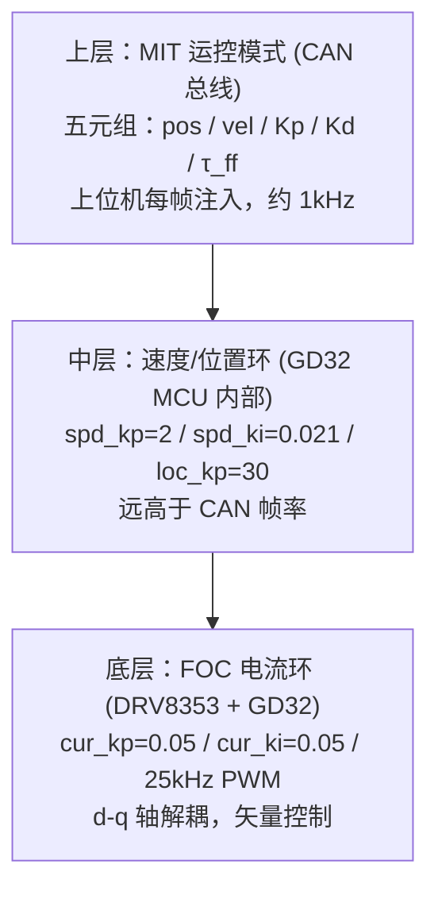
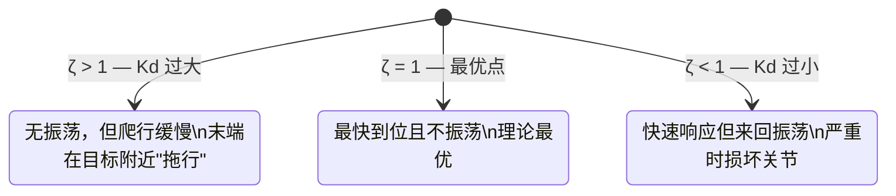
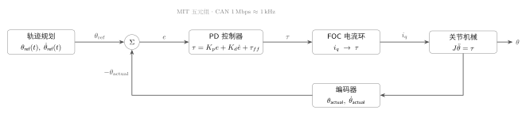
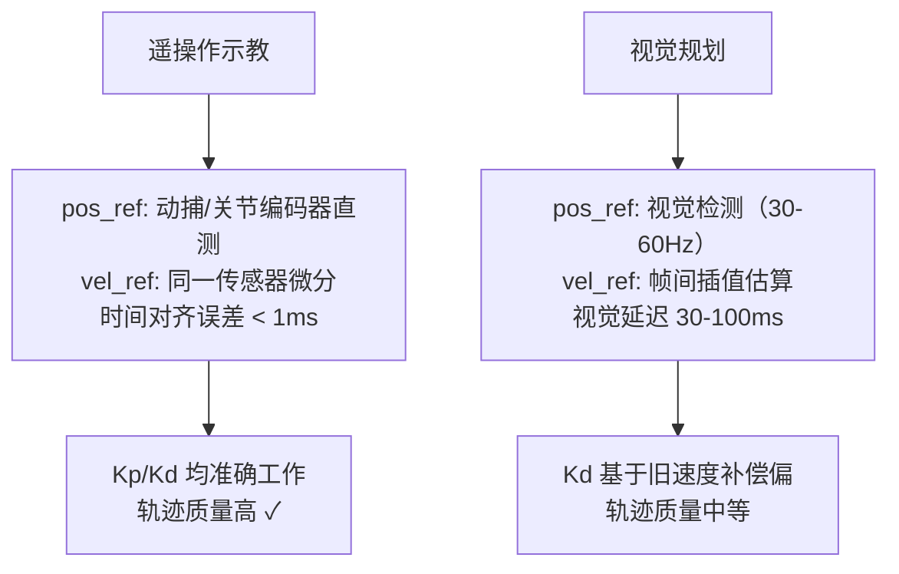

# FOC × MIT 运控深析：关节抖动根因与 PD 参数调参指南

> **日期**：2026-05-21 &emsp; **作者**：XC-Robot 技术组 &emsp; **状态**：✅ 已完成

---

## 一、为什么要理解 FOC 和 MIT 的关系

XC-Robot 使用灵足时代 RobStride RS04/RS03 关节模组。在调试过程中，机械臂出现明显抖动，团队内部出现了一个误判：

> "抖动是因为我们没有用 FOC，宇树不抖是因为它用了 FOC。"

这个判断是错的。本文从根本上厘清 FOC 与 MIT 运控的分层关系，分析抖动的真实根因，并给出 Kp/Kd 调参的理论依据。

---

## 二、三层控制架构

FOC 和 MIT 运控不是同一层面的技术。两者在控制栈中处于不同位置：



**关键结论**：

- **FOC（磁场定向控制）** 是最底层的换向策略，负责把三相电流精确控制到 d-q 轴，保证电机转矩线性可控。它跑在 GD32 MCU 内部，固件闭源，25kHz PWM。
- **MIT 运控模式** 是上层通信协议 + 外环控制逻辑，通过 CAN 总线以约 1kHz 帧率向关节发送"目标位置 + 弹簧/阻尼系数 + 力矩前馈"。
- 两者不冲突，灵足关节**同时运行 FOC 和 MIT 模式**。宇树也在用 FOC，并不是宇树有 FOC 而我们没有。

---

## 三、抖动的真实根因：四层瓶颈叠加

### 根因 1：CAN 总线带宽瓶颈（最关键）

MIT 运控模式把 Kp/Kd（外环 PD 参数）放在 CAN 总线上，每帧随位置指令一起发送。

| 指标 | 灵足 MIT 模式 | MIT Mini Cheetah 原版 |
|------|-------------|----------------------|
| 外环 PD 运行位置 | **CAN 总线上**（上位机） | **MCU 本地**（驱动板） |
| 外环更新频率 | ~1kHz（CAN 帧率上限） | **40kHz**（MCU 本地） |
| Kp/Kd 动态注入 | ✅ 每帧可改 | ❌ 固化在固件 |

Mini Cheetah 原版低抖动的根本原因：PD 控制在驱动板 MCU 上以 40kHz 本地闭环，CAN 总线只传高层轨迹指令。灵足把外环放到 1kHz 的 CAN 总线上，指令离散，关节收到的"弹簧"在跳变，表现为抖动。

### 根因 2：编码器噪声放大

AS5047P 双磁编 14-bit，低速时速度估计噪声大，经 Kd 放大后触发位置环震荡。QDD 9:1 减速比没有高减速比的噪声衰减效果，任何微小电流波动都直接体现在输出端。

### 根因 3：电流环参数保守

`cur_filt_gain=0.6` 代表重度平滑，电流环响应被压低。遇到外力扰动时，电流环来不及响应，外环位置环被动震荡。

### 根因 4：QDD 架构的固有敏感性

9:1 减速比的准直驱设计，力控带宽高（~100Hz），但对电流和编码器噪声极度敏感，任何微小波动都直达输出端。这是设计取舍，不是缺陷。

---

## 四、MIT 五元组：PD 参数的含义

每帧 CAN 报文发送五个数：

```
[pos_ref,  vel_ref,  Kp,  Kd,  τ_ff]
```

电机收到后计算输出力矩：

$$\tau = K_p \cdot (pos_{ref} - pos_{actual}) + K_d \cdot (vel_{ref} - vel_{actual}) + \tau_{ff}$$

### Kp — 位置环比例增益（弹簧）

物理比喻：**弹簧劲度系数**。关节偏离目标越远，拉回去的力越大。

$$K_p \cdot \underbrace{(pos_{ref} - pos_{actual})}_{\text{位置误差}}$$

| 参数 | 行为 | 场景 |
|------|------|------|
| Kp 大（200–300） | 刚硬，抗外力，但易振荡 | 精确定位、负载较重 |
| Kp 小（50–100） | 柔顺，可被推偏 | 遥操作、示教、接触任务 |

### Kd — 速度环阻尼增益（减震器）

物理比喻：**液压减震器**。关节运动越快，反向制动力越大。

$$K_d \cdot \underbrace{(vel_{ref} - vel_{actual})}_{\text{速度误差}}$$

| 参数 | 行为 | 场景 |
|------|------|------|
| Kd 大（5–10） | 平滑，阻尼强，不振荡，但慢 | 精密场景、负载柔顺 |
| Kd 小（1–2） | 响应快，但易来回振荡 | 高速运动（需配合大 Kp） |

**注意**：Kd 不是惯性。惯性（$F = J\alpha$）抵抗速度的**改变**，Kd 阻尼（$F = K_d \omega$）抵抗速度**本身**。前者重载感强，后者是水中运动感。

---

## 五、Kp/Kd 调参的数学依据：阻尼比

PD 控制下的关节运动是二阶振荡系统：

$$J\ddot{e} + K_d\dot{e} + K_p e = 0$$

固有频率和阻尼比：

$$\omega_n = \sqrt{\frac{K_p}{J}}, \qquad \zeta = \frac{K_d}{2\sqrt{K_p \cdot J}}$$



**Kp 增大为什么会导致振荡**：Kp 变大时 $\omega_n$ 上升，但 $\zeta = K_d / (2\sqrt{K_p J})$ 下降（Kd 不变）。当 $\zeta < 1$ 进入欠阻尼，过冲振荡不可避免。

**调参铁律**：**Kp 和 Kd 不能独立调，必须联动**，目标是维持 $\zeta \in [0.7, 1.0]$。

**典型值验证**（RS04，估算 J ≈ 0.1 kg·m²）：

| Kp | Kd | ζ | 状态 |
|----|----|---|------|
| 100 | 10 | 1.58 | 过阻尼（稳但慢）|
| 400 | 10 | 0.79 | 欠阻尼（会振荡）|
| 400 | 13 | 1.03 | 临界（推荐）|

若要提高 Kp 到 400 以增加刚度，Kd 也需同步从 10 提高到约 13，才能维持临界阻尼。

---

## 六、完整控制环路与位置规划

一个常见的误解：以为上位机直接发"终点位置"给电机。

实际上，上位机发的是轨迹规划器每 1ms 生成的**中间路径点**，关节持续在这条时间序列上跟踪误差并修正。下图用 TikZ 渲染了含公式的完整闭环：



- $\theta_{\text{ref}}(t)$：轨迹规划器当前时刻的目标位置（不是终点）
- $e = \theta_{\text{ref}} - \theta_{\text{actual}}$：位置误差，Kp 项的输入
- $\tau_{ff}$：前馈力矩（重力补偿 / 摩擦补偿），绕过误差反馈直接注入
- 编码器以 ~1kHz 采样，速度 $\dot{\theta}_{\text{actual}}$ 由微分估算

> **标注"MIT 五元组 · CAN 1 Mbps ≈ 1 kHz"**：Kp/Kd 每帧随 $\theta_{\text{ref}}$ 一起通过 CAN 发出，这是 MIT 协议的核心——动态变刚度，也是 1kHz 带宽瓶颈的来源。

---

## 七、遥操作 vs 视觉规划：数据质量差异

在 VLA 示教数据采集中，这一区别很关键：



**操作者速度差异导致卡顿的机制**：

快速操作者的动作突然加速时，追踪系统存在延迟，`vel_ref` 落后于 `vel_actual`，造成 `e_vel = vel_ref - vel_actual < 0`，Kd 产生反向制动力矩，关节被"踩了刹车"，表现为卡顿。

这是 VLA 示教数据中需要做**动作速度归一化**的直接原因。

---

## 八、前馈路线：突破 1kHz 带宽瓶颈的根本方法

CAN 总线 1kHz 的限制是结构性瓶颈，无法通过调 Kp/Kd 消除。根本解法是**减少对外环 PD 的依赖**，通过前馈直接补偿已知的物理力，让 PD 只处理微小残差：

$$\tau = \underbrace{K_p \cdot e_{pos} + K_d \cdot e_{vel}}_{\text{PD 误差修正}} + \underbrace{\tau_{gravity} + \tau_{friction} + \tau_{inertia}}_{\text{前馈补偿}}$$

| 优先级 | 补偿项 | 工具 | 预期效果 |
|--------|--------|------|----------|
| P0 | 轨迹插补（Ruckig） | MoveIt2 内置 | 消除阶跃跳变 |
| P1 | 重力补偿 | Pinocchio `computeGeneralizedGravity()` | 静态误差 10× 改善 |
| P2 | 摩擦补偿 | tanh 模型，需辨识实验 | 消除低速爬行 |
| P3 | 科氏力/惯量前馈 | Pinocchio `rnea()` | 高速运动平稳 |

所有前馈都只需在 `openarm_hardware::write()` 中把计算好的 τ_ff 填入 MIT 帧的 torque 字段，**不改 FOC 固件，不换硬件**。

---

## 九、下一步行动项

- [ ] 测量 RS04 关节实际惯量 J，代入阻尼比公式验证调参范围
- [ ] 逐步降低 `cur_filt_gain`（从 0.6 → 0.4），提升电流环响应速度
- [ ] 完成 URDF 动力学参数标定（悬挂法），为 Pinocchio 重力补偿做准备
- [ ] 开发 Pinocchio 重力补偿节点，填入 τ_ff 字段
- [ ] 摩擦辨识实验：采集低速段 mechVel 噪声谱，拟合 tanh 摩擦模型参数

---

> 本文整理自 XC-Robot 技术讨论（2026-05-21），对应内部笔记：
> `07｜思考过程/01-电机控制/01-电机控制.md` ·
> `09-MIT-PD参数与位置速度环深析.md` ·
> `10-位置规划与PD参数深析.md`
