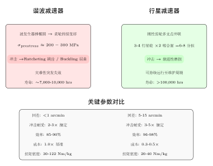
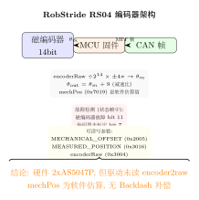

# 关节模组行业调研：谐波 vs 行星与供应商分析

> 基于对 2025-2026 年中国机器人企业供应链的调研，系统分析谐波减速器、行星减速器及编码器方案的行业格局。

## 一、谐波 vs 行星减速器核心差异

### 1.1 抗冲击原理分析

谐波减速器的柔轮（Flexspline）被波发生器撑为椭圆，产生约 200-300 MPa 预应力。冲击载荷来临时，柔轮已接近屈服强度 30-40%，容易发生 Ratcheting（跳齿）或 Buckling（屈曲失稳）。而行星减速器是刚性齿轮多支点并联啮合，无预应力，冲击时渐进磨损而非突发断裂。

### 1.2 全面对比表

| 维度 | 谐波减速器 | 单级行星 | 双级行星 |
|------|-----------|---------|---------|
| 冲击载荷 | 2-3$\times$ 额定扭矩 | 3-5$\times$ 额定扭矩 | 3-4$\times$ 额定扭矩 |
| 失效模式 | **灾难性突发**（柔轮屈曲/跳齿） | **渐进性磨损**（齿轮点蚀） | 介于两者之间 |
| 回差（Backlash） | $<$1 arcmin | 5-15 arcmin | 8-20 arcmin |
| 效率 | 85-90%（轻载可跌至 40-50%） | 96-98% | 90-95% |
| 寿命（满载） | ~7,000-10,000 hrs | $>$100,000 hrs | 80,000+ hrs |
| 成本比 | 1.0$\times$（基准） | 0.3-0.5$\times$ | 0.4-0.7$\times$ |
| 扭矩密度 | 30-122 Nm/kg | 20-40 Nm/kg | 20-40 Nm/kg |

### 1.3 行业趋势

**特斯拉 Optimus Gen 3 已从谐波全面转向行星（50:1）**，专利明确说明放弃定制谐波方案，优先成本和供应链可靠性。

**行业共识**：上肢用谐波（精密）+ 下肢用行星（抗冲击）是人形机器人标准架构。但**轮式双臂机器人不需要跑跳**，无落地冲击——谐波在双臂上的抗冲击短板不再显著。

<!-- 关键结论 -->

🔑 <strong>关键结论</strong>：对轮式双臂机器人，肩肘关节用谐波是当前行业最主流的选择——背隙经臂长放大后直接影响末端精度，而轮式底盘无落地冲击，谐波的抗冲击短板不构成问题。

---

## 二、行星模组 + 双编码器方案调研

### 2.1 主要供应商

| 厂商 | 代表型号 | 编码器 | 峰值扭矩 | 参考价 | 特点 |
|------|---------|--------|---------|-------|------|
| **达妙 Damiao** | DM-J4310-2EC | **双磁**编码器 | 12.5 Nm | **¥899** | 全系-2EC 标配双编码器 |
| | DM-J8009-2EC | **双磁**编码器 | 40 Nm | ¥4,751 | 中扭矩型号 |
| | DM-J10010-2EC | **双磁**编码器 | 150 Nm | — | 大扭矩 |
| **灵足 RobStride** | RS01/RS04 | **双磁**编码器 | 17-120 Nm | **¥599-1,199** | 最低价，准直驱 |
| **高擎 HighTorque** | HTDW-6036 | **双绝对值**编码器 | 36 Nm | 询价 | 绝对值编码器 |
| **东茂 Dongmao** | A6408 | **双**编码器 | 60 Nm | 询价 | 中空走线 |
| **因克斯 INX** | A8112 | **双**编码器（高速增量+输出绝对） | 90 Nm | 询价 | 松延动力供应商 |

### 2.2 双编码器溢价

双编码器方案比单编码器贵约 **¥100-300**（零售端溢价 15-30%），批量 OEM 差异更小（约 ¥50-150）。性价比极高。

<!-- 推荐做法 -->

✅ <strong>推荐</strong>：如果延续行星方案，从单编码器升级到双编码器的边际成本很低（¥100-300/关节），但能将背隙从"硬约束"变成"可补偿误差"。

---

## 三、行业企业关节配置调研

### 3.1 主要企业对比

| 企业 | 上肢关节 | 减速器供应商 | 编码器 | 关键特征 |
|------|---------|-----------|--------|---------|
| **智元 远征 A2** | **J1/J2/J4 谐波 + J3/J5/J6/J7 行星** | 绿的谐波 + 中大力德 | **共轭同轴双绝对值** | PowerFlow 关节，峰值 450 Nm |
| **银河通用 Galbot G1** | 腰部以上**全谐波** | 绿的谐波独家 | 绝对编码器 | 轮式双臂，春晚微电影 |
| **宇树 G1** | **全行星**（二级 20.58:1） | 中大力德 | 双编码器 | 极致低价（¥9.9 万） |
| **宇树 H1** | 肩肘**谐波** + 其余行星 | 绿的谐波 + 中大力德 | 双编码器 | M107 关节峰值 360 Nm |
| **傅利叶 GR-2** | **全臂谐波** 7$\times$2 DOF | 绿的谐波 | FSA 2.0 双编码 | 上肢精度优先 |
| **优必选 Walker S** | **全臂谐波** 7$\times$2 DOF | 绿的谐波 | 双编码器 | 工业级精度，峰值 250 Nm |
| **魔法原子 MagicBot** | 上肢**谐波** + 下肢**行星** | 绿的谐波 + 中大力德 | **双编码器 19bit** | H60 关节 590g/90 Nm |
| **特斯拉 Optimus** | **全行星 50:1**（Gen 3） | 自研 | 双编码器 | 成本优先路线 |

### 3.2 春晚 2025-2026 机器人供应链

| 企业 | 谐波减速器 | 电机 | 传感器 |
|------|-----------|------|--------|
| 银河通用 | **绿的谐波** | 兆威机电、雷赛智能 | 柯力传感、商汤视觉、速腾聚创 |
| 宇树科技 | **绿的谐波** | 卧龙电驱、米格电机 | 速腾聚创、奥比中光、汉威 |
| 魔法原子 | **绿的谐波** | 自研+鸣志电器 | 奥普特 3D 视觉、汉威电子皮肤 |
| 松延动力 | 因克斯（集成） | 自研 | 未公开 |

<!-- 关键结论 -->

🔑 <strong>关键发现</strong>：<strong>绿的谐波</strong>在谐波减速器领域处于垄断地位——春晚四家机器人企业全部使用其产品。行星减速器领域供应商分散（中大力德/精锻科技/豪能股份等）。

---

## 四、因克斯 INX 模组专项调研

因克斯（南京因克斯智能科技）是松延动力的关节模组供应商，也是值得关注的国产行星模组新势力。

### 4.1 产品线

| 型号 | 类型 | 峰值扭矩 | 重量 | 编码器 | 特点 |
|------|------|---------|------|--------|------|
| A6408 | 行星 | 60 Nm | 0.6 kg | 双编码器 | 轻量 |
| A8112 | 行星 | 90 Nm | 840 g | 双编码器 | 中小型 |
| A10020 | 行星（扁平） | 150 Nm | 1.35 kg | 双编码器 | 中空走线 |
| A13715 | 行星 | 320 Nm | 2.5 kg | 双编码器 | 大扭矩 |
| EC-H series | **谐波**（2025 新发） | 20-100 Nm | — | 双编码器 | 谐波新线 |

编码器配置：电机侧**高速增量编码器** + 输出侧**多圈绝对值编码器**。

### 4.2 因时机器人 vs 因克斯（重要区分）

| | 因克斯 (INX) | 因时机器人 (Inspiring) |
|---|---|---|
| 全称 | 南京因克斯智能科技 | 北京因时机器人科技 |
| 成立 | 2022 | 2016 |
| 核心产品 | **旋转关节模组**（行星/谐波/摆线） | **微型线性执行器** + **灵巧手** |
| 客户 | 松延动力、加速进化 | 宇树、银河通用、智元 |

**因时不做旋转关节模组**，只做微型丝杆执行器（RH56 灵巧手等）。两者是完全不同的公司。

---

## 五、RobStride RS04 代码分析

### 5.1 编码器架构

### 5.2 代码层确认

从 `Coding References/RobStride/` 代码分析：

- **单物理编码器**：产品手册明确标注"编码器分辨率 14bit（单圈绝对值）"
- **mechPos（0x7019）是软件估算值**：`mechPos = encoderRaw / 2^14 × ±4π / 9（减速比）`，**不是第二个物理编码器**
- **无 Backlash 补偿逻辑**：`MECHANICAL_OFFSET（0x2005）` 只用于归零校准，和背隙无关

<!-- 注意事项 -->

⚠️ <strong>注意</strong>：RS04 只有运动中的 <code>status_magnetic_encoder_fault</code> 和 <code>fault_encoder_uncalibrated</code> 故障检测，<strong>没有主动的背隙补偿功能</strong>。代码中的 calibration 仅包含方向（direction）和零偏（homing_offset）。

### 5.3 MIT 帧格式验证

C++ `RobStride_Motor_MIT_Control()` 函数确认标准 MIT 帧：
- **pos** (16bit), **vel** (12bit), **kp** (12bit), **kd** (12bit), **torque_ff** (12bit) = **8 字节**
- 完全兼容 Mini Cheetah MIT 协议
- 上层前馈 $\tau_{ff}$ 作为 torque 字段发送，电机固件 $I_{q\_ref} = \tau / K_t$

---

## 总结

1. **绿的谐波**在谐波减速器领域处于垄断地位，是国产机器人上肢精度的关键供应商
2. **双编码器行星方案**（达妙、因克斯、高擎等）提供高性价比的精度提升路径
3. **谐波+行星混搭**（J1/J2/J4 谐波，J3/J5/J6/J7 行星）是当前双臂机器人最优成本精度平衡方案
4. **RS04 单编码器 + 无背隙补偿**是 XC-Robot 当前精度的硬约束——升级到双编码器或换谐波可绕过此约束
