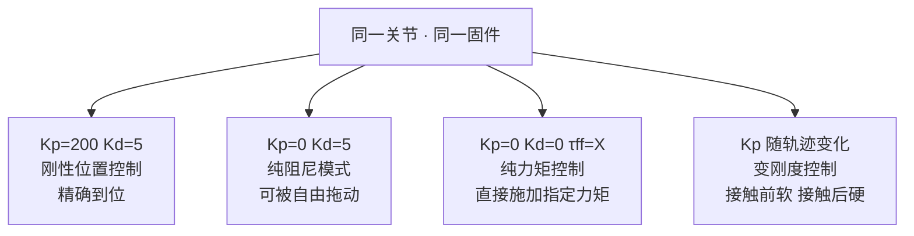
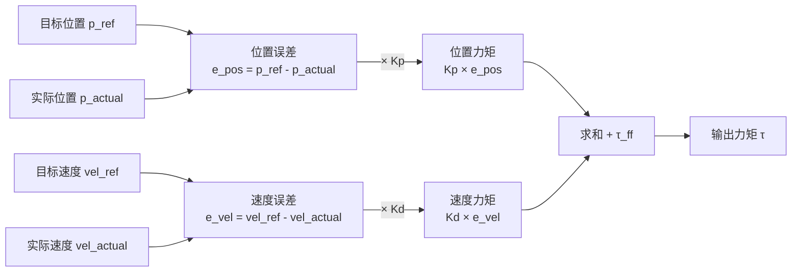
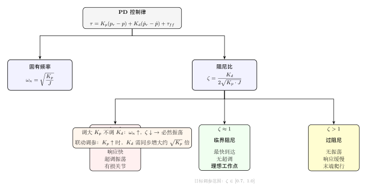
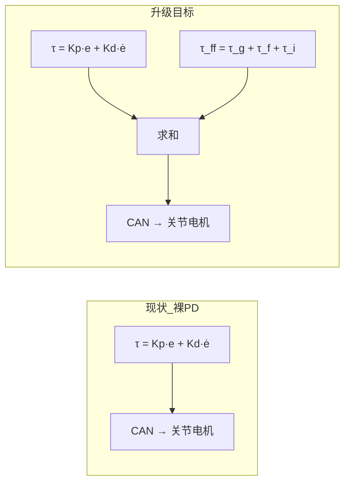
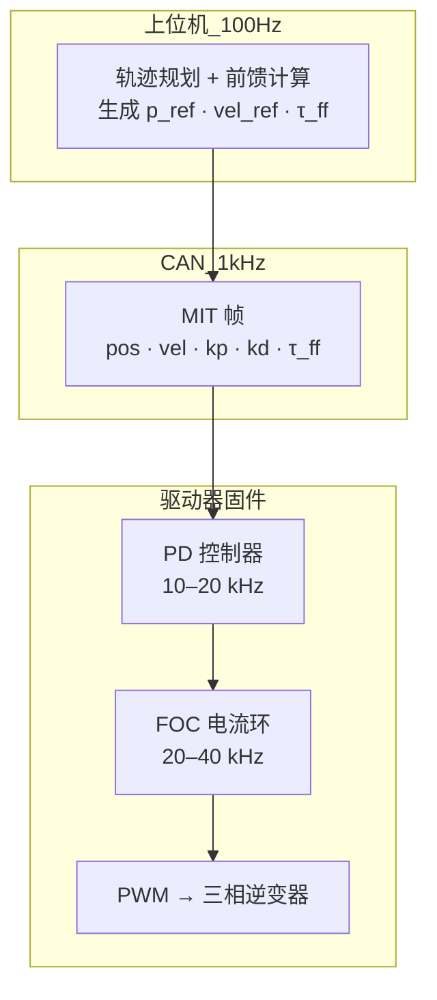
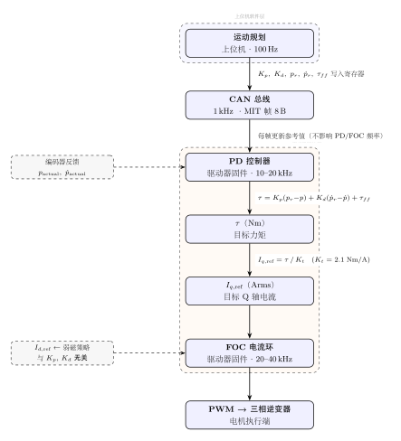
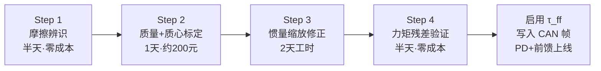

# MIT 运控深析（二）：PD 参数、前馈补偿与完整信号链路

> **导读**：本文是 [FOC × MIT 运控深析](../foc-mit-control-deep-dive/) 的续篇，聚焦三个核心问题：
> ① Kp/Kd 的物理本质与联动调参规律；
> ② 为什么当前 XC-Robot 缺少前馈补偿，以及动力学标定的路线图；
> ③ 从刚度系数到 Q 轴电流的完整信号链路。
> 内容综合自 openarmx_xc_robot_2 代码分析与 RobStride RS04 协议调研。

---

## 一、MIT 五元组与 PD 控制律

### 1.1 五元组回顾

MIT 运控模式下，上位机每帧向电机发送五个数：

$$\{p_r,\; \dot{p}_r,\; K_p,\; K_d,\; \tau_{ff}\}$$

电机固件收到后，计算输出力矩：

$$\tau = K_p(p_r - p) + K_d(\dot{p}_r - \dot{p}) + \tau_{ff}$$

其中 $p_r$ 为目标位置，$p$ 为编码器实测位置；$\dot{p}_r$ 为目标速度，$\dot{p}$ 为实测速度。

### 1.2 Kp 与 Kd 的物理直觉

| 参数 | 物理比喻 | 增大效果 | 减小效果 |
|------|---------|---------|---------|
| $K_p$（位置增益）| 弹簧劲度系数 | 刚性↑，抵抗外力强，但易振荡 | 柔顺，但位置保持差 |
| $K_d$（速度增益）| 减震器阻尼系数 | 运动稳定，但响应慢 | 响应快，但来回震荡 |

**弹簧比喻**：$K_p$ 越大，关节偏离目标越远时拉回去的力越大——就像弹簧越硬，拉伸后复位力越大。
**减震器比喻**：$K_d$ 越大，关节运动越快时阻力越大——就像减震器阻尼越强，振动衰减越快。

### 1.3 MIT 协议特别之处：动态注入

传统伺服驱动器的 Kp/Kd 是固件静态参数，出厂调一次不变。MIT 协议的核心创新是：$K_p$ 和 $K_d$ 随每帧位置指令一起以 1 kHz 发送，上位机可以每毫秒动态改变关节的"弹性"和"阻尼"。



这也是抖动的结构性根源之一：$K_p/K_d$ 只能以 CAN 的 1 kHz 帧率更新，指令离散性导致关节收到的"弹簧刚度"在跳变。对比 MIT Mini Cheetah 原版：关节 PD 控制在驱动板 MCU 以 **40 kHz** 运行，CAN 只传轨迹点——这才是低抖动的根本原因。

---

## 二、位置环与速度环

### 2.1 两个独立的误差反馈通道

"位置环"和"速度环"不是物理意义上的独立控制环路，而是 PD 公式里两个独立的误差反馈通道：



- **位置环**（$K_p$ 项）：用位置误差产生力矩，偏差越大拉回越猛
- **速度环**（$K_d$ 项）：用速度误差产生力矩，主要抑制振荡，防止超调后来回震荡

### 2.2 轨迹规划器持续生成路径点

上位机发的 $p_r$ **不是终点**，是轨迹规划器在每个时刻生成的当前路径点：


每帧（1 kHz）都重新计算路径点与实际位置的误差并修正。"终点"只是规划的输入，不是直接发给电机的东西。

---

## 三、阻尼比与 Kp/Kd 联动调参

### 3.1 二阶系统的阻尼比

PD 控制下，关节的闭环动力学方程为：

$$J\ddot{e} + K_d\dot{e} + K_p e = 0$$

从中提取两个关键特性：

$$\omega_n = \sqrt{\frac{K_p}{J}}, \qquad \zeta = \frac{K_d}{2\sqrt{K_p \cdot J}}$$

其中 $\omega_n$ 为固有频率，$\zeta$ 为阻尼比，$J$ 为关节惯量。



### 3.2 三种响应状态与调参目标

| 状态 | 条件 | 表现 | 适用场景 |
|------|------|------|---------|
| 欠阻尼 | $\zeta < 1$ | 响应快，但超调振荡 | 可能损坏关节，避免 |
| 临界阻尼 | $\zeta \approx 1$ | 最快到达且无振荡 | 理论最优，$\zeta \in [0.7, 1.0]$ |
| 过阻尼 | $\zeta > 1$ | 无振荡但末端爬行 | 精度要求极高的定位场景 |

**核心结论**：$K_p$ 和 $K_d$ 不能独立调节。调大 $K_p$ 时，$\omega_n$ 升高但 $\zeta$ 下降（$K_d$ 不变前提下），系统进入欠阻尼必然振荡。维持 $\zeta \approx 0.7–1.0$ 需要 $K_d$ 同步增大约 $\sqrt{K_p}$ 倍。

### 3.3 典型值数值验证

以 RS04 关节为例，取 $J = 0.1\;\text{kg·m}^2$：

- $K_p = 100$，$K_d = 10$：$\quad\zeta = \dfrac{10}{2\sqrt{100 \times 0.1}} = \dfrac{10}{6.32} \approx 1.58$（轻微过阻尼，稳定但略慢）
- 若 $K_p$ 升到 400，$K_d$ 不变：$\quad\zeta = \dfrac{10}{2\sqrt{400 \times 0.1}} = \dfrac{10}{12.65} \approx 0.79$（欠阻尼，会振荡）
- 保持临界阻尼所需：$K_d \approx 2\sqrt{400 \times 0.1} \approx 12.6$

---

## 四、遥操作 vs 视觉规划的速度信息质量

### 4.1 vel_ref 的来源差异

速度 $\dot{p}_r$ 的质量直接决定 $K_d$ 项的准确性：

| 速度来源 | 方式 | 时间对齐误差 | $K_d$ 精度 |
|---------|------|------------|-----------|
| 遥操作（关节传感器直测）| 动捕/IMU 实测 | < 1 ms | 高 |
| 视觉位置微分 | $(p_t - p_{t-1})/\Delta t$，30–60 Hz | 10–50 ms | 中，有延迟 |
| 固定填 0 | vel_ref = 0 | — | $K_d$ 始终在制动 |

视觉采样率（30–60 Hz）远低于 CAN 帧率（1 kHz），中间帧全靠插值补出，且视觉处理通常有 30–100 ms 延迟——$K_d$ 补偿的是"几十毫秒前的运动状态"，与实际速度错位。

### 4.2 操作者速度差异引发的卡顿

当操作者动作突然加速时：

```
vel_actual 正在上升
追踪延迟 → vel_ref 还停在旧的较低速度
→ e_vel = vel_ref - vel_actual < 0（负误差）
→ Kd 产生反向制动力矩
→ 表现：关节被"踩了刹车"，出现卡顿
```

慢速操作者延迟影响小，快速操作者延迟影响大。这也是 VLA 示教数据采集时需要做**动作速度归一化**的原因——不同操作者的速度差异会污染 $\dot{p}_r$ 的幅值分布，影响策略训练质量。

---

## 五、前馈补偿与动力学模型

### 5.1 当前状态：裸 PD，无任何前馈

对比 openarmx 三层谱系的前馈实现状态：

| 谱系 | 重力前馈 | 摩擦前馈 | 惯性/科氏前馈 |
|------|---------|---------|------------|
| **OpenARM 原版** | ✅ | ✅ | 🟡 部分 |
| **openarmx 购买版** | ❌ | ❌ | ❌ |
| **openarmx_xc_robot** | ❌ | ❌ | ❌ |



这是 openarmx 定制版相对原版最大的技术债之一：换电机的同时，把重力补偿、摩擦前馈、双边力反馈一并砍掉了。

### 5.2 机器人动力学方程

机器人完整动力学模型（刚体假设下）：

$$M(q)\ddot{q} + C(q,\dot{q})\dot{q} + g(q) + \tau_f(\dot{q}) = \tau$$

| 项 | 含义 | 物理依赖 |
|----|------|---------|
| $M(q)$ | 惯性矩阵 | 各连杆质量、惯性张量 |
| $C(q,\dot{q})$ | 科氏力/离心力矩阵 | 连杆质量 + 关节角速度 |
| $g(q)$ | 重力向量 | 连杆质量 + 质心位置 |
| $\tau_f(\dot{q})$ | 摩擦力向量 | 库仑摩擦系数 + 粘滞摩擦系数 |

前馈计算的目标正是预测并补偿这些项：

$$\tau_{ff} = M(q)\ddot{q}_{des} + C(q,\dot{q})\dot{q}_{des} + g(q) + f_c\tanh(\omega/\omega_0) + f_v\omega$$

动力学模型在代码中体现为 `openarmx_description/config/arm/v10/inertials.yaml`——每个连杆的质量、质心、惯性张量。**当前该文件来自 CAD 估算，误差 10–20%，这是所有前馈功能缺失的根本原因。**

### 5.3 精度影响因素

| 影响因素 | 程度 | 说明 |
|---------|------|------|
| 加工误差 | 高 | 实际质量/质心 vs CAD 设计值偏差 |
| 装配精度 | 高 | 螺栓紧固力矩、轴承预紧影响质心 |
| 线缆附加力 | 中 | 管线拖链未建模 |
| 关节磨损 | 累积 | 摩擦力随使用逐渐变化 |

---

## 六、PD + 前馈 vs PID，以及性价比标定方案

### 6.1 两种控制哲学

$$\text{PID:}\quad \tau = K_p e + K_i\int e\,dt + K_d\dot{e} \quad \leftarrow \text{靠积分"试错"累积稳态补偿}$$

$$\text{PD+前馈:}\quad \tau = K_p e + K_d\dot{e} + \tau_{ff}(q,\dot{q}) \quad \leftarrow \text{靠模型"算出"稳态补偿}$$

前馈的哲学：**既然知道这个关节需要多少力矩才能对抗重力/惯性/摩擦，直接算出来给它，不用靠 I 项试错。**

前馈精度 = 模型精度。工业协作机器人（UR、JAKA）效果好，差距在标定投入量级，不在算法选型：

| 维度 | 协作机器人 | XC-Robot（当前）|
|------|-----------|---------------|
| URDF 参数来源 | 实测（三坐标仪 + 扭摆台）| CAD 估算（误差 10–20%）|
| 摩擦辨识 | 逐关节台架跑速-力矩曲线 | 未做 |
| 惯量辨识 | 激励轨迹 + 离线优化 | 未做 |

### 6.2 性价比标定四步法


**第 1 步：摩擦辨识（半天，零成本）— 效果最大**

拆掉连杆空载，单关节恒速跑点，记录力矩稳态值，拟合：
$$\tau_f = f_c \cdot \tanh(\omega/\omega_0) + f_v \cdot \omega$$
得到库仑摩擦 $f_c$ 和粘滞摩擦 $f_v$。对改善低速抖动效果最明显。

**第 2 步：质量 + 质心标定（1 天，约 200 元）**

家用电子秤称质量，两点悬挂法（细绳 + 铅垂线）找质心，精度 ±2 mm，足够重力补偿。

**第 3 步：惯量缩放修正（2 天工时，零成本）**

从 SolidWorks 导出惯性张量，按实际质量/CAD 质量比例缩放，低速场景（100 Hz 加速度小）已足够。

**第 4 步：力矩残差验证（半天，零成本）**

跑一段轨迹，对比实测力矩与前馈力矩：残差越小模型越准。

---

## 七、三层控制环架构

### 7.1 三层分工



| 层 | 频率 | 位置 | 输入 | 输出 |
|----|------|------|------|------|
| FOC 电流环（内环）| 20–40 kHz | 驱动器固件 | 目标 $I_q$ | PWM 占空比 |
| PD 控制器（中环）| 10–20 kHz | 驱动器固件 | MIT 帧参数 | 目标力矩 |
| 轨迹规划（外环）| 100–1000 Hz | 上位机 | 终点目标 | 路径点 + 前馈 |

### 7.2 CAN 1 kHz 的正确解读

CAN 总线 1 kHz **只影响参考值刷新率**，不影响 PD 和 FOC 的运行频率——二者在驱动器固件内独立高频运行。这意味着：

- 位置/速度参考值的离散性（1 kHz 更新）是抖动根源之一
- PD 中环（10–20 kHz）始终在固件内闭环，不会因 CAN 帧丢失而失去反馈
- CAN FD 提高单帧数据量（8→64 字节），但不提高帧率，对 MIT 帧无优势

---

## 八、完整信号链路：从 Kp/Kd 到电流

### 8.1 信号链路图



### 8.2 Kp（刚度）的物理链

$$K_p \uparrow \;\Rightarrow\; \text{同一位置偏差}\; e \;\Rightarrow\; \tau = K_p \cdot e \uparrow \;\Rightarrow\; I_{q,ref} = \tau/K_t \uparrow \;\Rightarrow\; \text{电流↑→磁场↑→恢复力↑}$$

关节"感觉刚硬"的本质是：同一位置误差产生更大的 $I_q$，驱动更强的 Q 轴磁场，产生更大的电磁力矩。

### 8.3 Kd（阻尼）的物理链

$$K_d \uparrow \;\Rightarrow\; \text{同一速度偏差}\; \dot{e} \;\Rightarrow\; \tau = K_d \cdot \dot{e} \uparrow \;\Rightarrow\; I_{q,ref} \uparrow \;\Rightarrow\; \text{制动力矩↑→阻尼↑}$$

关节"感觉稳"的本质是：速度偏差产生更大的 $I_q$，形成更强的制动力矩。

### 8.4 Kp/Kd 不碰 Id

$I_d$ 由弱磁策略独立控制（通常 $I_{d,ref} = 0$ 或负值），与 $K_p$/$K_d$ 的调整完全无关：

$$K_p, K_d \;\longrightarrow\; \text{只影响}\; I_q$$
$$I_d \;\longleftarrow\; \text{弱磁策略独立}$$

FOC 的 $I_q$ 和 $I_d$ 两轴可以独立控制，这正是 FOC 的核心优势：力矩控制（$I_q$）和磁场控制（$I_d$）互不干涉。

---

## 九、RobStride 硬件层：MIT 架构原生支持

### 9.1 τ_ff 是 MIT 帧原生字段

RobStride RS04 的 CAN 协议（`write_operation_frame`）直接实现了 MIT 五元组：

| CAN 帧字段 | 含义 | RS04 范围 |
|-----------|------|---------|
| `position_u16` | 目标位置 | ±4π rad |
| `velocity_u16` | 目标速度 | ±15 rad/s |
| `kp_u16` | 刚度 $K_p$ | 0–5000 Nm/rad |
| `kd_u16` | 阻尼 $K_d$ | 0–100 Nm/rad/s |
| `torque_u16` | 力矩前馈 $\tau_{ff}$ | ±120 Nm |

**$\tau_{ff}$ 是 MIT 帧的原生字段**——RobStride 硬件层已经为 PD + 前馈架构做好了接口。缺的只是上位机的动力学参数标定，完成标定后直接把算出的 $\tau_{ff}$ 填入 CAN 帧的 `torque` 字段即可生效。

### 9.2 RS04 关键规格

| 参数 | 值 |
|------|-----|
| 额定电压 | 48 VDC |
| 额定负载 | 40 Nm @ 50 rpm |
| 峰值负载 | 120 Nm |
| 转矩常数 $K_t$ | **2.1 Nm/Arms** |
| 减速比 | 9:1（行星齿轮，QDD）|
| 编码器 | 14 bit 单圈绝对值 |

转矩常数 $K_t = 2.1\;\text{Nm/A}$ 是上位机计算 $I_{q,ref} = \tau / K_t$ 的关键参数，也是唯一可直接用于前馈换算的出厂标定值。

---

## 十、总结与实践路线

### 核心认知

1. **$K_p/K_d$ 是联动参数**，不能只动其中一个。调参目标：$\zeta \in [0.7, 1.0]$，即 $K_d \approx 2\sqrt{K_p \cdot J} \times 0.7–1.0$。

2. **当前 XC-Robot 缺少所有前馈补偿**。这是从原版 OpenARM 定制时欠下的技术债，是重力下垂、低速抖动的根本原因之一。

3. **RobStride 硬件已支持 PD + 前馈架构**，$\tau_{ff}$ 是 MIT 帧原生字段，补上标定即可生效。

4. **信号链路完全解耦**：Kp/Kd → 只改变 $I_q$；$I_d$ 由弱磁策略独立管理；PD 和 FOC 在驱动器固件内高频独立运行，不受 CAN 1 kHz 帧率限制。

### 实践优先级



摩擦辨识 + 质心标定完成后，重力补偿即可达可用水平，预期可消除当前静态垂降约 6° 的稳态误差（来自 `openarmx_gravity_comp/README_CN.md` 的分析：$\tau_{gravity}/K_p \approx 5.3/50 \approx 6°$）。

---

*文章综合自 `07｜思考过程/01-电机控制/09–13` 系列笔记，代码证据来自 `openarmx_xc_robot_2` 与 `Coding References/RobStride/`。结论等级：🟡 代码证据，待实测升级 🟢。*
