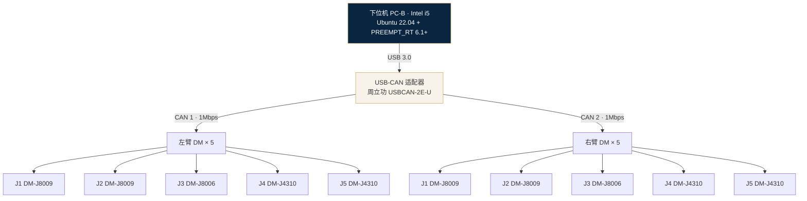
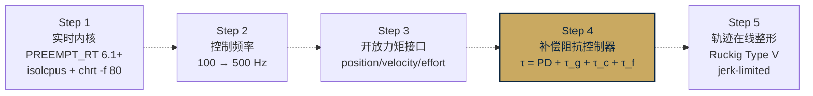
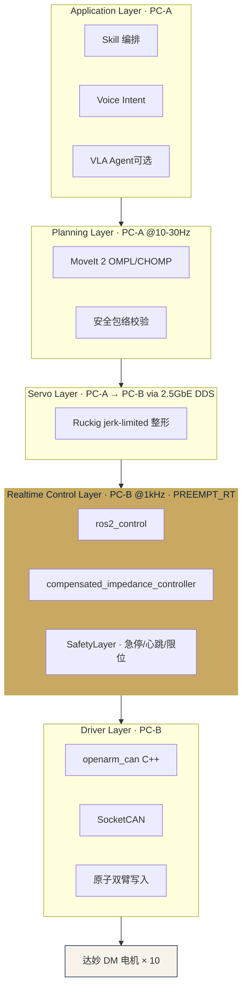
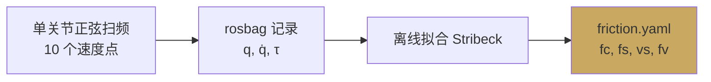
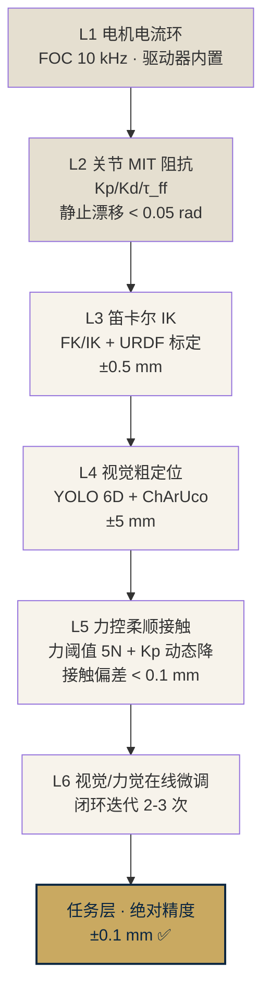

# OpenARM / OpenARM-X 硬件控制架构分析

> **文档定位**：技术分析与架构决策 · 调研报告
> **范围**：OpenARM 开源主仓 + RoboParty roboto_origin（Atom01）代码参考 + 祥承自研 OpenARM-X 定制改进
> **更新**：2026-04-19

---

## 1. 概述

`OpenARM` 是一套面向协作机器人手臂的**全栈开源**方案，由 `enactic` 组织维护（[github.com/enactic/openarm](https://github.com/enactic/openarm)）。其核心价值在于：

- 完整的 URDF / ros2_control / teleop / MoveIt 2 / Isaac Lab 训练仓（13 个子仓）
- 准直驱（QDD）硬件形态 + MIT 模式协议
- 开源协议允许二次开发与商用

然而 **OpenARM 原版并不能直接用于工程交付** —— 其控制栈存在若干与准直驱硬件特性不匹配的默认设计，导致在真实负载下关节抖动明显。祥承电子项目在 OpenARM 基础上 fork 并做了系统性改造，形成内部版本 **`openarmx_xc`**（本文简称 OpenARM-X）。

本文梳理两者的硬件控制实现，并给出祥承改造层的技术依据。

---

## 2. 硬件组成

### 2.1 关节电机选型

OpenARM 的官方默认电机是 **达妙 DM 系列**（Damiao，深圳达妙科技），祥承项目采用同款配置：

| 位置 | 型号（建议） | 额定扭矩 | 峰值扭矩 | 功率 |
|---|---|---:|---:|---|
| J1（肩） | DM-J8009 | 22 Nm | 54 Nm | ~500 W |
| J2（肩） | DM-J8009 | 22 Nm | 54 Nm | ~500 W |
| J3（肘） | DM-J8006 | 12 Nm | 36 Nm | ~300 W |
| J4（腕） | DM-J4310 | 5 Nm | 11 Nm | ~150 W |
| J5（腕） | DM-J4310 | 5 Nm | 11 Nm | ~150 W |

**减速方式**：行星减速器 **9 : 1**，属于准直驱（Quasi-Direct Drive, QDD）路线。

**关节重量**：单臂 5 个关节 + 结构件，约 4–5 kg。

### 2.2 硬件拓扑



**选择要点**：

- **USB-CAN 适配器选工业级**（周立功 USBCAN-2E-U / Kvaser USBcan R v2 / PCAN-USB）而非淘宝 10 元白板——后者在 1 Mbps 长时间满负载下常见丢帧。
- **左右臂独立 CAN**：每条 CAN 总线只挂 5 个电机，一条 CAN 故障不拖累另一侧。
- **CAN 波特率 1 Mbps**：OpenARM 原版、roboto_origin（Atom01）一致，兼容达妙 SDK 示例。

---

## 3. 通信协议：MIT 模式

### 3.1 为什么是 MIT 模式

MIT 模式由 MIT Biomimetic Robotics Lab 提出，广泛用于四足/双足/协作臂的 QDD 电机控制（波士顿动力 MIT Cheetah、Unitree 系列、OpenArm、atom01 都用）。它一次性下发**目标位置 + 目标速度 + 位置增益 Kp + 速度增益 Kd + 前馈力矩** 五个参数：

```text
τ_joint = Kp·(q_d − q) + Kd·(q̇_d − q̇) + τ_ff
```

- `q_d, q̇_d` 目标位置/速度
- `τ_ff` 前馈力矩（可做重力/摩擦/科氏补偿）
- `Kp, Kd` 可在运行时动态调低 → 实现关节级柔顺控制

相比位置环 / 速度环模式，MIT 模式**暴露了最底层的电流环入口**，外层控制器不必叠加电机内置位置环（避免嵌套震荡），且可以在同一周期内同时做位置跟踪 + 柔顺调节。

### 3.2 指令帧与状态帧

**下发指令**（8 字节 CAN 帧 + 3 字节控制字）：

| 字段 | 范围 | 位数 |
|---|---|---|
| target_pos | −12.5 ~ +12.5 rad | 16 bit |
| target_vel | −30 ~ +30 rad/s | 12 bit |
| Kp | 0 ~ 500 | 12 bit |
| Kd | 0 ~ 5 | 12 bit |
| torque | −18 ~ +18 Nm | 12 bit |

**状态回读**（同样 CAN 帧）：

| 字段 | 含义 |
|---|---|
| pos | 当前位置 (rad) |
| vel | 当前速度 (rad/s) |
| current | 相电流 (A) |
| temperature | 电机/驱动温度 (°C) |
| error_id | 过流/过温/编码器异常等故障码 |

### 3.3 参考代码（摘自 roboto_origin）

```python
# 来自 atom01_deploy/scripts/motors_py_example.py
motors[0].set_motor_control_mode(motors_py.MotorControlMode.MIT)
motors[0].motor_mit_cmd(
    target_pos = -0.5,  # rad
    target_vel =  0.0,
    kp         =  5.0,
    kd         =  1.0,
    torque     =  0.0)
pos  = motors[0].get_motor_pos()
vel  = motors[0].get_motor_spd()
tau  = motors[0].get_motor_current()
temp = motors[0].get_motor_temperature()
```

### 3.4 SocketCAN 落地

Linux 原生 **SocketCAN** 是最稳定的工业方案，可以像 socket 一样读写 CAN 帧：

```bash
# 主控启动时运行
sudo ip link set can0 up type can bitrate 1000000
sudo ip link set can1 up type can bitrate 1000000
```

```cpp
// 简化示例
int sock = socket(PF_CAN, SOCK_RAW, CAN_RAW);
struct sockaddr_can addr{AF_CAN, if_nametoindex("can0")};
bind(sock, (struct sockaddr *)&addr, sizeof(addr));
// write / read 单帧 16 字节（CAN_MTU）
```

祥承自研的 `openarm_can`（C++）封装了 SocketCAN + DM 协议，比 Python SDK 快一档（约 200 μs vs 600 μs 单帧往返），是 1 kHz 实时控制的必要条件。

---

## 4. OpenARM 原版控制栈的局限

### 4.1 默认配置暴露的 4 个问题

通过读 OpenARM 代码仓（`openarm_ros2/openarm_bimanual_moveit_config/config/ros2_controllers.yaml` 等），定位到以下默认配置问题：

| # | 现状 | 问题 |
|---|---|---|
| 1 | `update_rate: 100` Hz | 100 Hz 周期 10 ms，远低于 QDD 所需的 500–1000 Hz |
| 2 | `command_interfaces: [position]` | 只能下发位置，无法用 MIT 模式下发力矩前馈 |
| 3 | 默认控制器 `joint_trajectory_controller` (JTC) | 离散航点 + 段间速度跳变 = 抖动放大 |
| 4 | 全仓库 `grep -r servo` 无结果 | 未工程化 MoveIt Servo，接触任务无流式控制 |

### 4.2 关节抖动的四重放大机理


**根因的根因**：JTC 隐式假设"高减速比 + 不可背驱 + 刚性输出"，这是传统工业刚臂的特征；而准直驱刚好相反——**低惯量 + 可背驱 + 柔性输出**。把协作机械臂当刚臂控，必抖。

---

## 5. OpenARM-X（祥承定制层）的核心改进

祥承项目在 OpenARM 基础上做了 5 层软件栈改造，**不换硬件**（达妙 DM 电机 + Intel Mini PC 已投入），仅通过软件重新定义控制链路。

### 5.1 改进路径一览



### 5.2 关键技术组件

| 组件 | 选型 | 理由 |
|---|---|---|
| 动力学库 | **Pinocchio** | RNEA 单步 3.5 μs（Atlas 基准），解析导数，浮基机器人事实标准 |
| 在线轨迹整形 | **Ruckig Type V** | jerk-limited，250 μs 单步周期，首个支持非零目标状态 |
| 硬件接口 | **openarm_can (C++)** | 直连 DM MIT 模式，不经 Python，单帧 < 200 μs |
| 控制器框架 | **ros2_control** | 可插拔、支持多 command_interface、跨平台 |
| 实时内核 | **PREEMPT_RT 6.1+** | mainline 内核已合入，UR / Franka 官方推荐 |

### 5.3 分层控制链路全景



**关键洞察**：这是**一条贯通的速度 / 位置流**，不是离散航点。与 JTC 的"规划后离散执行"二段式形成对照，是解决顿挫的核心。

### 5.4 补偿阻抗控制器（核心）

```text
τ_cmd = Kp·(q_d − q) + Kd·(q̇_d − q̇)     ← PD 项（来自 MIT 模式）
      + τ_g(q)                           ← 重力补偿（Pinocchio RNEA）
      + τ_c(q, q̇)                        ← 科氏项（Pinocchio）
      + τ_f(q̇)                           ← 摩擦补偿（Stribeck 模型）
```

实际代码里这四项合并成一个 `compensated_impedance_controller.cpp` ros2_control 插件，每个 1 kHz 周期执行一次。

---

## 6. 动力学 & 摩擦补偿工程化

### 6.1 动力学参数实测


### 6.2 摩擦辨识



**Stribeck 曲线**包含 4 个参数：

- `fc` 库伦摩擦
- `fs` 静摩擦
- `vs` 临界速度
- `fv` 粘滞摩擦

```text
τ_f(q̇) = fc·sign(q̇) + (fs − fc)·exp(−(q̇/vs)^2)·sign(q̇) + fv·q̇
```

---

## 7. 分层实施路径

RD2 阶段（2026-05 到 2026-08）的 OpenARM-X 改造分 5 个里程碑，共 7 周：

| 里程碑 | 周数 | 目标 | 验收 |
|---|---|---|---|
| M1 重力补偿 | 2 周 | URDF 实测 + Pinocchio 前馈 | 关节悬空静止漂移 < 0.05 rad |
| M2 摩擦补偿 | 2 周 | Stribeck 曲线 + friction.yaml | 0.1 rad/s 低速无粘滑 |
| M3 Ruckig 整形 | 1 周 | jerk-limited 轨迹 | 末端绘圆 10 cm · 偏差 < 5 mm |
| M4 PREEMPT_RT + effort + 500 Hz | 1 周（并行） | 实时内核 + 力矩接口 | cyclictest P99 < 100 μs |
| M5 OMPL + JTC 验证 | 1 周 | 自由空间 P2P 规划 | 20 次 20 次成功，偏差 < 5 mm |

---

## 8. 精度分层承诺

OpenARM-X 在自由空间运动的极限精度由减速器决定：**9:1 行星减速的关节层回位精度物理上只能做到 0.3–1 mm**，直接对客户承诺 ±0.1 mm 不可达。祥承采用**分层承诺**策略，对齐行业主流做法（Franka / UR / JAKA 在 3C 装配的路径）：



**答辩统一口径**："关节伺服层的物理极限由减速器类型决定，最终装配精度由任务层的多模态闭环（视觉粗定位 + 力控柔顺 + 在线微调）保证。这是 Franka、UR、JAKA 在 3C 装配场景的主流技术路径。"

---

## 9. 后续演进（二期起）

| 项 | 计划期 | 说明 |
|---|---|---|
| MoveIt Servo 接入 | RD3 | 视觉伺服跟踪 + 遥操作实时响应 |
| 笛卡尔阻抗控制完整栈 | RD4 / 二期 | libfranka / UR ForceMode 同款 |
| 双臂 PTP 硬件时钟同步 | RD3 | 双臂同步误差 < 0.5 mm |
| arm_torso 8-DOF 联合规划 | P1 触发 | 升降 + 臂一次规划，参考 TIAGo |
| VLA 推理外挂 | 二期 | Intel iGPU + OpenVINO 或 Hailo-8 26 TOPS NPU |

---

## 10. 参考

- **OpenARM 上游主仓**：<https://github.com/enactic/openarm>
- **RoboParty atom01_deploy**（MIT 模式 + SocketCAN 参考实现）：<https://github.com/Roboparty/atom01_deploy>
- **达妙 Python SDK**：<https://github.com/sirwart/robstride-python-sdk>
- **Pinocchio 库**：<https://github.com/stack-of-tasks/pinocchio>
- **Ruckig 轨迹整形**：<https://arxiv.org/abs/2105.04830>
- **ros2_control 文档**：<https://control.ros.org/>
- **本项目内部文档**：
  - `02｜研发进展跟踪/02｜roboto_origin分析/02_机械臂驱动与CAN总线协议分析.md`
  - `02｜研发进展跟踪/01｜最新进展/2 月份｜26 年/（5）openarmx_xc代码问题分析/01-10` 九专题审查
  - `02｜研发进展跟踪/03｜2026-04报告三件套/01_技术分析报告A_双X86方案.md` §4.1
  - `01｜机器人配置中心/01｜当前配置/01｜新版BOM清单/祥承电子BOM_v2.1_2025-09-24_解析.md`

---

**文档作者**：Kevin & Claude · Transcribe Box Lab
**发布日期**：2026-04-19
