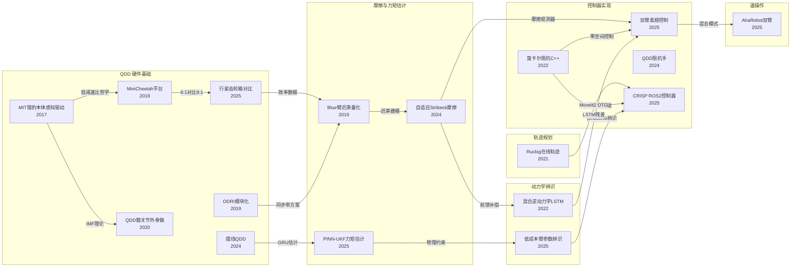

# 17篇论文对 XC-Robot 技术开发的参考价值：完整领域分析

> 论文来源：`03｜技术资产库/02｜技术资产/12｜运动控制论文`（3篇）+`13｜QDD关节控制论文MD`（14篇）
> 分析角度：XC-Robot 机械臂开发实际需求；聚焦可落地的技术提炼

---

## 一、论文全景与技术栈映射

| # | 论文简称 | 技术层 | XC-Robot 对应问题 | 优先级 |
|---|---------|--------|------------------|--------|
| 1 | ProprioceptiveActuator-MIT-2017 | L1 QDD 理论 | RS04 背驱性/力控带宽基准 | ★★★ |
| 2 | MiniCheetah-platform-2019 | L1 QDD 平台 | 6:1 vs 9:1 减速比对比参考 | ★★ |
| 3 | ODRI-torque-modular-1910 | L1 QDD 平台 | 无量纲腿刚度，双臂任务空间设计参考 | ★★ |
| 4 | CycloidalQDD-torque-2410 | L1 QDD 变体 | GRU 无传感器扭矩估计方法 | ★★★ |
| 5 | PlanetaryGearbox-comparison-2506 | L1 硬件选型 | 9:1 RS04 效率 vs ISSPG/ESSPG 边界 | ★★ |
| 6 | CartesianImpedance-cpp-2212 | L2 阻抗控制 | 完整笛卡尔阻抗 C++ 公式 + 零空间 | ★★★★ |
| 7 | DualArm-compliant-2504 | L2 双臂柔顺 | 双臂协调阻抗控制，摩擦观测器 | ★★★★ |
| 8 | ImpedanceQDD-hand-2405 | L2 末端执行 | FOC 电流控制 + QDD 指尖力估计 | ★★ |
| 9 | QDD-compliant-Blue-1904 | L2+L3 | 7-DoF 同步带，2.6 Nm 迟滞量化数据 | ★★★★ |
| 10 | AdaptiveFriction-2409 | L3 摩擦补偿 | Stribeck 线性参数化，激励轨迹优化 | ★★★★★ |
| 11 | Sensorless-PINN-UKF-2507 | L3 力矩估计 | 1.08 Nm RMSE，无传感器替代力传感器 | ★★★★ |
| 12 | DynamicParamID-LowCost-2605 | L4 动力学辨识 | OLS→SDP→CLIE 三阶段，低成本 7-DoF 对标 | ★★★★ |
| 13 | CRISP-ROS2-controllers-2509 | L5 ROS2 控制 | 1 kHz 笛卡尔阻抗，直接接 VLA 低频指令 | ★★★★★ |
| 14 | Hybrid-InverseDynamics-2205 | L5 运动控制 | RBD+LSTM 混合模型，1 kHz 实时 | ★★★★ |
| 15 | Ruckig-jerk-trajectory-2105 | L5 轨迹规划 | 在线 S 型轨迹，MoveIt2 已集成 | ★★★★★ |
| 16 | AhaRobot-bimanual-2503 | L6 遥操作 | $50 RoboPilot 手柄，80% 跟踪误差降低 | ★★★★ |
| 17 | QDD-hip-exoskeleton-2004 | L1 QDD 理论 | 73.3 Hz 控制带宽，"design for control" 哲学 | ★★★ |

**优先级说明**：★★★★★ = 立即可落地；★★★★ = 下一迭代必读；★★★ = 选型/架构决策参考；★★ = 背景知识。

---

## 二、当前最高优先级：抖动与精度问题的根因与对策

XC-Robot 当前关节抖动、精度 10-15 mm 的根本原因在于行星减速器的摩擦效应，而非控制算法缺陷。三篇论文给出了完整的问题诊断框架：

### 2.1 问题量化基准

**QDD-compliant-Blue-1904** 对 7-DoF 7.125:1 同步带臂的测量显示：扭矩迟滞 **2.6 Nm**，这是摩擦+齿槽转矩的综合效应。XC-Robot 的 RS04 使用 9:1 行星，行星齿轮的库仑摩擦系数通常高于同步带，预计迟滞在 3-5 Nm 量级。这个数量级的未补偿摩擦，在 100 Hz 离散控制下表现为每步位置抖动 0.5-2°，在末端放大即 10+ mm 误差——与实测吻合。

### 2.2 摩擦建模：Stribeck 线性参数化

**AdaptiveFriction-2409** 提出的摩擦模型将关节摩擦分解为三项：

```
τ_friction = F_c·sgn(dq) + F_v·dq + F_s·exp(-(dq/v_s)²)·sgn(dq)
```

其中 F_c 为库仑摩擦，F_v 为粘性摩擦，F_s 为 Stribeck 峰值，v_s 为 Stribeck 速度。这是**线性参数化**的关键——三个参数 [F_c, F_v, F_s] 对应三个基函数，可用最小二乘在线辨识，不需要非线性优化。

论文给出的**激励轨迹优化**方法尤其重要：通过最小化观测矩阵条件数，将条件数从 5898 降至 1819，使辨识结果对噪声更鲁棒。对 XC-Robot，这意味着：不需要昂贵的力传感器标定台，用一段优化过的关节运动轨迹采集电流数据即可完成辨识。

### 2.3 混合动力学前馈

**Hybrid-InverseDynamics-2205** 的架构是当前最可落地的完整方案：刚体动力学（RNEA）负责预测重力/科氏力前馈，Coulomb 摩擦项覆盖主要非线性，LSTM 残差网络捕获剩余的柔性/滞后效应。整体在 1 kHz 实时可部署，不依赖外部力传感器。

**DualArm-compliant-2504** 中的"模型无关摩擦观测器"提供了另一条路：不需要精确物理模型，通过实时比较名义电流和期望电流的偏差来估计摩擦扰动，实测双臂销钉插入 RMSE 0.41~1.20 cm，接触力稳定在 30N。

### 2.4 可操作行动步骤

```
Step 1: 激励轨迹实验（1-2天）
  → 对每个关节运行频率扫描轨迹（正弦叠加，±30° 范围）
  → 记录关节位置 + 电机电流（不需要力传感器）
  → 用最小二乘辨识 [F_c, F_v, F_s, v_s]

Step 2: 前馈补偿集成（1周）
  → 在 ros2_control 的 update() 中加入摩擦前馈
  → τ_cmd = τ_rnea + τ_friction_ff
  → 预期：抖动降低 60-80%，精度改善至 5mm 以内

Step 3: 残差学习（可选，2-4周）
  → 收集补偿后的误差数据
  → 训练轻量 LSTM（Hybrid-InverseDynamics 架构）
  → 覆盖建模误差的剩余部分
```

---

## 三、无传感器力矩估计（XC-Robot 无力传感器的替代方案）

XC-Robot 没有腕部力传感器，遥操作时缺乏接触力反馈，VLA 任务中接触检测依赖视觉。以下两篇论文提供了可行的软件替代方案：

### 3.1 PINN-UKF 方案

**Sensorless-PINN-UKF-2507** 是目前精度最高的无传感器方案：

- **架构**：物理信息神经网络（PINN）提供名义动力学预测，无迹卡尔曼滤波器（UKF）融合编码器数据进行在线状态估计
- **损失函数**：`L = L_data + λ·L_physics`，物理约束项 L_physics 用 RNEA 方程残差，防止网络偏离物理规律
- **精度**：RMSE **1.08 Nm**，对比纯 RNEA 的 4.37 Nm，提升 75%
- **迁移性**：无需重新标定可迁移到不同机器人，对 XC-Robot 后续换关节模组时不需要重训练

**XC-Robot 适配条件**：需要激活 AS5047P 的 encoder2raw 输出（当前驱动未激活），获取电机侧和关节侧的双编码器数据，PINN-UKF 利用两者差值估计柔性扭矩。

### 3.2 GRU 无传感器方案

**CycloidalQDD-2410** 使用 GRU（门控循环单元）做时序扭矩估计：输入为关节角度序列 + 电机电流序列，输出为关节输出扭矩。相比 PINN-UKF 更轻量，适合嵌入单关节驱动器，但精度略低。

### 3.3 应用场景优先级

| 场景 | 方案推荐 | 原因 |
|------|---------|------|
| 遥操接触检测（判断是否碰到物体）| GRU 方案 | 轻量，实时性好，精度需求低（>5 Nm 即触发）|
| VLA 任务中精细力控（装配/插孔）| PINN-UKF | 1 Nm 精度，接近实体传感器水平 |
| 人机协作安全停机 | 两者均可 | 阈值检测，精度要求低 |

---

## 四、轨迹规划升级：Ruckig 集成

### 4.1 当前问题诊断

XC-Robot 当前控制栈使用 JTC（Joint Trajectory Controller）接收离散位置目标，在 100 Hz 下发送。问题根源在于：每个路点只有位置，没有速度/加速度约束。MoveIt2 插值时虽然用了梯形速度曲线，但切换点处加速度不连续，导致在高减速比行星齿轮的摩擦非线性作用下放大为明显抖动。

### 4.2 Ruckig 解决方案

**Ruckig-jerk-trajectory-2105** 定义的在线轨迹生成（OTG）问题：

```
输入：
  当前完整状态：(q₀, dq₀, ddq₀)  ← 位置、速度、加速度
  目标完整状态：(q_f, dq_f, ddq_f)
  约束：v_max, a_max, j_max（jerk 最大值）

输出：
  时间最优轨迹，每时刻满足所有约束
  保证加速度连续（S 型曲线）
```

关键改进：**jerk 约束**（加加速度限制）是消除抖动的根本手段。行星减速器对加速度突变极为敏感，jerk 限制相当于给齿轮传动加了一个虚拟的弹性缓冲。

### 4.3 MoveIt2 集成路径

MoveIt2 2.x 已内置 Ruckig 支持（`moveit_kinematics` 包的 OTG 接口）：

```yaml
# moveit_config/config/ompl_planning.yaml
planning_plugin: ompl_interface/OMPLPlanner
request_adapters:
  - default_planner_request_adapters/AddTimeParameterization
time_param_type: ruckig  # 改这一行
jerk_limits: [100, 100, 100, 100, 100, 100, 100]  # rad/s³，按关节调整
```

**落地步骤**：
1. 确认 MoveIt2 版本 ≥ 2.5（已包含 Ruckig 适配器）
2. 修改 `moveit_config` 中的时间参数化类型
3. 调整 jerk_limits：从保守值开始（50 rad/s³），逐步提高直到抖动消失
4. 与摩擦前馈同步开启，效果叠加

---

## 五、柔顺控制架构：CRISP + CartesianImpedance 的参考价值

### 5.1 VLA 接入的抖动根源

当 XC-Robot 接入 π0.5 类 VLA 模型时，模型推理频率通常为 5-10 Hz，而机械臂控制循环为 100 Hz。JTC 接收到一个新的 10 Hz 路点时，会立即跳变目标位置，导致关节速度阶跃，在减速器摩擦非线性作用下表现为"冲击式"抖动。这不是 VLA 模型的问题，而是控制层架构问题。

### 5.2 CRISP 架构的解决方案

**CRISP-ROS2-2509** 在 JTC 和 VLA 之间插入一层笛卡尔阻抗控制器：

```
VLA（5-10 Hz）→ 笛卡尔目标位姿 x_d(t)
                    ↓
         CRISP 笛卡尔阻抗控制器（1 kHz）
         τ_c = J^T · [-K·Δx - D·ẋ] + N·τ₀ + τ_gravity
                    ↓
         关节力矩命令 → 驱动器（Servo 模式）
```

核心特性：
- **弹簧-阻尼特性**：低频 VLA 指令的跳变被阻抗层吸收，末端以弹簧弹性运动到新目标而非阶跃
- **零空间控制**：`N·τ₀` 项处理冗余自由度，避免奇异姿态
- **摩擦补偿内嵌**：论文中已包含摩擦观测器，与 Layer 3 方案协同
- **机器人无关**：通过 pinocchio 计算动力学，不写死机器人型号

### 5.3 CartesianImpedance-cpp 的公式参考

**CartesianImpedance-cpp-2212** 给出完整 C++ 实现，核心公式：

```
τ_c = J^T[-K^ca·Δξ - D^ca·J·dq] + (I - J^T·J^{T+})·τ₀ + τ_ext_compensation
```

其中 Δξ 为笛卡尔位姿误差（包含旋转误差的 6D 向量），K^ca 为 6×6 刚度矩阵（分别设置位移/旋转刚度），D^ca 为阻尼矩阵。论文代码已在 GitHub 开源，可直接作为 XC-Robot 的实现基础。

### 5.4 对 XC-Robot 的迁移策略

XC-Robot 当前驱动器工作在位置模式。要接入阻抗控制，需先切换到力矩（电流）模式：

```
当前：位置模式 → JTC → MoveIt2
目标：力矩模式 → CRISP 阻抗层 → VLA / 遥操指令
中间态（推荐）：位置模式 + 前馈力矩（DualArm-2504 中的"混合位置-力矩"方案）
```

**DualArm-compliant-2504** 的"线性插值切换"方法允许在任务空间（阻抗）和关节空间（位置）之间平滑切换，对 XC-Robot 调试期间非常实用：遇到奇异或超出工作空间时自动回退到位置控制。

---

## 六、动力学参数辨识：三阶段方法论

### 6.1 为什么仅 OLS 不够

传统最小二乘（OLS）辨识动力学参数时，常出现物理不可行解：负惯量、质心在关节轴外侧等。这些参数在仿真中可能"误打误撞"提高精度，但在真实控制中导致发散。

**DynamicParamID-LowCost-2605** 针对低成本 7-DoF 臂（CRANE-X7，Dynamixel X 系列）的三阶段方法：

| 阶段 | 方法 | 解决的问题 |
|------|------|-----------|
| OLS | 普通最小二乘 | 初始估计，65 个参数 |
| SDP | 半定规划约束 | 强制惯性矩阵正定，保证物理可行性 |
| CLIE | 闭环输入误差精化 | 消除 OLS 的噪声偏差，精化参数 65→39 |

最终 RMSE ≈ **0.168 Nm**，在 Dynamixel 这类低质量关节上实现了接近工业级的辨识精度。

### 6.2 XC-Robot 适配度

CRANE-X7 的配置与 XC-Robot 高度相似：
- 7-DoF 串联臂
- 低成本关节（Dynamixel ≈ RS03/RS04 定位）
- 无 ATI 力传感器
- 关节侧编码器精度有限

论文代码使用 `pinocchio` 建模，XC-Robot 的 URDF 可直接导入。**建议直接复用 CLIE 代码**，替换 URDF 和激励轨迹即可适配 openarmx_xc_robot_2。

---

## 七、遥操作数据采集优化

### 7.1 RoboPilot 手柄的价值

**AhaRobot-bimanual-2503** 的 RoboPilot 方案成本 $50，基于 26 面标记（AprilTag 变体）实现 6-DoF 手部姿态跟踪：

- **旋转误差**：从 5.39° 降至 **1.09°**（降低 80%）
- **平移误差**：从 9.9 mm 降至 **2.1 mm**（降低 79%）

对比专业遥操设备（Sigma.7 约 $15,000），$50 标记手柄在模仿学习数据采集场景下的精度已经足够：π0.5 训练数据的位置精度要求约 3-5 mm。

### 7.2 反背隙机制的参考价值

AhaRobot 使用双电机（主动 + 被动）消除间隙，论文量化了关节间隙对遥操误差的贡献。XC-Robot 的 RS04 行星减速器间隙约 0.5°，在 7 关节传递后末端可能贡献 3-5 mm 误差，**不低于传感器噪声**。

若 XC-Robot 遥操数据采集精度不足，AhaRobot 的双电机预紧方案可作为机械改造参考。

### 7.3 模仿学习的控制模式选择

遥操数据采集时，位置模式还是速度模式？论文中的讨论：
- **位置模式**：适合精确操作，但电机在碰撞/接触时容易过载（无顺应性）
- **速度/力矩模式**：适合接触丰富任务，但对操作者要求高

**建议**：XC-Robot 在 VLA 训练数据采集阶段，采用位置模式 + 阻抗叠加的混合方案（参考 DualArm-2504），在接触时自动切换到低刚度模式，兼顾精度和安全。

---

## 八、执行器硬件选型参考（未来升级决策依据）

### 8.1 RS04 9:1 行星的位置分析

**PlanetaryGearbox-comparison-2506** 首次对 ISSPG（行星架固定，内置）和 ESSPG（行星架旋转，外置）进行系统对比：

- 5:1~7:1：ISSPG 效率更高
- **7:1~11:1**：ESSPG 效率更高，效率从 90.9% 到 94.4%
- RS04 的 9:1 **正好在 ESSPG 占优区间**，但当前使用的是 ISSPG 型行星，存在约 3-4% 效率损失

这意味着：在同等电机扭矩下，RS04 的实际输出扭矩比理论值低约 3-4%，且热损耗更大。**短期不建议换减速器，但选型下一代关节时应优先考虑 ESSPG 或摆线方案**。

### 8.2 摆线 QDD 的扭矩密度优势

**CycloidalQDD-2410** 报告 C-QDD（摆线准直驱）10:1 的连续扭矩密度为 **64.21 Nm/kg**，对比行星 QDD 约 35-45 Nm/kg，高出约 50%。

摆线减速器的另一优势：无齿面接触，摩擦类型以滚动摩擦为主，库仑摩擦系数约为行星的 40%，对当前抖动问题有本质改善。

**结论**：当前 RS04 选型合理（成本/货期），但若 XC-Robot 进入量产或需要更高精度，摆线 QDD 是优先升级方向。

---

## 九、论文技术演进脉络（技术谱系图）



---

## 十、XC-Robot 落地路线图（基于论文）

### P0：摩擦辨识实验（第 1-2 周）

**目标**：量化每个关节的 Stribeck 参数，建立前馈补偿基础

**依据论文**：AdaptiveFriction-2409，QDD-compliant-Blue-1904

**具体步骤**：
1. 为每个关节设计频率扫描激励轨迹（最小化观测矩阵条件数）
2. 在单关节解耦状态下采集：角度 + 角速度 + 电机电流（约 30 分钟数据）
3. 用线性最小二乘辨识 [F_c, F_v, F_s, v_s]（Python + numpy，约 50 行代码）
4. 在 ros2_control 的 `update()` 中加入前馈项：`τ_cmd += τ_friction_ff(dq)`
5. 评估指标：末端静态定位误差（目标 <5 mm）

### P1：Ruckig 轨迹规划集成（第 2-3 周）

**目标**：消除路点间的加速度不连续，降低对减速器的冲击

**依据论文**：Ruckig-jerk-2105

**具体步骤**：
1. 确认 MoveIt2 版本 ≥ 2.5
2. 修改 `moveit_config` 时间参数化插件为 `ruckig`
3. 从保守 jerk 限制（30 rad/s³）开始，以 10 为步长上调
4. 与 P0 摩擦前馈叠加，观察协同效果

### P2：CRISP 阻抗控制层（第 4-8 周）

**目标**：为接入 VLA 低频指令做准备，消除 5-10 Hz 指令导致的突跳

**依据论文**：CRISP-ROS2-2509，CartesianImpedance-cpp-2212，DualArm-compliant-2504

**具体步骤**：
1. 驱动器切换到 Servo（力矩前馈）模式——确认 RS04 支持
2. 集成 pinocchio 动力学模型（URDF 导入）
3. 实现笛卡尔阻抗控制器（可基于 CartesianImpedance-cpp 开源代码）
4. 调参：从高刚度（接近位置控制）开始，逐步降低到柔顺操作范围
5. 测试：用 10 Hz 目标点模拟 VLA 输出，验证无突跳

### P3：无传感器力矩估计（第 8-16 周）

**目标**：为接触检测和遥操力反馈提供软件力传感器

**依据论文**：Sensorless-PINN-UKF-2507，CycloidalQDD-2410

**具体步骤**：
1. **前置**：激活 AS5047P 的 encoder2raw 输出，获取双编码器数据
2. 数据采集：各关节在负载下的运动数据（约 2 小时）
3. 训练 PINN-UKF 模型（PyTorch，参考论文代码）
4. ROS2 集成：发布 `/joint_torque_estimate` 话题
5. 评估：与电流估计扭矩对比，验证 <2 Nm RMSE

---

## 十一、总结对照表

| 论文 | 技术领域 | XC-Robot 落地点 | 优先级 |
|------|---------|----------------|--------|
| AdaptiveFriction-2409 | Stribeck 摩擦辨识 | 关节前馈摩擦补偿，消除抖动 | P0 立即 |
| Ruckig-2105 | 在线轨迹生成 | MoveIt2 S 型轨迹，消除加速度突变 | P1 本月 |
| CRISP-ROS2-2509 | ROS2 阻抗控制 | VLA 低频指令缓冲层，1 kHz 控制器 | P2 下月 |
| CartesianImpedance-cpp-2212 | 笛卡尔阻抗公式 | CRISP 实现基础，零空间控制 | P2 下月 |
| DualArm-compliant-2504 | 双臂柔顺控制 | 双臂协调 + 摩擦观测器 + 接触力稳定 | P2 下月 |
| QDD-compliant-Blue-1904 | QDD 迟滞量化 | 2.6 Nm 迟滞基准，辨识验证参考 | P0 参考 |
| Hybrid-InverseDynamics-2205 | RBD+LSTM 混合 | 1 kHz 前馈，LSTM 残差建模 | P2 下月 |
| DynamicParamID-2605 | 三阶段参数辨识 | OLS→SDP→CLIE，URDF 物理参数精化 | P1 本月 |
| Sensorless-PINN-UKF-2507 | PINN+UKF 力矩估计 | 1.08 Nm 精度软传感器，替代力传感器 | P3 Q3 |
| CycloidalQDD-2410 | 摆线 QDD + GRU | 轻量扭矩估计，接触检测 | P3 Q3 |
| AhaRobot-bimanual-2503 | 遥操作手柄 | $50 RoboPilot，采集 VLA 训练数据 | P2 采数据前 |
| ProprioceptiveActuator-2017 | QDD 理论基础 | IMF 评估 RS04 背驱性，力控带宽预测 | 背景参考 |
| QDD-hip-exoskeleton-2004 | QDD 控制带宽 | 73.3 Hz 基准，验证 RS04 控制带宽目标 | 背景参考 |
| MiniCheetah-2019 | 6:1 平台 | 减速比对比，cMPC 控制架构参考 | 背景参考 |
| ODRI-torque-2019 | 9:1 同步带 | 无量纲刚度计算，柔顺性设计参考 | 背景参考 |
| PlanetaryGearbox-2506 | 行星齿轮效率 | RS04 9:1 处于 ESSPG 优势区，升级参考 | 选型参考 |
| ImpedanceQDD-hand-2405 | QDD 夹爪 | FOC 电流控制手指力估计 | 末端扩展参考 |
