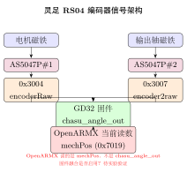

# RobStride RS04 编码器深度分析：双芯片硬件、寄存器映射与固件融合验证

> 从 BOM 表、寄存器映射到验证实验，系统分析灵足 RS00/RS03/RS04 的编码器架构。

## 一、硬件事实：2 颗 AS5047P 芯片

从产品规格书和 PDF 手册的 BOM 表确认：

| 型号 | 磁编码器芯片 | 来源 |
|------|------------|------|
| RS00（14 N.m）| AS5047P × 2 | `灵足时代产品规格介绍.md` 电气特性表，BOM 表 |
| RS03（60 N.m）| AS5047P × 2 | `RS03使用说明书260428.pdf` BOM 表 |
| RS04（120 N.m）| AS5047P × 2 | `RS04使用说明书260428.pdf` BOM 表 |

三款型号的驱动板上都有 **2 片 AS5047P 磁编码器芯片**。但关键问题在于：这两颗芯片分别安装在什么物理位置？上层驱动是否读取了它们的独立读数？



---

## 二、寄存器证据：不同型号的芯片用法不同

从 `robstride-kscale/python/parameter_map.py` 的寄存器定义，可以按型号区分编码器配置。

### RS03/RS04 寄存器

| 寄存器 | 名称 | 含义 | 来源芯片 |
|--------|------|------|---------|
| 0x3004 | `encoderRaw` | 电机转子侧磁编码器原始值 | AS5047P #1（电机侧） |
| 0x3007 | **`encoder2raw`** | **输出轴侧磁编码器原始值** | **AS5047P #2（输出侧）** |
| 0x2006 | `chasu_offset` | 输出端偏置 | 软件层 |
| 0x201D | `chasu_angle_offs` | 输出端角度偏移 | 软件层 |
| 0x3032 | `chasu_coder_raw` | 输出端编码器原始值 | 同 encoder2 |
| 0x3033 | **`chasu_angle_out`** | **输出端计算角度** | 由 encoder2 计算 |

### RS00/RS02 寄存器

| 寄存器 | 名称 | 含义 | 来源芯片 |
|--------|------|------|---------|
| 0x3004 | `encoderRaw` | 电机转子侧磁编码器原始值 | AS5047P #1 |
| 0x3007 | **`vBus(mv)`** | **母线电压（mV）**（不是编码器）| 电压采样 |
| 0x3033 | — | 无 `chasu_angle_out` | N/A |

### 核心区分

```
RS03/RS04:   0x3007 = encoder2raw（输出侧独立编码器读数）
RS00/RS02:   0x3007 = vBus(mv)（母线电压，不是编码器）
```

RS00 虽有 2 颗 AS5047P 芯片，但 0x3007 寄存器并未映射为第二编码器——两颗芯片可能都在电机侧用作冗余，而非输出端独立测量。RS03/RS04 的 `encoder2raw` 和 `chasu_angle_out` 则明确指向一颗芯片在电机侧、一颗在输出侧。

---

## 三、物理安装推断

AS5047P 是差分输出磁编码器 IC，每颗芯片需要独立的磁铁安装在旋转轴上。在 QDD（准直驱）9:1 行星减速器的紧凑模组内：

- **AS5047P #1**：安装在电机转子后端，读取转子磁场角度 → 用于 FOC 换向 + 电机侧位置（`encoderRaw`）
- **AS5047P #2**：安装在减速器输出侧，通过中空孔走线 → 读取输出轴实际位置（`encoder2raw` → `chasu_angle_out`）

判断依据：

- `encoderRaw` 和 `encoder2raw` 是**两个独立寄存器**，在 RS04 的参数映射表中有各自的条目和名称。如果两颗芯片都在电机侧做冗余，它们的读数应高度线性相关（差固定比例），那么只需要一个寄存器和一份数据。
- `chasu_angle_out`（输出端角度）的存在说明固件在计算输出端独立角度——如果 `encoder2raw` 也是电机侧读数，`chasu_angle_out` 没有存在的物理意义。
- **物理上可行**：QDD 模组的输出轴穿过电机中空孔，在输出端放置第二颗 AS5047P + 磁铁是行业标准做法。

<!-- 关键结论 -->
<div class="callout callout-key">
🔑 <strong>关键结论</strong>：RS03/RS04 的 AS5047P #1 在电机输入端、AS5047P #2 在输出端。RS00 的两颗芯片都在电机侧（功能上等同单编码器）。
</div>

---

## 四、驱动层现状：所有代码库均未读取 encoder2

搜索全部 4 个仓库群的结果：

| 关键词 | 匹配结果 | 有实际读取调用？ |
|--------|---------|----------------|
| `encoder2` / `0x3007` | 仅 `parameter_map.py` 的寄存器命名 | ❌ 无 |
| `chasu` | 同上 | ❌ 无 |
| `backlash` / `背隙` / `回差` | **0 个匹配** | ❌ 无 |

| 代码仓库 | 读取 encoder2? | 背隙补偿? |
|---------|-------------|----------|
| RobStride Python SDK | ❌ | ❌ |
| RobStride C++ 样例 | ❌ | ❌ |
| OpenARM 原版 (damiao\_motor) | N/A（达妙）| ❌ |
| OpenARMX (rs\_motor\_control) | ❌ | ❌ |
| openarmx\_xc\_robot\_2（在跑） | ❌ | ❌ |

**所有代码均只读 `encoderRaw（0x3004）`，`mechPos` 是 `encoderRaw ÷ 9` 的软件估算值。** 无任何代码读取 `encoder2raw（0x3007）` 或 `chasu_angle_out（0x3033）`，无任何背隙检测或补偿逻辑。

---

## 五、行业对标：双编码器在固件层使用情况

搜索和调研结果显示：**宇树、达妙 -2EC、因克斯 的双编码器闭环补偿在电机驱动板固件（MCU 层）内完成**，不在上层 ROS2 代码里。

### 三层架构

```
用户应用层（ROS2 / OpenARMX） → MIT CAN 帧（p_des/Kp/Kd/tau_ff）
                                           ↓
电机驱动板固件（MCU） ←  encoderRaw（电机侧）+ encoder2raw（输出侧）
                                           ↓
物理层：  AS5047P #1（输入端）  +  AS5047P #2（输出端）
```

### 各厂商对比

| 厂商 | 硬件双编码器 | 固件融合 | 用户层需改代码 |
|------|-----------|---------|-------------|
| 宇树 G1/H1 | ✅ | ✅ 固件内完成，CAN 输出融合后位置 | ❌ 不需要 |
| 达妙 -2EC | ✅ | ✅ 固件做 backlash estimation | ❌ 不需要 |
| 因克斯 INX | ✅ | ✅ 2000Hz 通信，输出端实时反馈 | ❌ 不需要 |
| **灵足 RS04** | ✅（2×AS5047P） | ❓ **待验证** | ❓ 见实验 |

达妙手册明确 "2EC = dual encoder, enabling backlash estimation"——固件已做融合。原版 OpenARM 发标准 MIT 帧，不需要额外代码就能受益。OpenARMX 将电机从达妙换为灵足后，失去了这个固件层面的优势。

---

## 六、验证实验：灵足固件是否做了融合？

如果灵足固件内部已经在做双编码器融合（`chasu_angle_out` 已含补偿），而 OpenARMX 只读 `mechPos`，那**只改一行寄存器地址**就能获益。反之，如果灵足固件根本没做融合，则需要联系灵足或自行实现。

### 实验步骤

1. **关节上电使能**，MIT 模式保持固定位置（0 rad，Kp=50，Kd=2）

2. **读取寄存器**（通过私有协议通信类型 17）

| 寄存器 | 含义 |
|--------|------|
| 0x3004 `encoderRaw` | 电机侧原始值 |
| 0x3007 `encoder2raw` | 输出侧原始值 |
| 0x7019 `mechPos` | MIT 反馈位置（OpenARMX 当前在读） |
| 0x3033 `chasu_angle_out` | 输出端计算角度 |

3. **施加外力**：轻转输出端（正反向 ≤10°），让齿轮经过背隙空行程

4. **判断依据**

| 现象 | 结论 |
|------|------|
| `chasu_angle_out` 与 `mechPos` 同步变化（趋势一致，差固定比例） | 固件未做独立补偿，两者都是软件估算 |
| `chasu_angle_out` 对输出端外力更敏感 | 固件在读 `encoder2raw`，`chasu_angle_out` 是真实输出角度 |
| 外力消失后 `chasu_angle_out` 准确回位，`mechPos` 有偏差 | 固件已做背隙补偿 |

### 后续行动

- 若 `chasu_angle_out` 有效：修改 `v10_simple_hardware.cpp`，将反馈从 `mechPos（0x7019）` 改为 `chasu_angle_out（0x3033）`
- 若 `chasu_angle_out` 也为估算：联系灵足确认固件是否支持双编码器融合，或自行在驱动层实现

---

## 总结

| 层面 | 现状 | 结论 |
|------|------|------|
| **硬件** | 2×AS5047P，RS03/RS04 一颗输入端一颗输出端 | ✅ 双编码器物理基础存在 |
| **寄存器** | `encoder2raw（0x3007）` + `chasu_angle_out（0x3033）` 可读 | ✅ 固件已暴露输出侧接口 |
| **驱动** | OpenARMX 只读 `mechPos（0x7019）`，未读 encoder2 | ❌ 瓶颈在驱动层 |
| **灵足固件融合** | `chasu_angle_out` 是否含补偿 | ❓ 待实验验证 |
| **达妙 -2EC 方案** | 固件已做补偿，上层无需改代码 | ✅ 换成达妙可直接解决 |
