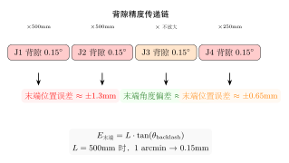
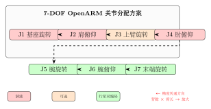

# 方案：OpenARM 架构肩肘谐波改造

> 在不改变 OpenARM 7-DOF 架构的前提下，用"3 谐波 + 4 行星双编码器"混合方案替换全行星方案，在可控成本内显著提升双臂定位精度。

## 问题背景

当前 XC-Robot 使用 RobStride RS04 **全行星**方案。主要约束：

1. **背隙经臂长放大**：J1/J2 的 5-15 arcmin 背隙经 500mm 臂长放大 → 末端 ±1.3mm 误差
2. **驱动未启用硬件双编码器**：RS04 硬件有 2×AS5047P 芯片，但 OpenARMX 驱动只读 `encoderRaw`，`encoder2raw` 未激活——`mechPos` 是软件估算值，无法感知齿轮背隙
3. **无前馈补偿**：URDF 动力学参数来自 CAD 估算（误差 10-20%），Pinocchio 重力补偿节点待开发

本文档提出一个从硬件选型角度解决精度瓶颈的方案。标定问题（URDF 参数、摩擦辨识）是独立工作流，须同步推进。

---

## 一、核心原理：精度传递链

<!-- 关键结论 -->
<div class="callout callout-key">
🔑 <strong>关键概念</strong>：背隙经臂长放大——距离基座越远的关节，其背隙对末端精度的影响被臂长乘数放得越大。J1/J2 的背隙经 500mm 臂长放大，J4 的背隙经 250mm 前臂放大，而 J3/J5/J6/J7 的背隙不经过臂长放大——直接作用在末端姿态上。
</div>



背隙的放大公式：$E_{\text{末端}} = L \cdot \tan(\theta_{\text{backlash}})$

| 关节 | 臂长因子 | 5 arcmin 背隙 | 15 arcmin 背隙 | 优先级 |
|------|---------|--------------|--------------|--------|
| **J1**（基座旋转）| ×500mm | 0.73mm | 2.18mm | 🔴 最高 |
| **J2**（肩俯仰）| ×500mm | 0.73mm | 2.18mm | 🔴 最高 |
| **J4**（肘俯仰）| ×250mm | 0.36mm | 1.09mm | 🟡 高 |
| J3（上臂旋转）| 不放大（姿态） | 末端偏转 ~0.15° | ~0.38° | 🟢 低 |
| J5/J6/J7（腕部）| 不放大（姿态） | 末端偏转 ~0.15° | ~0.38° | 🟢 低 |

J3 的背隙导致的是末端**姿态**偏差（如手爪偏转 0.5°），而不是**位置**偏差。对于大多数抓取任务，手爪偏转 0.5° 不影响核心功能——这就是 J3 可以不换谐波的工程依据。

---

## 二、行业配置调研

目前主流双臂机器人的关节配置可分为三个梯队：

### 2.1 全谐波方案（精度优先 — 优必选/傅利叶/银河通用路线）

| 优点 | 缺点 |
|------|------|
| 零背隙，末端精度最高 | 成本高（7 谐波/臂，~¥28,000/臂） |
| 无需双编码器补偿 | 抗冲击弱（但对轮式双臂不重要） |
| 控制最简单 | 寿命较短（~7,000-10,000 hrs） |

### 2.2 混合方案（精度/成本平衡 — 智元 A2 路线）

| 优点 | 缺点 |
|------|------|
| 肩肘精度高，末端**位置**误差受控 | 编码器方案仍需双编码器 |
| 成本可控（3 谐波/臂，~¥13,000/臂） | 安装接口可能需要适配 |
| 腕部保留行星，不浪费 | — |

### 2.3 全行星方案（成本优先 — 宇树 G1 路线）

| 优点 | 缺点 |
|------|------|
| 成本最低（~¥8,400/臂） | 精度受限（背隙经臂长放大） |
| 抗冲击好、寿命长 | 必须双编码器补偿才能接近混合方案 |

XC-Robot 当前处于全行星方案（全 RS04）。**推荐升级到混合方案**。

---

## 三、最优方案设计

### 3.1 关节分配



| 关节 | 减速器 | 推荐规格 | 参考供应商 | 理由 |
|------|--------|---------|-----------|------|
| **J1** | **谐波** 100:1 | 峰值 120-150 Nm | 绿的谐波 / 达妙 DM-JH | 背隙经全臂长放大，影响末端最大 |
| **J2** | **谐波** 100:1 | 峰值 120-150 Nm | 绿的谐波 / 达妙 DM-JH | 双臂前伸/上下主关节 |
| J3 | 行星双编码 10:1 | 峰值 40-60 Nm | 达妙 DM-J / 因克斯 A | 背隙不放大，不影响末端位置 |
| **J4** | **谐波** 80:1 | 峰值 60-90 Nm | 绿的谐波 / 达妙 DM-JH | 背隙经前臂 250mm 放大 |
| J5 | 行星双编码 10:1 | 峰值 20-40 Nm | 达妙 DM-J / 灵足 RS | 直接末端，不放大 |
| J6 | 行星双编码 10:1 | 峰值 20-40 Nm | 达妙 DM-J / 灵足 RS | 直接末端，不放大 |
| J7 | 行星双编码 9:1 | 峰值 10-30 Nm | 达妙 DM-J / 灵足 RS | 最小模组，末端旋转 |

### 3.2 为什么 J3 不走谐波

J3（上臂旋转/shoulder roll）虽然和 J1/J2 同属肩部，但物理影响完全不同：

| | J1/J2 | J3 |
|---|---|---|
| 背隙误差类型 | 末端**位置**偏差 | 末端**姿态**偏差（手腕偏转） |
| 量级（5 arcmin） | ±0.73mm | ~0.15° |
| 对抓取影响 | 物体抓偏，可能掉落 | 手爪微偏，大多数物体可抓 |
| 换谐波成本 | ¥3,000（值） | ¥3,000（不值） |

若未来需要精密装配（插孔、对准等），可以再给 J3 补谐波。但目前 XC-Robot 的投放、码垛、抓取场景不需要。

### 3.3 保持 OpenARM 架构不变

本方案**只更换关节模组**，不对机械结构做重新设计：

- URDF 需更新 `inertials.yaml`（质量/质心变化）
- 控制链路不需改——谐波和行星都支持 CAN MIT 协议
- CAN 总线负载不变（仍为 7 帧/臂）
- 安装接口可能需要转接法兰（视具体模组而定）

---

## 四、成本和阶段实施

### 4.1 成本对比（单臂）

| 方案 | 成本 | vs 当前基线 | 精度改善 |
|------|------|------------|---------|
| **当前**（全 RS04 单编码器）| ~¥8,400 | — | ±1-2mm 末端 |
| **推荐**（3 谐波 + 4 行星双编码）| ~¥13,000 | **+¥4,600** | ±0.2-0.3mm 末端 |
| 全谐波 | ~¥28,000 | +¥19,600 | ±0.05mm 末端 |
| 全行星双编码（只升级编码器）| ~¥10,000 | +¥1,600 | ±0.5-1.0mm 末端 |

整机成本（双臂）：当前 ~¥16,800 → 推荐 ~¥26,000，**增量约 ¥9,200**。相对于整机 BOM（~6.4 万），增量 14%，但精度改善量级达 4-10 倍。

### 4.2 分阶段实施

```
精确度优先级: J2 > J1 > J4 >> J3/J5/J6/J7
```

**阶段 1 — J2 验证（+¥3,000/臂）**
换**J2（肩俯仰）**为谐波——双臂前伸、上下抓取的主要关节。精度改善最先感知。做 A/B 对比（左臂谐波 vs 右臂全行星），数据驱动后续决策。

**阶段 2 — J1 扩展（+¥3,000/臂）**
加入**J1（基座旋转）**谐波，左右旋转精度同步提升。

**阶段 3 — J4 补齐（+¥2,500/臂）**
加入**J4（肘俯仰）**谐波，前臂精度补齐。

**始终保留 J3/J5/J6/J7 为行星双编码器**。

<!-- 推荐做法 -->
<div class="callout callout-ok">
✅ <strong>推荐</strong>：从阶段 1 开始，验证 J2 谐波单关节的效果。如果末端精度从 ±1-2mm 提升到 ±0.3-0.5mm，再做阶段 2 和 3。
</div>

---

## 五、实施注意事项

1. **安装接口适配**：达妙 DM-JH 谐波系列的安装法兰尺寸与现有 RS04 可能不同，需确认是否需要转接法兰或修改结构件
2. **URDF 标定**：换模组后质量和质心变化，需更新 `inertials.yaml` 重新做 Pinocchio 动力学校验
3. **力矩常数 Kt**：谐波模组的 Kt 值可能与 RS04 不同，需在控制代码中更新相应的力矩换算参数
4. **电调配套**：谐波模组通常使用外置驱动器或集成驱动器。达妙 DM-JH 系列为集成驱动+编码器一体模组，控制接口兼容 CAN，但需确认通信协议细节
5. **同步推进标定**：换硬件的同时，URDF 动力学参数标定和摩擦辨识实验也在关键路径上——两者互补，不矛盾

---

## 总结

| 维度 | 当前状态 | 推荐方案 | 改善 |
|------|---------|---------|------|
| J1/J2 | RS04 行星（背隙 5-15 arcmin） | **谐波**（背隙 <1 arcmin） | 末端位置从 ±2mm → ±0.2mm |
| J4 | RS04 行星 | **谐波** | 前臂精度同步提升 |
| J3/J5/J6/J7 | RS04 行星（单编码器） | **双编码器行星**（达妙/因克斯） | 背隙可补偿 |
| 成本 | ~¥8,400/臂 | ~¥13,000/臂 | +¥4,600/臂 |
