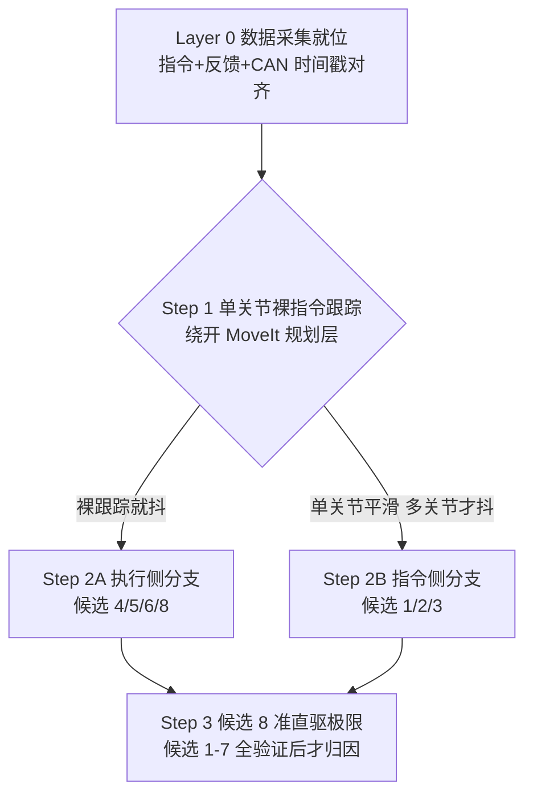

# 抖动诊断方法论（v0 框架）

> **文档性质**：本文件属于「00-我的AI判断」目录 —— 存放 xc-robot Agent 下的判断、假设与方法论草案，**非验证结论**。
> **来源**：基于 KB 对比文档 `06｜全库汇总总览/3-2_OpenARM原版与xc架构对比.md` + 用户口述的 8 条候选根因（见 xc-robot SKILL.md「判断框架与诊断方法论 D-1」）整理。待实验数据验证后，可升级为正式结论并迁出本目录。

## 背景

抖动 / 卡顿 / 精度不足是 XC-Robot 当前最核心痛点。用户基于控制学经验 + 专家意见，积累了 8 条候选根因，但明确声明这些是经验预判、未验证优先级排序。用户的真实诉求：不是要 AI 替他下结论，而是建立专家级的系统化诊断思路 —— 明确判断起点、排查路径、可验证的实验方案。

本文是对该诉求的第一版回应：把候选清单转化为系统诊断流程的方法论框架。

## 核心判断：不要从 8 个候选里挑一个猜

D-1 的 8 条候选，正确用法不是「挑一个最像的去查」，而是**设计能一次劈掉一半的区分性实验**。8 个候选分属两个世界：

- **指令侧**（候选 1 / 2 / 3）：规划、插补、时间轴 —— 发出去的轨迹本身就不平滑
- **执行侧**（候选 4 / 5 / 6 / 8）：通信、控制带宽、电机、方案结构 —— 轨迹平滑但跟不住
- 候选 7（URDF）横跨两边
- 候选 8（准直驱物理极限）是**排除法的终点，不是起点**

## 诊断决策树

## Layer 0：先解决「没有基础数据」

用户已点破的卡点 —— 「之前缺乏基础数据，调 KP / KD 后没能得出完整结论」。这是真正的第一步，不补上后面全是猜：

- 必须能同时录三条流，并对齐到同一时间轴：
  1. 指令轨迹
  2. 编码器反馈位置 / 速度
  3. CAN 帧时间戳
- 没有这套数据，任何诊断假设都无法证伪。

## Step 1：一个实验，劈成两半

**单关节裸指令跟踪** —— 绕开 MoveIt / 规划层，直接给单个关节一条平滑正弦（或阶跃），观察编码器反馈。

| 现象 | 结论 | 进入分支 |
|---|---|---|
| 单关节裸跟踪就抖 | 与规划无关 | → Step 2A 执行侧（候选 4 / 5 / 6 / 8）|
| 单关节平滑，多关节协调才抖 | 硬件没问题 | → Step 2B 指令侧（候选 1 / 2 / 3）|

一步把 8 个候选砍掉一半，不靠争论。

## Step 2A：执行侧分支

| 实验 | 验证候选 | 判据 |
|---|---|---|
| `candump` 抓 CAN 总线 | 候选 4 跳帧 | 看丢帧 / 周期抖动 —— 确定性检验，非猜测 |
| 阶跃响应看震荡 | 候选 5 / 6 控制带宽 | 过冲 + 衰减振荡 = 带宽 / 增益问题 |
| 极低速 vs 高速对比 | 区分候选 6 与 5 | 低速仍抖 → 静摩擦 / 间隙 / 编码器分辨率；高速才抖 → 带宽 / 通信频率 |

## Step 2B：指令侧分支

| 实验 | 验证候选 | 判据 |
|---|---|---|
| 直接画指令轨迹本身 | 候选 1 / 3 | 指令呈阶梯状 / 无时间平滑 → 规划或时间轴问题 |
| 开 / 关 MoveIt Servo 对比 | 候选 2 | 开 Servo 后明显改善 → 实锤 |
| MuJoCo 仿真跑同轨迹（OpenARM 原版自带）| 候选 7 URDF | 仿真平滑、现实抖 → URDF 非主因；仿真也抖 → 规划逻辑问题 |

## Step 3：候选 8 是最后才碰的

准直驱物理极限（候选 8）只有在候选 1-7 全部验证过、抖动幅度仍压不到可接受范围时，才能归因。

- 不要一开始就认命 —— 那是偷懒
- 也不要永远不认 —— 那是固执
- 难听的结论要敢下，但要下在排除法的终点

## 待办事项

- [ ] Layer 0：搭建指令 / 反馈 / CAN 三流同步采集
- [ ] Step 1：执行单关节裸指令跟踪实验，确定分支
- [ ] 依分支结果，按 Step 2A / 2B 逐项验证
- [ ] 验证后回填结论，将本文从「AI 判断」升级为正式结论

## 参考

- `06｜全库汇总总览/3-2_OpenARM原版与xc架构对比.md` —— 原版 OpenARM 与祥承在用版本差异
- xc-robot SKILL.md「判断框架与诊断方法论」D-0 / D-1
- 代码：`~/Obsidian/Coding References/OpenarmX/`、`Openarm Something/openarmx_xc_robot/`
- 灵足时代 datasheet：`🔌 祥承电子/03｜技术资产库/02｜技术资产/11｜灵足时代Robstride/`
