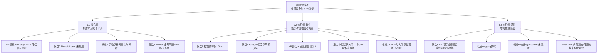
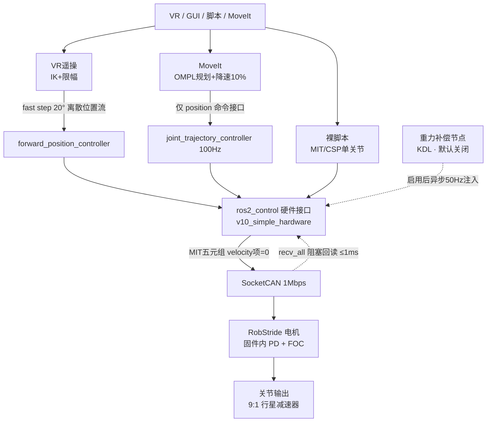

# 机械臂抖动诊断与控制优化（代码级深化）

> **文档性质**：本文是 [[01-抖动诊断方法论]] 的代码级深化 —— 把 8 条「经验候选根因」用 `openarmx_xc_robot_2` 实际代码逐条核验、定级。
>
> **v2 修正说明**（2026-05-22）：v1 由 5 个并行子 Agent 调研产出后，与一份独立的 Codex 分析交叉复核。核验确认 Codex 抓到了 v1 的两处实质遗漏 —— ① 整条 **VR 遥操控制路径**（v1 只看了 MoveIt/JTC 与裸脚本两条路径）；② 重力补偿**默认关闭**（v1 误以为它开着、只是相位错位）。两项均已实测核验后并入本文。同时保留 v1 比 Codex 准确的一处：`robstride_actuator_bridge` 的 `KP_MAX=500` 是旧参考实现的宏，**不在 xc_robot_2 实际路径**，实际 RS04/RS03 的 KP 上限是 5000。
>
> **结论分级提醒**：本文结论基于**代码静态分析**，等级为 🟡「机理确认」—— 代码确实这么写、机理上会导致抖动。它**不等于** 🟢「实验数据确认」。要升级 🟢 必须先做第三节的 Layer 0 三流同步采集 + 区分性实验。难听话先说在前：没有实测数据，下面任何一条都还不能拍板「就是它」。

---

## TL;DR 一页结论

1. **抖动是多因素叠加，没有单一元凶**，且**分场景** —— 不同控制路径（VR 遥操 / 脚本 / MoveIt）各有各的抖法，必须先问「在哪个场景抖」。
2. **当前有三条并行控制路径**，不是一条。VR 遥操路径（项目采数据主用）此前被 v1 完全漏掉。
3. **五个最硬的代码证据**（均已核验）：
   - **VR 遥操 fast 模式每周期步进高达 20°**（`teleop_params.yaml`），且限幅阈值被设到与步进上限相同 → 限幅形同虚设；20°/10ms 的速度需求远超电机额定转速。
   - **重力补偿默认关闭**（`enable_forward_effort` 默认 false）→ 若未显式启用，即纯 PD，MIT 模式下约 **6° 稳态误差**。
   - MIT 模式**速度前馈项恒为 0**（JTC 只配了 position 命令接口，`vel_commands_` 从没被填）。
   - KP 偏低（J1–J4 设 50，物理上限 5000）+ 阻尼不足。
   - 100Hz 控制频率 + `recv_all` 阻塞 → 控制周期实际抖到 8–14ms。
4. **准直驱物理极限是排除法终点，不是当前主因** —— 软件层整改全做完前，不能把账算到 9:1 行星减速器头上。
5. **优化路线分三阶段**：阶段一（改 YAML + 确认补偿开关 + 降 teleop step + 冻结 MIT 基线，1 周可验证）→ 阶段二（速度前馈 + 提频 + 摩擦前馈）→ 阶段三（encoder2 全闭环 + 零空间控制）。
6. **核心问题答案**：(a) TCP 控制 → 启用 MoveIt Servo + 换 TRAC-IK，把「批量规划/裸发关节位置」升级为「实时笛卡尔伺服」；(b) **不必从零自研运动规划器** —— MoveIt+OMPL 堆栈已完整，该自研的是「零空间控制器 + 解析 IK」增量件。运动规划器对「止抖」不是第一优先级，对「让系统可用」是必选件。

---

## 一、调研基线

### 1.1 调研方法

v1：5 个子 Agent 并行只读分析 —— A 控制栈 / B 电机管理层 / C RobStride / D OpenARM 原版对比+PD优化 / E TCP+运动规划器。
v2：与独立 Codex 分析（`07｜思考过程/Codex 分析/2026-05-22_OpenArmX_XC_Robot_2_机械臂抖动与控制调研.md`）交叉复核，关键差异点已逐条实测核验。

### 1.2 代码基线：三条并行控制路径

`openarmx_xc_robot_2` **同时存在三条主控路径**，抖动诊断必须先分清当前在用哪条：

| 路径 | 链路 | 用途 | 关键特征 |
|---|---|---|---|
| **裸脚本** | `openarmx_motor_manager/scripts/*.py` → `openarmx_arm_driver.Robot` → MIT/CSP 单关节 | 调试、回零、单关节测试 | 直接发 MIT/CSP，绕开 ROS2 |
| **ROS2 轨迹** | MoveIt → `joint_trajectory_controller` → `v10_simple_hardware.cpp::write()` | 点到点、动作回放 | 100Hz、仅 position 命令接口 |
| **VR 遥操** | `openarmx_teleop_vr_node.py` → IK → `_limit_joint_step` 限幅 → **`forward_position_controller`** | 遥操采数据（项目当前主用）| 离散关节位置流、fast step 20°、无 jerk 限制 |

> 实际控制链统一收口于 `v10_simple_hardware.cpp` → `openarmx` 闭源 SDK（`openarmx-can` deb 包）→ SocketCAN → RobStride 电机。外部 `RobStride/robstride_actuator_bridge/` 是独立参考实现，**不在 xc_robot_2 路径里** —— Codex 引用的该 bridge `KP_MAX=500` 对实际机器不成立，实际 RS04/RS03 的 KP 上限由 `kp_kd_panel.hpp:112-114` 确认为 5000。

---

## 二、抖动根因分析

### 2.1 三层归因模型

沿用 [[01-抖动诊断方法论]] 的「指令侧 / 执行侧」二分，叠加「硬件物理底盘」一层：

### 2.2 控制链路与抖动注入点

抖动注入点：`P1` 的 20° 离散步进；`P2` 的全局降速 10%；`JTC→HW` 速度前馈丢失；`GC` 默认关闭（虚线代表「启用后才有，且异步相位错位」）；`HW↔CAN` 阻塞回读；`Joint` 处叠加齿隙与摩擦。

### 2.3 候选根因代码级定级

| # | 根因 | 代码核验结果 | 定级 |
|---|---|---|---|
| **新** | **VR 遥操离散大步进** | `teleop_params.yaml` fast step：joint1=20° / joint2=16° / joint3-4=12°（普通 step 仅 4°）；`step_limit_enable_threshold` 被设到与 fast step 等值 → 限幅几乎不触发；主循环仅 `_limit_joint_step` 限幅、无 jerk 约束、无笛卡尔滤波。20°/10ms ≈ 35 rad/s 远超 RS04 额定转速（约 18–21 rad/s）→ 电机饱和追不上 | 🟢 实锤（Codex 发现，已核验）|
| 1 | MoveIt 规划过简单 | 用 OMPL 默认规划，无 `ompl_planning.yaml`；速度/加速度被双重降到 10%（`moveit_commander.cpp:25-26` + `joint_limits.yaml:19-20`）—— 「降速保平稳」的临时方案 | 🟡 部分成立 |
| 2 | MoveIt Servo 未启用 | 全库搜索无 `servo_node`/`moveit_servo`/`TwistStamped` | 🟢 实锤 |
| 3 | 轨迹缺时间轴 | 示教 `record_joint_states_always.py` 定频采样（默认 10Hz），`time_from_start` 是 `(i+1)×dt` **合成的等间距时间戳**（`:88-96`）→ 丢点时回放速度失真 | 🟢 实锤 |
| 4 | 通信不稳致跳帧 | `recv_all(1000)` 阻塞在 100Hz 循环内（`v10_simple_hardware.cpp:659`）；`read()` 的 `refresh_all/recv_all` 无超时（`:471-472`）；KB 2-5 记 Linux 调度 jitter 2–10ms | 🟡 机理确认 |
| 5 | 控制频率低 | 实际控制循环 **仅 100Hz**（`ros2_controllers.yaml:18`），原版 500Hz+ | 🟢 实锤 |
| 6 | 减速比小 + 无双编码器 | **修正**：RS03/RS04 物理上**有双编码器**（电机侧 + 输出轴 encoder2 `0x3007`），但当前控制只用 `mechPos`，**encoder2 未激活** | 🔴 表述修正 + 🟡 成立 |
| 7 | URDF 模型误差 | KB 2-5 §三记 `inertials.yaml` 动力学参数源自 CAD 估算，误差 10–20% | 🟡 机理确认 |
| 8 | 准直驱物理极限 | 9:1 单级行星齿轮齿隙 0.1–0.5°（需实测）；低速 cogging；低减速比刚度低（同等扰动位置偏差约为 100:1 谐波方案的 11 倍）。**软件可大幅补偿**，非认命终点 | 🟡 底盘限制 |
| **重力** | **重力补偿默认关闭** | `gravity_comp/README_CN.md:135` 明确「默认不启动」；`enable_forward_effort` 默认 false。纯 PD 在 MIT 模式稳态误差 `≈ τ_gravity/kp ≈ 5.3/50 ≈ 6°`（README_CN:21-24）。**即使启用**，仍有异步 50Hz 注入相位错位 + 方向系数/`g_scale`/URDF 惯量三者一致性依赖 | 🟢 默认关闭实锤；启用后问题 🟡 |

> ⚠️ **重力补偿的两层问题**（v1→v2 关键修正）：v1 说「异步注入、相位错位 ≤20ms」隐含假设它开着。实测核验：**它默认是关的**。所以第一步不是「修相位错位」，而是先确认现场到底有没有 `enable_forward_effort:=true`。没开 → 当前是纯 PD、带 6° 稳态误差（姿态变化时表现为下沉/晃动）；开了 → 才轮到查相位错位与标定。

### 2.4 核心结论

1. **抖动分场景，先问「在哪条路径上抖」**：
   - **VR 遥操时抖** → 头号嫌疑是 fast step 20° + 限幅失效 + 重力补偿没开；
   - **脚本 / MoveIt 执行时抖** → 头号嫌疑是 KP 偏低 + 速度前馈恒 0 + recv_all 阻塞。
2. **三条控制路径手感不统一**：VR 走 `forward_position_controller`、MoveIt 走 `joint_trajectory_controller`、裸脚本直发 MIT —— 三套参数与限幅逻辑各异，调参无法收敛。**工程治理上需先冻结统一的 MIT 基线参数集**。
3. **L3 硬件层是真实底盘限制，但不是当前主因** —— 在 L1/L2 软件层整改全做完前，不能把账算到准直驱头上（[[01-抖动诊断方法论]] Step 3 纪律）。
4. **方法论 Step 1「单关节裸指令跟踪」仍是判优先级的关键实验** —— 代码分析定位「哪里有问题」，但「指令侧 vs 执行侧谁主导」必须靠区分性实验切一刀（与 Codex「fake_hardware 平滑 / 真机抖 → 查底层」判据一致）。

---

## 三、控制优化方案：三阶段路线图

### 3.0 前置：Layer 0 数据采集（不可跳过）

[[01-抖动诊断方法论]] 已点破的卡点 —— 「缺基础数据，调 KP/KD 调不出结论」。任何整改前先补：同步录三流并对齐时间轴 —— ① 指令轨迹 ② 编码器反馈位置/速度 ③ CAN 帧时间戳（`candump -t z`）。再加 Codex 建议的 teleop 侧可观测性：记录 `target_q / current_q / delta_q / 发布率 / 异常计数`。

### 3.1 阶段一：配置级整改 + 工程治理（改 YAML，0 行 C++，约 1 周）

| 动作 | 改哪里 | 解决 | 风险 |
|---|---|---|---|
| **先确认 `enable_forward_effort` 是否开启**，未开则开启并扫 `g_scale = 0/0.5/1.0/1.05` | launch 参数 | 重力补偿默认关闭 | 低，但需验证符号正确（否则补偿变扰动）|
| **降 VR 遥操 fast step**（20°→8–12°）、把 `step_limit_enable_threshold` 调回小值（4–9°）| `teleop_params.yaml` | VR 离散大步进 | 低 |
| **冻结统一 MIT 基线参数集**，禁止各脚本/GUI/launch 各写一套 | 配置治理 | 三路径手感不统一 | 低 |
| 启用 MoveIt Servo | 新增 `servo_params.yaml` + launch | 候选 2 | 低 |
| KDL IK → TRAC-IK，timeout 5ms→50ms | `kinematics.yaml:17` | 候选 1 IK 发散 | 低 |
| KP/KD 联动上调 | KP/KD 面板 | 候选 5 | **中**，见 3.4 |
| 固定只用 MIT 路线做基线（暂不用 CSP，其默认限速 0.5 rad/s 偏低）| 模式选择 | 减少变量 | 低 |

### 3.2 阶段二：控制架构修复（改 C++，需开发，2–4 周）

| 动作 | 说明 | 解决 |
|---|---|---|
| 打开 velocity 命令接口 | `command_interfaces` 加 `velocity`，让 `vel_commands_` 真正被填 → MIT 帧速度前馈生效 | 速度前馈恒 0 |
| 控制频率 100Hz → 500Hz | 先把 `recv_all` 阻塞改成异步 CAN 收发线程，再上 PREEMPT_RT 内核压 jitter | 候选 4 / 5 |
| 重力补偿同步化 | 从异步 50Hz 订阅改为进 `write()` 循环同步计算，消除 ≤20ms 相位错位 | 重力补偿相位错位 |
| VR 遥操轨迹连续化 | 给 teleop 加 TCP pose / joint target 低通滤波 + 速度/加速度/jerk 限制，替代单纯 `delta clip` | VR 离散步进 |
| 摩擦力前馈（Coulomb tanh 模型） | 低速换向时纯 PD 在摩擦死区来回穿越 → 加前馈主动补偿，见 3.4 | 候选 8 低速摩擦 |
| PD 自动整定 | 迁移 `dm_pd_optimizer`（L-BFGS-B）到 RobStride，见 3.4 | 候选 5 调参依据缺失 |

### 3.3 阶段三：能力补强（中长期）

- 激活 encoder2 输出轴编码器做**全闭环**（解候选 6）。
- 把 RobStride 内层参数纳入版本化配置与系统辨识（见第四节技术澄清）。
- 零空间控制节点（基于已实现却未被调用的 `dynamics.hpp` 的 `GetJacobian/GetNullSpace`）。
- 解析式 IK（IKFast）替换 KDL 迭代解。
- 示教改为带**真实硬件时间戳**采集（解候选 3）。
- URDF 动力学参数实测标定替换 CAD 估算（解候选 7）。

### 3.4 KP/KD 调参的阻尼比约束

MIT 模式下单关节可近似为二阶系统，KP/KD 与阻尼比 $\zeta$ 的关系：

$$\zeta = \frac{K_d}{2\sqrt{K_p \cdot J_{eff}}}$$

其中 $J_{eff}$ 为折算到关节端的等效惯量。**只提 KP 不提 KD，$\zeta$ 下降 → 欠阻尼振荡** —— 这就是「光提刚度反而更抖」的物理原因。整改纪律：从临界阻尼 $\zeta \approx 1$ 出发，KP、KD 联动上调，全程维持 $\zeta \in [0.7, 1.0]$。详见 [[09-MIT-PD参数与位置速度环深析]] 与 [[10-位置规划与PD参数深析]]。

摩擦前馈的 Coulomb 模型（阶段二）：

$$\tau_{ff} = \tau_{c} \cdot \tanh\!\left(\frac{\omega}{\omega_{s}}\right)$$

$\tau_c$ 为 Coulomb 摩擦力矩，$\omega_s$ 为速度平滑系数。该前馈项叠加到 MIT 帧的 torque 字段，主动抵消低速换向死区。

`dm_pd_optimizer` 的 PD 自动整定（达妙电机原生，可迁移）：用 L-BFGS-B 在「13 组 PD 跑正弦跟踪」的误差曲面上求最优解，目标函数为加权复合误差：

$$E = 1.0 \cdot \text{MSE}_{pos} + 0.5 \cdot \text{MSE}_{vel} + 0.3 \cdot \text{MSE}_{acc}$$

迁移到 RobStride 技术可行（同为 MIT 五元组接口），工作量约 1–2 天。**但要注意**：该方法只优化 PD 增益，**解决不了行星减速器的摩擦非线性** —— 摩擦必须靠上面的 tanh 前馈单独补。建议在目标函数里额外加大低速段（<0.5 rad/s）误差权重。

---

## 四、核心问题解答

### Q1 — TCP（末端工具中心点）如何实现更好的控制？

> 说明：TCP = Tool Center Point（机械臂末端工具中心点的笛卡尔控制），非网络 TCP。代码里已定义 `openarmx_left_hand_tcp` / `openarmx_right_hand_tcp` frame（`moveit_commander.cpp:24-32`）。

**现状**：`openarmx_commander` 有两路笛卡尔控制（`moveit_commander.cpp:106-124`）—— `setPoseTarget`（OMPL 关节空间规划，TCP 路径不保证直线）与 `computeCartesianPath`（真笛卡尔直线，步长 1cm）。两路都是「批量规划 + 离散执行」。VR 遥操路径则更直接 —— IK 后裸发关节位置，**完全没把 TCP 当连续控制变量**。「有 TCP 概念，但还没有成熟 TCP 控制器」。

**做得更好的路径**（按改动量从小到大）：

1. **以 `hand_tcp` 为统一控制 frame** —— VR 输入先映射为 TCP `pose` / `twist`，而不是直接输出关节目标。
2. **笛卡尔空间先做滤波限速** —— 不要把手柄小抖动、姿态噪声直接灌进 IK。
3. **连续 IK** —— 以当前关节为 seed，显式处理关节限位、奇异位形阻尼、null-space 优化。
4. **启用 MoveIt Servo（配置级，首选）** —— 把 TCP 控制从「批量规划/裸发关节」升级为「实时笛卡尔伺服」。Servo 自带 Ruckig/AccelerationLimited 平滑滤波（直接治抖）、奇异点减速、碰撞检测、关节限位。输出与现有 `JointTrajectoryController` 兼容。
5. **换 TRAC-IK** —— 对 7-DOF 冗余臂比 KDL 鲁棒。
6. 点到点 / 直线任务：用笛卡尔路径 + 时间参数化，不再裸发离散关节点。

以上可叠加在现有四种控制模式之上，**不破坏现有功能**。

### Q2 — 是否需要引入运动规划器？

**分两层（与 Codex 一致）：**

- **对「止抖」本身：不是第一优先级。** 空载静止抖、单关节小步进抖、开关重力补偿差异极大、不同姿态抖动方向变化 —— 这些规划器都救不了，它们指向增益/补偿符号/CAN 周期/机械回差。
- **对「让系统成为可用控制系统」：必须引入，但不从零手搓。** 双臂点到点、笛卡尔直线、双臂避碰、未来接 VLA/LeRobot 的动作执行层 —— 都需要规划器。

`openarmx_xc_robot_2` 已有 MoveIt + OMPL 完整堆栈，该自研的是缺的增量件：

| 缺口 | 补法 | 性质 |
|---|---|---|
| 实时伺服层 | 启用 MoveIt Servo | 配置级 |
| 时间参数化没做对 | 显式配置 TOTG / 引入 Ruckig | 配置级 |
| 在线轨迹平滑 | Ruckig 滤波 | 配置级 |
| 7-DOF 冗余度无人管 | **自研零空间控制节点**（`dynamics.hpp:65-69` 接口已就绪却没被调用）| 增量 C++ 模块 |
| KDL 迭代 IK 慢且易发散 | （可选）**自研解析式 IK** / IKFast | 增量模块 |

**「如何不影响现有功能」**：零空间控制节点是 Servo 上层发布者、可随时关闭；TRAC-IK 替换只改一行 YAML；Servo 作为独立节点叠加 —— 三者都不动 `moveit_commander.cpp` 的四种现有控制模式。

**对五月计划「类 JAKA/Aubo/UR 的 C++ 底层运动规划系统」愿景**：那类工业底层栈核心是「硬实时 + 笛卡尔直线/圆弧 + 前瞻 look-ahead + jerk-limited」。现状盘点 —— 笛卡尔直线 ✅；jerk-limited ⚠️（Ruckig 可补）；硬实时 ❌（需 PREEMPT_RT + 提频）；前瞻 ❌。**建议「渐进逼近」而非「一步到位自研」** —— 直接对标 JAKA 自研底层栈，以当前人力不现实，且与已投入的 MoveIt 堆栈重复。

---

## 五、RobStride 内层参数：一处技术澄清

Codex 建议「校准 RobStride 内层 `loc_kp/spd_kp/spd_ki/spd_filt_gain`」—— 方向对，但需按控制模式区分（基于 MIT 协议标准定义 + 手册参数表的工程判断，🟡）：

- **MIT 运控模式（run_mode=0，当前默认）**：电机端控制律 $\tau = K_p(\theta_d-\theta) + K_d(\dot\theta_d-\dot\theta) + \tau_{ff}$，KP/KD 直接来自 MIT 帧、进 FOC 电流环。此模式下 `loc_kp(0x701E)` / `spd_kp(0x701F)` / `spd_ki(0x7020)` **不参与** MIT 控制律 —— 它们是位置/速度模式的串级环增益。所以 MIT 模式下要辨识的是 **MIT 帧的 KP/KD 本身**。
- **`spd_filt_gain(0x7021)` / `cur_filt_gain` 两种模式都生效** —— 它们影响速度估计与电流反馈，默认 0.1 偏低会让速度噪声大、Kd 项振荡。这一项 MIT 模式也该纳入辨识。
- **若改用 CSP / 位置模式**，则 `loc_kp/spd_kp/spd_ki` 才成为要辨识的内层环。

结论：Codex「内层未系统辨识」的判断成立，但「内层 = loc_kp/spd_kp/spd_ki」对当前的 MIT 模式不精确。MIT 模式的「内层辨识」= MIT KP/KD + spd_filt_gain。

---

## 六、与 Codex 分析的交叉比对

| 议题 | v1（5-Agent） | Codex | v2 采纳 |
|---|---|---|---|
| VR 遥操路径 | **漏了** | 抓到，fast step 20° | ✅ 采纳 Codex，已实测核验 |
| 重力补偿 | 说「异步注入相位错位」（隐含开着）| 指出**默认关闭** | ✅ 采纳 Codex，已实测核验 |
| 控制路径数 | 画了 1 条（JTC）| 三条路径 | ✅ 采纳 Codex 的三路径图景 |
| RobStride 内层参数 | 只提 spd_filt_gain | 列 loc_kp/spd_kp/spd_ki/spd_filt_gain | ⚠️ 部分采纳 + 按模式澄清（见第五节）|
| `robstride_actuator_bridge` KP_MAX | 澄清=不在实际路径，实际上限 5000 | 把 `KP_MAX=500` 当协议约束列出 | ✅ 保留 v1，Codex 此处不准 |
| 结论分级 | 明确 🟡 代码证据 / 🟢 实测 | 区分代码事实/工程判断，无待验证标记 | ✅ 保留 v1 的分级 |
| 示教合成时间戳 | 抓到（候选 3）| 未单独提 | ✅ 保留 v1 |
| 运动规划器 / TCP 结论 | 不从零自研 + Servo | 同 | ✅ 双方一致 |

**总评**：Codex 的分析有道理，且补上了 v1 两处实质遗漏（VR 遥操路径、重力补偿默认关闭）—— 这两处都已实测核验为真，是本次修正的核心。v1 在 `robstride_actuator_bridge` 的澄清和结论分级上更严谨，予以保留。两份分析在「先止抖不重写架构、运动规划器不从零自研、TCP 用 Servo」三大方向上独立得出一致结论 —— 这种交叉印证提高了结论可信度。

---

## 七、风险提示与验证建议

- **代码证据 ≠ 实测结论。** 本文 🟡 项均需 Layer 0 数据 + 区分性实验验证后才能升级 🟢。
- **先确认现场实际在用哪条控制路径、重力补偿有没有开** —— 这两个事实直接决定阶段一先动哪里。
- **先做方法论 Step 1（单关节裸指令跟踪）**：单关节裸跟踪就抖 → 执行侧优先；单关节平滑、多关节才抖 → 指令侧优先。叠加 Codex 判据：fake_hardware 平滑而真机抖 → 查低层执行/补偿。
- **KP 上调有振荡风险** —— 严格按 3.4 阻尼比约束联动调 KD。
- **重力补偿启用前先验证符号** —— `direction_multipliers` / `LEFT_ARM_GY` / URDF 惯量三者不一致时，补偿会从「减振」变成「注入扰动」。
- **阶段二改控制频率涉及 PREEMPT_RT 内核和 CAN 收发线程重构**，是 Level 2 改动，需评估对现有 demo 的回归影响。
- **固件版本核查**：RobStride 旧固件运控 KP/KD 有 1.4167 倍系数错误（datasheet changelog），整改前先确认固件版本。

---

## 待办事项

- [ ] 确认现场实际在用哪条控制路径（VR 遥操 / 脚本 / MoveIt），以及 `enable_forward_effort` 是否开启
- [ ] Layer 0：搭建指令/反馈/CAN 三流同步采集 + teleop 侧可观测性日志
- [ ] 执行方法论 Step 1 单关节裸指令跟踪实验，定指令侧/执行侧优先级
- [ ] 阶段一：确认/启用重力补偿 + 降 VR fast step + 冻结 MIT 基线 + 启用 Servo + 换 TRAC-IK
- [ ] 核查在用 RobStride 电机固件版本是否 ≥ KP/KD 系数修复版
- [ ] 阶段二：打开 velocity 命令接口让速度前馈生效
- [ ] 评估 `dm_pd_optimizer` 迁移到 RobStride 的工作量（预估 1–2 天）
- [ ] LuoboPi 萝卜派代码库尚未检索，五月计划「跑 OpenARM 代码库 + 找萝卜派」待补
- [ ] 验证后回填实测数据，将本文 🟡 项升级为 🟢 正式结论

## 参考

- [[01-抖动诊断方法论]] —— 本文的方法论母本（8 候选 + 诊断决策树）
- [[09-MIT-PD参数与位置速度环深析]]、[[10-位置规划与PD参数深析]] —— PD 参数与阻尼比基础
- [[03-Robstride编码器与减速器结构]] —— encoder2 与减速器结构
- Codex 分析：`07｜思考过程/Codex 分析/2026-05-22_OpenArmX_XC_Robot_2_机械臂抖动与控制调研.md`
- `06｜全库汇总总览/3-2_OpenARM原版与xc架构对比.md`、`2-5 / 2-6 / 2-7`
- 关键代码证据：`v10_simple_hardware.cpp`（控制频率/KP-KD/recv_all）、`teleop_params.yaml`（fast step）、`openarmx_teleop_vr_node.py`（VR 路径）、`openarmx_gravity_comp/README_CN.md`（重力补偿默认关闭）、`kinematics.yaml`（KDL IK）、`dynamics.hpp`（Jacobian/NullSpace 未调用）
