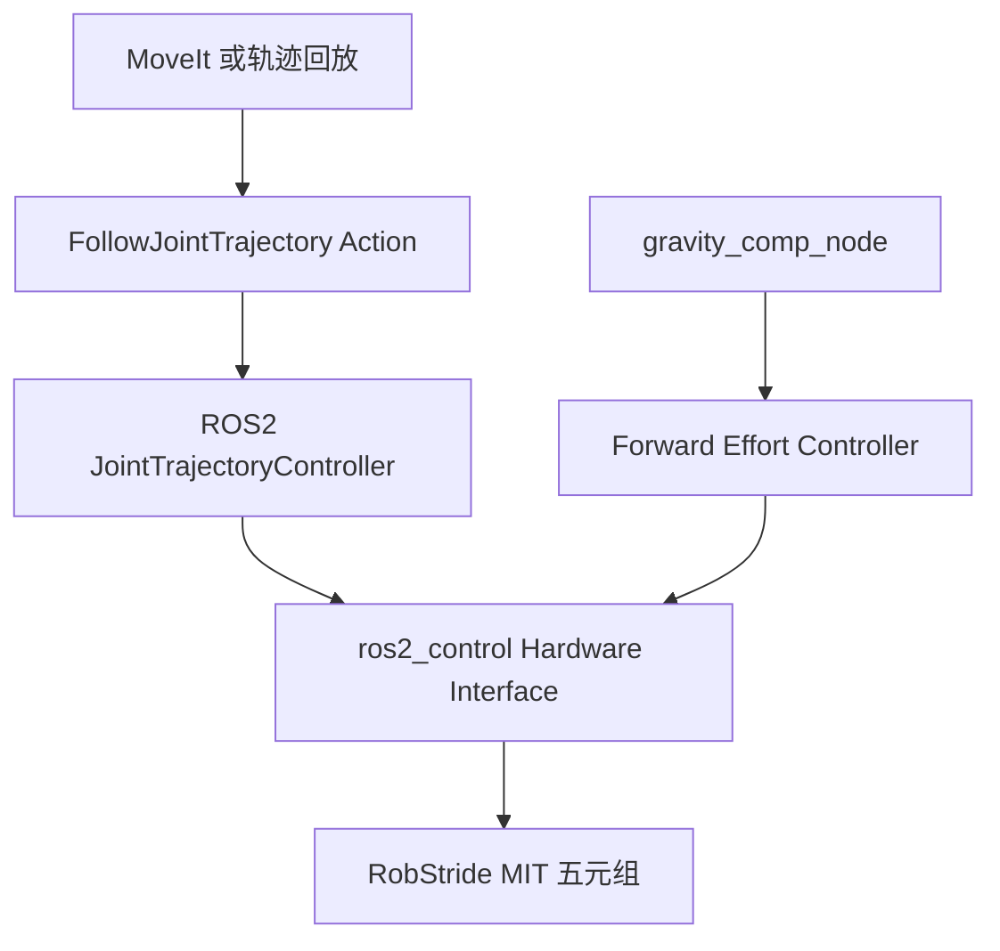
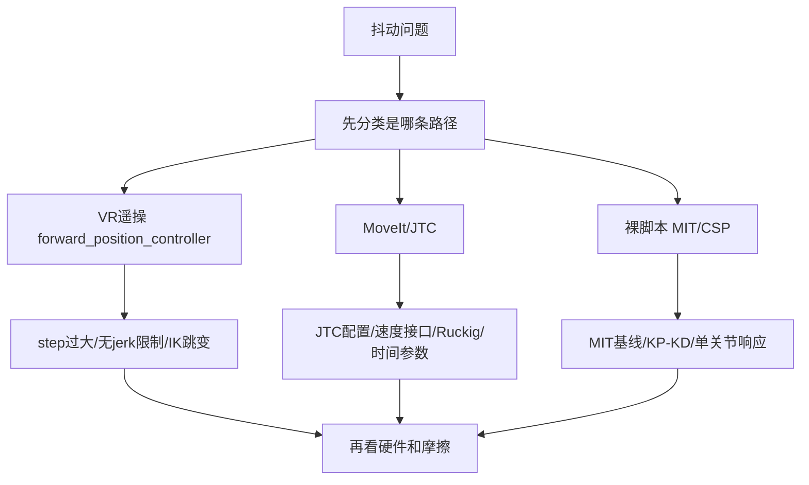
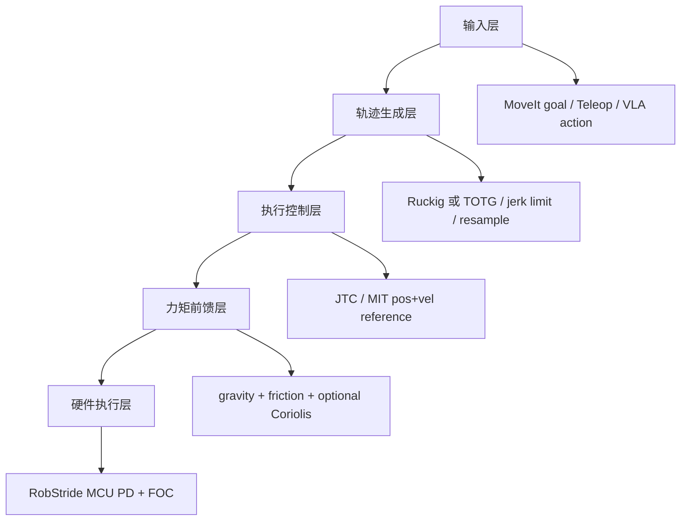
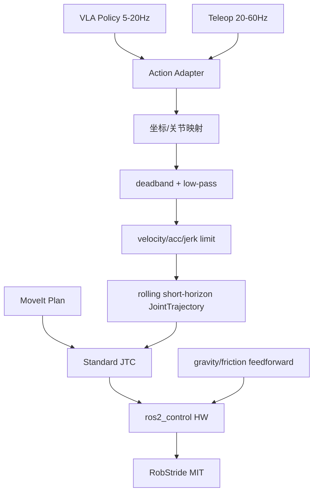

# 07 思考过程全量 Review 与轨迹控制器方案

## 0. Review 范围

本次覆盖：

- `07｜思考过程/` 下全部 Markdown：共 54 篇。
- 外部资料库：
  - `Coding References/Openarm Something/`：OpenARM 原版与生态仓库。
  - `Coding References/OpenarmX/`：采购回来的 OpenARMX 版本。
  - `Coding References/Openarmx_xc_robot/openarmx_xc_robot_2/`：当前最新版。
  - `Coding References/RobStride/`：灵足时代资料与样例。

重点问题：

1. 机械臂抖动如何解决。
2. 机械臂平滑控制如何解决。
3. 是否要做 Trajectory Controller。
4. 如果要，如何做，以及如何适配 VLA。

---

## 1. 总结论

### 1.1 最重要的纠偏

**不要再把“是否要做 Trajectory Controller”理解成“从零实现一个 ROS2 JointTrajectoryController”。**

`openarmx_xc_robot_2` 里已经有标准 ROS2 `joint_trajectory_controller/JointTrajectoryController`，MoveIt 也已经指向它：

- `openarmx_bringup/config/v10_controllers/openarmx_v10_bimanual_controllers.yaml`
- `openarmx_bimanual_moveit_config/config/moveit_controllers.yaml`
- `openarmx_tools/openarmx_teach/play_joint_trajectory.py`

现有架构实际已经是：



真正缺的是：

1. **把现有 JTC 用对**：速度接口、时间参数化、控制频率、controller 生命周期。
2. **把 VLA/遥操作接入现有控制链前，补一层实时 Action Adapter / Trajectory Generator**。
3. **把 position / velocity / torque_ff 三者同步组织成一致的 MIT 指令流**。

所以更准确的答案是：

> 需要一个“轨迹控制层”，但它不一定是从零写一个 ROS2 controller。短期应先修好现有 JTC + gravity_comp + Ruckig/时间参数化；中期再做一个 VLA/Teleop Rolling Trajectory Adapter；只有当标准 JTC 无法满足同步与实时语义时，才写 custom combined controller。

---

## 2. 现有 07 笔记里的关键认知 bug

### Bug 1：把“当前没有轨迹控制器”说得过满

**已有说法**：需要做一个轨迹生成中间层 / Trajectory Controller。

**问题**：当前代码已经有标准 JTC，且默认 launch 也可选 `joint_trajectory_controller`。MoveIt controller 配置也已经使用 `FollowJointTrajectory`。

证据：

- `openarmx_v10_bimanual_controllers.yaml`：声明 `left/right_joint_trajectory_controller`。
- `moveit_controllers.yaml`：MoveIt simple controller manager 指向 `left/right_joint_trajectory_controller`。
- `play_joint_trajectory.py`：已有 `FollowJointTrajectory` action client。

**修正**：

- 不要说“没有轨迹控制器”。
- 应说：“已有标准 JTC，但当前配置只使用 position command interface，MIT velocity 参考没有被填，且 VLA/teleop 缺上游 rolling trajectory adapter。”

---

### Bug 2：把 Ruckig 说成“输入位置点即可”的万能层

**已有说法**：Ruckig 输入位置点，不需要速度信息；MoveIt2 已内置，改配置即可。

**问题**：Ruckig 不是完整路径规划器，也不是“只给位置点就自动全解决”。它需要当前状态、目标状态、速度/加速度/jerk 限制；多 waypoint 和 MoveIt adapter 顺序也要配置与验证。

**修正**：

- Ruckig/TOTG 的位置：给已有路径做时间参数化、速度/加速度/jerk 平滑。
- MoveIt/IK/Servo 仍负责生成路径或局部目标。
- 需要验证 JTC 收到的 `JointTrajectoryPoint` 是否包含合理 `time_from_start`、`velocities`、`accelerations`。

---

### Bug 3：把“抖动解决”过度归因给轨迹生成器

**已有说法**：Ruckig / 轨迹生成器可解决抖动和平滑问题。

**问题**：轨迹生成器只能解决“指令侧不连续”。它不能解决：

- 重力补偿未启用或符号错误。
- `vel_ref=0` 导致运动中阻尼项持续制动。
- CAN 周期抖动 / `recv_all` 阻塞。
- 摩擦、齿隙、低速 stick-slip。
- KP/KD 阻尼比不合理。

**修正**：

轨迹生成器是必要层，但不是第一性万能解。抖动治理应分层：



---

### Bug 4：`vel_ref=0` 判断是对的，但“怎么修”要更严谨

**已有说法**：JTC 只配 position，`vel_commands_` 恒为 0，所以 MIT 中 `Kd(0-v_actual)` 运动中持续制动。

**代码证据成立**：

`v10_simple_hardware.cpp` 在 MIT 模式下发送：

```cpp
param.position = pos_commands_[i] * direction_multipliers[i];
param.velocity = vel_commands_[i] * direction_multipliers[i];
param.torque = tau_commands_[i] * direction_multipliers[i];
```

当前 JTC 配置：

```yaml
command_interfaces:
  - position
```

因此 velocity command interface 没有活跃控制器写入时，`vel_commands_` 很可能保持 0。

**但修法不能只写“一行加 velocity”。**

需要同时验证：

1. 当前 `export_command_interfaces()` 是否正确暴露 velocity。
2. ROS2 JTC 版本是否支持 `position + velocity` command interface 组合。
3. trajectory goal 里是否真的有 velocities。
4. 没有 velocities 时，JTC 是否会内部插补并写 velocity command。
5. 加 velocity 后 resource claiming 是否与 forward velocity controller 冲突。

**更准确的修法**：

- 第一阶段：保持 JTC position-only，但确认 JTC 插补后的 position 连续性。
- 第二阶段：配置 `position + velocity` command interface，并送带 velocity 的 trajectory。
- 第三阶段：若 JTC velocity 语义不满足 MIT 五元组需求，再写 custom trajectory-to-MIT command controller。

---

### Bug 5：重力补偿的“默认关闭 / 单臂无效 / 双臂有效”需要重新核实版本

**已有说法**：单臂 YAML 无 forward_effort_controller，双臂可用；默认关闭。

**当前最新版代码事实**：

`openarmx_v10_bimanual_controllers.yaml` 中已有：

- `left_forward_effort_controller`
- `right_forward_effort_controller`

`gravity_comp_node.cpp` 发布到：

- `/left_forward_effort_controller/commands`
- `/right_forward_effort_controller/commands`

硬件层会把 `tau_commands_` 写入 MIT `param.torque`。

**仍需核实**：

- 现场 launch 是否带 `enable_forward_effort:=true`。
- 当前跑的是单臂还是双臂 launch。
- effort controller 是否 active。
- position controller 与 effort controller 是否同时成功 claim 不同 command interface。
- `g_scale` 符号与方向是否正确。

**修正**：

不要只说“gravity_comp 未启用”。应说：

> 代码已具备 gravity_comp，并且双臂配置已具备 effort controller；真实问题是现场是否启动、controller 是否 active、符号与 URDF 惯量是否正确。第一步不是写新算法，而是做 active controller + torque sign + g_scale sweep 验证。

---

### Bug 6：编码器问题前后冲突，不能再直接宣称“encoder2 一行代码启用”

**已有冲突**：

- 一些笔记说 RS03/RS04 硬件有 2×AS5047P 和 `encoder2raw`。
- 另一些笔记又说协议反馈等效单编码器。
- 还有说“encoder2 未激活，一行代码可用”。

**修正**：

当前更稳妥表述应为：

> RobStride 在硬件/寄存器层疑似存在第二编码器线索，但当前控制反馈链路等效单编码器。`encoder2raw` 是否对应输出端真实角度、是否可实时用于闭环，必须通过寄存器读取实验验证，不能直接写成已确认输出端双编码器。

验证实验：

1. 读取 `mechPos`、`encoderRaw`、`encoder2raw`。
2. 让输出端受外力/换向/加载。
3. 看两路值是否独立变化。
4. 判断是否能用于输出端闭环或背隙估计。

---

### Bug 7：Blue 臂 3.7mm 对 XC 的推论过强

**已有说法**：Blue 臂同类架构 3.7mm，所以 XC 软件修好可 5-10mm。

**问题**：这个推论可作为方向性参考，但不能作为可靠预测。差异包括：

- Blue 臂传动、结构刚度、控制链、标定方式与 XC 不完全一致。
- XC 使用 RobStride + 9:1 行星，代码路径与 OpenARM 原版不同。
- 当前 URDF 动力学参数、控制周期、补偿符号、摩擦模型均未实测闭环验证。

**修正**：

- “5-10mm”应标记为假设，不是结论。
- 当前目标应改为：先把静态 hold 误差、慢速轨迹误差、重复定位误差分别测出来。

---

### Bug 8：AhaRobot 与 XC 的“高度重叠”要降级

**已有说法**：AhaRobot 遥操作平滑与 XC 高度重叠。

**问题**：AhaRobot / SO-ARM 更像低成本高减速位置伺服路线，不等于 XC 的 QDD/RobStride 路线。它可以借鉴“示教轨迹清洗、平滑、数据集质量控制”，但不能作为控制硬件路线对标。

**修正**：

- 可借鉴：遥操作数据 resample、滤波、轨迹平滑、数据质量门控。
- 不可直接借鉴：硬件能力上限、力控能力、QDD 控制带宽判断。

---

## 3. 四个问题的回答

## Q1：机械臂抖动问题如何解决？

### 3.1 先分场景，不要混在一起

抖动不是一个单因问题。至少分三条路径：

| 场景 | 主要嫌疑 | 第一动作 |
|---|---|---|
| VR / 遥操作抖 | step 太大、IK 跳变、forward_position_controller 直灌位置 | 降 step + 加速度/jerk 限制 + 改成 rolling trajectory |
| MoveIt / JTC 抖 | position-only、速度参考缺失、时间参数化不足、100Hz | 检查 trajectory goal + 加 velocity interface + Ruckig/TOTG |
| 裸脚本单关节抖 | KP/KD、摩擦、CAN 周期、驱动参数 | 单关节正弦/阶跃实验 + CAN 时间戳 |

### 3.2 P0 修复顺序

1. **建立观测**：同步记录 command、joint_states、CAN frame timestamp。
2. **确认 gravity_comp 是否真的 active**：不是只看代码存在。
3. **确认 MIT velocity 是否为 0**：从硬件层输出日志或 CAN 解包验证。
4. **降低遥操作 step 与 jerk**：避免把不可执行指令送到底层。
5. **JTC velocity 接口试验**：验证 `pos + vel` 对运动抖动的改善。
6. **再谈 update_rate 提升**：先 100→200，稳定后再评估 500。
7. **摩擦辨识**：低速往返，拟合 Coulomb + viscous + Stribeck。

---

## Q2：机械臂平滑控制如何解决？

平滑控制不是单个滤波器，而是四层：



关键原则：

- 不要把 VLA/teleop 的离散目标直接灌进 MIT。
- 不要让 `vel_ref=0` 追运动中的目标。
- 不要用高 KP/KD 掩盖轨迹不连续。
- 平滑要在“参考轨迹”层解决，而不是只在电机层硬扛。

---

## Q3：是否要做 Trajectory Controller？

### 结论

**要做轨迹控制层，但短期不建议从零写标准 Trajectory Controller。**

因为现在已经有：

- ROS2 `JointTrajectoryController`
- MoveIt `FollowJointTrajectory` 配置
- teach/playback action client
- hardware interface 支持 position / velocity / effort
- gravity_comp effort path

短期目标应该是：

> 修好并用对现有 JTC，而不是从零写一个替代 JTC。

### 什么时候需要自研 custom controller？

只有满足以下任一条件，才值得写 custom combined controller：

1. 标准 JTC 无法同时稳定输出符合 MIT 语义的 `q_des / dq_des`。
2. position JTC + effort forward controller 的异步组合导致 torque_ff 相位问题不可接受。
3. VLA/teleop 需要短周期 rolling horizon，标准 JTC action goal 频繁替换语义太重。
4. 需要在同一实时循环内做轨迹插补 + gravity/friction + safety watchdog + MIT command shaping。

---

## Q4：如果要，如何做这个轨迹控制器，并适配 VLA？

### 4.1 推荐架构：先做 VLA/Teleop Rolling Trajectory Adapter

不是先写底层 controller，而是在 JTC 前加一层：



### 4.2 Adapter 的职责

输入：

- VLA 输出：末端 delta pose、joint delta、waypoint 或高层动作。
- Teleop 输出：手柄 / VR / 示教动作。

输出：

- 短时域 `JointTrajectory`，例如 100-300ms horizon。
- 每 20-50ms 滚动更新，但内部轨迹连续。

必须包含：

1. 时间戳校验。
2. action deadband。
3. 速度/加速度/jerk 限制。
4. 新旧目标 blend，不允许 abrupt replace。
5. watchdog timeout。
6. joint limit / self-collision guard。
7. raw action 与 executed trajectory 双日志。

### 4.3 VLA 数据适配重点

为了 VLA，不只是“执行更平滑”，还要保证数据质量：

| 数据 | 用途 | 必须记录 |
|---|---|---|
| raw human/VLA action | 训练输入分布 | 原始未滤波 action |
| smoothed command | 控制器实际目标 | q_des, dq_des, ddq_des |
| robot feedback | 真实执行结果 | q, dq, tau/current |
| success/failure | 策略学习标签 | task outcome |

否则模型可能学到控制器抖动或延迟，而不是任务本身。

### 4.4 实施分三阶段

#### Phase 1：不用写新 controller，先修现有链路

- 开启/验证 gravity_comp。
- JTC 加 velocity command interface 实验。
- MoveIt/Ruckig/TOTG 配置验证。
- 轨迹回放点补 `velocities` / `accelerations`。
- update_rate 100→200 试验。

#### Phase 2：写 Rolling Trajectory Adapter

节点建议：`openarmx_trajectory_adapter`。

输入 topic：

- `/vla_action`
- `/teleop_target`
- `/joint_states`

输出：

- `/left_joint_trajectory_controller/joint_trajectory`
- `/right_joint_trajectory_controller/joint_trajectory`

或 action goal：

- `/left_joint_trajectory_controller/follow_joint_trajectory`
- `/right_joint_trajectory_controller/follow_joint_trajectory`

#### Phase 3：必要时写 custom MIT trajectory controller

如果 Phase 1/2 证明标准 JTC 不够，再写：

`openarmx_mit_trajectory_controller`

职责：

- 直接 claim `position + velocity + effort`。
- 同一个 update loop 内输出 `q_des / dq_des / tau_ff`。
- 内置 gravity/friction feedforward。
- 内置 rolling horizon 与 watchdog。

---

## 4. 最终建议路线图

| 优先级 | 任务 | 目的 | 是否写新 controller |
|---|---|---|---|
| P0 | 验证 gravity_comp active + 符号 + g_scale sweep | 先消静态误差 | 否 |
| P0 | 记录 command/joint/CAN 三流 | 给抖动分类 | 否 |
| P0 | JTC velocity interface 实验 | 消除 `vel_ref=0` | 否 |
| P1 | Ruckig/TOTG 配置验证 | 平滑 MoveIt 轨迹 | 否 |
| P1 | 降 teleop step + 加 jerk limit | 平滑遥操作 | 否 |
| P1 | 写 Rolling Trajectory Adapter | 适配 VLA/teleop | 是，adapter 级 |
| P2 | 摩擦辨识 + friction feedforward | 低速平滑 | 可能不需要 |
| P3 | custom MIT trajectory controller | 同步 q/dq/tau_ff | 只有标准链路不够时 |

---

## 5. 需要改写/标注的旧笔记位置

建议后续修订这些笔记，避免团队继续沿用过强判断：

1. `04-轨迹规划/02-硬件精度上限与轨迹生成中间层.md`
   - 把“Ruckig 输入位置点即可”改为“Ruckig/TOTG 需要状态与约束；负责时间参数化，不负责完整路径规划”。
   - 把“需要中间层”细化为“已有 JTC，缺 VLA/teleop adapter 和 velocity interface 验证”。

2. `02-关节抖动根源解析/02-关节抖动根源分析总纲.md`
   - L2 `vel_ref=0` 保留。
   - L4 “无速度时间参数化”要补充：JTC 本身有插补，问题是输入 trajectory 与 command interface 是否带 velocity。
   - L5 `encoder2raw 一行代码启用` 降级为待验证。

3. `03-重力补偿前馈/02-OpenARM重力补偿架构与XC状态核查.md`
   - RobStride 单编码器结论应与后续 `encoder2raw` 笔记统一：当前控制链等效单编码器，但硬件/寄存器疑似第二路，需实验确认。

4. `00-我的AI判断/02-机械臂抖动诊断与控制优化.md`
   - “需要引入运动规划器”应分为：止抖不是第一优先级；可用性必须有轨迹/servo 层；VLA 需要 rolling adapter。

---

## 6. 一句话结论

XC-Robot 当前最值得做的不是“重写一个大而全的 Trajectory Controller”，而是：

> **先把现有 JTC + gravity_comp + MIT velocity/tau_ff 链路打通；再在 VLA/teleop 前加 rolling trajectory adapter；最后只有在标准 JTC 无法保证 q/dq/tau_ff 同步时，才写 custom MIT trajectory controller。**
