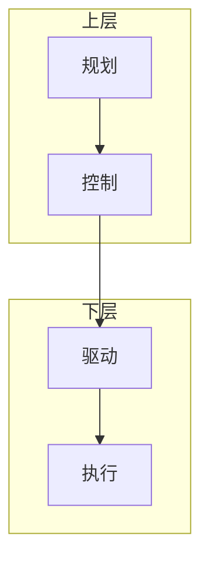

# Mermaid + 代码展示缺陷扫描 + SKILL v2.3 补丁说明

## 元信息

- **触发场景**：用户在 OpenCode + DeepSeek-V4-Flash 生成 Mermaid 图时频繁遇到「文字展示不全 / 被遮挡」问题
- **扫描范围**：祥承电子 Vault 全量 .md（995 个，含 Mermaid 块的 50 个，块数 105 个）
- **审查方式**：Sonnet 4.6 agent 扫描 + Opus 4.7 主线程审定补丁
- **执行日期**：2026-05-25
- **结果**：342 条问题去重为 5 类核心模式 + 4 个 DeepSeek 缺陷指纹；SKILL v2.3 补丁已合入；4 个 P0 文档已修复；linter 脚本已落盘

## 一、5 类核心缺陷模式

| 严重度 | 模式 | 数量 | 影响 |
|--------|------|------|------|
| 🔴 严重 | 节点塞段落级文本（6 个 `<br/>`，100+ 字符）| 2 处极端（最大在 `三臂横向对比` 文档）| 移动端完全截断 |
| 🟠 高 | 节点 ≥2 个 `<br/>`（A2 模式）| **90 处** | lab-website SVG 容器撑破 |
| 🟠 高 | **subgraph 裸中文 ID** | **40 处 × 15 文件** | 跨渲染器（GitHub / NotePlan）渲成空白框 |
| 🟡 中 | 边标签含 `<br/>` 换行 | 21 处 | mermaid 不解析 HTML，`<br/>` 裸出文本 |
| 🟡 中 | 代码块无语言标签（F3）| **114 处** | lab-website 高亮全失效 |

## 二、DeepSeek-V4-Flash 缺陷指纹（用户主诉直接根因）

按出现频率排序：

1. **节点当 Markdown 列表用** — 把应写进表格的内容全塞节点（`<br/>` ≥3 个）
2. **边标签当注释用** — 边上挂 `<br/>` 换行的多行描述
3. **subgraph 不用 ASCII ID** — 直接用中文当 subgraph ID
4. **代码块不加语言标签** — 三反引号裸用

→ 已全部纳入 SKILL v2.3 + linter 规则。

## 三、SKILL.md v2.3 补丁（已合入 `~/.claude/skills/xc-robot/SKILL.md` 约 line 638）

### 5 条新铁律

#### 1. 节点字符上限

- 节点标签 ≤ **20 中文字符**（≤ 40 英文字符）
- 节点内 `<br/>` ≤ **1 个**
- 超出 → 拆节点，或改用 Markdown 表格
- 核心原则：图不是用来装段落的，是用来呈现关系的

#### 2. 边标签字符上限

- 边标签 `-->|text|` ≤ **15 中文字符**
- 边标签内**禁含** `<br>` / `<br/>` / `\n` —— mermaid 不解析 HTML，会原样输出 `<br/>` 字面文本
- 超出 → 移入节点标签，或在图下方加 Markdown 注释

#### 3. subgraph 必须 ASCII ID + 双引号标签

- ❌ `subgraph 现状_裸PD`（跨渲染器隐患：GitHub / NotePlan 会渲成空白框）
- ✅ `subgraph PD_current["现状：裸 PD"]`
- 规则：subgraph ID 仅用 `[a-zA-Z0-9_]`，显示标题用双引号包裹

#### 4. 代码块强制语言标签

- ❌ 裸三反引号
- ✅ `python` / `bash` / `yaml` / `cpp` / 最低 `text`
- 无语言标签的代码块在 lab-website doc-renderer.js 下不高亮，可读性骤降

#### 5. 对比类场景禁止 Mermaid 堆节点

- 两列对比 / 参数对比 → **改用 Markdown 表格**
- 阶段流程对比 → 平行两列 Mermaid，每节点 ≤ 20 字
- ❌ 在单节点写 ≥3 个 `<br/>` 列出多个条件 / 参数

### 3 个防御性 Mermaid 模板（DeepSeek / LLM 套用）

**模板 A — 精简流程图**（≤ 8 节点，节点 ≤ 15 字）：


**模板 B — 分层架构**（subgraph 必须 ASCII ID + 中文标签）：



**模板 C — 对比场景**（禁示例 + 改用表格）：

❌ 反例（不要写）：

<!-- 下面是反例，故意违反 S1-node-br 规则用作示例；改为 text 块防止 linter 误报 -->
```text
flowchart LR
    P --> Q["QDD 系<br/>低减速比<br/>背驱性好<br/>力控可靠<br/>精度差<br/>成本低"]
```

✅ 正例（用 Markdown 表格）：

| 维度 | QDD 系 | 谐波系 |
|------|--------|--------|
| 减速比 | 7-9:1 | 50-100:1 |
| 背驱性 | 好 | 差 |
| 精度 | 3-8mm | ±0.1mm |

## 四、OpenCode + DeepSeek-V4-Flash 工作流增强

### A. 系统 prompt 注入

在 OpenCode 给 DeepSeek 的 system prompt 里强制注入上面 5 条铁律 + 3 个模板。

### B. Post-generation linter

用 `~/.claude/scripts/mermaid_linter.py` 在 DeepSeek 输出落盘前检测，命中违规自动重写。

linter 用法：

```bash
# 单文件检查
python3 ~/.claude/scripts/mermaid_linter.py <markdown-file>
# 退出码 0 = 通过；非 0 = 有违规数，stdout 列出违规清单

# JSON 输出（供脚本消费）
python3 ~/.claude/scripts/mermaid_linter.py --json <markdown-file>

# 整目录扫描
python3 ~/.claude/scripts/mermaid_linter.py --check-dir <directory>
```

## 五、P0 整改实际执行清单（2026-05-25）

4 个 P0 文档已修复并通过 linter 二轮验证（最终 0 违规）：

| # | 文档 | 改动 |
|---|------|------|
| 1 | `lab-website/dev/mit-pd-feedforward-signal-chain/doc.md` | 4 处 subgraph 裸中文 ID → ASCII ID + 双引号；9 处节点 `\n` 换行精简到 ≤1；1 处代码块加 `text` 语言标签 |
| 2 | `lab-website/dev/agv-navigation-architecture/doc.md` | Step 1-4 节点从 4 个 br 精简到 1 个 + 详情移到表格；两雷达 subgraph 中文标签加双引号 + 节点 br 精简 |
| 3 | `lab-website/dev/openarm-control-architecture/doc.md` | Step 1-5 路径节点 br 精简；L1-L6 精度节点 br 精简；动力学工装 Tools 节点 3 br 精简 |
| 4 | `07｜思考过程/04-轨迹规划/03-三臂横向对比-Blue臂vs宇树Z1vsXCRobot.md` | 段落级 100+ 字符节点改为 Markdown 表格（保留极简 mermaid 作示意）|

### 关键教训（linter 二轮验证）

第一轮按 Agent D 报告点名位置修完后，跑 linter 又发现 **13 条 D 报告未点名的同类违规**（节点 `\n` 换行、未点名代码块、雷达 subgraph 双引号、动力学工装节点 3 br 等），全部补修后二轮 linter 0 违规。

→ **关键认知**：linter 规则覆盖是「全集」，agent 报告中的示例位置只是「采样」。今后类似审查任务，应优先以脚本化规则做收尾验证。

## 六、Mermaid linter 脚本设计要点

**文件**：`~/.claude/scripts/mermaid_linter.py`（Python 3，已 chmod +x）

**检测规则**（与 SKILL v2.3 严格对齐）：

- S1-node-chars：节点中文字符 > 20
- S1-node-br：节点 `<br/>` 数 > 1
- S1-node-newline：节点 `\n` 数 > 1
- S2-edge-chars：边标签中文 > 15
- S2-edge-br：边标签含 `<br>` / `\n`
- S3-subgraph-id：subgraph ID 非 ASCII（`[a-zA-Z0-9_]`）
- S4-code-no-lang：代码块缺语言标签

**接口设计**：

- 入参：单文件 / 多文件 / `--check-dir` 目录递归
- 出参：可读文本（默认）/ JSON（`--json`）
- 退出码：违规数（封顶 255）
- 静默：`--quiet`（仅在有违规时输出）

## 七、剩余工作（未在本次执行范围）

- 🟡 lab-website 全站剩余约 300 条违规（D 报告 342 - 本次修 30+ 条 = 剩余）— 可用 `python3 ~/.claude/scripts/mermaid_linter.py --check-dir lab-website/dev/` 一键扫
- 🟡 07 思考过程其他文档的 subgraph 裸中文 ID（D 报告 40 处 × 15 文件，本次只覆盖 lab-website 部分）— 同上 linter 一键扫
- 🟡 OpenCode 端接入 linter（用户自行集成）

## 八、参考

- xc-robot SKILL.md v2.3 补丁：`/Users/mac-minishu/.claude/skills/xc-robot/SKILL.md`（"Mermaid 写法新增铁律 v2.3" 段，约 line 638-743）
- Mermaid linter 脚本：`/Users/mac-minishu/.claude/scripts/mermaid_linter.py`
- 4 agent 综合报告原文：返回在 task-notification 消息体中（未单独存档）
- 会话脉络对照：`07｜思考过程/00-我的AI判断/_会话脉络.md` line 20-83
