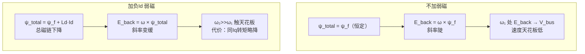
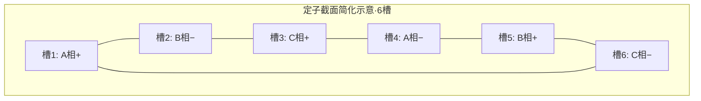

# FOC 定子结构与弱磁-速度控制关系深析

## 背景

接续 [[07-弱磁机制深析]]。用户已理解 DQ 轴本质后，进一步提出两个问题：
弱磁（负 $I_d$）为何让转速更高（而非更低）；以及定子线圈的物理形态是什么。

---

## Q1：ID 削弱磁场为什么反而允许更高转速？正 ID 为何导致抖动？

用户原始理解：

> 旋转磁场与转子永磁体保持 90° 正交，靠 $I_q$ 分量驱动旋转。那弱磁（负 $I_d$）削弱总磁通后，转速为什么反而更高？正 $I_d$ 强化磁场时，抖动为什么更大？

### 分析

**首先要修正一个认知**：$I_q$ 不直接控制转速，$I_d$ 也不直接控制转速。

转矩-速度控制链路：

$$\tau = K_t \cdot i_q$$

$$\alpha = \frac{\tau - \tau_{load}}{J} \quad \Rightarrow \quad \omega(t) = \int \alpha \, dt$$

转速是转矩与负载博弈的结果。$I_q$ 控制转矩，转矩减去负载后产生角加速度，速度由此积分得到。

**真正的约束来自电压上限：**

$$E_{back} = \omega \cdot \psi_{total}$$

$$V_{bus} = E_{back} + I \cdot R + L \cdot \frac{dI}{dt}$$

当 $\omega$ 足够高时：

$$E_{back} \to V_{bus} \Rightarrow \text{剩余电压} \approx 0 \Rightarrow I_q \text{ 无法继续灌入} \Rightarrow \tau \to 0$$

电机撞上"速度天花板"，无法再加速。

**弱磁的作用：把这个天花板向上移**

$$\psi_{total} = \psi_f + L_d \cdot I_d \quad (I_d < 0 \Rightarrow \psi_{total} < \psi_f)$$

$$E_{back} = \omega \cdot \psi_{total} \downarrow \Rightarrow \text{电压裕度恢复} \Rightarrow I_q \text{ 可继续灌入}$$

弱磁不是让电机"自动变快"，而是把电压天花板从 $\omega_1$ 移到 $\omega_2 \gg \omega_1$，解除限速，速度快慢仍由 $I_q$（转矩）和负载决定。

### 架构 / 流程图

**正 $I_d$ 导致抖动的两个机制：**

**机制 1：电流环 D-Q 交叉耦合放大**

FOC 理论上解耦，但实际存在干扰项：

$$v_d^{disturb} = \omega_e L_q i_q$$

$$v_q^{disturb} = \omega_e L_d i_d$$

正常 $I_d = 0$ 时，Q 轴干扰项 $\omega_e L_d i_d = 0$，解耦补偿误差可接受。  
$I_d \neq 0$ 时，Q 轴干扰项变大，补偿不完全 → $i_q$ 波动 → 转矩波动 → 抖动。

**机制 2：有效增益升高触发机械谐振**

正 $I_d$ 增强磁场 → 有效 $K_t$ 增大 → 同样电流误差产生更大力矩 → 驱动侧增益升高。  
Robstride 关节传动链（减速器、联轴器）有弹性柔度。高增益 + 机械柔度 = 谐振条件成立 → 关节抖动。

### 结论

弱磁（负 $I_d$）= 解除电压天花板，让电机能在更高速下维持转矩，不是直接控速。  
正 $I_d$ 导致抖动的根本原因：交叉耦合放大 + 有效增益升高触发机械谐振。  
Robstride 设计工作点是 $I_d = 0$（MTPA），偏离该点会引入上述两个不稳定来源。

---

## Q2：三相正弦电流是怎么给到定子的？定子线圈是什么结构？

用户原始问题：

> 三相正弦波是指电流以三相正弦波的形式给到定子线圈吗？定子线圈是三个不同线圈叠在一起，还是什么结构？

### 分析

**三相正弦电流**：是的，DRV8353 通过 SVPWM 调制，让三相线圈里流过互差 120° 的正弦电流：

$$i_A(t) = I_m \sin(\omega_e t)$$

$$i_B(t) = I_m \sin\!\left(\omega_e t - \frac{2\pi}{3}\right)$$

$$i_C(t) = I_m \sin\!\left(\omega_e t - \frac{4\pi}{3}\right)$$

**定子线圈的物理结构**：不是三个线圈叠在一起，而是绕在同一铁芯不同槽位里的分布绕组。

实际物理结构：

- 定子 = 带槽的圆筒铁芯（硅钢片叠压），内壁开均匀分布的槽
- 三相绕组的铜线嵌入不同槽位，每相占总槽数的 1/3
- A 相槽位在 0°/180°，B 相在 120°/300°，C 相在 240°/60°（以 2 极对为例）
- 每相是串联线圈，**同一时刻只流一个电流值**，随时间正弦变化

**旋转磁场的形成**：三相电流同时通电，各自产生固定方向的磁场向量，三者叠加：

$$\vec{B}_{合} = \vec{B}_A + \vec{B}_B + \vec{B}_C = \frac{3}{2} B_m \angle(\omega_e t)$$

合成磁场向量幅值恒定，方向以电气角频率 $\omega_e$ 连续旋转。  
FOC 保证合成磁场始终超前转子 90°，即 $I_d = 0$，力矩最大。

**Robstride 的多极对数特殊性**：

$$n_{mech} = \frac{n_{elec}}{p}$$

Robstride RS03/RS04 极对数 $p \approx 14\sim21$，<mark style="background: #FFB86CA6;">同样电气频率下机械转速更低，天然低速高转矩，适合直驱关节。  
代价</mark>：<mark style="background: #FFB86CA6;">电控频率要求高（1000Hz CAN 帧对应多个电气周期的控制），电流环带宽需更宽</mark>。

### 结论

三相正弦电流通过 SVPWM 合成，分别流入定子铁芯上 120° 空间分布的槽内绕组，叠加产生幅值恒定的旋转磁场。Robstride 多极对结构（$p \approx 14\sim21$）使其在低机械转速下有高电气频率，直驱关节无需大减速比。

---

## 待办事项

- [ ] 确认 Robstride RS03/RS04 的实际极对数参数（查数据手册或拆机测量）
- [ ] 测量大臂关节在高速段的实际转矩-速度曲线，确认弱磁折弯点位置

## 参考

- [[07-弱磁机制深析]]（弱磁机制 + ψ_total 公式基础）
- [[05-DQ轴与FOC原理]]（DQ 轴基础 + Clark/Park 变换链路）
- [[06-传统vsMIT模式与扭矩生成]]（τ = Kt × Iq，MIT 五元组）
