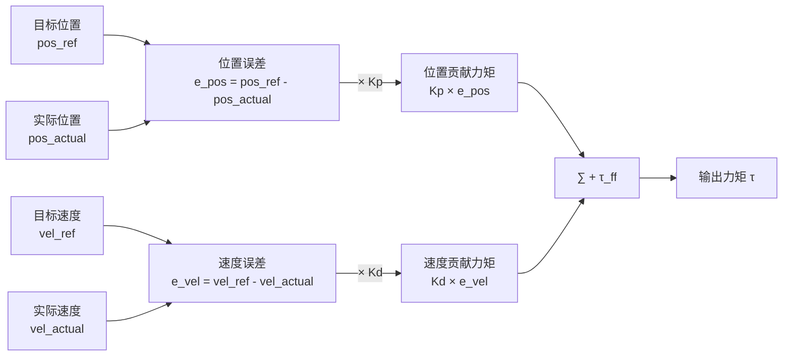
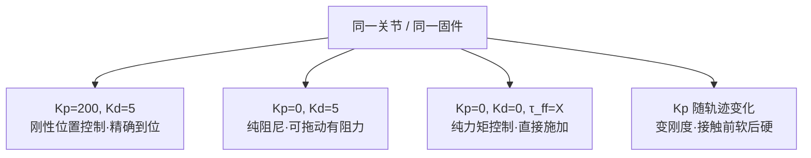

# MIT PD 参数与位置环/速度环深析

## 背景

接续 [[01-电机控制]]（抖动四层根因分析）。用户在理解 MIT 运控模式的基础上，进一步追问：
"上位机通过 CAN 帧实时注入 PD 参数"具体是什么意思，Kp/Kd 分别代表什么，位置环和速度环如何区分。

---

## Q1：MIT 五元组里 Kp/Kd 是什么？"PD"是什么意思？

用户原始问题：
> 什么叫 PD 参数？是因为其中包含了 Kp 和 Kd 吗？

### 分析

MIT 运控模式每帧发送五个数：`[pos_ref, vel_ref, Kp, Kd, τ_ff]`

电机收到后按此公式计算输出力矩：

$$\tau = K_p \cdot (pos_{ref} - pos_{actual}) + K_d \cdot (vel_{ref} - vel_{actual}) + \tau_{ff}$$

**Kp 和 Kd 就是这个公式里的两个系数。**

- P = Proportional（比例）：对位置误差的响应系数
- D = Derivative/Damping（微分/阻尼）：对速度误差的响应系数

没有 I（积分项），是因为积分在机器人控制里容易积分饱和（windup），<mark style="background: #FFF3A3A6;">用 `τ_ff` 前馈项替代稳态误差补偿</mark>。

### 结论

"PD 参数"= Kp + Kd 两个数。每帧随位置指令一起通过 CAN 发送。

---

## Q2：位置环和速度环分别是什么？

用户原始问题：
> 这里的"位置环比例增益"和"速度环阻尼增益"具体指什么？什么是位置环，什么是速度环？

### 分析

- **位置环**：用位置误差产生力矩。偏差越大，拉回去的力越大。
- **速度环**：用速度误差产生力矩。主要作用是抑制振荡，防止关节超调后来回震荡。

### 结论

两个"环"指两个独立的误差反馈通道，各自乘以对应增益后叠加。

---

## Q3：比例增益和阻尼增益分别代表什么？

用户原始问题：
> 这里的比例增益和阻尼增益分别代表什么意思？

### Kp — 位置环比例增益（弹簧）

$$K_p \cdot (pos_{ref} - pos_{actual})$$

物理比喻：**弹簧劲度系数**。关节偏离目标位置越远，拉回去的力越大。

| Kp 大 | 弹簧硬，刚性高，抵抗外力强，但容易过冲振荡 |
|-------|-----|
| Kp 小 | 弹簧软，柔顺，可被外力推偏，位置保持差 |

典型值（灵足 RS04）：`loc_kp = 30`（固件内部速度环）；MIT 帧上层 Kp 常用范围 50–300 N·m/rad。

### Kd — 速度环阻尼增益（减震器）

$$K_d \cdot (vel_{ref} - vel_{actual})$$

物理比喻：**减震器阻尼系数**。关节运动越快，这一项产生的反向力越大，让运动减速。

| Kd 大 | 阻尼强，平滑不振荡，但响应慢 |
|-------|-----|
| Kd 小 | 阻尼弱，响应快，到达目标后来回震荡 |

典型值：MIT 帧 Kd 常用范围 1–10 N·m·s/rad。

### 结论

Kp = 弹簧（位置拉力大小），Kd = 减震器（运动阻力大小）。两者共同决定关节的"软硬"和"稳定性"。

---

## Q4："上位机实时注入 PD 参数"的重要性

用户原始问题（隐含）：
> 为什么说 Kp/Kd 是"实时注入"的？这有什么特别意义？

### 分析

**传统伺服驱动器**：Kp/Kd 是固件静态参数，出厂调一次，运行中不变。

**MIT 协议的特别之处**：Kp 和 Kd 随每帧位置指令一起发送（~1kHz），上位机可以每 1ms 动态改变弹簧劲度和阻尼。

### 与抖动的关系

这也正是 XC-Robot 当前抖动的直接来源之一：Kp/Kd 只能以 CAN 的 1kHz 帧率更新，而关节真正需要的外环刚度更新频率是 5–10kHz。帧率不够时，指令离散，关节收到的"弹簧"在跳变，表现为抖动。

对比：MIT Mini Cheetah 原版的关节 PD 控制在驱动板 MCU 以 **40kHz** 运行，CAN 总线只传高层轨迹点，Kp/Kd 固化在本地——这才是低抖动的根本原因，而不是"灵足没 FOC"。

### 结论

MIT 协议的动态 Kp/Kd 注入赋予了变刚度控制能力，是一大优势；
但同时，把外环 PD 放在 1kHz 的 CAN 总线上，是导致抖动的结构性瓶颈。

---

## 待办事项

- [ ] 实测 Kp/Kd 调参范围：从默认值出发，逐步增大 Kp，观察振荡临界点
- [ ] 确认灵足固件内部 40kHz 本地 PD 路径是否可用（电流模式 run_mode=3 + 上位机外环）
- [ ] 参考 `tmotor_ros2` pyro_2dof_controller 的 Kp/Kd 动态调参实现

## 参考

- [[01-电机控制]]（抖动四层根因：CAN 带宽/编码器/电流环/QDD）
- [[02-MIT-FOC中间层代码库调研]]（五元组 τ_ff 前馈路线图）
- [[06-传统vsMIT模式与扭矩生成]]（τ = Kt × Iq，MIT 五元组完整解释）
