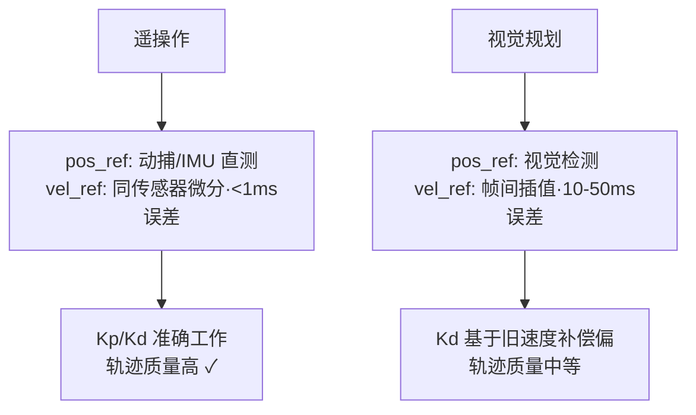
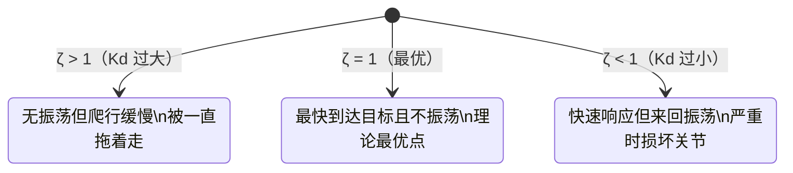

# 位置规划机制与 Kp/Kd 参数深析

## 背景

接续 [[09-MIT-PD参数与位置速度环深析]]。用户理解了 Kp/Kd 的基本含义后，进一步追问：
系统如何持续确定目标位置、视觉规划 vs 遥操作的质量差异、Kp 过大为何导致振荡、Kd 是否来自惯性、过阻尼/欠阻尼的行为差异。

---

## Q1：系统如何持续确定"正确的位置"？

用户原始问题：
> 我从外部给它一个终端位置，经过规划后机器人靠近这个准确点，它是否会时时刻刻探测当前位置与目标位置产生的误差？

### 分析

上位机发的 `pos_ref` **不是终点**，是轨迹规划器在每个时刻生成的当前路径点。


每帧（1kHz）都在重新计算当前目标点与实际位置的误差，持续修正。终点只是规划的输入，不是直接发给电机的东西。

### 结论

"正确的位置"是轨迹规划器每 1ms 生成一次的中间路径点，不是终点本身。

---

## Q2：双目视觉获取位置时，速度信息如何处理？

用户原始问题：
> 如果直接通过双目视觉获取位置，就没有速度环的信息了。速度要么是固定生成的，要么是插值生成的，其真实性是否不如遥操作？

### 分析

**速度只能估算，不是测量到的。**

| 速度来源 | 方式 | 精度 |
|---------|------|------|
| 编码器直接测 | 微分计算，1kHz | ✅ 高 |
| 视觉位置微分 | $(pos_t - pos_{t-1})/\Delta t$，30–60Hz | 🟡 中，有噪声和延迟 |
| 固定填 0 | vel_ref = 0 | ❌ Kd 始终在刹车 |

视觉采样率（30–60Hz）远低于 CAN 帧率（1kHz），中间帧的 vel_ref 全靠插值补出来。核心问题不是插值本身，而是视觉有 **处理延迟**（通常 30–100ms），导致 vel_ref 描述的是"几十毫秒前的运动状态"，和实际关节速度对不齐，Kd 的补偿因此偏差。

### 结论

视觉规划的 vel_ref 是估算值，时间对齐误差 10–50ms，Kd 项精度低于遥操作。

---

## Q3：遥操作效果是否优于直接视觉规划？

用户原始问题：
> 遥操作能提供更准确的速度、位置以及时间关联信息，是否会导致遥操作效果比简单规划好？

### 分析



遥操作时，人手的动捕或关节传感器直接读取真实运动，`pos_ref` 和 `vel_ref` 都来自同一物理过程，天然时间对齐。这也是为什么 ACT / Diffusion Policy 的示教数据要求尽量用高质量力矩传感器和直接关节编码器，而非纯视觉推断。

### 结论

遥操作的运动数据质量本身更高，是目前 VLA 高质量示教数据采集的首选来源。

---

## Q4：不同操作者速度不同，是否会导致卡顿？

用户原始问题：
> 如果遥操作人员不同，速度环控制结果的差异是否可能导致力矩在抑制震荡时出现过头或不到位，从而引发卡顿？

### 分析

速度不同不是核心问题，**延迟是问题**。当操作者动作突然变快时：

```text
vel_actual 正在上升
追踪系统有延迟 → vel_ref 还停在"旧的较低速度"
→ e_vel = vel_ref - vel_actual < 0（负值）
→ Kd 产生反向制动力矩
→ 表现：关节被"踩了刹车"，出现卡顿
```

- 慢速操作者：延迟影响小，Kd 误差小，顺滑
- 快速操作者：延迟影响大，Kd 频繁踩刹车，卡顿明显

这也是 VLA 示教数据中需要做**动作速度归一化**的原因——不同操作者速度差异导致 vel_ref 幅值不一致，影响策略训练质量。

### 结论

操作者速度差异 + 追踪延迟 → Kd 产生周期性制动力矩 → 卡顿。这是遥操作数据质量控制的关键变量之一。

---

## Q5：Kp 大为什么会过冲振荡？

用户原始问题：
> KP 大刚性高，但容易过冲和震荡。过冲震荡与 Kp 过大之间具体的逻辑关系是什么？

### 分析

用弹簧-质量系统推导。PD 控制下的运动方程：

$$J\ddot{e} + K_d\dot{e} + K_p e = 0$$

固有频率和阻尼比：

$$\omega_n = \sqrt{\frac{K_p}{J}}, \quad \zeta = \frac{K_d}{2\sqrt{K_p \cdot J}}$$

Kp 变大时，$\omega_n$ 上升（系统想振得更快），但 $\zeta$ 下降（Kd 不变的前提下）。当 $\zeta < 1$，系统进入**欠阻尼**状态，必然过冲振荡。

**物理直觉**：Kp 大 → 系统在距离目标还远时就施加了很大的力，积累了高速度 → 到达目标时来不及停 → 冲过头 → Kp 反向拉回 → 来回震荡。

### 结论

Kp 增大 → 阻尼比 ζ 减小 → 欠阻尼 → 振荡。调大 Kp 必须同步调大 Kd，才能维持 ζ ≈ 0.7–1.0。

---

## Q6：Kd 阻尼感是否来自惯性？

用户原始问题：
> 这种阻尼感是否是由某种惯性导致的？

### 分析

**不是**，两者机制完全不同：

| 概念 | 公式 | 物理含义 |
|------|------|---------|
| **惯性** | $F = J \cdot \alpha$（加速度） | 抵抗速度的**改变**；重物难启动也难停止 |
| **Kd 阻尼** | $F = K_d \cdot \omega$（速度本身） | 抵抗速度**本身**；动得越快阻力越大 |

- 惯性：静止时也感受得到（启动难）
- Kd 阻尼：只有在动的时候才有阻力，像在水里运动

关节的惯性来自电机转子和连杆质量，是物理属性，不可调。Kd 是软件里定义的虚拟阻尼，可以每帧改变。

### 结论

Kd 阻尼是纯软件参数，与物理惯性性质不同。感觉相似但作用机制不同。

---

## Q7：Kd 大/小行为与阻尼比

用户原始问题：
> Kd 大 → 平滑不震荡但响应慢；Kd 小 → 响应快但震荡。这个过程是怎样的？

### 分析

$$\zeta = \frac{K_d}{2\sqrt{K_p \cdot J}}$$



**Kd 大（过阻尼）的本质**：关节靠近目标过程中速度上升，Kd 产生的制动力矩也上升，最终制动力矩 > 驱动力矩，关节被"提前减速"，在目标附近慢速爬行。

**Kd 小（欠阻尼）**：制动力不足，到达目标时仍有速度 → 冲过 → Kp 拉回 → 循环。

### 结论

最优调参目标：$\zeta = 0.7 \sim 1.0$。Kp/Kd 需要联动调节，不能只动其中一个。

---

## 典型值验证

以 Kp=100 N·m/rad、Kd=10 N·m·s/rad、关节惯量 J=0.1 kg·m² 为例：

$$\zeta = \frac{10}{2\sqrt{100 \times 0.1}} = \frac{10}{6.32} \approx 1.58 \quad \text{（轻微过阻尼，稳定但略慢）}$$

若 Kp 增大到 400，Kd 不变：

$$\zeta = \frac{10}{2\sqrt{400 \times 0.1}} = \frac{10}{12.65} \approx 0.79 \quad \text{（欠阻尼，会振荡）}$$

要保持临界阻尼，Kd 需同步增大到约 12.6。

**Kp 和 Kd 不是独立调的，要一起动，调参目标：$\zeta \in [0.7, 1.0]$。**

---

## 待办事项

- [ ] 测量 RS04 关节实际惯量 J（扭摆法），代入公式验证调参范围
- [ ] 遥操作数据采集时记录操作者手速方差，评估 vel_ref 对齐质量
- [ ] 针对不同操作者的速度差异，评估是否需要做示教数据速度归一化预处理

## 参考

- [[09-MIT-PD参数与位置速度环深析]]（Kp/Kd 基础含义、弹簧/减震器比喻）
- [[01-电机控制]]（抖动四层根因：CAN 带宽瓶颈是核心）
- [[02-MIT-FOC中间层代码库调研]]（Ruckig 轨迹规划、τ_ff 前馈路线）
