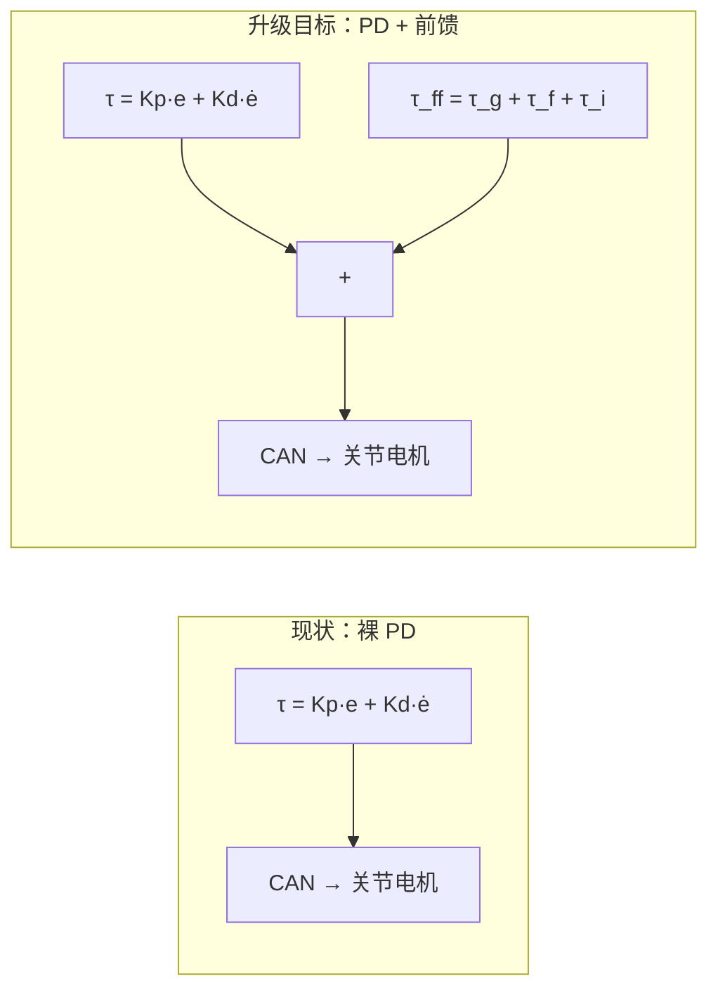

# 前馈补偿与动力学模型：openarmx_xc 现状分析

## 背景

前 10 篇讨论了 MIT PD 参数、FOC 原理、位置规划，用户已理解 Kp(刚度) + Kd(阻尼) 的基本含义。本次延续讨论两个新问题：

1. OPA / openarmx_xc 是否实现了前馈（重力、惯性、离心、摩擦力）？
2. 动力学模型是什么、如何判断其准确性？

---

## Q1：openarmx_xc 是否实现了前馈补偿？

用户原始问题：
> 前馈指的是事前调整，不是事后反馈。比如重力前馈、惯性前馈、离心前馈和摩擦力前馈。这些在 OPA 或者 OPA X 里面有没有做？

### 分析

从 KB 对比文档和技术问题清单中提取的事实：

**当前代码只有裸 PD，没有任何前馈项。**

```text
τ = Kp × e + Kd × ė                    ← 现状：裸 PD
τ = Kp × e + Kd × ė + τ_gravity + τ_friction  ← 目标：PD + 前馈
```

对比三层谱系：

| 层级 | 重力前馈 | 摩擦力前馈 | 惯性/科氏前馈 | 状态 |
|------|---------|-----------|-------------|------|
| **OpenARM 原版** | ✅ 实现 | ✅ 实现 | 🟡 部分 | 原始开源版 |
| **openarmx 购买版** | ❌ 未实现 | ❌ 未实现 | ❌ | KB 明确标注 "无动力学补偿" |
| **openarmx_xc_robot** | ❌ 未实现 | ❌ 未实现 | ❌ | 同上，已验证 |



### 为什么缺失

核心原因在上次笔记 `10` 已铺垫——**URDF 动力学参数未标定**，所有依赖动力学的控制算法自然无法启用。具体落实：

| 缺失项 | KB 对应状态 |
|--------|-----------|
| Pinocchio 重力补偿节点 | 🟡 "待开发"（概览章节明确标注） |
| 摩擦辨识实验 | 🟡 "待执行" |
| URDF inertials.yaml 参数标定 | ❌ 来自 CAD 估算（误差 10-20%） |

### 结论

**openarmx_xc 当前没有任何前馈补偿。** 这是从裸 PD 升级到 PD+前馈的计划中的关键缺失项，也是抖动/重力下垂问题的根因之一。

---

## Q2：动力学模型是什么？如何判断其准确性？

用户原始问题：
> 你怎么能判断它的动力学模型是准确的？动力学模型又是什么？它是否跟机械设计的连杆安装精度、加工精度、电机的稳定性等因素有关？动力学模型到底指的是哪些？具体是什么样的动力学模型？

### 分析

#### 2.1 动力学模型是什么

机器人动力学模型描述**力矩与运动之间的关系**，标准形式：

$$M(q)\ddot{q} + C(q,\dot{q})\dot{q} + g(q) + \tau_f(\dot{q}) = \tau$$

| 项 | 含义 | 物理依赖 |
|----|------|---------|
| $M(q)$ | **惯性矩阵** | 各连杆质量、惯性张量 |
| $C(q,\dot{q})$ | **科氏力/离心力矩阵** | 同上 + 关节角速度 |
| $g(q)$ | **重力向量** | 各连杆质量 + 质心位置 |
| $\tau_f(\dot{q})$ | **摩擦力向量** | 库仑摩擦系数 + 粘滞摩擦系数 |

**前馈计算即基于此：**

$$\tau_{ff} = M(q)\ddot{q}_{des} + C(q,\dot{q})\dot{q}_{des} + g(q) + f_c \cdot \tanh(\omega/\omega_0) + f_v \cdot \omega$$

#### 2.2 动力学模型的物理实体

在 openarmx_xc 中，动力学模型体现在：

- `openarmx_description/config/arm/v10/inertials.yaml` —— 每个 link 的 mass + center of mass + inertia tensor
- 该文件被读入 URDF → 供给 ros2_control / Pinocchio / MuJoCo

每个 link 约 10 个参数（质量 1 + 质心 3 + 惯性张量 6）。七自由度双臂约 14 个 link → ~140 个参数。

#### 2.3 精度受什么影响

| 影响因素 | 影响程度 | 说明 |
|---------|---------|------|
| **加工误差** | high | 实际质量/质心 vs CAD 设计值有偏差 |
| **装配精度** | high | 螺栓紧固力矩、轴承预紧影响质心 |
| **线缆/外皮** | medium | 管线拖链的附加力不建模 |
| **电机稳定性** | low | 电机本身对前馈准度影响小 |
| **关节磨损** | progressive | 摩擦力随使用变化 |

KB 明确标注当前 openarmx_xc URDF 参数是 CAD 估算值，**误差 10-20%**：惯性张量用均匀密度估算（实际铸造/机加工件密度分布不均匀），质心位置用 CAD 装配体近似（实际打螺丝、接线后质心偏移）。

#### 2.4 如何判断是否准确（标定方法）

| 方法 | 测量什么 | 精度 |
|------|---------|------|
| **两点悬挂法** | 每个连杆质心位置 | ±2mm |
| **称重法** | 质量 | ±1g |
| **扭摆法** | 惯性张量 | ±5% |
| **单关节辨识** | 摩擦力矩曲线 | 半定量 |
| **力矩残差分析** | 综合验证 | 定量，最佳 |

### 结论

动力学模型是 $M(q)\ddot{q} + C + g + \tau_f$ 的数学表达式，物理上体现为 URDF 中每个 link 的 mass/inertia/COM 参数。当前 openarmx_xc 的动力学参数来自 CAD 估算（非实测标定），误差 10-20%，这是重力补偿、摩擦补偿等所有前馈功能缺失的根本原因——参数不准，前馈算出来也是错的。

---

## 待办事项

- [ ] 【沟通】确认并对比 OpenARM 原版 / openarmx / xc_robot_2 的前馈存在状态（NotePlan 5月计划 → 机械臂方向）
- [ ] 【沟通】与天津团队确认 URDF 动力学模型（inertials.yaml）准确度及优化方案（NotePlan 5月计划 → 机械臂方向）
- [ ] 【沟通】与团队确认魔改版去掉前馈后表现变差的原因及能否恢复（NotePlan 5月计划 → 机械臂方向）
- [ ] 完成 URDF 动力学参数离线标定（两点悬挂法 + 称重 + 扭摆法）
- [ ] 标定后反写 inertials.yaml → 重新生成 URDF
- [ ] 启用 Pinocchio 重力补偿节点
- [ ] 执行摩擦辨识实验，更新 τ_friction 模型参数
- [ ] 最终升级控制律：τ = Kp·e + Kd·ė + τ_g + τ_f

## 参考

- `06｜全库汇总总览/2-5_openarmx代码问题_运动控制篇.md` §三：URDF 动力学参数失真问题
- `06｜全库汇总总览/2-6_openarmx代码问题_硬件驱动篇.md` §一：控制模式公式升级方案
- `06｜全库汇总总览/3-2_OpenARM原版与xc架构对比.md`：无动力学补偿 vs 摩擦力+重力前馈
- `📌 项目概览 — 祥承 Xc-Robot.md`：Pinocchio 重力补偿节点待开发
- [[10-位置规划与PD参数深析]]
- [[12-PD前馈逻辑标定方案与RobStride参数调研]]（PD+前馈 vs PID、性价比标定方案、三层环、RobStride 参数）
