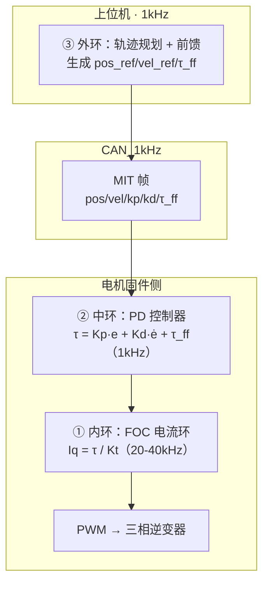

# PD+前馈逻辑、标定方案与 RobStride 参数调研

## 背景

继 [[11-前馈补偿与动力学模型]]（讨论 openarmx_xc 前馈缺失现状 + 动力学模型定义）之后，本次延续讨论四个子话题：
1. PD+前馈 vs PID 的逻辑确认
2. 工业/协作机器人为什么效果好（标定投入差异）
3. 性价比标定方案
4. 三层环嵌套 + FOC 与 Kp/Kd 的关系
5. RobStride 代码库参数调研

---

## Q1：PD+前馈 vs PID 的逻辑确认

用户原始问题：
> 如果我不通过传统的 PID 方式来控制，而是变成 PD 方式，也就是不用积分、改用前馈，而前馈必须依赖于准确的模型和模型的估算，是否是这个意思？

### 分析

理解完全正确。

```text
PID:    τ = Kp·e + Ki·∫e·dt + Kd·ė     ← 靠积分"试错"累积稳态补偿
PD+前馈: τ = Kp·e + Kd·ė + τ_ff(q,dq)  ← 靠模型"算"稳态补偿
```

前馈精度 = 模型精度。模型越准，稳态误差越小，I 项越不需要。

PID 靠积分"犯错"来学稳态补偿，前馈靠"物理模型"直接算出来。

### 结论

PD+前馈的哲学是：**既然知道这个关节需要多少力矩才能对抗重力/惯性/摩擦力，那直接算出来给它，不需要靠 I 项去试错积累。**

---

## Q2：工业/协作机器人为什么效果好

用户原始问题：
> 目前市场上的这些团队（工业机器人、协作机器人、宇树等），他们的关节臂效果比较好，是否是因为经过了精确的测算，所以前馈做得比较精准？

### 分析

是的，差距在标定投入量级，不在算法选型。

| 维度 | 宇树/协作机器人 | XC-Robot（当前） |
|------|---------------|----------------|
| URDF 参数来源 | 实测（三坐标仪+扭摆台） | CAD 估算（误差 10-20%） |
| 摩擦辨识 | 逐关节上台架跑速-力矩曲线 | 未做 |
| 惯量辨识 | 激励轨迹+离线优化 | 未做 |
| 标定投入 | 几十万设备 + 专职工程师 | 无 |

宇树的关节手感好，是因为出厂前力矩常数、摩擦曲线、编码器偏差已写入固件，上层直接调封装 API。协作机器人（UR、JAKA、节卡）同理——每台出厂都做完整动力学辨识。

**XC-Robot 的差距不在算法，在于参数还没标。**

### 结论

PD+前馈本身是成熟路线。当前卡在标定这一步没做完。

---

## Q3：性价比标定方案（不上三坐标仪）

用户原始问题：
> 在我拿到一台 OpenARM X 的魔改版本之后，如何能以一个相对性价比高的方式，来做一些外部标定并获得这些参数？

### 分析


四步法，按性价比排序。

### 第 1 步：摩擦辨识（半天，零成本）← 效果最大

拆掉连杆空载，单关节恒速跑点，记录力矩稳态值：

| 速度 | 力矩 |
|------|------|
| 10°/s | 实测值 |
| 50°/s | 实测值 |
| 100°/s | 实测值 |

拟合 τ_f = fc·tanh(ω/ω₀) + fv·ω，得到库仑摩擦 fc 和粘滞摩擦 fv。对改善低速抖动效果最明显。

### 第 2 步：质量 + 质心标定（1 天，~200 元）

- 家用电子秤称质量
- 两点悬挂法（细绳 + 铅垂线）找质心
- 精度 ±2mm，够重力补偿用

### 第 3 步：惯量缩放修正（2 天工时，零成本）

- 从 SolidWorks 导出惯性张量
- 按 实际质量 ÷ CAD 质量 比例缩放
- 低速场景（100Hz 加速度小）够用

### 第 4 步：力矩残差验证（半天，零成本）

跑一段轨迹，对比实测力矩 vs 前馈力矩：

```text
残差 = |τ_actual − τ_ff|
残差越小 → 模型越准
```

### 结论

摩擦辨识 + 质心标定做完，重力补偿即可达可用水平。惯量可放后面。

---

## Q4：三层环嵌套 + FOC 与 Kp/Kd 的关系

用户原始问题：
> 内环、外环具体是指哪块内容？MIT 通过 CAN 以 1kHz 更新，但你提到关节需要 5-10kHz——这是否指的是 FOC 那种级别的控制？FOC 控制的是电流，它会控制 Kp/Kd 吗？

### 分析



| 层 | 名称 | 频率 | 运行位置 | 输入 | 输出 |
|----|------|------|---------|------|------|
| ① | FOC 电流环 | 20-40 kHz | 驱动器固件 | 目标 Iq | PWM 占空比 |
| ② | PD 中环 | 1 kHz | 驱动器固件 | pos/vel/kp/kd/τ_ff | 目标力矩 |
| ③ | 轨迹规划 | 100-1000 Hz | 上位机 | 终点目标 | 路径点 + 前馈 |

### FOC 不会控制 Kp/Kd

FOC 全程对位置和 Kp/Kd 无感：

```text
MIT 帧 → PD: τ = Kp·e + Kd·ė + τ_ff → Iq_ref = τ / Kt → FOC 执行 → PWM
```

Kp/Kd 是②中环的参数，FOC ①只控制电流，两者完全解耦。5-10 kHz 是 FOC 电流环的天然频率，不是外环的更新需求。

### CAN FD 可提高帧率吗？

不能。CAN FD 提高单帧数据量（8→64 字节），帧率上限受物理层仲裁限制不变。一关节 8 字节够用 → CAN FD 无优势。

### 结论

Kp/Kd 是中环 PD 的参数，和 FOC 无关。FOC 只负责把 PD 算出的力矩转换成电流来执行。

---

## Q5：RobStride 代码库参数调研

### 调研来源

- `Coding References/RobStride/Python_Sample/robstride_dynamics/` — table.py / bus.py / protocol.py
- `Product_Information/产品资料/RS04/RS04使用说明书260428.pdf`
- `灵足时代产品规格介绍 RobStride Product Specification Document 20250626.pdf`

### 关键发现

#### 5.1 RobStride CAN 协议直接实现了 MIT 框架

`write_operation_frame` 发送的 MIT 帧包含 5 个字段：

| CAN 帧字段 | 含义 | RS04 范围 |
|-----------|------|----------|
| position_u16 | 目标位置 | ±4π rad |
| velocity_u16 | 目标速度 | ±15 rad/s |
| kp_u16 | 刚度 | 0–5000 Nm/rad |
| kd_u16 | 阻尼 | 0–100 Nm/rad/s |
| **torque_u16 (extra_data)** | **力矩前馈 τ_ff** | ±120 Nm |

**τ_ff 是 MIT 帧的原生字段** —— RobStride 协议本身就是 PD + 前馈架构。上层的 τ_ff 直接填入此字段即可。

```python
def write_operation_frame(self, motor, position, kp, kd, velocity=0, torque=0):
    # torque → torque_u16 → 作为 extra_data 放入 CAN 帧
    self.transmit(CommunicationType.OPERATION_CONTROL, torque_u16, device_id, data)
```

#### 5.2 电机规格参数（RS04）

| 参数 | 值 |
|------|-----|
| 额定电压 | 48 VDC |
| 空载转速 | 200 rpm ±10% |
| 额定负载 | 40 Nm @50rpm |
| 峰值负载 | 120 Nm |
| 转矩常数 | 2.1 Nm/Arms |
| 减速比 | 9:1 |
| 编码器 | 14bit 单圈绝对值 |
| 重量 | 1420g ±20g |

#### 5.3 没有预置的动力学/摩擦参数

产品资料中**没有**提供出厂标定的摩擦系数、粘滞阻尼、转子惯量等参数。转矩常数（2.1 Nm/Arms）和减速比（9:1）是唯一可直接用于前馈计算的固定参数。

#### 5.4 电机内部参数可读可写

`ParameterType` 定义了大量可读写参数：

- 电流环：CURRENT_KP (0x7010), CURRENT_KI (0x7011), CURRENT_FILTER_GAIN
- 速度环：VELOCITY_KP (0x701F), VELOCITY_KI (0x7020), VELOCITY_FILTER_GAIN
- 位置环：POSITION_KP (0x701E)
- 限幅：TORQUE_LIMIT, CURRENT_LIMIT, VELOCITY_LIMIT

但这些是**驱动器内环的控制参数**，不是机器人动力学的前馈参数。动力学前馈计算（重力/惯性/摩擦）需要在上位机（ROS2/Pinocchio）完成，算出的 τ_ff 通过 MIT 帧传入。

### 结论

RobStride 硬件链路**已经支持 PD + τ_ff 架构**，τ_ff 是 MIT 帧的原生字段。缺的是上层动力学参数（质量/质心/摩擦）的标定。标定后，上层算出的 τ_ff 直接填入 CAN 帧的 torque 字段即可生效。

---

## 待办事项

- [ ] 执行摩擦辨识实验（第 1 步，优先级最高）
- [ ] 质量/质心标定（第 2 步，~200 元）
- [ ] 惯量缩放修正（第 3 步）
- [ ] 力矩残差验证（第 4 步）

## 参考

- [[11-前馈补偿与动力学模型]]（前馈缺失现状 + 动力学模型定义）
- `06｜全库汇总总览/2-6_openarmx代码问题_硬件驱动篇.md` §一：控制模式公式升级
- `Coding References/RobStride/Python_Sample/robstride_dynamics/bus.py` — write_operation_frame
- `Product_Information/产品资料/RS04/RS04使用说明书260428.pdf` — RS04 规格
