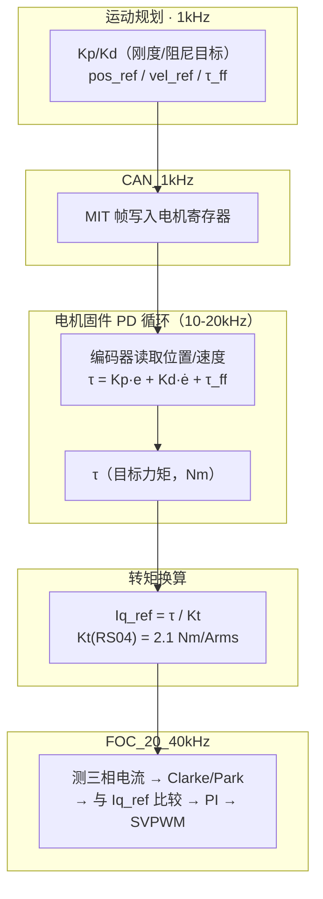

# Kp/Kd 信号链与 FOC 解耦：从刚度系数到电流的完整链路

## 背景

前 12 篇讨论了 PD+前馈、MIT 协议、标定方案。用户已理解：
- Kp = 刚度、Kd = 阻尼、τ_ff = 前馈
- 动力学模型需要标定才能做准前馈
- 三层环：轨迹规划 → PD → FOC

本次整理的核心主题：**Kp/Kd 调整最终影响的是什么东西？和 FOC 的 Iq/Id 是什么关系？**

---

## Q：Kp/Kd 最终影响的是 Iq 还是 Id？和磁场的关系？

用户原始问题：
> Kp、Kd 参数变化，到底调整的是电机里面什么具体的东西，才产生了所谓的阻尼或刚度变化？是调整磁场还是其他东西？因为我理解磁场其实是通过 FOC 里面的 Id 和 Iq 来调的，对吧？

### 分析：完整信号链



### Kp（刚度）的物理链

```text
Kp ↑ → 同一位置偏差 e → τ = Kp·e ↑ → Iq_ref = τ/Kt ↑ → 电流↑ → 磁场↑ → 力↑ → 感觉"刚"
```

- 低速时如果要求刚度大，同一位置偏差的 P 项输出更大
- 更大 → Iq_ref 更大 → 电流更大 → 磁场更强 → 恢复力度更大

### Kd（阻尼）的物理链

```text
Kd ↑ → 同一速度偏差 ė → τ = Kd·ė ↑ → Iq_ref = τ/Kt ↑ → 刹车力矩↑ → 感觉"稳"
```

- 当前速度与目标速度偏差对电流的权重增加
- Iq 增大，阻尼增强 → 刹车更灵敏

### Kp/Kd 不碰 Id

```text
Kp/Kd → affects only Iq_ref
Id_ref 由弱磁策略独立控制（通常 Id_ref = 0 或负值）
```

**Id 是一个内生的规律**，只有在判断需要高速运行的时候，才会产生弱磁电流（负 Id）去削弱电磁场，通过弱磁控制来提升转速上限。

FOC 的 Iq 和 Id 是**可以独立控制**的。

### 运动规划的逻辑

Kp 和 Kd 的调整不是随机参数整定，而是**规划出来的**：

| 阶段 | 要求 | Kp/Kd 策略 |
|------|------|-----------|
| 高速运动 | 稳定性优先 | 增大 Kd（阻尼），响应变慢但系统更稳 |
| 低速/定位 | 响应性优先 | 减小 Kd（阻尼），减小 Kp（防止过冲），响应更快 |

完整的链路闭环：

```text
运动规划（1kHz）
  → 算出 Kp, Kd, pos_ref, vel_ref, τ_ff
  → CAN 帧（8 字节）
  → 电机寄存器更新（1kHz）
  → PD 循环（10-20kHz，固件内独立跑）
  → Iq_ref = τ / Kt（每 50-100μs 算一次）
  → FOC（20-40kHz，电流闭环）
  → PWM → 三相逆变器
```

### 关于频率的澄清（延续 [[12-PD前馈逻辑标定方案与RobStride参数调研]]）

| 频率 | 谁 | 够不够 |
|------|-----|--------|
| 1kHz | CAN 刷新 Kp/Kd/参考值 | ✅ Kp/Kd 是系统特性参数，不需要每帧剧烈变化 |
| 10-20kHz | PD 计算（电机固件内） | ✅ **现在就是高频的** |
| 20-40kHz | FOC 电流环 | ✅ **和 CAN 完全解耦** |

CAN 的 1kHz **只影响参考值刷新率**。PD 和 FOC 在固件内独立跑高频，不受 CAN 限制。

### 结论

Kp/Kd 最终影响的基本都是 **Iq**，完全不碰 Id。

```text
Kp/Kd → τ → Iq_ref → FOC(Iq) → 力矩
Id ← 弱磁策略独立控制 ← 高速需求
```

## 待办事项

- [ ] 验证 RS04 Kt = 2.1 Nm/Arms 是否准确，确认 τ → Iq_ref 的换算关系
- [ ] 测量当前 CAN 总线实际负载率（7 关节 × MIT 帧），评估是否需优化时序

## 参考

- [[12-PD前馈逻辑标定方案与RobStride参数调研]] Q4：三层环嵌套 + FOC 与 Kp/Kd 关系
- [[05-DQ轴与FOC原理]]：Iq/Id 轴独立控制
- [[11-前馈补偿与动力学模型]]：前馈 + PD 公式
- RobStride protocol.py `write_operation_frame`：MIT 帧结构
