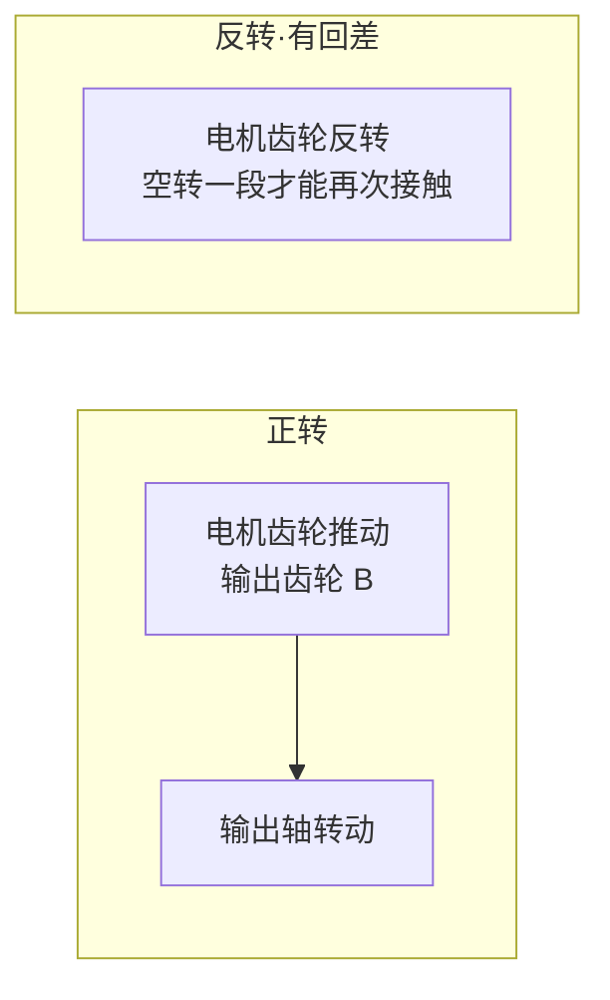
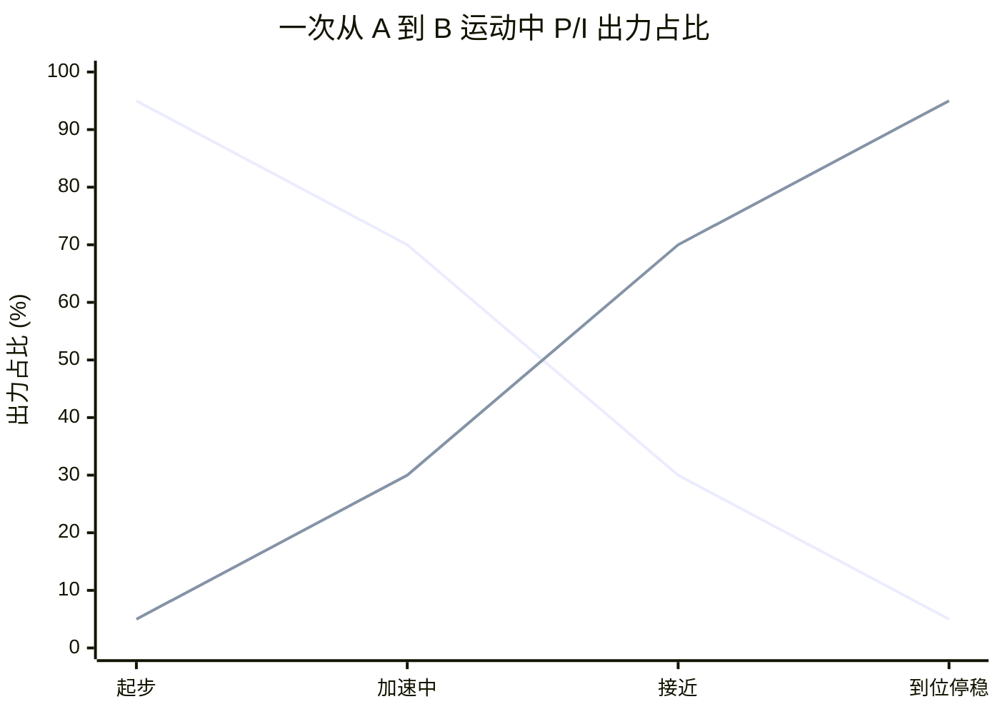

# 编码器精度、回差/背隙、控制频率与 P/I 动态权重

## 背景

续 [[13-KpKd信号链与FOC解耦]]，用户在理解了 Kp/Kd→τ→Iq_ref→FOC 的信号链后，提出三个新方向：
1. RobStride 编码器是单编码器还是双编码器？14bit 与 17-24bit 差距多大？
2. 回差（背隙）是什么意思？行星减速器 vs 谐波减速器的差异？
3. PD 的 10-20kHz 是在哪跑的？和工控机的 1kHz 是什么关系？
4. 运动过程中 P 和 I 的权重如何变化？

---

## 补充纠正：前馈计算的是位置相关的重力

用户原始确认：
> 模型靠前馈算，是否意味着它根据这个模型，能够计算出不同负载下、不同终点目标（也就是机械臂伸出去的那个长度和角度），能计算出对抗重力补偿所需要的一个前馈数值？

### 分析

**完全正确。** 前馈 g(q) 就是根据当前关节角度 q，实时查重力模型算出力矩：

```text
g(q) = g(q₁, q₂, ..., q₇)
```

臂伸得越长（q 变化）→ 力臂变化 → g(q) 实时更新 → τ_ff 随之变化。这就是前馈比 I 项高明的地方——**它提前知道各个位置的重力矩是多少，而不是等掉了再积分慢慢补。**

---

## Q1：RobStride 编码器——硬件双芯片，驱动未启用

用户原始问题：
> 灵足时代的编码器是双编码器还是单编码器？14 bit 编码器与 17-24 bit 的高分辨率编码器相比，是否意味着前者的分辨精度会差很多？

### 从产品手册+BOM 确认

产品规格表标注 **"磁编码器: 2 pcs"**，BOM 表列明 **"AS5047P × 2"**。RS03/RS04 有 `encoder2raw（0x3007）` 寄存器可用于读取输出侧独立位置。但 OpenARMX 驱动代码只读 `encoderRaw`（0x3004），**未启用第二路编码器做独立回读**。

- **硬件**：双 AS5047P 芯片，RS03/RS04 寄存器支持输出侧独立读数
- **驱动**：OpenARMX 只用了 encoder1，当前实际表现为单编码器效果
- **瓶颈**：不在硬件，在驱动层未激活 encoder2

### 14bit vs 17-24bit 量化对比

| 编码器 | 每圈计数 | 输出端等效分辨率（×9减速比） | 末端 500mm 处最小位移 |
|-------|---------|--------------------------|-------------------|
| **14bit**（RS04） | 16,384 | 14bit×9 ≈ 147,456  | 约 0.02° → **0.18mm** |
| 17bit | 131,072 | 17bit×9 ≈ 1,179,648 | 约 0.003° → **0.026mm** |
| 19bit（常见协作臂） | 524,288 | 19bit×9 ≈ 4,718,592 | 约 0.0008° → **0.007mm** |
| 24bit（高端） | 16,777,216 | — | **亚微米级** |

**终端感受**：14bit 对于抓取、码垛等场景够用，但对于需要精细力控（如插拔、装配）会感受到明显的阶梯感。这是 XC-Robot 精度的硬约束之一——不是算法能补的。

### 单编码器的含义

RobStride **只有电机侧磁编码器**，没有输出侧的第二编码器。这意味着齿轮箱（9:1 行星）的回差、形变、扭转全部**不可被编码器感知**。相比之下，高端协作臂通常配备双编码器（电机侧 + 输出侧），可以补偿齿轮箱的弹性形变。

---

## Q2：回差（背隙）——谐波 vs 行星的差距

用户原始问题：
> 谐波减速器的"回差小"具体是什么意思？是指当我转到一个目标点位时，受惯性影响往回倒的那一点点距离吗？

### 回差 ≠ 惯性过冲

**回差（Backlash）** 不是惯性导致的过冲。它是指：**当输入轴改变旋转方向时，输出轴没有立即跟随的那段空行程。**



**过冲（overshoot）** 是惯性停不住冲过头，是动态的。**回差（backlash）** 是齿轮啮合的间隙，是静态的、固定存在的。

### 谐波 vs 行星的回差对比

| 类型 | 回差典型值 | 原理 |
|------|-----------|------|
| **谐波减速器** | < 1 arcmin（< 0.017°）| 柔性齿轮弹性变形啮合，**零间隙** |
| **精密行星减速器** | 5-15 arcmin（0.08-0.25°）| 多级齿轮啮合，必须有间隙才能转动 |
| **普通行星减速器** | 20-30 arcmin | 精度更低 |

**XC-Robot 用的 RobStride RS04 是行星减速器（9:1），回差大约在 5-15 arcmin。** 对末端精度的影响：

```text
500mm 臂长 × tan(0.15°) ≈ 1.3mm
```

这就是为什么行星减速器方案做精密力控（插拔、装配）受限于机械回差——不是算法能解决的硬约束。

### 为什么谐波方案更贵

谐波减速器的原理是用柔性轴承的弹性变形来传递力矩，**齿轮始终处于啮合状态，无间隙**。代价是：价格高（2-5×行星减速器）、效率略低、不能承受大的冲击负载。

---

## Q3：10-20kHz PD 频率是在哪跑的？

用户原始问题：
> PID 是 10-20 kHz。这么高的频率是否是基于板载的、类似于 DCU 的控制器实现的？它是否区别于我们现在常用的工控机计算出的那种 1 kHz 的 PID 参数？

### 分析

**你的理解正确。10-20kHz 的 PD 循环是在电机驱动器固件（MCU/DSP）上跑的，不在工控机上。**

```text
工控机（上位机）：   轨迹规划、前馈计算                    1kHz
    │
    └── CAN 帧（8 字节/关节）
          │
电机驱动器（MCU）：  PD 循环 = 10-20kHz（固件中断定时器）
                    FOC 循环 = 20-40kHz
                    两者都在 MCU 内部，不受 CAN 影响
```

### MIT 原版也是一样的架构

你说得对——MIT 原版（Mini Cheetah）也是通过板载控制器（STM32/DSP）跑高频 PD。它没有用 CAN，而是直接写寄存器或者用 SPI 之类的高速接口。但**结构是一样的**：PD 在电机固件内跑高频，上位机只发参考值。

RobStride 也是**把 MIT 的 PD 循环烧在电机固件里**的——CAN 帧来了更新寄存器，固件自己的定时器以 50μs 周期读寄存器、算 PD、输出 τ。

### 总结频率分配

| 计算内容 | 频率 | 运行位置 | 通信方式 |
|---------|------|---------|---------|
| 轨迹规划 + 前馈计算 | 100-1000 Hz | 工控机 | — |
| Kp/Kd 参考值下发 | 1 kHz | 工控机→CAN | CAN 帧 |
| PD 循环 | **10-20 kHz** | **电机 MCU 固件** | **内部寄存器** |
| FOC 电流环 | 20-40 kHz | 电机 MCU 固件 | 内部寄存器 |

所以你说的"工控机算 1kHz PID"和"板载跑 10-20kHz PD"是**两回事**——前者是轨迹规划，后者是伺服执行。

---

## Q4：运动中 P 和 I 的动态权重

用户原始问题：
> 从 A 点到 B 点的过程中，一开始误差较大，P 占 95%。这里的 P 和 I 分别指的是什么意思？是否存在多次运动积累的问题？

### P 和 I 在一次运动内部的动态过程



| 阶段 | e 大小 | P 项 | I 项 |
|------|--------|------|------|
| 起步（误差大） | 大 | **P 占 ~95%**，主导加速 | I 刚开始积累，占比 ~5% |
| 加速中 | 中 | P 逐渐缩小 | I 稳步增长 |
| 接近目标 | 小 | P 随 e 缩小 | **I 占比升至 ~70%**，持稳 |
| 到位停稳 | ≈0 | P ≈ 0 | **I 保持**，对抗负载力矩 |

### 关键澄清

I 项的补偿**不是攒够了再释放，而是每帧都在出力**。从第一帧开始：

```python
# 每 1ms 都在执行
integral += e × dt      # 第一帧就在累加
τ_i = Ki × integral     # 第一帧就有了出力
τ_total = τ_p + τ_d + τ_i  # 每帧都包含三项
```

不存在跨多次运动积累才能生效的问题——**一次运动的内部就完成了从 P 主导到 I 持稳的过渡。**

### P 和 I 的定义回顾

| 项 | 全称 | 含义 | 公式 |
|----|------|------|------|
| **P** | Proportional（比例） | 与**当前误差大小**成正比 | Kp × e |
| **I** | Integral（积分） | 与**误差的历史累积**成正比 | Ki × ∫e·dt |
| **D** | Derivative（微分） | 与**误差的变化趋势**成正比 | Kd × de/dt |

你的理解是准确的：P 吃当前，I 吃历史，D 看趋势。

---

## 待办事项

- [ ] 评估 14bit 单编码器 + 行星减速器回差对末端精度的影响（量化约束），作为控制算法设计输入的硬边界

## 参考

- `Coding References/RobStride/Product_Information/产品资料/RS04/RS04使用说明书260428.pdf` — 编码器 14bit 单圈绝对值
- 谐波减速器产品规格（对照用）：回差 < 1 arcmin
- [[13-KpKd信号链与FOC解耦]]
