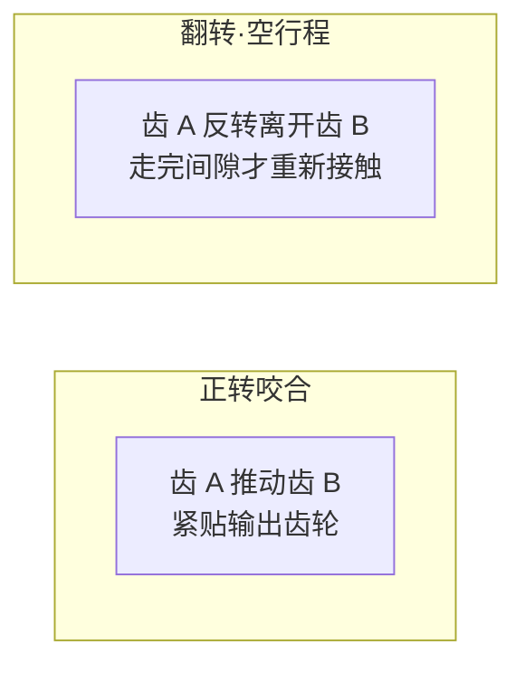
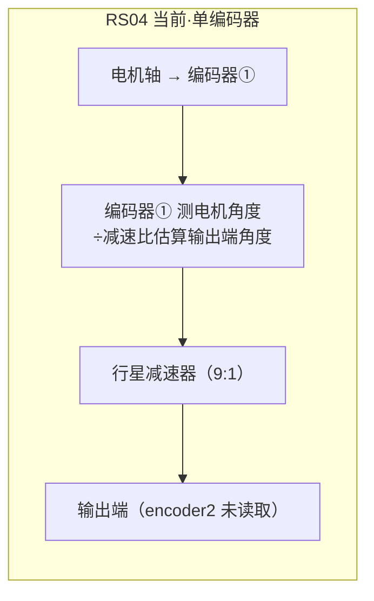
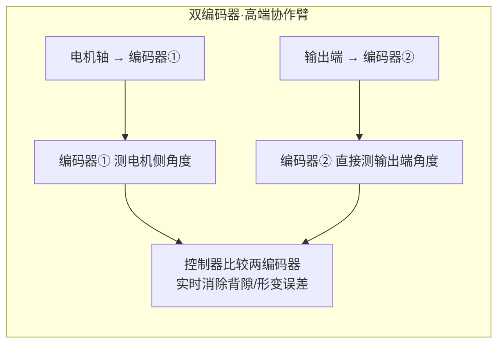

# 齿轮背隙、arcmin、双编码器原理与 PI 权重澄清

## 背景

续 [[14-编码器精度背隙与控制频率PvsI]]，用户纠正术语并追问：
1. Backlash 的空行程具体是什么？
2. arcmin 单位是什么？
3. 宇树双行星方案是否更好？
4. P/I 权重中的 P/I 和 Kp/Ki 的关系？
5. 双编码器的优势和原理
6. 编码器的输入/输出是什么？

---

## Q1：Backlash 空行程——不是"回差"，是"齿轮间隙空行程"

Backlash 指的是：**正反转切换时，主动齿脱离接触、空转一段角度后，才再次推动从动齿的那段空行程。**



像方向盘有一段 "虚位"——打了方向车轮不动，再打一点才动。这段虚位就是 Backlash。

在 XC-Robot 上的表现：机械臂正转到某个角度，然后反转回来——由于背隙的存在，反转时关节会先空转一小段角度（输出端不动），齿轮彻底贴紧后才真的往回转。**这导致终点永远有 ±0.1-0.25° 的不确定性。**

---

## Q2：arcmin——角度的单位

```text
1 arcmin（角分）= 1/60 度（一度分成 60 份）
1 arcdeg（度）= 60 arcmin
1 arcmin = 60 arcsec（角秒）

换算成直观感受：
5 arcmin ≈ 0.083°
15 arcmin ≈ 0.25°

500mm 臂长末端：
0.083° → 0.73mm 误差
0.25° → 2.18mm 误差
```

**谐波减速器**：< 1 arcmin（末端 < 0.15mm）
**精密行星减速器**：5-15 arcmin（末端 0.7-2.2mm）← RS04 在此范围
**普通行星**：20-30 arcmin

---

## Q3：宇树双行星方案——是否更好？

**看场景。双行星的优势在精度和价格的折中，不是全面优于谐波。**

### 宇树双行星 vs 单行星 vs 谐波对比

| 类型 | 背隙 | 成本 | 冲击耐受 | 效率 | 代表 |
|------|------|------|---------|------|------|
| **单行星**（RS04）| 5-15 arcmin | 低 | 好 | 高 | RobStride |
| **双行星**（宇树）| 3-8 arcmin | 中 | 好 | 中 | 宇树 G 系列 |
| **谐波** | <1 arcmin | 高 | 差 | 中 | 协作臂标准配置 |

双行星通过**两级行星轮串联**来分摊间隙，比单行星背隙小，但达不到谐波的零间隙水平。宇树选择双行星是因为他们做四足机器人——谐波承受不了足式落地冲击，纯双行星在精度和可靠性上找到了平衡。

**对 XC-Robot 的参考意义**：双行星确实比单行星好，但代价是成本和重量增加。如果当前抖动问题主要来自控制层（无前馈、无标定），换更贵的减速器不是最优解。

---

## Q4：PI 权重中的 P/I 和 Kp/Ki 的关系——术语澄清

| 符号 | 全称 | 在哪用 | 含义 |
|------|------|-------|------|
| **Kp** | Position Proportional Gain | **MIT PD 公式** | 位置误差的比例系数（刚度） |
| **Kd** | Derivative Gain | **MIT PD 公式** | 速度误差的微分系数（阻尼） |
| **Kp_P**（记 P）| Proportional term of PID | PID 位置环 | 位置误差比例（刚度和 Kp 类似） |
| **Ki**（记 I）| Integral term of PID | PID 积分项 | 误差历史积累，消除静差 |
| **Kd_P**（记 D）| Derivative term of PID | PID 微分项 | 误差变化趋势（和 MIT Kd 含义相同） |

**结论**：MIT 框架中的 Kp = PID 中的 P（比例项），MIT 没有 I 项。MIT 的 Kd = PID 中的 D（微分项），含义完全相同。

```text
MIT PD 公式： τ = Kp · e + Kd · ė + τ_ff
                   ↑       ↑
                  =P      =D  （含义分别对应 PID 的 P 和 D）
PID 公式：     τ = Kp · e + Ki·∫e·dt + Kd·ė
                   ↑    ↑        ↑
                   P    I        D
```

---

## Q5：编码器——输入/输出、单 vs 双、为什么 14bit 不够

### 编码器的本质

```text
输入：轴旋转角度（物理量）
输出：数字信号（A/B 脉冲或绝对值数字值）
```

编码器是一个**角度→数字**的传感器。没有"输入输出"之分，只有**测角精度**的高低。

### 单编码器 vs 双编码器的架构





### 双编码器的核心优势

**单编码器**只能测电机侧，经过减速器后，齿轮背隙、弹性形变、扭转全部不可知——只能"估算"输出端角度。

**双编码器**在输出端再加一个编码器直接测输出角度，控制器可以**闭环补偿**所有齿轮间隙和形变——背隙不再是硬约束，变成了可控误差。

### 为什么 14bit RS04 不一定够用

14bit 单编码器 + 行星 9:1 减速器 + 无输出端编码器：

```text
编码器  齿轮间隙   弹性形变     末端精度
⁝14bit⁝ → × 9:1 → 不可知 → ±0.18mm ~ ±2.2mm
           ↑          ↑
         5-15 arcmin  齿轮扭转
```

这限制了精细操作（插孔、装配）的可达精度。不是算法能补的——因为编码器根本不知道输出端实际到了哪。

---

## Q6：RobStride 代码中的编码器相关函数

RobStride Python 库中与编码器相关的关键代码位置：

| 代码位置 | 功能 | 寄存器 |
|---------|------|--------|
| `protocol.py:65` | `MECHANICAL_OFFSET = (0x2005, "mechOffset")` | 读/写机械零偏（homing offset） |
| `protocol.py:66` | `MEASURED_POSITION = (0x3016, "mechPos")` | 读取当前位置 |
| `protocol.py:79` | `MECHANICAL_POSITION = (0x7019, "mechPos")` | 机械位置（可写） |
| `bus.py:449-454` | `write_operation_frame()` 中应用 `calibration["direction"]` 和 `calibration["homing_offset"]` | 标定应用 |
| `bus.py:484-488` | `read_operation_frame()` 中反向应用 | 读回标定 |
| RS04 手册 0X3004 | `encoderRaw` 寄存器 | 磁编码器原始采样值 |

核心子函数实际上是 `read（motor, MECHANICAL_OFFSET）` 和 `write（motor, MECHANICAL_OFFSET, value）`，用于读取和写入编码器的机械零偏。

## 待办事项

- [ ] 实测 RS04 单关节背隙大小（正反转到目标位置测量偏差），量化当前硬约束
- [ ] 基于背隙量化结果，评估是否需要输出端编码器或切换到双行星方案

## 参考

- RobStride protocol.py `MECHANICAL_OFFSET` / `MEASURED_POSITION`
- RobStride bus.py `write_operation_frame` / `read_operation_frame` 标定应用
- RS04 使用说明书：14bit 单圈绝对值编码器
- [[14-编码器精度背隙与控制频率PvsI]]
