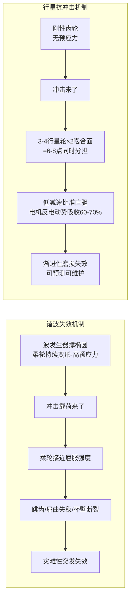

# 行星双编码器方案、谐波 vs 抗冲击分析与行业关节模组调研

## 背景

续 [[15-齿轮背隙双编码器与PI动态权重]]，用户追问三个方向，启用三个并行 Agent 调研后汇总。

---

## Q1：行星减速器 + 双编码器方案——市面上有哪些？

用户原始问题：
> 现在的行星减速器有没有采用双编码器方案的？除了灵足时代之外，像达妙电机这种是否有双编码器的产品？

### 调研结论

**达妙（Damiao）全系 DM-J 行星模组标配双磁编码器。** 型号后缀 `-2EC` 即为双编码器版。此外还有多家国产厂商已有双编码器行星产品。

### 主要厂商及型号

| 厂商 | 代表型号 | 编码器 | 峰值扭矩 | 参考价 |
|------|---------|--------|---------|-------|
| **达妙** Damiao | DM-J4310-2EC | **双磁**编码器 | 12.5 Nm | **¥899** |
| **达妙** | DM-J8009-2EC | **双磁**编码器 | 40 Nm | ¥4751 |
| **灵足** RobStride | RS01/RS04 | **双磁**编码器 | 17-120 Nm | **¥599-1199** |
| **高擎** HighTorque | HTDW-6036 | **双绝对值**编码器 | 36 Nm | 询价 |
| **东茂** Dongmao | A6408 | **双**编码器 | 60 Nm | 询价 |
| **意优** Yiyou | PP 系列 | **双绝对值**编码器 | — | 询价 |

### 双编码器溢价

- 零售端约 ¥100-300（15-30%）
- 批量 OEM 差异更小（约 ¥50-150）

**结论：双编码器已是行星模组的中高端标配，成本增量很小。**

---

## Q2：谐波减速器为什么不能承受落地冲击 + 行星为什么更强

用户原始问题：
> 如果改用行星减速器，是否意味着机械臂的抗冲击力会更强？为什么行星关节模组的抗冲击力会优于谐波？

### 根本原因

**谐波的柔轮（Flexspline）已被波发生器撑到持续弹性变形状态——相当于纸杯已被捏变形，再受力就塌了。**

### 量化对比

| 维度 | 谐波减速器 | 行星减速器 |
|------|-----------|-----------|
| 冲击耐受 | **2-3×** 额定扭矩 | **3-5×** 额定扭矩 |
| 失效模式 | **灾难性突发**：柔轮屈曲/跳齿/断裂 | **渐进性**：齿轮点蚀磨损 |
| 回差 | **<1 arcmin**（零背隙） | 5-15 arcmin（需双编码器补偿） |
| 效率 | 85-90%（轻载可跌至40-50%） | **96-98%** |
| 寿命 | ~7,000-10,000 hrs（满载） | **100,000+ hrs** |
| 成本比（基准） | **1.0×** | **0.3-0.5×** |

### 行业选型趋势（仅双臂/上肢视角）

| 方案 | 精度 | 抗冲击 | 成本 | 代表 |
|------|------|--------|------|------|
| **全身谐波**（协作臂标准）| ✅ 零背隙 | ❌ 差 | 高 | UR、JAKA |
| **上肢谐波 + 其他行星** | ✅ 高（双臂端） | 🟡 中 | 中高 | 智元、魔法原子 |
| **全身行星 + 双编码器** | 🟡 中（可补偿） | ✅ 好 | 低中 | XC-Robot、宇树 G1 |
| **全身行星 + 单编码器**（当前） | ❌ 差 | ✅ 好 | 低 | RS04 方案 |

**特斯拉 Optimus Gen 3 已从谐波全面转向行星（50:1）**，专利明确说明放弃定制谐波方案，优先成本和供应链可靠性。但这是人形全身方案，对轮式双臂机器人来说，上肢才是精度关键区。

---

## Q3：行业公司关节模组调研

### 调研对象

银河通用、逐际动力、智元、魔法原子、宇树、千寻智能、松延动力等。

### 核心发现

| 公司 | 上肢关节 | 减速器供应商 | 编码器 | 关键特征 |
|------|---------|-----------|--------|---------|
| **银河通用** Galbot | **谐波** | 绿的谐波（独家） | 绝对编码器 | 轮式双臂，双臂负载5-50kg |
| **智元** 远征A2 | **谐波+行星混用** | 绿的谐波 + 中大力德 | **自研双编码** | PowerFlow 关节，密度50Nm/kg |
| **逐际动力** CL-1 | **全自研** | 全自研 | 未公开 | 不依赖外采模组 |
| **千寻智能** Moz1 | **全自研** | 前身珞石供应链 | 未公开 | 功率密度比特斯拉高15% |
| **魔法原子** MagicBot | **上肢谐波+下肢行星** | 绿的谐波 + 中大力德 | **双编码器 19bit** | H60关节仅590g，峰值90Nm |
| **宇树** G1/H1 | **谐波+行星混用** | 绿的谐波 + 中大力德 | 双+单编码器 | M107峰值360Nm，密度189Nm/kg |
| **松延动力** 小布米 | **自研+因克斯模组** | 因克斯（集成） | 未公开 | 售价<1万元 |

### 2025-2026 春晚机器人供应链

| 企业 | 节目 | 谐波减速器 | 电机 | 传感器 |
|------|------|-----------|------|--------|
| **银河通用** | 微电影 | **绿的谐波** | 兆威机电、雷赛智能 | 柯力传感、商汤视觉、速腾聚创 |
| **宇树科技** | 武术《武BOT》 | **绿的谐波** | 卧龙电驱、米格电机 | 速腾聚创、奥比中光、汉威 |
| **魔法原子** | 歌曲《智造未来》 | **绿的谐波** | 自研+鸣志电器 | 奥普特3D视觉、汉威电子皮肤 |
| **松延动力** | 小品《奶奶的最爱》 | **因克斯**（集成） | 自研 | 未公开 |

### 关键行业结论

1. **绿的谐波是垄断级供应商** — 春晚四家机器人企业全部使用
2. **上肢谐波 + 行星（其他部位）= 行业常见架构**（人形下肢用行星抗冲击，轮式双臂不需考虑下肢）
3. **双编码器已成标配**
4. 自研趋势分化：逐际动力/千寻走全自研；银河通用/宇树走生态采购；魔法原子走自研模组+外采减速器

### 价格参考

| 产品 | 参考价 |
|------|-------|
| **宇树 G1 EDU** | **~¥9.9 万起** |
| 逐际动力 TRON 1 | ¥6.98 万起 |
| 银河通用 Galbot G1 | ~¥63 万 |
| 宇树 H1 | ~¥65 万 |
| 松延动力 小布米 | **<¥1 万** |

---

## 对 XC-Robot 的启示

当前 RS04 是 **硬件双编码器芯片（2×AS5047P）但驱动未激活的**行星方案。三条可评估的升级路径：

| 路径 | 成本增量 | 效果 |
|------|---------|------|
| ① 保持 RS04 + 标定前馈 + 优化 PD | 零（人工） | 改善抖动，但背隙硬约束不变 |
| **② 换双编码器行星**（达妙/高擎） | **+¥300-4000/关节** | 背隙从硬约束变为可控误差 |
| ③ 换谐波方案（绿的谐波） | **+¥2000-5000/关节** | 零背隙但牺牲抗冲击+寿命 |

路径 ② 可能是性价比最优——双编码器行星能背隙补偿，保留抗冲击能力，成本增量小。

## 参考

- 「达妙 DM-J 系列产品手册」— 全系-2EC 双编码器
- RobStride 产品规格书 — RS04 单编码器 vs 双编码器选型
- 绿的谐波产品手册 — 谐波减速器规格与寿命
- 《特斯拉 Optimus Gen 3 专利》— 全面转向行星减速器
- 2025-2026 春晚机器人供应链公开报道
