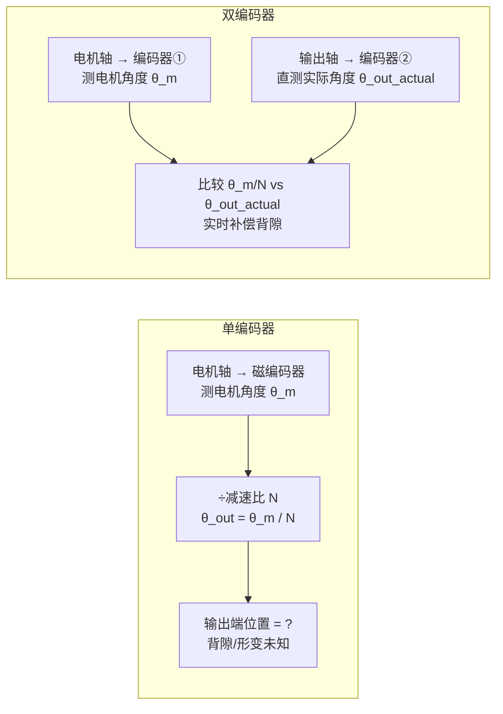
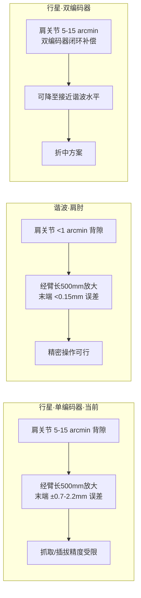

# 编码器类型、双编码器价值、50:1 行星可行性、因克斯/逐际动力调研与 RobStride 代码分析

## 背景

续 [[16-行星双编码器谐波vs冲击与行业调研]]，用户追问编码器原理、50:1 行星方案、因克斯模组参数，并要求检查 RobStride 代码中的编码器实现。

---

## Q1：双编码器的本质——输出端编码器到底在测什么？

用户原始问题：
> 双编码器尤其是关节端或输出端的编码器，其本质是不是通过读取实际输出时的编码效果，来分析背隙（Backlash）和回差造成的误差，进而把这些误差补偿掉？

### 分析

**理解完全正确。** 输出端编码器读的是关节输出轴的**实际角度**，不是电机侧的估算值。



- 单编码器：不知道输出端实际在哪，背隙和弹性形变是盲区
- 双编码器：直接知道输出端实际角度，`θ_m/N` 和 `θ_out_actual` 的差值 = 背隙+形变的实时量化值，可以直接闭环补偿掉

---

## Q2：磁编码器、增量编码器、绝对值编码器的区别

| 类型 | 原理 | 掉电记忆 | 精度 | 成本 |
|------|------|---------|------|------|
| **磁编码器** | 霍尔/MR 感应磁场角度变化 | 可做绝对式 | 中等（10-14bit）| 低 |
| **增量编码器** | 光栅/磁栅输出 A/B 脉冲 | ❌ 不记忆，需归零 | 高（17-24bit） | 中 |
| **绝对值编码器** | 光栅/磁栅带格雷码盘 | ✅ 记忆，上电即知位置 | 高（17-24bit） | 高 |

### 三种在关节模组中的应用

| 方案 | 电机侧 | 输出侧 | 常见于 |
|------|--------|--------|--------|
| **低成本方案**（RS04） | 磁编码器（14bit） | 无 | 低端行星模组 |
| **中端方案**（达妙-2EC） | 磁编码器 | 磁绝对值编码器 | 中端行星模组 |
| **高端方案** | 增量编码器（17-20bit） | 绝对值编码器（17-19bit） | 谐波模组/高端行星 |

---

## Q3：50:1 行星减速器——国内厂商能做到吗？

用户原始问题：
> 特斯拉 Optimus 做到了 50:1 行星减速比。国内像松延动力（因克斯/Inx）有能做到这么大的行星关节模组吗？

### 分析

**能。因克斯的 A13715/A13720 等大型行星模组完全可以做到 50:1。** 但需要注意关键trade-off：

50:1 行星的含义是**行星排里的两级或者三级串联**。特斯拉用 50:1 的背景是：

- 3 级行星（每级约 3.7:1，串联得 50:1）
- 放弃谐波（零背隙但抗冲击差）
- 用**双编码器闭环补偿**行星的背隙（5-15 arcmin）

| 方案 | 减速比 | 回差 | 成本 | 抗冲击 | 代表 |
|------|--------|------|------|--------|------|
| **单级行星** | 3:1 - 10:1 | 5-15 arcmin | 低 | ✅ 好 | RS04 (9:1) |
| **双级行星** | 10:1 - 30:1 | 8-20 arcmin | 中 | ✅ 好 | 宇树双行星 |
| **三级行星** | 30:1 - 100:1 | 12-25 arcmin | 高 | ✅ 好 | **特斯拉 Optimus (50:1)** |
| **谐波** | 30:1 - 160:1 | <1 arcmin | 高 | ❌ 差 | 协作臂标准 |

**因克斯 A10020 行星模组的峰值扭矩 150 Nm，理论上可以定制到 50:1。** 但问题是：多级行星的背隙会叠加，**没有双编码器补偿的话，50:1 行星的末端精度可能还不如 9:1 的**。

---

## Q4：肩肘用谐波、其他用行星——混搭对轮式双臂机器人的意义

用户原始问题：
> 肩部和肘部用谐波减速器，其他部位使用行星减速器。虽然成本可能会增加，但这样设计的目的和好处是什么？

### 分析

对于轮式双臂机器人（XC-Robot 的场景），不需要跑跳，没有落地冲击。选型的核心矛盾是：

```text
双臂末端的定位精度 ← 背隙经过臂长放大 → 关节的减速器选型
```

**谐波在双臂上的核心价值：肩肘的背隙经 500mm 臂长放大后，每 1 arcmin 背隙到末端放大为 ~0.15mm。** 谐波的 <1 arcmin 背隙直接保障末端精度。



### 核心考量（针对轮式双臂机器人）

| 考量 | 说明 |
|------|------|
| **精度传递链** | 肩肘的背隙经臂长放大到末端（500mm × tan(0.15°) ≈ 1.3mm）。谐波零背隙直接保证末端精度 |
| **抗冲击** | 轮式底盘不跑跳，双臂无落地冲击 → 谐波在轮式场景下的抗冲击短板不明显 |
| **成本** | 只换肩肘 2-4 个关节为谐波（单关节 +¥2000-4000），整体成本增量可控 |

### 结论

对轮式双臂机器人：**肩肘用谐波是当前行业最主流的选择，代价小收益大。** 如果继续用行星，双编码器是必要条件——否则背隙直接在末端放大到毫米级，限制精细操作能力。

---

## Q5：因克斯 (INX) 模组与逐际动力编码器调研

### 因克斯 (INX / 南京因克斯智能科技)

- 成立于 2022 年，创始人 祝宗煌（南航），2025 年出货超 10 万套
- 确认供应**松延动力**的关节模组
- 通过经销商**东茂智能** (`joint.dongmao-drive.com`) 销售

### 因克斯行星模组参数

| 型号 | 峰值扭矩 | 重量 | 编码器 | 减速器 |
|------|---------|------|--------|--------|
| A6408（轻量）| 60 Nm | 0.6 kg | **双编码器**（增量+绝对）| 行星 |
| A8112（小型）| 90 Nm | 840 g | **双编码器** | 行星 |
| A10020（扁平）| 150 Nm | 1.35 kg | **双编码器** | 行星 |
| A13715（大扭矩）| 320 Nm | 2.5 kg | **双编码器** | 行星 |
| A13720（超大）| 380 Nm | ~3.5 kg | **双编码器** | 行星 |
| EC-A 谐波系列 | 20-100 Nm | — | **双编码器** | **谐波**（2025 年新发）|

**编码器：全部双编码器**，电机侧（高速增量编码器）+ 输出侧（多圈绝对值编码器）。具体 bit 数未公开。

**价格：约 ¥1,000-5,000/个**（视型号，消费级定位）。

### 松延动力 小布米 Bumi

- 重量 ~12 kg，高度 ~94 cm
- 关节峰值 **50 Nm**
- 关节供应商：**因克斯** + 绿的谐波 + 双环传动
- 主芯片：瑞芯微 RK3588S
- 预估价格：**< ¥10,000**

### 逐际动力 LimX（TRON 1）

- 关节：**全自研**，不用外采模组
- TRON 1：峰值 **60 Nm**，早鸟价 **¥49,800**
- Oli 系列：峰值 150-250 Nm
- 编码器类型：**未公开**
- **关键结论：逐际动力没有公开编码器参数，所有关节自研不对外销售。**

### 因时机器人 vs 因克斯

**两个完全不同的公司，不要混淆。**

| | 因克斯 (INX) | 因时机器人 (Inspiring) |
|---|---|---|
| 成立 | 2022，南京 | 2016，北京 |
| 核心产品 | **旋转关节模组**（行星/谐波）| **微型线性执行器** + **灵巧手** |
| 客户 | 松延动力、加速进化 | 宇树、银河通用、智元 |
| 2025 融资 | ¥2 亿 | ¥1 亿+ |

因时不做旋转关节模组，只做微型丝杆执行器和灵巧手。

---

## Q6：RobStride 代码中编码器分析

### 代码来源

`Coding References/RobStride/` 中的 Python 和 C++ 源码。

### 关键发现

**1. RS04/RS03 是双编码器硬件架构（2×AS5047P），但 OpenARMX 驱动未启用独立回读。**

硬件确认：
- 产品规格表标注 **"磁编码器: 2 pcs"**，BOM 表列明 **"AS5047P × 2"**
- RS03/RS04 有 `encoder2raw（0x3007）` 寄存器可读取输出侧独立位置
- RS00 也有 2 颗芯片但输出侧寄存器未暴露（功能上等同单编码器）

驱动层确认：
- OpenARMX 代码只读 `encoderRaw（0x3004）`，**未读取 `encoder2raw`**
- `mechPos（0x7019）` 来自 `encoderRaw × 减速比 9:1` 的软件估算
- **没有独立的输出端物理编码器读数**，因此无法做背隙闭环补偿

```diff
+硬件：2×AS5047P 芯片（双编码器基础）
-驱动：OpenARMX 只读 encoder1，encoder2 未激活
+结论：硬件有潜力，需改驱动层才能发挥双编码器优势
```

**2. Backlash 补偿代码不存在。**

代码中与"补偿"相关的机制只有：
- `MECHANICAL_OFFSET (0x2005)` — 机械零偏（归零校准用），不是 backlash 补偿
- `homing_offset` + `direction` — 在 bus.py 中用于校准方向和零点，和背隙无关

```python
# bus.py - 只校准方向+零点，不补偿背隙
calibration = {"homing_offset": 0.0, "direction": 1.0}
position = position * calibration["direction"] + calibration["homing_offset"]
```

**3. MIT 帧格式验证**

C++ `RobStride_Motor_MIT_Control` 函数确认 MIT 帧格式：**pos(16bit) + vel(12bit) + kp(12bit) + kd(12bit) + torque_ff(12bit) = 8 字节**，完全是 Mini Cheetah 标准。

### 结论

RS04 是 **双编码器硬件（2×AS5047P）+ 9:1 行星**，但 OpenARMX 驱动未激活 `encoder2raw` 独立回读，`mechPos` 仍为软件估算值。代码中没有 backlash 检测或补偿逻辑。这是 XC-Robot 当前精度受限的硬约束之一——**硬件有潜力，瓶颈在驱动层**。

## 待办事项

- [ ] 实际测量 RS04 的背隙大小（正转到目标→读取 mechPos→反转回目标→再读 mechPos，差值即背隙）
- [ ] 基于代码分析结果，确认 RS04 是否可升级到双编码器版本
- [ ] 根据实测背隙值，评估切换到双编码器方案（达妙/因克斯）的量化收益

## 参考

- RobStride C++ `Robstride01.cpp` — MIT 帧格式验证
- RobStride Python `protocol.py` — `MECHANICAL_OFFSET` / `MEASURED_POSITION`
- RobStride C++ `Robstride.h` — `mechPos` / `encoderRaw` 寄存器定义
- 因克斯产品手册（东茂智能渠道）
- 逐际动力 TRON 1 公开参数
