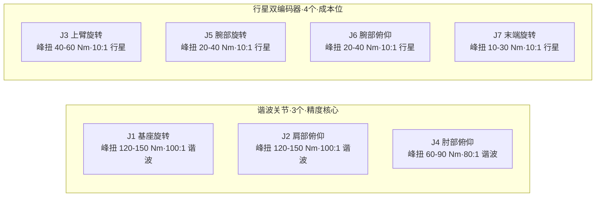

# 肩肘谐波方案：行业调研与 OpenARM 关节分配设计

## 背景

轮式双臂机器人不需要跑跳、无落地冲击。谐波在双臂上的价值来自背隙极小的精度优势。本方案回答：
1. 哪些厂商采用"肩肘谐波 + 其余行星"
2. 7-DOF OpenARM 关节映射与谐波分配
3. 最优方案设计与性价比分析

---

## 一、7-DOF OpenARM 关节映射与精度传递规则

### 标准 S-R-S 构型

| 关节 | 运动 | 背隙放大因子 | 精度影响力 |
|------|------|------------|-----------|
| **J1** | 基座旋转（肩部 yaw） | **× 500mm（全臂长）** | 🔴 最大 |
| **J2** | 肩部俯仰（shoulder pitch） | **× 500mm（全臂长）** | 🔴 最大 |
| J3 | 上臂旋转（shoulder roll） | 不放大（只影响末端姿态） | 🟢 最小 |
| **J4** | 肘部俯仰（elbow pitch） | **× 250mm（前臂长）** | 🟡 中等 |
| J5 | 腕部旋转（wrist roll） | 不放大（直接末端） | 🟢 最小 |
| J6 | 腕部俯仰（wrist pitch） | 不放大（直接末端） | 🟢 最小 |
| J7 | 末端旋转（wrist roll） | 不放大（直接末端） | 🟢 最小 |

精度传递链：

```text
J1/J2 背隙 → 放大 ×500mm → 末端位置误差
J4 背隙 → 放大 ×250mm → 末端位置误差
J3/J5/J6/J7 背隙 → 末端姿态误差（不放大）
```

---

## 二、行业调研：谁在用"谐波肩肘 + 行星其余"？

| 厂商 / 平台 | 谐波关节 | 行星关节 | 编码器 | 定位 |
|------------|----------|----------|--------|------|
| **智元 远征 A2** | **J1, J2, J4**（肩+肘） | J3, J5, J6, J7（腕部） | 双绝对值 | 成本优化 |
| **傅利叶 GR-2** | 全臂 7 DOF 谐波 | 无 | 双编码器（FSA 2.0） | 高性能 |
| **优必选 Walker S** | 全臂 7 DOF 谐波 | 无 | 双编码器 | 工业级精度 |
| **宇树 G1** | 无 | **全臂行星**（二级行星 20.58:1） | 双编码器 | 极致低成本 |
| **特斯拉 Optimus** | 全 14 旋转关节谐波 | 12 传动关节行星 | 双编码器 | 高性能 |

**最常见的成本优化模式 = "J1/J2/J4 谐波 + J3/J5/J6/J7 行星"。** 智元 A2 是该方案的代表，傅利叶/优必选则走全谐波路线（性能优先）。宇树 G1 证明全行星技术可行（售价 ¥9.9 万），但牺牲定位精度。

### 行业成本测算（单臂 7 DOF，量产规模）

| 方案 | 谐波数量 | 行星数量 | 单臂减速器成本 | 双臂成本 |
|------|---------|---------|-------------|----------|
| 全谐波（优必选级） | 7 | 0 | ~¥5,600 | ~¥11,200 |
| **4 谐波 + 3 行星** | 4 | 3 | ~¥4,100 | ~¥8,200 |
| **3 谐波 + 4 行星（推荐）** | **3** | **4** | **~¥3,600** | **~¥7,200** |
| 全行星（宇树级） | 0 | 7 | ~¥2,100 | ~¥4,200 |

---

## 三、OpenARM 架构下的最优方案设计

### 核心原则

- **保持 OpenARM 架构不变**，只换关节模组
- 谐波只给**背隙被臂长放大的关节**（J1/J2/J4）
- 行星保留双编码器，补偿自身背隙
- J3 不走谐波：其背隙误差只影响末端**姿态**（如手腕偏转 0.5°），不影响末端**位置**（坐标偏 1mm）

### 方案总览



### 详细参数推荐

| 关节 | 减速器 | 峰扭 | 减速比 | 推荐供应商 | 理由 |
|------|--------|------|--------|-----------|------|
| **J1** | **谐波** | 120-150 Nm | 100:1 | 绿的谐波 / 达妙 DM-JH | 背隙经全臂长放大最严重 |
| **J2** | **谐波** | 120-150 Nm | 100:1 | 绿的谐波 / 达妙 DM-JH | 同上，双臂前伸主关节 |
| J3 | 行星（双编码器） | 40-60 Nm | 10:1 | 达妙 DM-J / 因克斯 A | 背隙不放大 |
| **J4** | **谐波** | 60-90 Nm | 80:1 | 绿的谐波 / 达妙 DM-JH | 背隙经前臂放大 |
| J5 | 行星（双编码器） | 20-40 Nm | 10:1 | 达妙 DM-J / 灵足 RS | 直接末端，不放大 |
| J6 | 行星（双编码器） | 20-40 Nm | 10:1 | 达妙 DM-J / 灵足 RS | 直接末端，不放大 |
| J7 | 行星（双编码器） | 10-30 Nm | 9:1 | 达妙 DM-J / 灵足 RS | 直接末端，不放大（最小模组） |

### 成本对比（单臂，含电机+减速器+编码器+驱动）

| 方案 | 成本 | vs 当前基线 |
|------|------|------------|
| **当前（全 RS04 单编码器）** | ~¥8,400 | 基线 |
| **推荐（3 谐波 + 4 行星双编码器）** | ~¥13,000 | **+¥4,600** |
| 全谐波（优必选级） | ~¥28,000 | +¥19,600 |
| 全行星双编码器（只升级编码器） | ~¥10,000 | +¥1,600 |

---

## 四、为什么 J3 不走谐波——关键取舍论证

J3（上臂旋转/shoulder roll）和 J1/J2 同属肩部，但物理影响完全不同：

| 对比 | J1/J2（肩部俯仰/偏航） | J3（上臂旋转） |
|------|------------------------|---------------|
| 背隙误差 | 末端**位置**偏 1-2mm | 末端**姿态**偏 ~0.5° |
| 物理原因 | 角度误差 × 臂长（500mm）→ 位置误差 | 旋转误差直接变成腕部角度误差 → 不放大 |
| 对抓取的影响 | 物体抓偏，可能掉落 | 手爪偏转 0.5°，大多数物体仍可抓 |
| 谐波成本增量 | ¥3000（值） | ¥3000（不值） |

对于物料分拣、码垛、转运等 XC-Robot 目标场景，0.5° 腕部旋转偏差不影响核心功能。如果未来要上精密装配/插孔，再给 J3 补谐波——但现在没有必要。

---

## 五、分阶段实施路径

如果一次性换 3 个谐波预算太高：

```text
精度影响: J2 > J1 > J4 >> J3/J5/J6/J7（不需要谐波）
```

| 阶段 | 动作 | 单臂成本增量 | 精度改善 |
|------|------|------------|---------|
| **阶段 1** | 换 **J2** 为谐波（主抓取/前伸关节） | +¥3,000 | 前伸抓取精度从 ±2mm → ±0.3mm |
| **阶段 2** | 加 **J1** 谐波（基座旋转） | +¥3,000 | 左右旋转精度同步提升 |
| **阶段 3** | 加 **J4** 谐波（肘部） | +¥2,500 | 肘部精度补齐 |
| 始终 | J3/J5/J6/J7 保留行星双编码器 | — | — |

### 验证阶段 1 效果再决定是否扩大

阶段 1 做完后，可以做 A/B 对比：左臂用谐波 J2、右臂保持全行星，抓取同一物体，测量末端精度差异。数据说话，决策有据。

---

## 六、实施注意事项

- **结构兼容**：谐波模组和行星模组的安装法兰可能不同，需确认机械接口适配。达妙 DM-JH 谐波系列的安装接口可能与现有 RS04 不同
- **URDF 更新**：换模组后更新 `inertials.yaml`（质量/质心变化），重新跑 Pinocchio 动力学验证
- **控制链路不变**：谐波和行星都支持 CAN MIT 协议（PD + τ_ff），无需改控制代码
- **CAN 总线**：3 谐波 + 4 行星的帧数与全行星相同（7 帧/臂），不增加总线负载
- **J2 优先**：双臂前伸、上下抓取的主要关节，换谐波效果最先感知

---

## 参考

- 绿的谐波产品手册 — 谐波减速器规格
- 达妙 DM-J 系列 — 行星/谐波双编码器模组
- 智元 A2 产品架构公开报道
- [[16-行星双编码器谐波vs冲击与行业调研]]
- [[17-编码器类型双编码器价值与Inx松延调研]]
