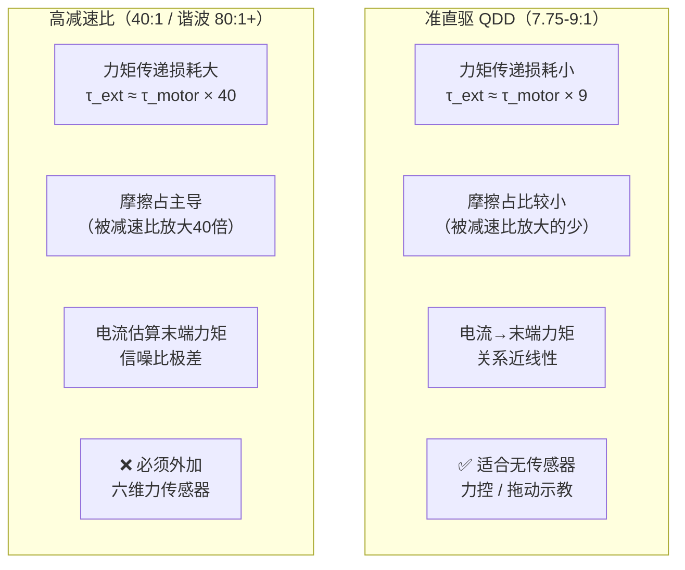
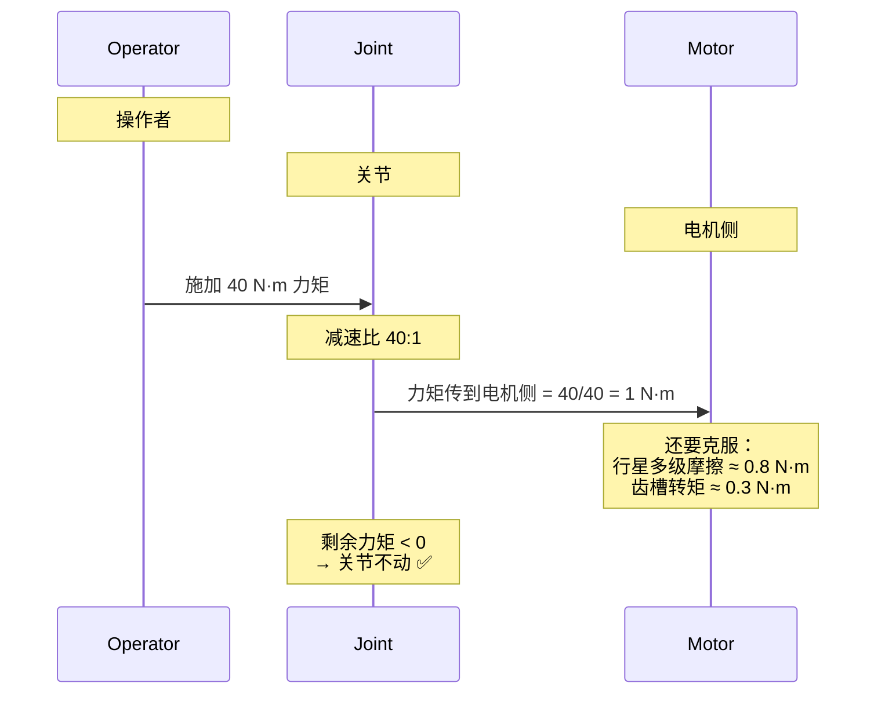

# QDD 力控原理与反向驱动分析

> 解释两个核心概念：① QDD 低减速比方案为什么天生适合力控和拖动示教（基于电流环）；② 不可反向驱动是什么意思，反向驱动的价值是什么。

---

## Q1：QDD 方案的力控和拖动示教是否基于电流环？

### 回答

是的。力控的核心就是基于**电流环的转矩估算**，完整信号链如下：

### 力控信号链

$$
\tau_{em} = K_t \cdot I_q
$$

- $I_q$ — 电机转矩电流（电流环实时采样，mA 级精度）
- $K_t$ — 电机转矩常数（灵足 RS04：2.36 N·m/Arms）
- $\tau_{em}$ — 电磁转矩估算值


**扣除补偿项**：

| 补偿项 | 来源 | 说明 |
|-------|------|------|
| 重力补偿 $\tau_{grav}$ | URDF 实时正解动力学 | 减去臂自重产生的重力矩 |
| 摩擦补偿 $\tau_{fric}$ | Stribeck 模型 | 减去 Coulomb + Viscous 摩擦力矩 |

剩余 $\tau_{ext}$ 就是**外部施加力矩** → 控制器反向输出，让臂"顺着"外力方向运动。

### QDD 方案在力控上的优势



> 🔑 **关键结论**：QDD 方案下，电流环估算末端力的**信噪比高**——摩擦力不占主导，电流 × Kt 能较准确反映真实末端力。高减速比方案摩擦力矩被放大 40 倍以上，电流环估算基本被噪声淹没，力控只能靠外加六维力传感器。

**前提**：必须先做好重力补偿和摩擦辨识。这两项恰恰是 XC-Robot 当前欠缺的。

---

## Q2：不可反向驱动是什么意思？反向驱动的意义

### 不可反向驱动的物理本质

**不可反向驱动（Non-backdrivable）**：你在关节末端用力推，它不动。



**为什么不可反向驱动？**

1. 力矩被减速比**除以**（40:1 → 末端 40 N·m 到电机侧只剩 1 N·m）
2. 多级行星/谐波内部摩擦又吃掉一大半
3. 剩余力矩不足以克服电机的齿槽转矩 → 电机转子不转 → 关节锁死

### 反向驱动的场景价值

| 需要反向驱动的场景 | 为什么需要 | 没有反向驱动怎么办 |
|-------------------|-----------|------------------|
| **拖动示教** | 操作者直接抓住末端拖，靠外力推关节转动 | 只能用示教器逐点编程，或遥操作 |
| **碰撞检测** | 撞到人/物时关节被外力推动，控制器感知 → 急停 | 必须加触觉皮肤/力传感器 |
| **阻抗控制** | 外力 → 关节顺应移动 → 表现像弹簧阻尼 | 无法实现，只能刚性位置控制 |
| **柔顺装配** | 插孔时顺着接触力微调位置 | 要么卡死，要么靠视觉+高精度规划 |
| **人机协作** | 人推臂可以顺势移开 | 撞到人硬碰硬，不安全 |

### 类比理解

```text
QDD（可反向驱动）         高减速比（不可反向驱动）
────────────────────     ────────────────────────
自行车                     千斤顶
你踩踏板 → 轮子转           你摇手柄 → 车升起
你推轮子 → 踏板跟着转       你按车顶 → 手柄不动
双向可逆                    单向不可逆
```

自行车可以蹬它走，也可以推着它让踏板倒转——这就是**可反向驱动**。千斤顶摇手柄它升起来，但按车顶它不会降——这就是**不可反向驱动**。

---

## 两种方案的取舍

| 维度 | QDD 低减速比（XC-Robot） | 高减速比（40:1 / 谐波） |
|-----|------------------------|----------------------|
| 反向驱动 | ✅ 可反向驱动 → 力控/拖动示教天然 | ❌ 不可反向驱动 |
| 力控方式 | ✅ 基于电流环，无需额外传感器 | ❌ 必须外加六维力传感器 |
| 碰撞检测 | ✅ 灵敏 | ❌ 困难 |
| 柔顺控制 | ✅ 阻抗控制自然实现 | ❌ 只能刚性位置控制 |
| 精度 | ❌ 低（5-10mm），需软件补偿 | ✅ 高（±0.1mm） |
| 抖动/平滑度 | ❌ 需要摩擦补偿+重力补偿 | ✅ 高减速比掩盖摩擦 |

> **XC-Robot 选 QDD 是正确的长期路线**——力控和协作是具身智能的核心需求。当前欠缺的重力补偿和摩擦辨识补上之后，这套方案的价值才会真正体现出来。
