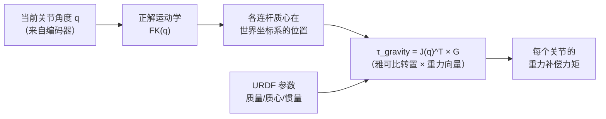
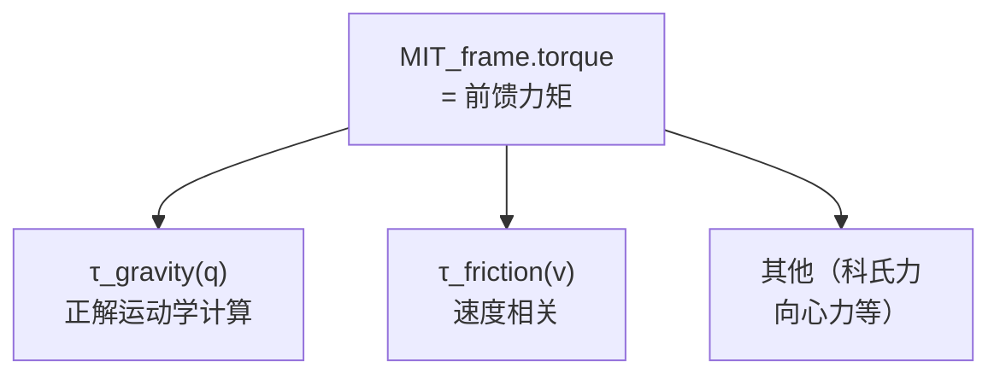

# MIT 五元组与 E（前馈力矩）的动态计算

> 解答：MIT 五元组是哪五个元素？E（Effort/torque）作为前馈力矩，为什么不是固定值，而是每个控制周期根据关节角度和速度动态计算。

---

## MIT 五元组确认

| 参数 | 含义 | 符号 |
|------|------|------|
| **Pos** | 目标位置（rad）| $q_{des}$ |
| **Vel** | 目标速度（rad/s）| $\dot{q}_{des}$ |
| **Kp** | 位置增益 | $K_p$ |
| **Kd** | 速度增益 | $K_d$ |
| **Torque / E** | **前馈力矩**（N·m）| $\tau_{ff}$ |

```cpp
// CAN 帧中打包的五元组结构
struct MIT五元组 {
    float pos;      // 目标位置
    float vel;      // 目标速度
    float kp;       // 位置增益
    float kd;       // 速度增益
    float torque;   // 前馈力矩 ← 这就是 E
};
```

硬件接口写入时的实际代码（`v10_simple_hardware.cpp`）：

```cpp
mit_cmd.pos    = pos_cmd;      // 来自 JTC 的 Pos
mit_cmd.vel    = vel_cmd;      // 来自 JTC 的 Vel
mit_cmd.kp     = kp_values[i];
mit_cmd.kd     = kd_values[i];
mit_cmd.torque = effort_cmd;   // 来自 JTC 的 E（Effort）
```

---

## E（torque）不是固定值——每帧动态计算

### 错误理解

> "E 是一个固定值，提前就能计算出来。"

### 正确理解

**E（torque）在每个 10ms 控制周期都重新计算。** 架构不是"算一次，一直用"——而是：

```text
每 10ms（100Hz 控制周期）：
  ┌─────────────────────────────────────────┐
  │ ① 读当前关节位置 q（从编码器）           │
  │ ② 读当前关节速度 v                      │
  │ ③ 计算当前位姿下的重力矩：              │
  │    τ_gravity = f(q, URDF_参数)          │
  │     ↑ 臂伸平 → 肩关节重力矩最大         │
  │     ↑ 臂垂直 → 肩关节重力矩≈0          │
  │ ④ 计算当前速度下的摩擦力矩：             │
  │    τ_friction = g(v, 摩擦参数)           │
  │ ⑤ 打包前馈力矩：                        │
  │    torque = τ_gravity + τ_friction       │
  │ ⑥ 发 CAN 帧                             │
  └─────────────────────────────────────────┘
```

### 直观举例：肩关节（J1）在不同位姿下的 E

```text
姿态 A：臂水平伸出（q1 ≈ 90°）
  τ_gravity ≈ 12 N·m    ← 需要向上托住整个臂

姿态 B：臂垂直向下（q1 ≈ 0°）
  τ_gravity ≈ 0 N·m     ← 重力线过关节中心

姿态 C：臂斜 45°（q1 ≈ 45°）
  τ_gravity ≈ 8.5 N·m   ← 介于两者之间
```

三个姿态下发的 CAN 帧，torque 字段分别是 **12 N·m、0 N·m、8.5 N·m**——每一帧都不同。

---

## 重力补偿的实时计算过程



公式表达：

$$
\tau_{gravity} = \sum_{i=1}^{n} J_i(q)^T \cdot m_i \cdot g
$$

- $q$ — 当前所有关节角度（变化 → τ_gravity 变化）
- $J_i(q)^T$ — 第 i 个连杆的雅可比转置（取决于臂的位姿）
- $m_i$ — 第 i 个连杆的质量（来自 URDF 标定）
- $g$ — 重力向量

**结论**：即使空载，**臂自身的质量分布在不同的位姿下产生的重力矩就不同**——这是重力补偿必须动态计算的根本原因。

---

## 摩擦补偿 + 完整前馈

摩擦补偿公式：

$$
\tau_{friction} = \tau_{coulomb} \cdot \text{sign}(v) + \tau_{viscous} \cdot v
$$

- $\tau_{coulomb}$ — 库仑摩擦（与速度方向有关，与大小无关）
- $\tau_{viscous}$ — 黏性摩擦系数（与速度成正比）
- $v$ — 当前关节速度（每个周期不同 → 摩擦力矩也不同）

### 完整前馈力矩结构



```cpp
// 伪代码：每 10ms 执行一次
void compute_feedforward() {
    float q[7];          // 从编码器读当前关节角度
    float v[7];          // 从编码器读当前关节速度
    
    float tau_gravity[7] = compute_gravity(q, urdf_params);     // 依赖位姿
    float tau_friction[7] = compute_friction(v, friction_params); // 依赖速度
    
    for (int i = 0; i < 7; i++) {
        mit_frame[i].torque = tau_gravity[i] + tau_friction[i];
        // ↑ 每帧取值不同，取决于当前 q 和 v
    }
}
```

---

## 一句话总结

> **E（torque）在每个控制周期都是重新计算的，不是一个固定值。** 重力补偿 $\tau_{gravity}(q)$ 随臂的位姿实时变化——臂伸平时最大，垂直时≈0。摩擦补偿 $\tau_{friction}(v)$ 随速度变化。两者通过**实时正解运动学 + URDF 参数**在每个周期动态算出，打包进 CAN 帧的 torque 字段发给电机。
