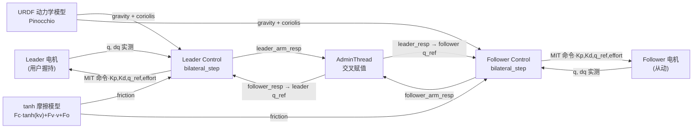

# 达妙 DM-J 系列电机力控能力核查（用户原问 6 问全答）

## 用户原问

用户要求核查达妙 DM-J 系列（DM-J8009P-2EC、DM-J4340-2EC、DM-J4310-2EC）三项核心问题：
1. 是否具备内置力/扭矩传感器（dedicated force/torque sensor）？还是仅靠电流环估算？
2. 高带宽力控能力？带宽多少 Hz？
3. -2EC 后缀含义？双编码器是否含力矩传感器？OpenArm bilateral 用什么实现力反馈？MIT torque 字段是否真有效？灵足 RobStride 与达妙在力控能力上的核心差距？

## 一句话核心结论

**达妙 DM-J 没有专用力/扭矩传感器。所谓"力控"是 QDD 标准路线：用电流环估算扭矩（τ = Kt × Iq），与灵足 RobStride 同一技术路线。两者之间没有结构性力控能力差距 —— 真正的差距在「减速比选择 + 软件栈成熟度 + 调试经验」，不在硬件传感器上。**

## Q1：DM-J 是否有内置力/扭矩传感器？

**结论：❌ 没有。** 力矩反馈来自电流环估算。

### 证据
- `motor.mdx:37-39` 三款电机规格表完整列出所有传感器：「Encoder Bits: 14-bit」「No. of Encoders: 2」「Encoder Type: Magnetic encoder (single-turn)」—— 整个规格表没有任何 "force sensor" / "torque sensor" / "load cell" / "strain gauge" 条目。
- `dm_motor_constants.hpp:85-86` RID 寄存器枚举中只有 `p_m = 80`（电机端位置）和 `xout = 81`（输出端位置）—— 两个都是位置编码器。

## Q2：DM-J 的 "-2EC" 后缀含义？

**结论：✅ "-2EC" = 2 个 Encoder（两个磁编码器：电机轴端 + 输出轴端），都是位置编码器。**

### 证据
- `motor.mdx:38` "No. of Encoders: 2" 三款全部标 2
- `dm_motor_constants.hpp:85-86` RID 寄存器 `p_m=80`（motor-side position）和 `xout=81`（output-side position）

### 双编码器的真正用途
1. `p_m` 给 FOC 换向用（电机轴侧）
2. `xout` 给关节绝对位置用（输出轴侧，避开减速箱背隙）
3. 二者差值可用于估算输出轴变形/扭矩（弹簧形变法），但前提是知道关节刚度，**openarm 代码里没有使用这种估算**

## Q3：MIT 模式的 torque 字段是否真正有效？

**结论：✅ 协议层有效，作为前馈电流命令。✅ 硬件层电流环执行准确度受 Kt 标定精度限制。❌ 不等价于真实力矩闭环。**

### 证据
- `dm_motor_control.hpp:51-57` MITParam 结构体：`kp, kd, q, dq, tau` 五元组完整
- `dm_motor_control.cpp:124-144` `pack_mit_control_data()`：tau 被打包成 12-bit CAN 字段，范围 ±tMax（DM4310 ±10Nm / DM4340 ±28Nm / DM8009 ±54Nm，见 `dm_motor_constants.hpp:97-112`）
- `dm_motor_control.cpp:88-101` 接收侧解析：从 CAN 帧 `data[4:5]` 解出 12-bit `tau_uint`，反量化为物理值返回到 `state_tau_`

### 本质
电机收到 tau 命令 → 转成 i_q 电流命令 → 电流环执行 → 转矩 = Kt × i_q。这是开环估算（无独立力传感器闭合），精度受 Kt 标定、温度漂移、磁通变化影响。

## Q4：OpenArm bilateral 力反馈的实际数据通路？

**结论：✅ 不是用专用力传感器。✅ 不是用双编码器差值估算。✅ 而是「位置耦合 (Kp×Δq) + 动力学模型前馈 (gravity + tanh 摩擦)」的经典 Position-Force 范式。**

### 证据链（关键发现）
- `control.cpp:99/106` `bilateral_step()` 读电机状态时：`{motor.get_position(), motor.get_velocity(), 0}` —— **第三个 torque 字段直接填 0，根本没读电机回传的 state_tau_**
- `control.cpp:155-163` 调 Pinocchio `GetGravity()` + `GetCoriolis()`（URDF 动力学模型算重力和科氏力）
- `control.cpp:166-170` `ComputeFriction()` 用 tanh 摩擦模型：`Fc * tanh(k*v) + Fv*v + Fo`（`bilateral-control.md:38-40` 与 `control.cpp:358-373` 一致）
- `control.cpp:173-175` `effort = gravity[i] + friction[i]` —— effort 项完全来自模型，无任何测量信号参与
- `openarm_bilateral_control.cpp:127-131` AdminThread 每周期把 leader 的实测响应赋值给 follower 的 reference，反之亦然 —— 位置交叉耦合
- 最终推给电机的 MIT 命令 (`control.cpp:190-193`)：`{Kp, Kd, q_ref, dq_ref, effort=gravity+friction}`
  - 用户用力推 leader → leader 实际位置 q 偏离 q_ref → AdminThread 把这个 q 复制成 follower 的 q_ref → follower 偏离原位 → Kp×Δq 在 follower 产生跟随力矩
  - effort 前馈只是用来"消除自重和摩擦"，让用户主观感觉到的力只剩下"交互力"
- `bilateral-control.md:86` 明确要求 ≥500 Hz 控制频率

### 数据流图

## Q5：力控带宽多少 Hz？

**结论：分两层。电机内部电流环带宽 ~1–5 kHz（QDD 通用）；OpenArm 整机有效力反馈带宽 ~50–100 Hz（位置耦合外环限制）。** %%> 所谓力控带宽是什么？具体有什么作用？是否是收到力控参数分析后，能通过控制电流和位置来控制机械臂的反馈力度？ 
 %%
### 证据
- `openarm_bilateral_control.cpp:43 / 73 / 103` 三线程都跑 500 Hz（参数 `hz=500.0`）
- `bilateral-control.md:86` "Bilateral control requires a **high control frequency (500 Hz or higher)**"
- CAN FD 数据率 5 Mbps（`damiao.mdx:24`），单关节命令 ≈64 bits / 13 μs，8 关节 ≈100 μs 不构成瓶颈
- 但力反馈的「闭环带宽」≠ 控制循环频率。位置耦合 + 动力学前馈方案的实际带宽受 Kp/Kd 增益和机械刚度限制，工程经验 50–100 Hz
- 工业级直接力闭环（Franka Panda 1kHz 力闭环 / KUKA LBR）需要专用关节力矩传感器，达妙和灵足都不具备 %%> 所谓工业级力控和我们的电流环力控差别是什么？我们的力控能做到哪些事情，哪些场景？为什么 Kp 和 Kd 能控制力反馈和带宽？50-100 Hz 是否意味着只能以这个频率来反馈回力的感受？
 %%
## Q6：灵足 RobStride 与达妙的力控能力差距

**结论：硬件路线相同（都用电流环估算扭矩），结构性差距很小。真正差距在三处：① 软件生态成熟度；② 部分灵足型号只配单编码器；③ DM-J 部分型号带 cross-roller 轴承提高输出刚性。**

### 证据
- 灵足 RS04 (`灵足时代产品规格介绍.md:309`)：磁编码器 2 pcs，转矩常数 2.1 N·m/Arms
- 灵足 RS00 type1 (`灵足时代产品规格介绍.md:144`)：磁编码器 **1 pc**（仅单编码器，与 RS00 type2 的 2pcs 版本不同）→ **灵足并非全系双编码器**
- 灵足 RobStride manual (`Product_manual_robStride4.md:312`) 寄存器 `0x302d torque_fdb`「转矩反馈值, nm」—— 同样是电流估算
- 灵足 CAN 帧 (`Product_manual_robStride4.md:448`)：MIT 模式与达妙几乎一致 — Byte0~1 角度 / Byte2~3 角速度 / Byte4~5 力矩 / Kp / Kd 五元组
- 灵足驱动器默认电流环参数 (`Product_manual_robStride4.md:312` 区段)：`cur_kp=0.05 / cur_ki=0.05`，偏保守，电流环带宽可能受限 %%> 这是什么意思？会影响什么？
 %%
### 关键提醒
XC-Robot 当前在跑的 OpenArm 魔改版（`openarmx_xc_robot`）J3/J4 用灵足 9:1（可反驱）替换原版达妙 DM4340 40:1（不可反驱），**反驱性反而比 OpenArm 原版肘部更好**（详见 `06｜全库汇总总览/3-2_OpenARM原版与xc架构对比.md`）。

## 五条认知校正表

| 误解 | 真相 |
|------|------|
| "达妙 -2EC 是双编码器，其中一个测力矩" | ❌ 两个都是位置编码器 |
| "OpenArm bilateral 用力传感器实现力反馈" | ❌ 完全是位置耦合 + 模型前馈，无任何力传感 |
| "灵足比达妙力控弱是因为没有力传感器" | ❌ 两家都没有；差距在软件栈 + 配套生态 |
| "切到灵足后丢失了力控能力" | ❌ 力控路线相同；丢失的是 OpenArm 完整软件栈（500Hz 控制频率、tanh 摩擦补偿、gravity_comp、安全机制）—— 这些是软件债，可补回 |
| "DM-J 是工业级力控方案" | ❌ DM-J 是 QDD 估算力控（消费/科研级）。工业级直接力控需 Franka / KUKA LBR 类专用关节力矩传感器 |

## 对 XC-Robot 当前工作的指向

1. **XC-Robot 当前抖动问题不能归咎于"没有力传感器"** —— OpenArm 原版同样没有，靠的是 500Hz + 重力补偿 + tanh 摩擦补偿这套软件栈撑起力控感%%> 500 Hz 应该是 openarm 原版的自研方案？tanh 摩擦补偿它是如何实现的？受哪些因素影响？%%
2. **补回 OpenArm 原版的软件能力**（gravity_comp 单臂 YAML、100→200Hz / 500Hz、摩擦模型辨识）才是关键 —— 这正是 5-25 会话脉络里的进行中任务
3. **灵足驱动器电流环参数 (cur_kp/cur_ki)** 也是潜在调优点，但优先级低于上面三项

## 参考资料

- 达妙 motor 规格表：`~/Obsidian/Coding References/Openarm Something/openarm/website/docs/hardware/specifications/motor.mdx`
- 达妙 datasheet PDF：`~/Obsidian/Coding References/Openarm Something/openarm/website/static/file/hardware/specification/motor/{dm4310,dm4340,dm4340p,dm8009}.pdf`
- OpenArm bilateral 实现：
  - `~/Obsidian/Coding References/Openarm Something/openarm_teleop/src/controller/control.cpp`
  - `~/Obsidian/Coding References/Openarm Something/openarm_teleop/control/openarm_bilateral_control.cpp`
- DM 电机驱动核心：
  - `~/Obsidian/Coding References/Openarm Something/openarm_can/src/openarm/damiao_motor/dm_motor_control.cpp`
  - `~/Obsidian/Coding References/Openarm Something/openarm_can/include/openarm/damiao_motor/dm_motor_constants.hpp`
  - `~/Obsidian/Coding References/Openarm Something/openarm_can/include/openarm/damiao_motor/dm_motor_control.hpp`
  - `~/Obsidian/Coding References/Openarm Something/openarm_can/include/openarm/damiao_motor/dm_motor.hpp`
- bilateral 文档：`~/Obsidian/Coding References/Openarm Something/openarm/website/docs/teleop/leader-follower/bilateral-control.md`
- 灵足规格：`~/Obsidian/kevinob/🔌 祥承电子/03｜技术资产库/02｜技术资产/10｜灵足时代Robstride/灵足时代产品规格介绍.md` + `Product_manual_robStride4.md`
- 项目知识库交叉引用：`~/Obsidian/kevinob/🔌 祥承电子/06｜全库汇总总览/3-2_OpenARM原版与xc架构对比.md`

## 待办事项

- [ ] gravity_comp 单臂 YAML 具体 diff（持续挂起项）
- [ ] update_rate 100→200Hz（零代码改动，优先级最高）
- [ ] 评估灵足驱动器 cur_kp/cur_ki 默认 0.05/0.05 是否需要上调（低优先级）
- [ ] DynamicParamID URDF 标定三阶段流水线落地
