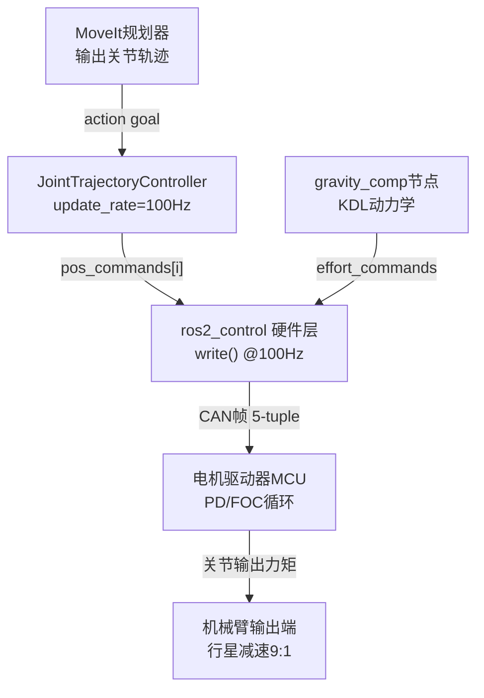
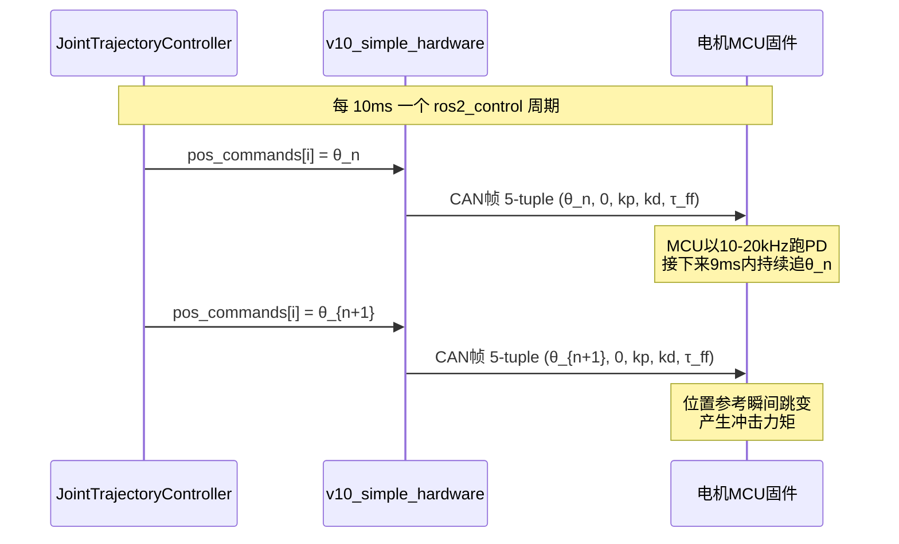
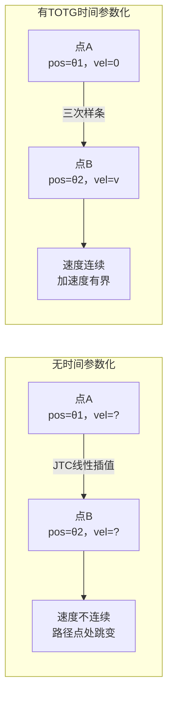
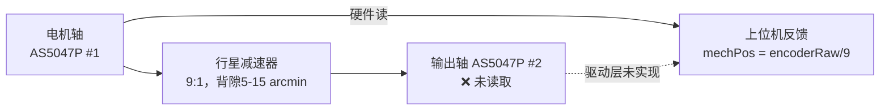
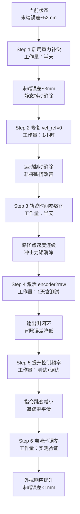

# 关节抖动根源分析总纲

> 本文基于以下资料综合分析：
> - `07｜思考过程/01-电机控制/` 全部 23 篇笔记
> - `openarmx_xc_robot_2` 代码实测（`v10_simple_hardware.cpp` / `openarmx_v10_bimanual_controllers.yaml` / `gravity_comp_node.cpp`）
> - 灵足时代 RobStride 产品规格与 AS5047P 数据手册
> - OpenARM 原版 vs openarmx_xc 架构对比文档

---

## 一、控制链路全景

理解抖动必须先清楚完整的指令链路：



> **节点说明**：MoveIt规划器输出位置点序列；JTC update_rate=100Hz，仅 position 接口；CAN帧为 pos/vel=0/kp/kd/tau_ff 五元组；电机驱动器MCU PD循环 10-20kHz、FOC循环 20-40kHz；机械臂输出端行星减速 9:1，背隙 5-15 arcmin；gravity_comp 节点基于 KDL 动力学计算重力+科里奥利，双臂模式有效，单臂模式无效。

---

## 二、根因分层总表

| 层级 | 根因 | 来源 | 末端影响（500mm） | 是否可软件解决 |
|------|------|------|-----------------|---------------|
| **🔴 L1** | 重力前馈未注入单臂配置 | 代码实证 | **~52mm 静态误差** | ✅ 改 YAML + 启用节点 |
| **🔴 L2** | MIT 5-tuple vel_ref 恒为 0 | 代码实证 | 运动中恒定制动力矩 | ✅ JTC 加 velocity 接口 |
| **🔴 L3** | 控制循环仅 100Hz | 代码实证 | 位置指令 10ms 跳变 | 🟡 有上限，可提升至 200-500Hz |
| **🟡 L4** | 轨迹无速度时间参数化 | 配置实证 | 路径点速度不连续 | ✅ MoveIt TOTG 时间参数化 |
| **🟡 L5** | encoder2raw 未激活 | 驱动实证 | 输出侧位置无闭环 | ⚠️ 待实验验证（固件是否内部融合未确认）|
| **🟡 L6** | 电流环响应过保守 | 规格分析 | 外扰响应慢 | ✅ 调 cur_filt_gain + cur_kp |
| **⚪ L7** | 行星背隙 5-15 arcmin | 硬件固有 | 0.7-2.2mm | 🟡 单向逼近法可消除换向误差 |
| **⚪ L8** | 14bit 编码器分辨率 | 硬件固有 | ~0.18mm | ❌ 硬件约束，软件无法改变 |
| **⚪ L9** | 9:1 减速比噪声放大 | 结构固有 | 乘数效应 | ❌ 准直驱方案的根本代价 |

> **[状态更新 2026-05-25]**：L5 encoder2raw 激活效果降级为「待实验验证」。原因：`22-双编码器固件融合验证实验.md` 实验 SOP 尚未执行，灵足固件是否内部做了双编码器融合补偿未知。仅改一行驱动代码是必要非充分条件。

---

## 三、逐层详细分析

### L1 重力前馈未注入单臂配置（最大误差源）

#### 代码实证

`gravity_comp_node.cpp` 已实现，发布到：
- `/left_forward_effort_controller/commands`
- `/right_forward_effort_controller/commands`

`openarmx_v10_controllers.yaml`（单臂）：未定义 `forward_effort_controller`，上述 topic 无订阅者，重力补偿输出**静默丢弃**。

`openarmx_v10_bimanual_controllers.yaml`（双臂）：定义了 `left/right_forward_effort_controller`，重力补偿在双臂模式**可以工作**。

#### 影响量化

无重力补偿时，纯 PD 在静止保持时的稳态误差约 6°（来自 01-电机控制/01 分析）：

$$\text{末端误差} = 500\text{mm} \times \sin(6°) \approx 52\text{mm}$$

这是所有误差源中最大的，是背隙误差（~2mm）的 **25 倍**。

#### 修复路径

单臂配置中加入 `forward_effort_controller` 定义，并启动 gravity_comp 节点（需要传入正确的 URDF 路径）。预期效果：静态误差从 ~52mm 降至 ~3mm。

---

### L2 MIT 5-tuple 的 vel_ref 恒为 0（运动中制动）

#### 代码实证

`v10_simple_hardware.cpp` 初始化：
```cpp
vel_commands_.resize(total_joints, 0.0);
```

`write()` 发出的 MIT 5-tuple：
```cpp
param.velocity = vel_commands_[i] * direction_multipliers[i];  // = 0
```

`openarmx_v10_controllers.yaml` JTC 配置：
```yaml
command_interfaces:
  - position   # 只有 position，没有 velocity
```

JTC 只更新 `pos_commands_`，从不写 `vel_commands_`，后者在整个运行生命周期中恒为 0。

#### 影响机制

MIT 运控公式为：

$$\tau = K_p \cdot (p_{ref} - p_{actual}) + K_d \cdot (v_{ref} - v_{actual}) + \tau_{ff}$$

当 $v_{ref} = 0$ 时，速度误差项变为：

$$K_d \cdot (0 - v_{actual}) = -K_d \cdot v_{actual}$$

关节在运动中（$v_{actual} \neq 0$），这一项始终产生与运动方向相反的制动力矩。关节越快，制动越强——表现为运动"黏滞"、轨迹跟随滞后，到达路径点后振荡收敛。

#### 修复路径

JTC 配置中加入 velocity command interface：

```yaml
command_interfaces:
  - position
  - velocity
```

并确认 `v10_simple_hardware.cpp` 的 `export_command_interfaces()` 已暴露 velocity 接口（已暴露，无需改硬件层代码）。

---

### L3 控制循环仅 100Hz（10ms 位置跳变）

#### 代码实证

```yaml
controller_manager:
  ros__parameters:
    update_rate: 100  # Hz
```

ros2_control 的 `read()` → 控制器计算 → `write()` 整个周期以 100Hz 运行，即每 **10ms** 发送一次 CAN 帧。

#### 影响机制



电机 MCU 的 PD 循环（10-20kHz）在两个 CAN 帧之间无新指令，会重复执行同一目标位置。当下一帧到达时，目标位置跳变 → PD 响应产生脉冲力矩 → 抖动。

原版 MIT Mini Cheetah 以 **40kHz** 在 MCU 本地运行 PD，CAN 只传高层轨迹参考，不直接传每一拍的 Kp/Kd → 这是 XC-Robot 与原版在控制架构上的根本差距。

#### 理论上限与实际可达

| 频率 | 可行性 | 预期改善 |
|------|-------|---------|
| 100Hz（当前） | 已跑 | 基线 |
| 200Hz | 可能：取决于 CAN 总线负载和 CPU | 抖动减半 |
| 500Hz | 边界：7关节 × 双臂 = 14路CAN，每帧 0.1ms 周期 | 接近 CAN 1Mbps 带宽极限 |
| 1000Hz | 超限：单臂7关节+1ms/帧理论极限 | 不可达 |

---

### L4 轨迹缺速度时间参数化（路径点速度不连续）

#### 配置实证

JTC 配置无 TOTG（Time Optimal Trajectory Generation）或 IPTP 参数：
```yaml
constraints:
  stopped_velocity_tolerance: 0.01
  goal_time: 0.0
```

`moveit_commander.cpp` 使用 `computeCartesianPath`：
```cpp
double fraction = arm->computeCartesianPath(waypoints, 0.01, 0.0, trajectory, true);
```

#### 影响机制

当 MoveIt 未配置时间参数化时，轨迹中相邻路径点之间缺少速度/加速度约束：



速度不连续等效于无穷大加速度脉冲 → 电机电流急剧跳变 → 抖动。

#### 修复路径

在 MoveIt pipeline 中加入时间参数化：

```python
move_group.set_max_velocity_scaling_factor(0.3)
move_group.set_max_acceleration_scaling_factor(0.1)
# 或在 OMPL pipeline 配置中启用 TOTG
```

---

### L5 encoder2raw 未激活（输出侧无闭环）

#### 代码实证（来自 01-电机控制/20 纠正专题）

`v10_simple_hardware.cpp` 的 `read()` 函数：
```cpp
pos_states_[i] = arm_motors[i]->get_position() * direction_multipliers[i];
// get_position() 内部读 encoderRaw（0x3004），折算为 mechPos = encoderRaw ÷ 9
```

RS04 有 `encoder2raw`（0x3007）寄存器，对应输出侧独立 AS5047P 芯片，当前驱动层**从未读取**。

#### 影响机制



> **节点说明**：电机轴 AS5047P #1，寄存器 encoderRaw 0x3004；输出轴 AS5047P #2，寄存器 encoder2raw 0x3007，当前驱动层未读取；上位机反馈为软件估算值 mechPos = encoderRaw/9。

齿轮背隙、弹性形变造成的输出轴实际位置与 `mechPos` 估算值之间的偏差，无法被感知和补偿。

#### 修复路径

激活 encoder2raw 读取（改驱动层约 10 行代码），用输出侧位置替代 `mechPos` 估算值作为 `pos_states_[i]`。预期精度改善：背隙误差 0.7-2.2mm → 接近编码器分辨率极限 ~0.18mm。

---

### L6 电流环响应过保守（外扰补偿慢）

#### 参数来源

灵足 RS04 出厂默认参数（来自寄存器手册）：

| 参数 | 默认值 | 含义 |
|------|--------|------|
| `cur_kp` (0x2012) | 0.05 | 电流环比例增益 |
| `cur_ki` (0x2013) | 0.05 | 电流环积分增益 |
| `cur_filt_gain` (0x2014) | 0.6 | 电流采样滤波 |

`cur_filt_gain=0.6` 表示**强低通滤波**，电流响应被大幅压低，遇到外力扰动时电流环无法快速响应。

#### 影响机制

当机械臂受到外力冲击（关节运动惯性、末端碰触、连杆重力变化），电流环需要快速注入补偿电流。`cur_filt_gain=0.6` 导致电流响应延迟，误差累积后通过位置环激励振荡。

#### 修复路径

在确认电机热负荷可接受的前提下，逐步降低 `cur_filt_gain`（从 0.6 → 0.4 → 0.2），提升电流环带宽。风险：过小的滤波值会放大电流采样噪声，需实测验证。

---

### L7-L9 硬件结构性约束（软件无法根本解决）

| 约束 | 量化 | 影响 | 工程化应对 |
|------|------|------|-----------|
| **背隙 5-15 arcmin**（L7） | ±1.3mm @500mm | 换向时精度下降 | 单向逼近法消除换向误差 |
| **14bit 分辨率**（L8） | ±0.18mm @500mm | 精度天花板 | 接受此约束，不做目标 |
| **9:1 减速比**（L9） | 噪声×9 | QDD 固有 | 提高电流环增益 + 前馈可部分缓解 |

这三层约束是选用灵足 RobStride 行星减速方案的**代价**。采购时即已决策：低成本 → 接受精度上限。L1-L6 解决后，L7 的背隙是剩余最大可改善项。

---

## 四、误差源优先级与改进路线图



> **步骤说明**：Step 1 = 单臂配置加 effort controller + 启动 gravity_comp 节点；Step 2 = JTC 加 velocity 接口；Step 3 = MoveIt TOTG 配置；Step 4 = 驱动层 10 行代码；Step 5 = 200-500Hz；Step 6 = cur_filt_gain 0.6→0.2。

### 工作量与收益汇总

| 步骤 | 工作量 | 预期末端误差 | 风险 |
|------|--------|------------|------|
| 基线（当前） | — | ~52mm | — |
| Step 1 重力补偿 | 半天 | ~3mm | URDF 参数误差 10-20%，需 g_scale 微调 |
| Step 2 vel_ref 修复 | 1小时 | ~2mm | 低 |
| Step 3 时间参数化 | 半天 | ~1.5mm | 速度约束设置不当会变慢 |
| Step 4 encoder2raw | 1天 | ~0.5mm | 需验证 RS04 固件融合状态（见 22 号笔记） |
| Step 5 频率提升 | 2天测试 | ~0.3mm | CAN 总线负载边界需测量 |
| Step 6 电流调参 | 1天实测 | ~0.2mm | 过激可能引入高频噪声 |

---

## 五、代码层事实速查表

| 问题 | 代码位置 | 当前值 | 建议值 |
|------|---------|--------|--------|
| 控制频率 | `openarmx_v10_controllers.yaml:5` | 100Hz | 200-500Hz |
| JTC velocity 接口 | `openarmx_v10_controllers.yaml:45` | 未配置 | 加 velocity |
| vel_commands_ 初始值 | `v10_simple_hardware.cpp:233` | 0.0 | 由 JTC 写入 |
| KP joints 1-4 | `v10_simple_hardware.cpp:167` | 50.0 | 待实测调优 |
| KD joints 1-4 | `v10_simple_hardware.cpp:168` | 2.5 | 待实测调优 |
| 重力补偿节点 | `gravity_comp_node.cpp` | 已实现 | 需单臂配置激活 |
| g_scale | `gravity_comp_node.cpp:46` | 1.05 | 需摩擦辨识后校准 |
| encoder2raw 读取 | `v10_simple_hardware.cpp:476-484` | 未实现 | 需改 `read()` |
| cur_filt_gain | 灵足 RS04 寄存器 0x2014 | 0.6（出厂）| 建议 0.2-0.3 |

---

## 六、待验证实验

| 实验 | 验证内容 | 对应根因 |
|------|---------|---------|
| 单臂启用 gravity_comp，观察静止保持误差变化 | L1 重力前馈效果 | Step 1 |
| JTC 加 velocity 接口后对比轨迹跟随 | L2 vel_ref=0 效果 | Step 2 |
| 读 RS04 `encoder2raw(0x3033 chasu_angle_out)` vs `mechPos(0x7019)`，外力响应对比 | L5 灵足固件是否已做融合 | Step 4 前置 |
| 提升 update_rate 至 200Hz，测量 CAN 总线负载与抖动 | L3 频率上限 | Step 5 |
| 调 cur_filt_gain 0.6→0.4→0.2，观察电流响应与噪声 | L6 电流环调参 | Step 6 |

---

## 七、关联文档

- `01-电机控制/01` — FOC/MIT 三层架构与抖动四层根因（先验分析基础）
- `01-电机控制/09` — MIT PD 参数深析（vel_ref=0 的 Kd 制动机制来源）
- `01-电机控制/14` — 编码器精度与背隙量化（L7/L8 数据来源）
- `01-电机控制/20-22` — 编码器事实纠正与 encoder2raw 寄存器分析
- `01-电机控制/23` — 背隙补偿方法验证与误差源优先级（L1 52mm 量化来源）
- `03-重力补偿前馈/` — Step 1 详细实施方案（待写）
- `04-轨迹规划/` — Step 3/5 规划层改进（待写）
