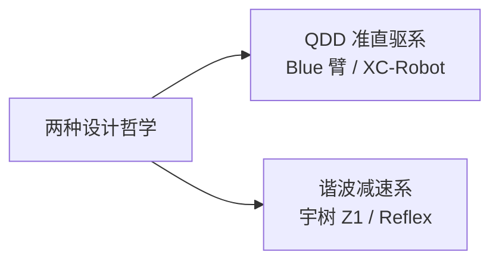

# 三臂横向对比：Blue 臂 / 宇树 Z1 / XC-Robot

> 核心结论：三者属于不同设计哲学，不是同类竞品。

---

## 一、Blue 臂完整硬件参数（论文实测）

来源：QDD-compliant-manipulation-1904.03815（UC Berkeley，Pieter Abbeel 实验室）

| 参数 | Blue 臂 |
|------|---------|
| 自由度 | 7 DOF（3 肩 + 1 肘 + 3 腕） |
| 传动方式 | **7.125:1 同步带** + 差动齿轮（每 2-DOF 模块） |
| 电机 | iFlight 大气隙外转子无刷电机（gimbal 系列）|
| 编码器 | 14-bit 绝对值磁编码器（电机侧，单编码器）|
| 电流传感 | 12-bit（用于扭矩估算）|
| 辅助传感 | 3 轴加速度计 + 温度传感器 |
| 扭矩传感器 | **无** |
| 通信 | RS485 @ 170Hz，1Mbps |
| 电机侧控制 | **20kHz 电流环（FOC）** |
| 重力/科氏补偿 | **有**（PID 层前馈，正常工作）|
| 重复精度 | **3.7 mm**（OptiTrack 实测 133 次）|
| 扭矩迟滞 | 2.6 Nm（最差）/ 0.89 Nm（单模块反驱）|
| 位置控制带宽 | 7.5 Hz |
| 扭矩控制带宽 | **13.8 Hz** |
| 有效载荷 | 2 kg 持续 / 4 kg @70% 占空比 |
| 整臂自重 | 8.7 kg |
| 最大臂展 | 0.7 m（全伸）/ 0.42 m（中程）|
| 热功率 | 20W RMS 正常 / 40W 热限值 |
| 整机成本 | < $5,000（2019年，批量 1500 套估算）|

---

## 二、宇树 Z1 / Z1 Pro 参数

> 基于训练知识，以宇树官网最新规格为准。

| 参数 | 宇树 Z1 |
|------|---------|
| 自由度 | **6 DOF** |
| 传动方式 | **谐波减速器**（各关节 50:1-100:1）|
| 编码器 | **17-18bit 绝对值**，部分关节双编码器（输出侧）|
| 扭矩传感器 | 无（旗舰可选）|
| 通信 | RS485 / 以太网 |
| 控制频率 | **500Hz+** |
| 重力补偿 | **内置，SDK 可调用** |
| 重复精度 | **±0.1 mm**（标称）|
| 有效载荷 | 2 kg（Z1）/ 5 kg（Z1 Pro）|
| 整臂自重 | ~4.5 kg |
| 参考售价 | ~¥20,000-27,000 |

---

## 三、XC-Robot 当前硬件配置

| 参数 | XC-Robot（openarmx_xc_robot_2）|
|------|-------------------------------|
| 自由度 | **7 DOF** |
| 传动方式 | **9:1 行星减速器** |
| 关节模组 | RS04（肩 J1/J2）/ RS03（肘 J3）/ RS00（腕 J4/J5）|
| 编码器 | **14-bit 单编码器**（电机侧，AS5047P）|
| 扭矩传感器 | **无** |
| 通信 | **CAN @ 1000Hz** |
| ROS2 控制频率 | **100Hz**（可改 YAML）|
| 电机侧控制 | 20kHz FOC（灵足驱动器）|
| 重力补偿 | **单臂无效**（代码 bug），双臂有效 |
| 摩擦补偿 | **无** |
| 重复精度 | 当前 ~50mm（含重力误差）/ 理论 5-10mm |
| 成本（单臂模组）| ¥10,000-18,000 |

---

## 四、核心设计哲学差异

| 维度 | QDD 准直驱系 | 谐波减速系 |
|------|------------|----------|
| 代表 | Blue 臂 / XC-Robot | 宇树 Z1 / Reflex |
| 减速比 | 7-9:1（低）| 50-100:1（高）|
| 背驱性 | 好，可电流估算力矩 | 差，需专用力传感器 |
| 精度天花板 | 3-8 mm | ±0.1 mm |
| 场景 | 力控 / VLA 采数 / 人机协作 | 结构化精密任务 |
| 成本 | 低 | 高 |

| 对比维度 | Blue 臂 | 宇树 Z1 | XC-Robot |
|---------|---------|---------|---------|
| 设计哲学 | QDD 力控 + VLA 采数 | 精密位置控制（协作臂）| QDD 力控（目标同 Blue）|
| 传动类型 | 同步带（低摩擦）| 谐波减速器（高精度低背隙）| 行星减速器（介于两者）|
| 精度 | 3.7mm | **±0.1mm** | 5-10mm（软件修好后）|
| 背驱性 | ✅ 好（0.89Nm 反驱）| ❌ 差（谐波自锁）| 🟡 中 |
| 重力补偿 | ✅ 有效 | ✅ 成熟 | ❌ 单臂有 bug |
| 双编码器 | ❌ | ✅ | ❌ |
| 自由度 | 7 | 6 | 7 |
| VLA / 模仿学习 | ✅ 设计初衷 | 🟡 可以，非设计方向 | ✅ 是目标 |
| 成本 | ~$5,000 | ~¥27,000 | ~¥10,000-18,000（模组）|

---

## 五、Reflex 机械臂架构（来自知识库竞品分析）

Reflex **不是** QDD 架构，和 Blue 臂不同类：

| 参数 | Reflex |
|------|--------|
| 结构 | 6 轴协作臂 |
| 传动 | **谐波减速器 + 碳纤维连杆** |
| 重复精度 | **±0.1mm** |
| 末端载荷 | 单臂 >11.3 kg（25 磅）|
| 力控 | 集成力矩传感器 + 触觉传感器 |
| 峰值扭矩 | 180 N·m |

Reflex 的精度和宇树 Z1 相当（±0.1mm），均属于谐波减速器精密协作臂路线，与 XC-Robot / Blue 臂的 QDD 哲学不同。

---

## 六、XC-Robot vs Blue 臂的差距只有两点

1. **传动类型**：Blue 臂用同步带（摩擦更低、背驱性更好）；XC-Robot 用行星减速器（摩擦稍高）。这是硬件固有差距，不换传动无法消除，但差距量级在 1.5-2 倍，不是量级差异。

2. **软件未配好**：重力补偿单臂 bug 未修、控制频率仅 100Hz、无摩擦补偿。这是当前可以解决的部分。

修好软件后，XC-Robot 理论可接近 Blue 臂的 5-8mm 精度水平，对 VLA 任务够用。

---

## 参考来源

- `13｜QDD关节控制论文MD/QDD-compliant-manipulation-1904.03815/` — Blue 臂论文原文
- `06｜全库汇总总览/0-2_竞品Reflex硬件拆解.md` — Reflex 硬件竞品分析
- `06｜全库汇总总览/4-1_供应链与关节模组全景分析.md` — 国内关节模组供应链
- `06｜全库汇总总览/1-3_BOM机械臂与视觉交互.md` — XC-Robot 当前 BOM
