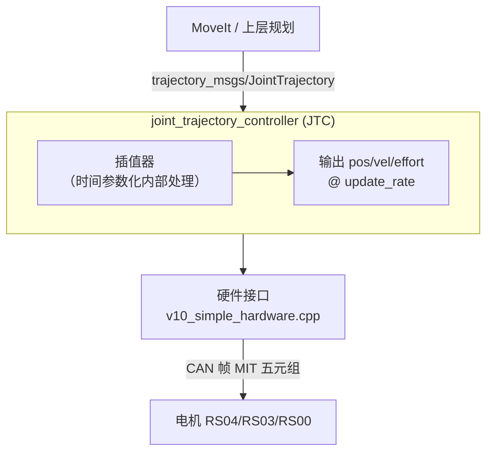
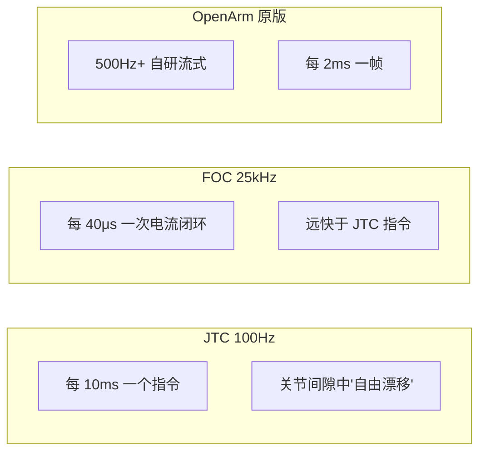

# ROS2 控制架构与轨迹执行工具链

> 解释三个核心概念：① JTC（Joint Trajectory Controller）是什么、是否为 ROS2 自带；② gravity_comp 重力补偿；③ Ruckig 在线轨迹生成库。以及 JTC 100Hz 是否太低、如何解决。

---

## Cheetah 读音

**Cheetah**（MIT Mini Cheetah 机器狗项目）：

- 英文：/ˈtʃiːtə/
- 中文注音：**"起-tah"**（"起"重音，"tah"轻音）
- 中文常音译为"起塔"或"奇塔"
- 全称：MIT Mini Cheetah（MIT 迷你猎豹）
- 注意：ChatterBox Lab 的另一个项目 **Cheetah** 与此不同，不要混淆

---

## Q1：JTC 是 ROS 2 自带的吗？

**是的。** JTC（`joint_trajectory_controller`）是 ROS 2 官方控制包 `ros2_controllers` 中的标准组件，由 ROS 2 核心团队维护。

- GitHub：`ros-controls/ros2_controllers/joint_trajectory_controller/`
- 它不是第三方库，也不是 OpenArmX 自研的
- OpenArmX 和 XC-Robot 都是在 YAML 配置文件中声明"我要用 JTC"，直接开箱即用

```yaml
# openarmx_v10_controllers.yaml
left_joint_trajectory_controller:
  type: joint_trajectory_controller/JointTrajectoryController
  update_rate: 100  # ← 当前 100Hz
```

### 架构位置



---

## Q2：100Hz 是否太低？需要插补适配 FOC 吗？

### 是的，100Hz 对于 QDD 准直驱方案太低



10ms 的指令间隔内，QDD 关节受力（重力、摩擦、外力）持续作用，位置会漂移。下一个指令来的时候是**阶跃纠正**而非连续跟踪——这是抖动的源头之一。

### 不是插补——是换控制器

JTC 的设计是"收到完整轨迹 → 内部插值完成 → 按 update_rate 发命令"。**无法在 JTC 和硬件接口之间再加一层外部插补**。

正确的方向：

| 方案 | 原理 | 效果 | 优先级 |
|-----|------|------|-------|
| **提高 update_rate** | 100Hz → 200Hz | 减小一半漂移量，零代码改动 | 🔴 立即 |
| **JTC velocity 接口修复** | 给 JTC 写 vel_ref，消除 vel_ref=0 的制动力矩 | 消除一项抖动根因 | ⚪ 1-2月 |
| **MoveIt Servo** | 流式笛卡尔/关节指令，500Hz 持续下发 | 替代 JTC 离散模式，官方方案 | ⚪ 评估中 |
| **CRISP 控制器** | 1kHz 扭矩接口控制器，持续跟踪最新指令 | 彻底解决离散轨迹问题 | ⚪ 2-3月 |

---

## Q3：gravity_comp 是重力补偿吗？Ruckig 是什么？

### gravity_comp = 重力补偿

**是的。** gravity_comp 就是重力补偿任务。

**物理含义：**

```text
没有重力补偿：
  τ_cmd = PD(pos_error, vel_error)
          ↑ Kp 既要"托住臂"又要"追目标" → Kp有效调节范围变小

有重力补偿：
  τ_cmd = PD(pos_error, vel_error) + τ_gravity(q)
                                     ↑ 前馈注入
          关节不需要自己"托" → Kp 全部用来追目标
```

**实现方式**：<mark style="background: #FFF3A3A6;">从 URDF 读取各连杆质量和质心 → 实时正解运动学 → 计算当前位姿下每个关节的重力矩 → 通过 MIT 五元组的 `torque` 字段直接注入电机</mark>。%%> 这个数据应该是固定的吧，只有正解运动学计算的重力矩确实是变化的，所以每次 e 是不一样的？%%

**当前状态**：双臂 YAML 有此配置，<mark style="background: #FFB8EBA6;">单臂缺失——已列为立即执行待办</mark>%%> 为什么单臂无，双臂有，双臂用了么？ %%

### Ruckig = 在线轨迹生成库（时间参数化）

Ruckig（读作"ruck-ig"）是一个 **C++ 在线轨迹生成库**，专门解决"给一串路径点，但缺时间信息"的问题。

- GitHub：`pantor/ruckig`
- 官网：https://ruckig.com/

**核心能力：**

```python
# 输入
输入：当前状态 + 目标状态 + 约束
  - 当前位置：45°
  - 当前速度：15°/s
  - 目标位置：90°
  - 目标速度：0°/s
  - 最大速度：30°/s
  - 最大加速度：60°/s²
  - 最大加加速度（Jerk）：120°/s³

输出：在 0~T 时间内，每一时刻的 p(t), v(t), a(t)
```

**加加速度（Jerk）限制**是 Ruckig 相比传统梯形/S 型规划器的关键优势：保证加速度连续变化，没有加速度突变 → 末端更平滑%%> 这种规划是否与关节构型，与 URDF 有关系？。 %%

**在轨迹规划中的位置：**


**XC-Robot 场景价值：**

当前遥操作数据只有位置序列，没有时间轴。直接给 JTC 跑时，JTC 自动插值但不考虑速度/加速度约束 → 产生不平滑轨迹。Ruckig 的作用是**给裸路径加时间参数化**：

```text
裸轨迹（当前）          →   加 Ruckig 后
点1: 45°               点1: 45° @ t=0s
点2: 60°               点2: 60° @ t=0.5s, v=20°/s  
点3: 90°               点3: 90° @ t=1.2s, v=0°/s, a=0
                         ↑ 有速度/加速度约束，加加速度连续
```

---

## 术语总结

| 术语 | 全称 | 是什么 |
|-----|------|-------|
| **JTC** | Joint Trajectory Controller | ROS2 自带关节轨迹控制器，100Hz 离散下发 |
| **gravity_comp** | Gravity Compensation | 重力补偿，前馈注入抵消臂的自重力矩 |
| **Ruckig** | — | C++ 在线轨迹生成库，给裸路径加时间/速度/加速度/Jerk 约束 |
| **Cheetah** | MIT Mini Cheetah | MIT 四足机器人项目，QDD 方案的原始出处 |
