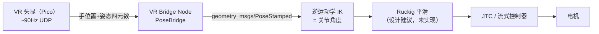
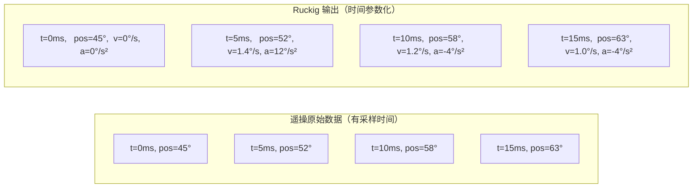
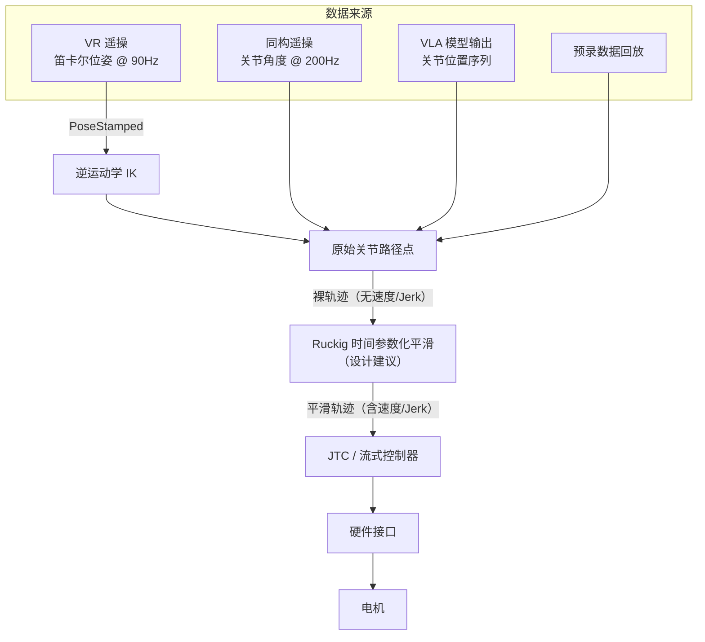

# 遥操数据类型与 Ruckig 平滑管道

> 解答：VR 遥操和同构遥操（Leader-Follower）的数据格式差异、各自是否有时间信息、Ruckig 到底解决了什么问题。

---

## Q1：两种遥操的数据格式和时间信息

### 你的判断是正确的——两种遥操都有时间信息

| 遥操方式 | 数据类型 | 输出格式 | 采样频率 | 时间信息 |
|---------|---------|---------|---------|---------|
| **VR 遥操**（Pico 手柄）| 笛卡尔位姿 | `PoseStamped`（位置+姿态）| ~72-90Hz（头显原生帧率）| ✅ **有**——每条消息携带 `timestamp_ns` |
| **同构遥操**（Leader-Follower）| 关节角度 | 7 个 joint 值 | **200Hz**（YAML 可配）| ✅ **有**——固定 5ms 间隔采样 |

从 OpenArmX 源码可看到两种遥操的时间数据：

```cpp
// VR 遥操：数据包中显式携带时间戳
struct PoseSample {
    double position[3];       // 位置 x,y,z
    double orientation[4];    // 姿态四元数
    double trigger_value;     // 食指扳机值
    double grip_value;        // 握把扳机值
    int64_t timestamp_ns;     // ← 每个数据点都有纳秒级时间戳
};
```

```cpp
// 同构遥操：固定频率采样
int control_rate_hz = this->get_parameter("control_rate_hz").as_int();
// → 默认 200Hz，每 5ms 读一次 leader 关节角度
```

### 200Hz 频率是否可以改变？

**可以。** 它是一个 YAML 参数，不是硬编码。从上面代码可以看到 `declare_parameter<int>("control_rate_hz", 200)`，修改配置文件中的值即可调整。

实际可调范围受以下因素限制：

| 限制因素 | 说明 | 极限估算 |
|---------|------|---------|
| **CAN 总线带宽** | 1Mbps，读 leader 7 关节 + 写 follower 7 关节 | ~500-1000Hz |
| **主动臂状态返回时间** | 每帧需要等待电机返回状态帧 | ~200-500Hz |
| **CPU 负载** | 频率越高，节点计算开销越大 | 取决于硬件 |

> ✅ **结论**：200Hz 是安全的默认值，如需更高频率，改 YAML 即可，不需改代码。

---

## Q2：两种遥操的数据格式差异

### VR 遥操——数据流管道



**特点**：
- 输出是**笛卡尔空间的位姿**，不是关节角度 %%> 位姿和关节角度是什么关系？IK 逆求解是否是要基于稳定可控的 URDF 么？%%
- 需要 **IK 逆解**才能得到关节指令 → 引入额外计算延迟和误差
- 数据有天然抖动（手持 VR 手柄的微颤 + IK 放大）%%> X-这里关键因素  %%
- 时间戳来自头显，ms 级精度

### 同构遥操——数据流管道

#### 当前架构（直通模式，OpenArmX 现有代码）


当前 OpenArmX 的遥操是**直通模式**——读 leader 关节角 → 原样写 follower，中间没有平滑层。

#### 建议改进架构（加 Ruckig 平滑层）


> ⚠️ **注意**：Ruckig 插值层是**设计建议**，不是 OpenArmX 现有代码。当前实现是直通模式。加 Ruckig 的好处是平滑抖动、施加速度上限，代价是增加延迟（几毫秒量级）。

```cpp
// openarmx_teleop_bimanual 核心循环（每 5ms）：
//  ① leader_arm.read_joint_positions()   ← 读主动臂关节角
//  ② follower_arm.write_joint_positions() ← 写到从动臂
```

**特点**：
- 输出是**关节空间的关节角度**，无需 IK，天然对齐 %% > 这个频率是固定的还是可调的？另外，ruckig 仓是你自己添加的么？原来有么？ %%
- 采样频率高（200Hz），数据平滑度好
- **天然有力和力反馈潜力**（双边遥操）
- 人在臂旁边

---

## 同构遥操相比 VR 遥操的优势

| 维度 | VR 遥操 | 同构遥操（Leader-Follower）|
|------|--------|---------------------------|
| **输出数据** | 笛卡尔位姿（x,y,z + quaternion）| **关节角度**（j1~j7）|
| **需不需要 IK** | ✅ 需要逆解 → 额外误差 + 延迟 | ❌ **不需要**，天然对齐 |
| **力反馈** | ❌ 无（VR 手柄无真实力感）| ✅ **天然有**——推 leader 臂时有反驱阻力 |
| **操作直觉** | 需要适应（手柄 → 臂的虚拟映射）| **直感**——操作者推的就是机械臂本身 |
| **采样频率** | ~90Hz（VR 头显限制）| **200Hz+**（CAN 总线限制）|
| **数据平滑度** | 抖动大（手持 + IK 解算放大）| 平滑（机械结构天然滤波）|
| **成本** | 需要 VR 头显设备 | 需要一对机械臂 |
| **远程遥操** | ✅ 可以异地操作 | ❌ 人必须在臂旁边 |

---

## Q3：既然有时间信息，为什么还需要 Ruckig？

### 关键认知
> **有"时间" ≠ 有"时间参数化"**



### Ruckig 做的三件事

| Ruckig 的工作 | 为什么需要 |
|--------------|-----------|
| **① 施加速度/加速度/Jerk 上限** | 原始操作可能超出机器人物理极限（比如操作者手速比电机能跑的快）|
| **② 平滑噪声和抖动** | 人手或 VR 手柄有微颤（尤其是 VR，手持自然抖动 1-3mm），直接回放会导致关节抖动 |
| **③ 允许变速播放** | 录的时候慢，回放时想加速或自适应重规划 |

**用大白话说**：

> 遥操原始数据像手机录的视频——有帧率（时间信息），但每帧之间可能有手抖、有突然的跳动。Ruckig 的作用不是加时间，而是像视频后期防抖+限速：保证每帧之间的运动是平滑的，且不超过机器人的物理极限。
>
> 如果没有 Ruckig，就直接让 JTC 去执行这些原始点——JTC 只做位置插值，不管你速度是否超限、加速度是否突变。结果就是机械臂跟着操作者的手一起抖。

---

## Ruckig 是 OpenArmX 自带的吗？

**不是。** Ruckig 插值层是设计建议，OpenArmX 现有代码里没有。

### 当前实现（直通模式）

```text
主动臂编码器 → teleop_bimanual_node → 从动臂电机
                 ↑ 200Hz 直通，无中间平滑层
```

### 建议改进（加 Ruckig）

```text
主动臂编码器 → teleop_bimanual_node → Ruckig（平滑）→ 从动臂电机
                                          ↑ 这是设计建议
```

**直通模式的好处**：延迟最小（Leader 动 → Follower 跟着动，几乎实时）。

**直通模式的坏处**：
- Leader 的抖动直接传到 Follower
- 无法对轨迹做速度/加速度约束
- 录下来回放时无法调速

**加 Ruckig 的代价**：增加几毫秒延迟（Ruckig 计算时间微秒级，主要是管道增加一跳）。

---

## 完整数据管道（总结）


