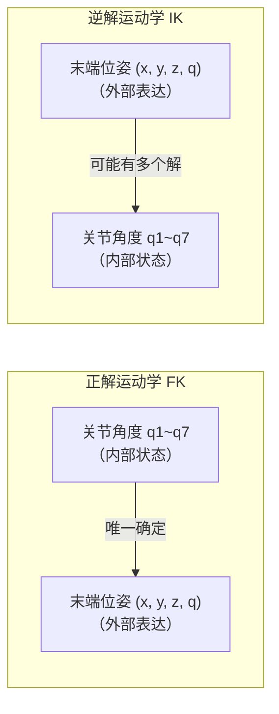
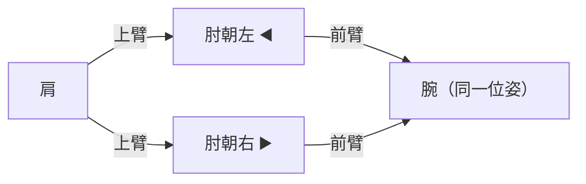
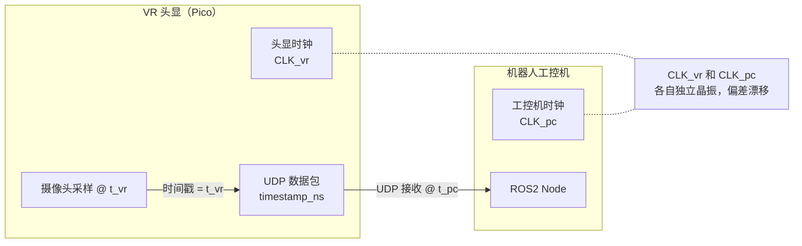

# VR 遥操精度与 IK 求解基础

> 解答：VR 追踪的标定精度、四元数与位姿的概念、位姿与关节角度的关系（IK 逆解）、IK 对 URDF 的依赖。

---

## Q1：VR 追踪的标定准确度

**感觉是对的——VR 追踪确实不太准，误差随距离和环境变化。**

### 不同 VR/追踪系统的精度水平

| VR 系统 | 定位原理 | 位置精度 | 姿态精度 | 适用场景 |
|---------|---------|---------|---------|---------|
| **Pico / HTC Vive（Inside-out）** | 头显摄像头视觉 SLAM | **~1-3 cm** 漂移 | **~1-2°** | 游戏、粗定位遥操 |
| **HTC Vive（Outside-in）** | 激光基站三角测量 | **~1-2 mm** | **~0.1°** | 工业级 VR |
| **OptiTrack / Vicon（动捕）** | 多红外相机 triangulation | **< 0.1 mm** | **~0.01°** | 科研精密动捕 |

XC-Robot 用的 Pico 是 **Inside-out** 方案（头显自追踪，无外部基站），精度约 **1-3 cm** 级。<mark style="background: #BBFABBA6;">经过 IK 逆解映射到关节角度后误差被臂长放大，末端精度进一步下降。</mark>

> **结论**：VR 遥操适合粗定位（"把臂移到大致位置抓取"），不适合精密操作。

---

## Q2：位置、姿态、位姿、四元数

### 位姿 = 位置 + 姿态

| 概念 | 含义 | 表示方法 | 类比 |
|------|------|---------|------|
| **位置** | 在三维空间中的坐标 | $(x, y, z)$ | 这个点在空间的哪里 |
| **姿态** | 物体朝哪个方向 | 四元数 / 欧拉角 / 旋转矩阵 | 正着、歪着还是倒着 |
| **位姿** | 位置 + 姿态，完整描述刚体在空间中的状态 | `(x,y,z)` + 四元数 | 在哪 + 朝哪 |

**直观例子——一个水杯放在桌子上：**

```text
位置：杯底中心在 (0.3m, 0.2m, 0.1m)
姿态：杯口朝上（不歪不斜）
位姿：= (0.3, 0.2, 0.1) + "杯口朝上"
```

### 什么是四元数？

四元数是一种**描述三维旋转/姿态的数学工具**，用 4 个数字表示。

#### 为什么不用欧拉角（俯仰/偏航/翻滚）？

欧拉角有**万向锁（Gimbal Lock）**问题——某些角度下两个旋转轴会重合，丢失一个自由度。四元数没有这个问题，且插值平滑。

#### 四元数的结构

```text
四元数：q = w + xi + yj + zk

也可以写成：q = [w, x, y, z]

解释：
  w —— 旋转的"多少"（标量部分）
  x, y, z —— 旋转轴的方向（向量部分）
```

**直观理解：**

```text
想象一个刚体绕某个轴旋转：
  ① 轴的方向：用单位向量 (x, y, z) 表示"绕哪个轴转"
  ② 旋转角度：用 w 表示"转了多少度"

四元数本质上 = {旋转轴方向, 转了多少度}
```

#### 例子：三个不同姿态的四元数

```text
姿态 A：杯口朝上（不旋转）
  q = [1, 0, 0, 0]

姿态 B：杯口朝前（绕 Y 轴转 90°）
  q = [0.707, 0, 0.707, 0]

姿态 C：杯口朝右倒下（绕 Z 轴转 90°）
  q = [0.707, 0, 0, 0.707]
```

#### VR 遥操消息中的实际结构

```cpp
struct PoseSample {
    double position[3];       // 位置：x, y, z（单位：米）
    double orientation[4];    // 姿态四元数：w, x, y, z
    int64_t timestamp_ns;     // 时间戳
};

// 例子：手柄在 (0.5, 0.3, 0.2) 处，正朝前
// position    = {0.5, 0.3, 0.2}
// orientation = {0.707, 0, 0.707, 0}
```
%%> 时间戳，这里的时间戳是什么样的时间戳？是否准确？
 %%

## Q3：位姿与关节角度的关系——IK 求解

### 正向运动学（FK）vs 逆向运动学（IK）



| 概念 | 方向 | 输入 → 输出 | 解的唯一性 |
|------|------|-------------|-----------|
| **FK 正解** | 关节 → 末端 | q1~q7 → 位姿 | **唯一**（给定 7 个角度，末端位姿是确定的）|
| **IK 逆解** | 末端 → 关节 | 位姿 → q1~q7 | **不唯一**（同一位姿可能有多个关节角度组合）|

**逆解不唯一的例子——够同一个点，肘可以朝左也可以朝右：**



两个不同的关节角度组合，末端在同一个位姿。

### IK 是否要基于稳定可控的 URDF？

**是。URDF 的几何参数（连杆长度、关节位置）直接影响 IK 结果的准确性。**

```text
IK 求解需要：
  ① 末端目标位姿 (x, y, z, q)     ← 来自 VR 手柄
  ② 连杆长度（来自 URDF）          ← 必须准确
  ③ 关节限位（来自 URDF）          ← 必须准确
  ④ 质量/惯量（用于重力补偿）       ← IK 本身不需要
```

**URDF 参数不准的影响：** %%> X- 所以这里就能看出来。所以这里就看出来，这个偏差本质还是跟 URDF 关系比较大。我们之前用的是 CAD 模拟的，但是 CAD 模拟存在了很大的问题，就是没有用连杆质心，去两点法去检测的方式去测的话，就会存在很大的问题。%%

| URDF 参数偏差 | 对 IK 的影响 | 原因 |
|--------------|-------------|------|
| **连杆长度偏差 1 cm** | 关节角度偏差 **可达 5-10°** | 臂长放大效应 |
| **关节零点偏移 2°** | 末端精度偏差 **2-3 cm** | 零点误差直接传递 |
| **连杆质量/质心偏差** | IK 本身不受影响，但**重力补偿会不准** | IK 只算几何，动力学才用质量 |

> IK 算出来的关节角度理论上能让末端到达目标位姿——**前提是 URDF 的几何参数（连杆长度、关节位置）是准的**。XC-Robot 当前 URDF 来自 CAD 估算，未做实测标定，这是已知问题。%%> 重要的是要学会如何进行实测标定。
 %%
### 是否可以直接通过位姿计算出关节角度？

**可以。IK 就是做这件事的。** 给 IK 求解器输入末端位姿，输出 7 个关节角度。

但有两个实际限制：

```text
限制 1：多解问题
  同一位姿 → 多个关节角度解。
  IK 求解器需要加约束条件（如"选最接近当前姿势的解"）。

限制 2：奇异点
  某些位姿下关节达到极限，IK 无解或解不稳定。
  如臂完全伸直时，肘关节对末端失去调节能力 → 速度无穷大。
```

### VR 遥操 + IK 的完整精度链

```text
VR 手柄位姿 (x,y,z, q)    
误差：VR Inside-out 追踪 ~1-3 cm
      ↓
逆运动学 IK（基于 URDF）
误差：URDF 参数不准 → 额外误差（臂长放大）
      ↓
关节角度 q1~q7
误差：被臂长放大
      ↓
JTC / Ruckig → 电机执行
末端精度：可能 5-10 cm 甚至更差
```

---

## Q4：VR 数据包的时间戳是否准确？
%%> X- 所以这里就能看到我们之前担心的问题，就是 VR 数据包的时间戳就是没有用的。因为时间戳是从 VR 头显发出的，但是我工控机接收的时候跟它的头显之间并没有同步机制，所以并没有办法真正的实现同步。而我原来考虑时间戳最大的价值是在于做时序，是为了给轨迹提供时序信息方便优化，并且可以通过规划结合时序信息来，有序的，有需要的地方进行加减速度的平滑的处理。但是现在这种方式是做不了的，所以这是这个问题，另外一点就是，就是本身还有那个没有那个 NTP 或者 PTR 这种，另外一个就是 UDP 本身那个传输抖动也会造成误差的影响，所以实际情况下是不用这个时间戳，或者直接用工控机本身的接收到的那个时间戳作为它的信息加载到里面去，ROS 里面好像是有这么一个工具的。%%

### 三层不一致问题

#### 第一层：时钟不同源（最大问题）

VR 头显（Pico）和机器人工控机是两台独立设备，各有自己的时钟晶振，**没有同步机制**。



| 问题 | 说明 |
|------|------|
| **绝对时间不匹配** | 头显里是 T+1000s，工控机里可能是 T+0s |
| **时钟漂移** | 两个晶振频率有微小差异（ppm 级），长时间运行偏差累积 |
| **没有 NTP/PTP** | VR 头显不支持网络时间同步协议 |

所以 `PoseSample.timestamp_ns` 这个值，在工控机上解读时**不知道它对应的是哪个时钟域的哪个绝对时间**。

#### 第二层：UDP 传输抖动

VR 数据走 UDP（无连接、无重传），每个包的网络传输时间不固定：

```text
发送端               网络             接收端
t=0ms   包A ────────────────────── t=1ms     ← 正常延迟 1ms
t=5ms   包B ────────────────────── t=7ms     ← 网络抖动，延迟 2ms
t=10ms  包C ──────── 丢包 ──────── t=12ms    ← 丢包跳过
t=15ms  包D ────────────────────── t=16ms    ← 正常
```

包内的时间戳记录的是"发送时刻"，但接收时刻是不确定的。

#### 第三层：ROS2 节点处理的不确定性

```text
UDP 包到达网卡
    ↓ 中断处理 + 内核协议栈（几十 μs ~ 几 ms）
用户态程序 recv()
    ↓ ROS2 回调排队（取决于其他节点的 CPU 占用）
ROS2 回调执行
    ↓
发布 PoseStamped 消息
```

### 实际影响

#### 实时遥操：时间戳基本没用

实时控制时，逻辑是"拿到最新一帧就立即下发"，不依赖时间戳做排队或同步：

```cpp
// 实际运行逻辑（简化）
while (running) {
    recv(udp_socket, &pose_sample);    // 阻塞等 UDP 包
    // 不检查 timestamp_ns ← 时间戳在此场景下不使用
    publish_pose(pose_sample);          // 立刻发下去
}
```

所以实时遥操时时间戳问题不致命——以"收到就发"为准。

#### 录播回放：时间戳不可靠

录制 VR 操作数据后回放时会遇到问题：

```text
录的时候：
  包A 发出时间 t_vr=1000ms（头显时钟）→ 收到时间 t_pc=????ms（工控机时钟）

回放的时候按哪个时间轴放？
  — 用头显时间？但头显时钟和工控机时钟有未知偏移
  — 用收到时间？但 UDP 抖动导致帧间隔不均匀
  — 两种方式都无法准确还原操作时的真实时间轴
```

### 实际工程中的应对方式

| 场景 | 策略 | 说明 |
|------|------|------|
| **实时遥操** | **忽略时间戳**，以"收到即发"为准 | 最新一帧覆盖上一帧，不依赖时间 |
| **录播回放** | **用工控机本地收到的时间**，丢弃头显自带时间戳 | ROS2 的 `header.stamp` 在接收到时重新赋值 |
| **双机同步**（极少数高速精密场景）| 加 GPS PPS 或 PTP 硬件同步时钟 | XC-Robot 当前不需要 |

### 为什么同构遥操没有这个问题

<mark style="background: #BBFABBA6;">同构遥操的主动臂和从动臂在**同一台工控机上、同一个 CAN 总线、同一个时钟域**，不存在时钟不同源、网络抖动、接收延迟的问题——这是它相比 VR 遥操在可靠性上的又一个优势。</mark>
