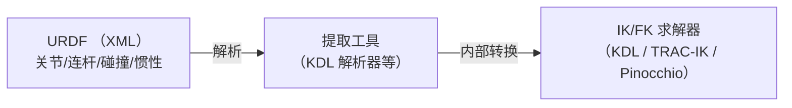
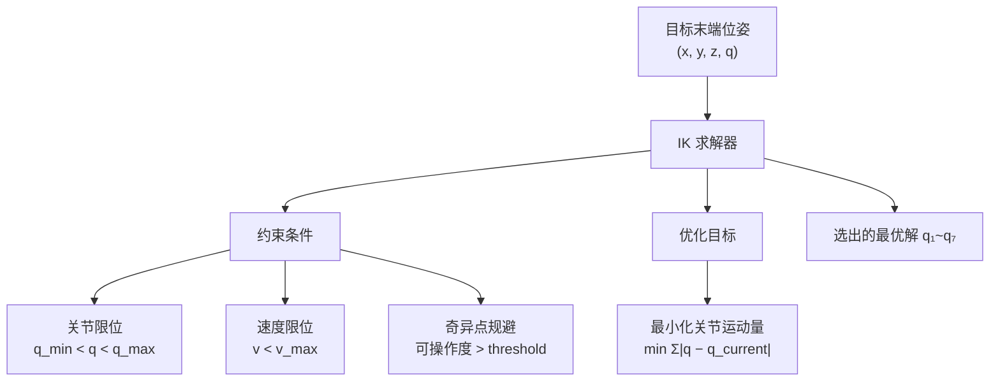

# 运动学基础、IK 求解与 URDF 标定

> 解答：FK/IK 是否基于 DH 参数？DH 参数与 URDF 的关系？URDF 是否需要重新测量标定？IK 解不唯一时怎么选？涉及哪些约束逻辑（奇异点、避障、合理性）？

---

## Q1：FK/IK 是否用 DH 参数？DH 和 URDF 什么关系？

### 先说结论

**IK/FK 可以用 DH 参数解，但在 ROS2 生态里，更常见的做法是从 URDF 自动提取几何信息来解，不直接写 DH 表。**

### DH 参数是什么

DH（Denavit-Hartenberg）参数是用 **4 个参数** 描述相邻两个关节之间关系的数学约定：

| 参数 | 符号 | 含义 |
|------|------|------|
| **连杆长度** | $a_i$ | 沿 $x_i$ 轴平移 |
| **连杆扭转** | $\alpha_i$ | 绕 $x_i$ 轴旋转 |
| **连杆偏置** | $d_i$ | 沿 $z_i$ 轴平移 |
| **关节角度** | $\theta_i$ | 绕 $z_i$ 轴旋转（机械臂运动时变化的就是这个）|

把 7 个关节的 DH 参数串起来，得到一整条运动链的完整几何描述：**DH 表可以唯一确定一台机械臂的 FK 解**。

### URDF 和 DH 的关系



**URDF 是"源文件"**，DH 是"内部表示"——不需要自己写 DH 表，IK 求解器会从 URDF 自动提取几何约束并转换成求解器需要的内部格式。

### 一个精确的理解：URDF 不直接包含 DH，而是包含推导 DH 的充分信息

关键区别：

| 概念 | 包含什么 | 是否完整描述机器人 |
|------|---------|----------------|
| **DH 参数** | 每关节 4 个参数 $(a_i, \alpha_i, d_i, \theta_i)$，只描述相邻连杆的**几何运动链关系** | ❌ **不够**——缺少质量、惯量、碰撞、传动等 |
| **URDF** | 几何 + 动力学（质量/惯量/质心）+ 碰撞模型 + 传动 + 视觉模型 | ✅ **完整描述**——求解器从它自动提取 DH 等价信息 |

```text
URDF 写的是：                     求解器内部转换成：
━━━━━━━━━━━━━━━━━                ━━━━━━━━━━━━━━━━━
<joint name="joint1">            DH 等价表示（非显式，内部用）
  <parent link="link0"/>              a₁, α₁, d₁, θ₁
  <child link="link1"/>               a₂, α₂, d₂, θ₂
  <origin xyz="0 0 0.058"            ...
    rpy="0 0 0"/>
  <axis xyz="0 0 1"/>
</joint>

再加上：
  <link> 的质量、惯量、碰撞模型   ← DH 从未包含这些
  <transmission> 减速比、传动效率
```

> **一句话**：URDF 是"机器人的完整身份证"，DH 是"骨架几何的另一种速记法"。URDF 包含了 DH 所需的所有几何信息，但还多出大量 DH 没有的东西（质量、惯量、碰撞模型、传动参数）。URDF $\supset$ DH 几何信息。

```text
传统做法（10 年前）：
  手写 DH 表 → 手写运动学代码 → IK 求解

现代做法（ROS2）：
  写 URDF → 求解器自动解析 → IK 求解
  ↑ 你不用管 DH，求解器内部帮你做了
```

> **结论**：URDF 里已经包含了所有 DH 参数所需的信息（关节位置、旋转轴方向、连杆长度），求解器加载 URDF 时自动提取。只需要维护好 URDF，不需要手写 DH 表。

---

## Q2：URDF 够精确是否需要重新测量？

**需要。** CAD 图纸和实际装配体之间的偏差足够大，如果不实测标定，IK 和重力补偿都会不准。

### CAD 参数 vs 实际参数的偏差来源

```text
CAD 图纸                      实际装配体
━━━━━━━━━━━                  ━━━━━━━━━━━
连杆长度 400.00 mm           实际 401.2 mm（公差 + 装配间隙）
关节中心 (0, 0, 58)          实际 (0.5, -0.3, 58.7)
质心位置 从 CAD 算              实际因电机线束、螺丝重量偏移
质量 1.68 kg                 实际 1.72 kg（含线缆）
```

### 不标定的直接影响

| 功能 | 依赖的 URDF 参数 | 不准的后果 |
|------|-----------------|-----------|
| **IK 逆解** | 连杆长度、关节位置 | 末端到达不了目标位姿（误差 1-5 cm）|
| **重力补偿** | 质量、质心位置 | 前馈力矩不准，臂"托不住"或"过推" |
| **仿真** | 全部 | 仿真结果与实际不一致 |

### 标定方法对比

| 方法 | 精度 | 工作量 | 工具 | 说明 |
|------|------|-------|------|------|
| **游标卡尺 + 角度尺** | ±0.5 mm / ±0.5° | 中 | 卡尺、量角器 | 手动测量各连杆长度、关节零点 |
| **激光跟踪仪** | ±0.05 mm | 高 | 激光跟踪仪（设备贵）| 工业级精度，适合产线定型后 |
| **参数辨识（自动）** | ±0.1 mm | 低 | DynamicParamID 流水线 | 让臂自己运动 → 采集数据 → 优化参数 |

<mark style="background: #ADCCFFA6;">**推荐 XC-Robot 用第三种**——DynamicParamID 论文（2605.15949）的 OLS→SDP→CLIE 三阶段流水线已在低成本 7-DoF 臂上验证，RMSE=0.168 N·m，可以直接搬用。</mark>

---

## Q3：IK 解不唯一——如何选？涉及哪些逻辑？

### 7 自由度机械臂的解空间

对于一个 7-DoF 臂，给定末端位姿，IK 的解是**一个连续空间**，不是有限几个：

```text
关节角度解空间 = { 所有使末端到达目标位姿的 q₁~q₇ }
                ↑ 这是一个连续的流形（因为冗余），不是离散的几个点
```

数学上，$n$ 自由度臂的末端位姿有 **6 个自由度**（3 位置 + 3 姿态）。当 $n > 6$ 时产生冗余。XC-Robot 是 **7-DoF → 冗余度为 1**。

### 怎么选解——带约束的优化问题



### 具体涉及的逻辑

| 约束/优化项 | 说明 | XC-Robot 状态 |
|------------|------|--------------|
| **关节限位** | 选解不超出机械限位 | ✅ 基本（URDF 声明）|
| **最近解** | 选最接近当前关节角度的解（最小化运动量）| ✅ 常见 IK 求解器默认行为 |
| **奇异点规避** | 可操作度接近 0 时（关节接近极限/臂伸直），避免选那个方向的解 | ❌ 未特别处理 |
| **避障** | 选解不与环境/自身碰撞 | ❌ MoveIt 层面可做，但 IK 求解本身不处理 |
| **动作合理性** | 选"像人"的解（如肘朝下比肘朝右更自然）| ❌ 不涉及，上层规划器处理 |
| **任务导向** | 同一操作的不同阶段优先使用不同解 | ❌ 需要额外策略 |

### 什么是奇异点

**奇异点（Singularity）**：机械臂到达某个位姿时，一个或多个关节失去对末端运动的调节能力。

```text
典型奇异点示例——臂完全伸直：
  肘关节 j4 ≈ 0°
  
  此时肩关节转动 → 末端沿弧线运动
  但肘关节伸直状态下，末端径向运动能力为 0
  
  表现在数学上：雅可比矩阵 J(q) 不再是满秩
  表现在物理上：某个方向的末端速度会趋向无穷大
```

### IK 求解器的选择

ROS2 生态几种常见 IK 求解器对比：

| 求解器 | 选解策略 | 冗余处理 | XC-Robot 适用性 |
|-------|---------|---------|----------------|
| **KDL**（ROS2 默认）| 最近解 + 关节限位 | 弱（6-DoF 优化）| 够用 |
| **TRAC-IK** | 多线程同时尝试多个起点 + 最近解 | 比 KDL 稳定 | ✅ **推荐替换** |
| **Pinocchio** | 可自定义优化目标 | 强（支持完整冗余求解）| ✅ 适合未来升级 |
| **BioIK** | 多目标优化（限位/避障/奇异点/舒适度）| 最强 | 太重 |

---

## 一句话总结

| 问题 | 回答 |
|------|------|
| **FK/IK 用 DH 吗？** | 可以用，但 ROS2 生态中 IK 求解器从 URDF 自动提取几何信息，不需要手写 DH 表 |
| **URDF 需要重新测量吗？** | **需要。** CAD 和实际装配有偏差，直接影响 IK 精度和重力补偿。推荐 DynamicParamID 自动辨识 |
| **IK 多解怎么选？** | 本质是带约束的优化问题——优先选"最接近当前姿势 + 满足关节限位 + 避开奇异点"的解。避障和动作合理性由上层规划器处理，不在 IK 层面 |
