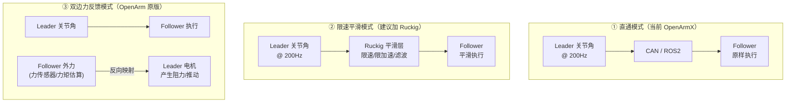
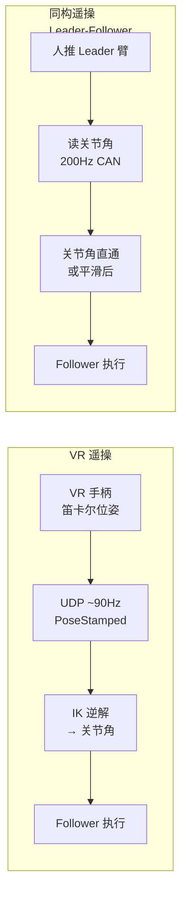

# 遥操模式与 Ruckig 读音

> 解答：直通模式（Pass-through）的含义、三种遥操模式（直通/限速平滑/双边力反馈）、Ruckig 的读法。

---

## Q1：这三种模式是针对同构遥操还是 VR 遥操？

**三种模式都是针对同构遥操（Leader-Follower）的，不适用于 VR 遥操。**

| 遥操方式 | 数据流 | 适用的模式概念 |
|---------|-------|--------------|
| **同构遥操**（Leader-Follower）| Leader 关节角 → Follower 关节角 | 直通 / 限速平滑 / 双边力反馈 |
| **VR 遥操**（Pico 手柄）| 手柄笛卡尔位姿 → IK → 关节角度 → Follower | 不同概念——输出的是笛卡尔位姿，需要 IK 转换，不存在"直通"的概念 |

VR 遥操的"加工"逻辑不在 Leader→Follower 的信号链上，而是在：
- IK 逆解之前的位姿滤波（平滑手柄抖动）
- IK 逆解时加入关节限位/奇异点规避

---

## Q2：三个模式在 OpenArmX / OpenArm 里真实存在吗？

从代码实调查确认：

| 模式 | 对应代码文件 | 存在状态 |
|------|-------------|---------|
| **① 直通模式（无平滑）** | OpenArmX: `openarmx_teleop_bimanual/src/teleop_bimanual_node.cpp` | ✅ **OpenArmX 已有**，当前在用的就是它 |
| **② 限速平滑模式（+Ruckig）** | 无对应文件 | ❌ **我的设计建议**，OpenArmX 没有 |
| **③ 双边力反馈模式** | OpenArm 原版: `openarm_teleop/control/openarm_bilateral_control.cpp` | ✅ **OpenArm 原版有**，但 OpenArmX 没有，XC-Robot 无力传感器也用不了 |

### 代码证据

**OpenArmX 的同构遥操（直通模式 + gravity_comp 扩展）：**

```text
OpenArmX/openarmx_teleop_bimanual/
├── src/
│   ├── teleop_bimanual_node.cpp                  ← 直通模式
│   └── teleop_bimanual_with_gravitycomp_single.cpp ← 直通 + 重力补偿
├── py/
│   ├── teleop_unilateral_single.py               ← 直通（Python 版）
│   └── teleop_unilateral_bimanual.py              ← 直通双臂（Python 版）
└── launch/
    ├── teleop_bimanual.launch.py
    └── teleop_bimanual_with_gravitycomp.launch.py
```

**OpenArm 原版的双边力反馈（XC-Robot 没有）：**

```text
openarm_teleop/control/
├── openarm_unilateral_control.cpp   ← 单向（直通）模式
└── openarm_bilateral_control.cpp    ← 双边力反馈模式 ✅ 原版有
               ↑ 主从之间双向力映射，需要电机的高带宽力控能力
```

**XC-Robot（灵足版）的现状：**

```text
openarmx_xc_robot_2/openarmx_teleop_vr/    ← 只有 VR 遥操配置
                                           ← 没有 isomorphic teleop 节点
                                           ← bilateral 在灵足上不支持（无力传感器）
```

### 结论

| 说法 | 准确吗 |
|------|--------|
| "OpenArmX 当前是直通模式" | ✅ 准确。`teleop_bimanual_node.cpp` 就是直通 |
| "OpenArmX 有重力补偿版遥操" | ✅ 确实有。`teleop_bimanual_with_gravitycomp_single.cpp` |
| "加 Ruckig 平滑层是设计建议" | ✅ 准确。OpenArmX 没有这个功能 |
| "双边力反馈模式有" | ⚠️ OpenArm 原版有（`openarm_bilateral_control.cpp`），但 OpenArmX 没有；XC-Robot 灵足无力传感器，暂不支持 |

注：`openarmx_teleop_bimanual` 包的运行需要 Leader 臂也能被反向驱动（被动模式）。代码中 Leader 臂初始化时调用了 `disable_all_complete()`，不是 MIT 模式使能状态。

### 定义

**直通模式（Pass-through）**：Leader 什么位姿，Follower 就什么位姿，中间不做任何处理。


实际代码逻辑：

```cpp
// 每 5ms 的核心循环（简化版）
while (running) {
    leader_arm.read_joint_positions(q);    // 读 Leader 7 个关节角
    follower_arm.write_joint_positions(q);  // 原样写到 Follower
    // ← 中间没有加减速、没有限速、没有滤波
}
```

---

## Q3：除了直通模式，还有其他模式吗？

遥操作从粗到精，主要有 **3 种模式**：

| 模式 | 英文 | 工作原理 | 好处 | 坏处 | 力反馈 |
|------|------|---------|------|------|--------|
| **① 直通模式**（当前）| Pass-through | Leader 关节角 → **原样** → Follower | 延迟最低，实时响应 | Leader 抖动直接传到 Follower | ❌ |
| **② 限速平滑模式** | Smoothed | Leader 关节角 → **平滑层**（Ruckig 限速/限加速/滤波）→ Follower | 消除抖动、不超速 | 增加几 ms 延迟 | ❌ |
| **③ 双边力反馈模式** | Bilateral Force Feedback | Leader 关节角 → Follower 执行，**同时** Follower 所受外力反向传到 Leader | 能"感觉到"物体 | 需要力传感器或准确力矩估算 | ✅ |

### 三种模式的信号流对比



### 类比：开车

| 遥操模式 | 类比 |
|---------|------|
| **直通模式** | 你踩油门多少，车就加速多少——没有任何电子干预 |
| **限速平滑模式** | 你踩油门到底，ECU 限制在 120km/h——限速但不断油 |
| **双边力反馈模式** | 你推方向盘，能感觉到车轮压到路肩的震动——双向通信 |

### OpenArm 原版 vs XC-Robot

OpenArm 原版的遥操包 `openarm_teleop` 实现了**双边力反馈**（主从双臂力反馈映射），因为原版用的是达妙电机，通过双编码器位置耦合 + Pinocchio 动力学模型前馈实现了近似力感知（MIT 五元组本质是电流估算力矩，无专用力传感器）。

> **[纠正 2026-05-25]**：达妙 DM-J 系列与灵足 RobStride 同路线——均通过电流估算转矩，均**无专用力/扭矩传感器**。OpenArm bilateral 双边力反馈实现机理是「位置耦合 + 动力学模型前馈」，详见 `26-达妙DMJ力控能力核查.md`。
XC-Robot（灵足 RobStride）无力传感器，所以当前只能做**直通模式**。未来如果做好重力补偿和摩擦辨识，可以基于电流环力矩估算实现**无传感器的近似双边力反馈**。

---

## VR 遥操 vs 同构遥操完整对比

### 数据流差异


08 也有这样的问题。比如说在通过有操作和 VR 的一个对比里面，通过有操作的第一个人推 leader，好像那个字没显示成功，不知道是为啥，显示的一半就被遮掉了。

我不知道是不是有可能是因为 Obsidian 的问题。
### 逐项对比

| 维度 | VR 遥操 | 同构遥操（Leader-Follower）|
|------|--------|---------------------------|
| **输出数据** | 笛卡尔位姿 (x,y,z) + 四元数 | **关节角度** j1~j7（天然对齐）|
| **需不需要 IK** | ✅ 需要 → 额外误差 + 延迟 | ❌ **不需要** |
| **采样频率** | ~72-90Hz（VR 头显限制） | **200Hz**（CAN 限制，YAML 可调）|
| **控制模式** | 只有直通（VR 位姿 → IK → Follower） | 直通 / 限速平滑 / 双边力反馈 三种 |
| **时间戳可靠性** | ❌ 头显与工控机时钟不同源，不可靠 | ✅ **同一台机器、同一时钟域** |
| **数据平滑度** | 抖动大（手持微颤 + IK 放大 + 1-3cm 追踪误差）| 平滑（机械结构天然滤波）|
| **力反馈** | ❌ 无（VR 手柄无真实力感） | ✅ **天然有反驱阻力**（双边模式下）|
| **操作直觉** | 需要适应（手柄 → 虚拟臂的映射） | **直感**——人推的就是真实机械臂 |
| **远程遥操** | ✅ 可异地操作 | ❌ 人必须在臂旁边 |
| **成本** | 需 VR 头显设备（Pico 几千元） | 需额外一套 Leader 臂（~$6500）|

### XC-Robot 现状（从代码确认）

| 遥操方式 | 代码位置 | 状态 |
|---------|---------|------|
| **VR 遥操** | `openarmx_xc_robot_2/openarmx_teleop_vr/` | ✅ **有配置** |
| **同构遥操**（Leader-Follower）| OpenArmX 仓库有，但 xc_robot v2 未部署 | ❌ **未部署** |
| **双边力反馈** | 仅 OpenArm 原版 `openarm_bilateral_control.cpp` 有 | ❌ **XR 不支持**（灵足无力传感器）|

### 关键结论

> 同构遥操在数据质量（200Hz 关节角直出、无 IK 误差、可靠时间戳、天然力反馈）上全面优于 VR 遥操，但代价是操作者必须在臂旁边，且需要额外一套 Leader 臂。VR 遥操的唯一核心优势是可远程操作，但精度和可靠性都打了折扣。

---

## Q4：平滑层是不是指 Ruckig？

**是的，完全正确。** "中间没有平滑层" = 没有 Ruckig 或类似的轨迹平滑器。

```text
当前（直通模式）：
  Leader → 采样 → Follower            ← 无平滑层

建议改进（加平滑层）：
  Leader → 采样 → Ruckig → Follower    ← Ruckig 就是平滑层
```

需要平滑层的原因：
- Leader 手抖 → Ruckig 滤波掉
- Leader 动作过快 → Ruckig 限速
- 录播回放时 → Ruckig 做时间参数化

---

## Q5：Ruckig 怎么读？

| 标注 | 读法 |
|------|------|
| 中文音译 | **"拉克-ig"** 或 **"如克-ig"** |
| 英文音标 | /ˈrʌk.ɪɡ/（**RUCK**-ig）|
| 重音位置 | 第一个音节 **RUCK**（重），-ig 轻读 |
| 官网 | https://ruckig.com/ |

**注意不要读成** `ruck-IG`（重音在 ig）或 `RUCK-ee-guh`——它是个短促的 `/rʌkɪɡ/`。

---

## 总结

| 术语 | 含义 |
|------|------|
| **直通模式（Pass-through）** | Leader 原样写 Follower，无任何中间处理，延迟最小 |
| **限速平滑模式** | 加 Ruckig 平滑层，消除抖动、限制速度，增加几 ms 延迟 |
| **双边力反馈模式** | Leader → Follower + Follower 力反向 → Leader，双向通信 |
| **Ruckig 读音** | **/ˈrʌk.ɪɡ/**（"拉克-ig"）|
