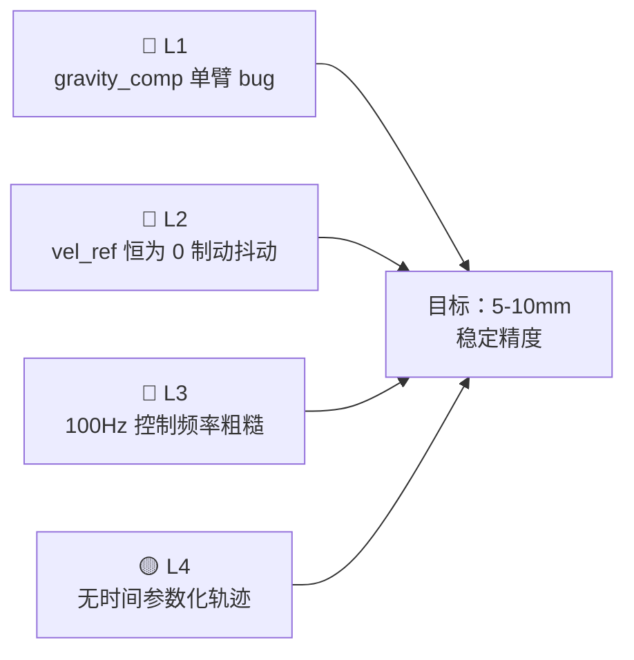
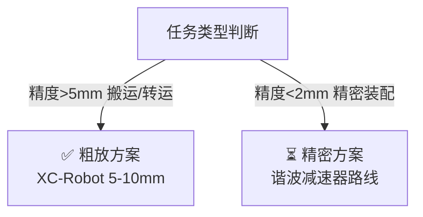

# 产品定位与两轨技术路线

> 本文是 2026-05-24 会话定性讨论的完整记录，厘清了 XC-Robot 的产品定位、目标场景、硬件能力边界以及两轨技术策略。

---

## 一、产品定位定性

### 核心定位

**XC-Robot 是企业级工业/商业场景机器人，不是遥操作数据采集工具。**

目标场景（第一批验证任务）：

| 任务 | 说明 | 精度需求 |
|------|------|---------|
| 仓储分拣 | 抓取、识别、分类放置箱体/包裹 | 5-10 mm |
| 办公室转运 | 文件、物品在室内 A→B 搬运 | 5-10 mm |
| 快递抓取放置 | 包裹从传送带→货架/容器 | 5-10 mm |
| 简单移转动作 | 工位间物料传递 | 5-10 mm |

以上 4 类任务的共同特征：
- 对象尺寸 >5 cm（盒子、包裹、文件夹等）
- 精度要求 5-10 mm，不需要 ±0.1 mm 级精密操作
- 负载要求 1-3 kg，不是重工业

### 明确不做的

- 精密装配（螺丝、连接器插拔、PCB 操作）—— 需要 <2 mm，超出当前路线
- 遥操作数据采集工具（AHA Robot / SO-ARM 的定位）

---

## 二、AHA Robot / SO-ARM 的重新定位

本次讨论明确排除了以 AHA Robot 和 SO-ARM 作为参考路线：

**根本原因：Feetech STS3215 扭矩远不足以支撑工业搬运**

| 指标 | Feetech STS3215 | XC-Robot RS04 |
|------|-----------------|---------------|
| 额定扭矩 | 1.9 Nm（峰值）| **40 Nm+** |
| 0.5m 臂展最大负载 | ~0.3 kg | 2-3 kg（持续）|
| 减速比 | 1:345 | 9:1 |
| 背驱性 | 几乎无（自锁）| 有（QDD 准直驱）|
| 定位 | 遥操 / 学术数据采集 | 工业搬运 / 力控 |

**结论：AHA Robot 和 SO-ARM 是学术平台，仅适合数据采集和模仿学习研究，不适合真正执行工业搬运任务。** 它们在机械臂扭矩上差了约 20 倍。

---

## 三、XC-Robot 当前硬件能力边界

### 硬件本身：够用

XC-Robot 的 9:1 行星减速 + RobStride RS04/RS03/RS00 组合，对 4 类目标任务：

- ✅ 负载：2-3 kg（对仓储包裹够）
- ✅ 精度：5-10 mm（软件修好后，对 >5 cm 物体够）
- ✅ 背驱性：中等（9:1 准直驱，比 1:345 自锁方案好得多，碰撞更安全）

### 当前阻塞点：全部是软件



> L1 修复方式：改 YAML gravity_comp 配置；L2：改 JTC 配置接入速度前馈；L3：改 YAML 一行将频率升至 200Hz；L4：MoveIt Ruckig TOTG 打开。

**修完 L1-L4 后，XC-Robot 可以做 4 类目标任务的实际验证。**

### 硬件天花板（不换硬件）

| 能力 | 预期水平 | 备注 |
|------|---------|------|
| 重复精度 | 5-10 mm | Blue 臂同类架构实测 3.7 mm 为参考上限 |
| 持续负载 | 2 kg | RS04 额定扭矩有余量，但结构刚性是瓶颈 |
| 控制带宽 | ~8 Hz（位置）| 软件修好后，与 Blue 臂相近 |
| 精密装配 | ❌ | <2 mm 需要双编码器或谐波，硬件约束 |

---

## 四、两轨技术路线策略

### 当前路线：粗放方案（XC-Robot）

```text
定位：仓储分拣 / 办公转运 / 包裹搬运
精度：5-10 mm
负载：2-3 kg
传动：9:1 行星减速器（准直驱）
成本：整机 ≤ ¥50,000
主控：X86 工控机（近期）→ 天玑 930/950 端侧盒子（未来）
状态：硬件够，软件需修
```

### 未来路线：精密方案（备选，下一代）

```text
定位：精密装配 / 工位操作 / <2mm 精度任务
传动：谐波 + 行星一体化，或纯谐波方案
对标：宇树 Z1（±0.1mm）/ Reflex / 松灵 NERO
成本：高出一个量级（¥30,000+ 单臂）
状态：待定，暂不启动
```

### 路线选择逻辑



> 粗放方案适用：负载 <3kg，仓储分拣/办公转运；精密方案适用：精密装配、连接器/螺丝，下一代硬件。

---

## 五、主控演进路线

| 阶段 | 主控 | 状态 |
|------|------|------|
| 当前 | X86 工控机（NUC 类，~¥3,000）| 在用 |
| 近期验证 | 同上，先把软件调稳 | — |
| 中期 | 天玑 930/950 端侧盒子（Angel Box 路线）| 待规格确认 |
| 远期 | Angel Box 400 TOPS 版（CUDA 兼容，今年下半年）| 算力释放 VLA |

---

## 六、立即行动优先级

| 优先级 | 任务 | 预期效果 |
|--------|------|---------|
| 🔴 立即 | 修 gravity_comp 单臂 YAML bug（L1）| 消除 52mm 误差，精度跃升 |
| 🔴 立即 | 控制频率 100Hz → 200Hz（L3，改一行 YAML）| 指令更平滑 |
| 🟡 近期 | 修 vel_ref=0 → 接入 Ruckig 速度前馈（L2）| 消除运动中制动抖动 |
| 🟡 近期 | MoveIt2 打开 Ruckig TOTG 插件（L4）| 轨迹时间参数化 |
| ⚪ 后续 | 摩擦前馈补偿（Coulomb + Viscous）| 再提精度 |

---

## 参考来源

- `07｜思考过程/04-轨迹规划/02-硬件精度上限与轨迹生成中间层.md`
- `07｜思考过程/04-轨迹规划/03-三臂横向对比-Blue臂vs宇树Z1vsXCRobot.md`
- `07｜思考过程/02-关节抖动根源解析/02-关节抖动根源分析总纲.md`
- `13｜QDD关节控制论文MD/QDD-compliant-manipulation-1904.03815/` — Blue 臂精度基准
