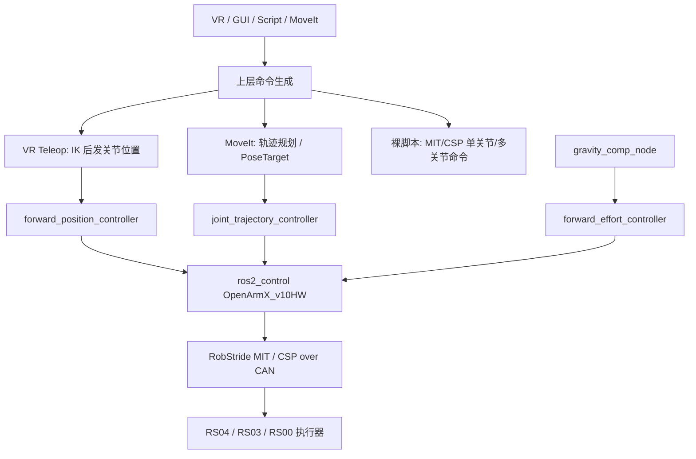

# OpenArmX XC_Robot_2 机械臂抖动与控制调研

## 调研范围

本次调研基于 2026-05-22 本地代码与资料快照，重点覆盖以下来源：

- 当前最新调试代码：`/Users/mac-minishu/Obsidian/Coding References/Openarmx_xc_robot/openarmx_xc_robot_2`
- OpenArmX 多子仓库：`/Users/mac-minishu/Obsidian/Coding References/OpenarmX`
- 原版 OpenARM / LeRobot 背景代码：`/Users/mac-minishu/Obsidian/Coding References/Openarm Something`
- RobStride 代码与 SDK：`/Users/mac-minishu/Obsidian/Coding References/RobStride`
- Obsidian 技术资产：
  - [[03｜技术资产库/02｜技术资产/10｜灵足时代Robstride/Product_manual_robStride4]]
  - [[03｜技术资产库/02｜技术资产/10｜灵足时代Robstride/灵足时代产品规格介绍]]
- 项目背景与内部方法论：
  - `06｜全库汇总总览/3-2_OpenARM原版与xc架构对比.md`
  - `07｜思考过程/00-我的AI判断/01-抖动诊断方法论.md`
  - NotePlan `📋 5月计划 待办.md`

说明：

- 用户提到的 “RobotStride（零族时代）”，结合代码与资料，当前对应的实际执行器体系是 `RobStride / 灵足时代`。
- 本文区分“代码事实”和“工程判断”。凡是明确来自代码或文档的，均在正文中标出证据路径。

## 执行摘要

- 当前抖动问题大概率不是单点故障，而是四层问题叠加：`100Hz` 外环、MIT/CSP 参数与 CAN 往返、重力补偿默认关闭且符号/比例敏感、上层遥操/动作回放轨迹不连续。
- OpenArmX 不是“没有 MoveIt / ros2_control / 重力补偿 / 仿真”；这些基础设施已经存在。当前更关键的不是补架构空白，而是把现有链路调通并提高可观测性。
- 如果讨论 TCP，当前最应优先理解为 `Tool Center Point` 控制，而不是网络 `TCP socket`。代码里已有 `hand_tcp` frame 和 MoveIt pose target，但实时控制主链路仍然是“IK 后直接发关节位置”。
- 是否需要运动规划器：需要，但不是第一顺位的止抖手段。对于静止抖动、小步抖动、补偿错误，规划器无能为力；对于点到点、笛卡尔直线、双臂避碰、动作回放平滑，规划器是必须组件。

## 一、当前控制链路

当前实际存在三条主控路径：

1. 裸电机路径：
`openarmx_motor_manager/scripts/*.py` 和 `ui/RobotWorker.py` 直接调 `openarmx_arm_driver.Robot`，用 `set_mode_all('mit'/'csp')`、`enable_all()`、`move_one_joint_mit()`、`move_one_joint_csp()` 控单关节或回零。

2. ROS2 轨迹路径：
MoveIt 或 action script 经 `joint_trajectory_controller` 进入 `openarmx_hardware/src/v10_simple_hardware.cpp::write()`。

3. VR 遥操路径：
`openarmx_teleop_vr_node.py` 从手柄姿态做 IK，随后直接发布到 `/left_forward_position_controller/commands` 和 `/right_forward_position_controller/commands`，本质仍是关节位置流。

关键代码事实：

- `controller_manager.update_rate = 100Hz`：
  `openarmx_ros2/openarmx_bringup/config/v10_controllers/openarmx_v10_bimanual_controllers.yaml:14-16`
- Teleop 默认 `control_rate = 100Hz`：
  `openarmx_teleop_vr/config/teleop_params.yaml:6-8`
- MoveIt 已绑定 TCP frame：
  `openarmx_commander/src/moveit_commander.cpp:24-32`
- MoveIt 支持 `setPoseTarget()` 与 `computeCartesianPath()`：
  `openarmx_commander/src/moveit_commander.cpp:81-125`

## 二、机械臂抖动根因分析

### 2.1 一级根因：外环控制频率过低，且读写链路可能阻塞

代码事实：

- ROS2 控制器主管理频率是 `100Hz`：
  `openarmx_v10_bimanual_controllers.yaml:16`
- 硬件层每周期 `read()` 先 `refresh_all(); recv_all();`：
  `v10_simple_hardware.cpp:468-472`
- `write()` 结束后还执行 `openarmx->recv_all(1000)`：
  `v10_simple_hardware.cpp:659`

工程判断：

- 这意味着外环并不是纯粹的“100Hz 发布一次命令”，而是每个控制周期都绑定了 CAN 刷新与回读。
- 如果底层库在 `recv_all()` 上出现等待、超时或总线拥塞，控制周期 jitter 会直接映射为机械臂抖动、发黏、偶发跳变。
- 原版 OpenARM 虽然 ROS2 配置同样能看到 `100Hz`，但其遥操体系另有 `500Hz/1000Hz` 的高频控制路径；XC 当前主链路更明显落在低频 ROS2 控制器上。

### 2.2 二级根因：MIT/CSP 参数路径简单，缺少系统化辨识

代码事实：

- MIT 默认 KP/KD：
  `kp = {50,50,50,50,10,10,10,50}`
  `kd = {2.5,2.5,2.5,2.5,0.5,0.5,0.5,2.5}`
  见 `v10_simple_hardware.cpp:165-168`
- MIT `write()` 直接发送 `position / velocity / torque / kp / kd`：
  `v10_simple_hardware.cpp:571-580`
- CSP 初始化时固定速度上限 `0.5 rad/s`：
  `v10_simple_hardware.cpp:535-540`
- RobStride 手册明确可调参数包括：
  `run_mode(0x7005)`、`limit_spd(0x7017)`、`limit_cur(0x7018)`、`loc_kp(0x701E)`、`spd_kp(0x701F)`、`spd_ki(0x7020)`、`spd_filt_gain(0x7021)`、`vel_max(0x7024)`、`acc_set(0x7025)`
  见 `Product_manual_robStride4.md:524`

工程判断：

- 当前工程主要在“外层 MIT KP/KD”上动手，但 RobStride 内层本身就有位置环、速度环、滤波和限速参数。
- 如果只在 ROS2 外层加大 KP/KD，而不校准内层 `loc_kp / spd_kp / spd_ki / spd_filt_gain`，常见结果就是高频发颤、低速跟随不顺、换向时毛刺放大。
- 如果现场误用了 CSP，而仍以高频小步进方式发离散位置，`0.5 rad/s` 的默认限速很容易表现为“卡顿”和“拉扯感”。

### 2.3 三级根因：重力补偿已存在，但默认关闭，且强依赖符号与模型误差

代码事实：

- OpenArmX 重力补偿包明确说明：纯 PD 在 MIT 模式下会产生约 `6°` 稳态误差，加入 `tau_ff` 后可降到 `1°` 内：
  `openarmx_gravity_comp/README_CN.md:7-10`
- 补偿链路经 `forward_effort_controller` 注入 `tau_ff`：
  `README_CN.md:33-58`
- `enable_forward_effort` 默认 `false`：
  `openarmx.bimanual.launch.py:262-265`
  `README_CN.md:135-159`
- 文档明确指出重力方向依赖硬件层统一 `-1` 的方向乘子：
  `README_CN.md:60-70`
- 当前硬件层方向修正被硬编码为全 `-1.0`：
  `v10_simple_hardware.cpp:711-714`

工程判断：

- 这说明“没有重力补偿”已经不是准确描述，更准确的说法是：重力补偿能力存在，但默认不启用，而且启用后的正确性依赖符号约定、URDF 惯量与实物一致性、`g_scale` 标定。
- 若 `direction_multipliers`、`LEFT_ARM_GY/RIGHT_ARM_GY`、URDF 惯量三者不一致，补偿会从“减振”变成“注入扰动”。

### 2.4 四级根因：VR/动作回放链路生成的是离散关节目标，不是平滑笛卡尔伺服

代码事实：

- Teleop 节点内部使用 `PinocchioTeleopCore`：
  `openarmx_teleop_vr_node.py:14, 135`
- Teleop 输出直接发到 `forward_position_controller`：
  `openarmx_teleop_vr_node.py:213-214, 793-800`
- 主循环只是对 `target_q` 做 `_limit_joint_step()` 限幅：
  `openarmx_teleop_vr_node.py:671-727, 758-787`
- 当前 fast 模式每周期最大步进达到：
  `joint1 = 20deg, joint2 = 16deg, joint3/4 = 12deg`
  见 `teleop_params.yaml:24-30`
- 同一文件里阈值也被放到与 fast step 接近的水平：
  `teleop_params.yaml:40-46`
- 控制循环异常被吞掉：
  `openarmx_teleop_vr_node.py:725-727`

工程判断：

- 当前遥操路径实质是“VR pose -> IK -> 关节目标 -> 每周期 delta clip -> 位置控制器”。
- 这不是 TCP 速度控制，也不是笛卡尔阻抗控制，更没有 jerk 限制。
- 手柄输入噪声、IK 解跳变、关节限幅触发点不连续，都会直接表现为机械臂末端抖动。
- `except: pass` 让现场很难区分“控制不稳”和“控制链里偶发异常被静默吞掉”。

### 2.5 五级根因：RobStride 执行器与原版 OpenARM 的机械/电气特性不同

代码事实：

- RobStride 手册给出的关键参数：
  `48V`、`CAN 1Mbps`、`FOC`、`减速比 9:1`、`编码器 14bit 单圈绝对值`
  见 `Product_manual_robStride4.md:74-80, 156-166`
- RobStride 手册明确要求：
  “在关节运行时不可切换控制方式”
  见 `Product_manual_robStride4.md:5-8`
- RobStride 协议与旧桥接头文件里的 MIT 范围约束：
  `KP_MAX = 500`, `KD_MAX = 5`
  见 `robstride_actuator_bridge/include/motor_control/robstride.h:12-21`

工程判断：

- 与原版 OpenARM 使用的达妙体系相比，RobStride 在电机、减速器、编码器、总线策略上都不是等价替换。
- `9:1` 行星/QDD 风格链路通常会带来比高减速谐波更明显的柔顺、回差、静摩擦/动摩擦切换效应。
- `1Mbps CAN + 100Hz ROS2 外环 + 14bit 单圈编码反馈` 的组合，天然更容易在低速保持、换向、小角度微动中暴露粗糙感。

## 三、如何优化控制，使其运行更平稳

### 3.1 第一阶段：先止抖，不先重写架构

建议按以下顺序推进：

1. 固定控制模式，只用 MIT 路线做基线。
原因：CSP 当前默认限速过低，而且参数组合更多，先把 MIT 走稳更容易定位。

2. 启用并校准重力补偿。
先验证 `enable_forward_effort=true` 是否改善静止保持，再扫 `g_scale = 0 / 0.5 / 1.0 / 1.05`。

3. 降低 Teleop fast step 和阈值。
当前 fast step 太大，不适合作为高质量遥操基线。先把 fast step 收到普通 step 的 2-3 倍以内，再观察抖动是否显著下降。

4. 给 Teleop 增加最小可观测性。
至少记录 `target_q / current_q / delta_q / controller publish rate / exception count`。

5. 区分“轨迹不连续”和“底层闭环振荡”。
同一套关节轨迹同时在 `fake_hardware` 和真机上跑；仿真平滑而真机抖，优先查低层；两边都不平滑，优先查轨迹生成。

### 3.2 第二阶段：把参考轨迹从“离散点”改成“连续轨迹”

推荐路线：

1. 对 VR / VLA / 动作播放器输出增加时间参数化。
最低要求是速度、加速度约束；更理想是 jerk 约束。

2. 对 Teleop 不要只做 `delta clip`，应加入：
- TCP pose 或 joint target 低通滤波
- 速度限制
- 加速度限制
- jerk 限制

3. 对按钮动作、动作回放、示教回放统一走同一种轨迹生成器。
否则一个系统里会并存多种手感，调参无法收敛。

4. 若继续走关节空间流控，建议引入 Ruckig 或等价时间参数化器。
这样至少能把“轨迹毛刺”与“底层执行毛刺”拆开。

### 3.3 第三阶段：增强低层可观测性与参数治理

应补的不是“更多脚本”，而是系统化实验能力：

1. 单关节阶跃实验：
输出超调、收敛时间、稳态误差、振荡频率。

2. 慢速正弦实验：
看低速跟随、相位滞后、摩擦死区。

3. 正反向回差实验：
看换向死区和机械回差。

4. 重力补偿 on/off 对照实验：
看静态误差、电流变化、姿态相关漂移。

5. CAN 周期统计：
记录 `read / write / recv_all` 周期 jitter、超时和错误率。

RobStride 官方 SDK 已有 `recv_timeout`、`retry_count`、`error_rate()` 这类思路，可作为仪表化参考：
`Openarm Something/robstride-python-sdk/robstride/client.py:72-156`

## 四、TCP 如何实现更好的控制

这里的 TCP 应优先理解为 `Tool Center Point`。

当前状态：

- 代码里已经定义了 `openarmx_left_hand_tcp` / `openarmx_right_hand_tcp`
  `moveit_commander.cpp:24-32`
- MoveIt 也支持末端 pose target 和笛卡尔路径
  `moveit_commander.cpp:81-125`
- 但实时主链路并没有把 TCP 当成连续控制变量，而是 IK 后直接发关节位置。

更好的 TCP 控制应该这样做：

1. 以 `hand_tcp` 为统一控制 frame。
VR 输入先映射为 TCP `pose` 或 `twist`，而不是直接输出关节目标。

2. 在笛卡尔空间先做滤波和限速。
不要把手柄小抖动和姿态噪声直接灌进 IK。

3. IK 必须是“连续求解”。
要使用当前关节为 seed，并显式处理关节限位、奇异位形阻尼和 null-space 优化。

4. 实时遥操优先考虑 MoveIt Servo 或自研 Jacobian servo。
因为它们天然适合“TCP twist -> 连续关节速度/位置增量”的链路。

5. 对点到点或直线任务，先用笛卡尔路径 + 时间参数化，再下发到 `joint_trajectory_controller`。
这类任务不应该继续裸发离散关节点。

结论：

- 当前代码“有 TCP 概念”，但还没有“成熟 TCP 控制器”。
- 如果要明显改善末端手感，优先做 TCP 参考轨迹平滑，不要直接把主要精力投入到底层 MIT 重构。

## 五、是否需要引入运动规划器

结论分两层：

### 5.1 对“止抖”本身

不是第一优先级。

如果现场表现为以下问题，运动规划器不能直接解决：

- 空载静止都抖
- 单关节小步进也抖
- 开关重力补偿差异极大
- 不同姿态抖动方向明显变化

这些首先指向：

- 增益不当
- 补偿符号或比例错误
- CAN 周期或阻塞问题
- 机械回差 / 摩擦 / 柔顺性

### 5.2 对“实际可用控制系统”

需要，而且应尽快用现有组件，不建议从零手搓。

原因：

- 双臂点到点动作需要时间参数化
- 笛卡尔直线任务需要路径插补
- 双臂协同和避碰不适合继续手写离散点序列
- 未来接 VLA / LeRobot 也需要一个稳定的动作执行层，而不是直接把离散 action 生硬下发

推荐路线：

1. 近端任务：
直接复用现有 MoveIt + `joint_trajectory_controller` + Pilz Cartesian。

2. 中间层平滑：
补上 Ruckig 或同类时间参数化。

3. 实时遥操：
后续补 MoveIt Servo 或 Jacobian servo。

判断标准非常简单：

- 如果 MoveIt/JTC 平滑，而原动作播放器抖：问题主要在上层轨迹生成。
- 如果两者都抖：问题主要在低层执行或补偿。
- 如果 fake hardware 平滑、真机抖：优先查硬件闭环与执行器，不先怪规划器。

## 六、RobStride 专项判断

### 6.1 当前项目里最可能导致抖动的 RobStride 底层原因

1. 运行模式和参数切换管理不严谨。
手册明确写了运行中不可切模式；若现场脚本频繁改模式或交叉下发，极易产生冲击。

2. 只调外层 MIT KP/KD，未系统识别内层位置/速度环。
RobStride 内层已有 `loc_kp / spd_kp / spd_ki / spd_filt_gain`，XC 当前没有形成成体系的辨识和版本管理。

3. 速度/加速度限制策略与上层轨迹不匹配。
尤其 CSP 的 `limit_spd / vel_max / acc_set`，若和上层高频小步位移流冲突，会表现成拉扯和顿挫。

4. 经典 CAN 1Mbps 路径对高带宽外环不友好。
不是说 1Mbps 不能工作，而是当前架构把大量控制质量都压在这条链路上，容错空间小。

5. 机械链路本身的柔顺与回差不可忽略。
9:1 减速比、QDD 风格结构、低速微动和换向过零区，都会放大控制粗糙感。

### 6.2 对 RobStride 的近期有效策略

1. 先冻结一个“MIT 基线参数集”。
不要让不同脚本、不同 GUI、不同 launch 在现场各写一套模式和参数。

2. 把 `loc_kp / spd_kp / spd_ki / spd_filt_gain / limit_spd / limit_cur` 纳入版本化配置。
不要长期依赖临场手改。

3. 对每个关节做静态保持、慢速正弦、正反换向三组实验。
这比单纯凭手感改 KP/KD 更有效。

4. 在硬件层增加 CAN 周期、超时、错误帧统计。
否则“抖动”里会混进通信问题。

5. 在参数变更前后记录同一轨迹的误差曲线。
没有前后对照，无法判断是增益优化还是偶然工况变化。

## 七、建议的两周验证计划

### 第 1-3 天：建立基线

做四组对照：

1. `fake_hardware + MoveIt`
2. `real + no gravity compensation`
3. `real + gravity compensation`
4. `real + forward_position_controller teleop`

目标：

- 区分“轨迹层问题”和“真机层问题”
- 区分“补偿缺失”和“补偿错误”

### 第 4-7 天：收敛 MIT 路线

只做 MIT，不切 CSP。

实验项：

1. 单关节阶跃
2. 单关节保持
3. 慢速正弦
4. 正反换向
5. 姿态变化下的静止保持

记录：

- 目标角
- 实际角
- 误差
- 实际速度
- 前馈力矩
- CAN 超时 / 错误

### 第 8-10 天：校准重力补偿

变量：

- `enable_forward_effort = false / true`
- `g_scale = 0 / 0.5 / 1.0 / 1.05`
- Coriolis 开 / 关

目标：

- 找到是否存在符号错误
- 找到是否存在姿态相关过补偿
- 找到可复现实验基线

### 第 11-14 天：接入轨迹平滑

按优先级推进：

1. Teleop 目标平滑
2. MoveIt / JTC 动作回放
3. Ruckig 时间参数化
4. 再评估是否上 MoveIt Servo

## 八、最终结论

这次排查最关键的结论有三条：

1. 当前抖动主因不是“OpenArmX 没有规划器或没有补偿”，而是现有链路没有被工程化收敛。

2. 真正的第一修复点不是大改 VLA，也不是立刻重写底层，而是：
固定 MIT 基线、启用并校准重力补偿、把 Teleop 目标变连续、补足日志与周期统计。

3. 运动规划器必须引入，但它属于“让系统可用”的必选件，不是“让空载静止不抖”的第一止痛药。

## 附录：关键证据文件

- `openarmx_ros2/openarmx_bringup/config/v10_controllers/openarmx_v10_bimanual_controllers.yaml`
- `openarmx_ros2/openarmx_hardware/src/v10_simple_hardware.cpp`
- `openarmx_teleop_vr/openarmx_teleop_vr/config/teleop_params.yaml`
- `openarmx_teleop_vr/openarmx_teleop_vr/openarmx_teleop_vr/openarmx_teleop_vr_node.py`
- `openarmx_ros2/openarmx_gravity_comp/README_CN.md`
- `openarmx_ros2/openarmx_bringup/launch/openarmx.bimanual.launch.py`
- `openarmx_ros2/openarmx_commander/src/moveit_commander.cpp`
- `03｜技术资产库/02｜技术资产/10｜灵足时代Robstride/Product_manual_robStride4.md`
- `RobStride/robstride_actuator_bridge/include/motor_control/robstride.h`
- `Openarm Something/robstride-python-sdk/robstride/client.py`
